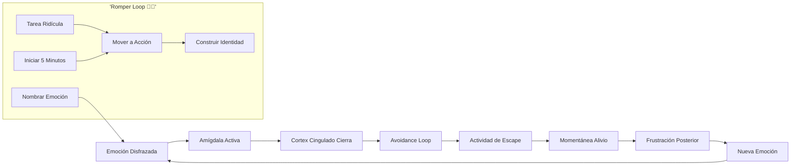
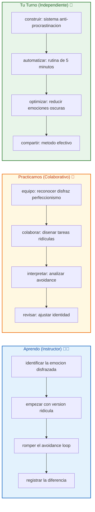
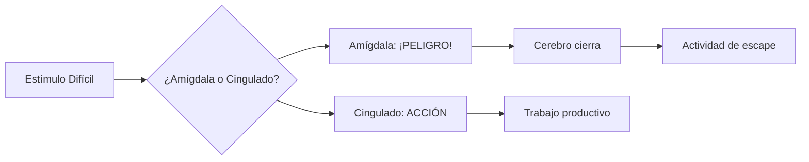

# 🚀 MASTERCLASS: Rompiendo la Procrastinación — La Neurociencia del Avoidance Loop 🔥🧠

## 🎯 INTRODUCCIÓN: POR QUÉ ESTE MASTERCLASS ES DIFERENTE 💡

La mayoría de la gente cree que la procrastinación es un problema de gestión del tiempo. ⏰ Van a cursos de productividad, organizan sus agendas, usan técnicas Pomodoro... y sin embargo, cuando se enfrentan a una tarea difícil, ¡regresan a las redes sociales! 📱

Este masterclass propone otro camino: **entender la procrastinación como un problema de regulación emocional**. 🧠 El cerebro no es un robot que necesita mejor organización. Es un sistema de supervivencia que huye del dolor emocional. Cuando entiendes el mecanismo neuronal, puedes romper el loop.

> **🎯 Objetivo de Aprendizaje** — Al final de esta guía, identificarás los mecanismos neuronales de la procrastinación, reconocerás los disfraces más comunes, romperás el avoidance loop y tendrás un sistema para empezar cualquier tarea sin resistencia emocional.

> **⚠️ Advertencia** — Este contenido es formativo. La procrastinación es un hábito profundo que requiere práctica constante. Ningún truco mágico reemplaza la repetición consciente de los ejercicios.

---

## 🗺️ MAPA DEL WORKFLOW DE ROMPER LA PROCRASTINACIÓN 🗺️🚀



| Fase 🌍 | Pregunta que responde ❓ | Output principal 🎯 |
|--------|-----------------------|------------------|
| **Emoción Disfrazada** 🎭 | ¿Qué siento realmente? | Claridad emocional |
| **Amígdala Activa** ⚠️ | ¿ Por qué mi cerebro me advierte? | Identificación del miedo |
| **Cortex Cingulado Cierra** 🧊 | ¿Por qué no actúo? | Reconocimiento del shutdown |
| **Avoidance Loop** 🔁 | ¿Cómo funciona el escape? | Mapa del ciclo |
| **Actividad de Escape** 📱 | ¿A qué me escapo? | Identificación de distracciones |
| **Momentánea Alivio** 😊 | ¿Qué gano al escapar? | Entendimiento del refuerzo |
| **Frustración Posterior** 😞 | ¿Qué pierdo después? | Motivación para cambio |
| **Nueva Emoción** 🔄 | ¿Cómo evitar el ciclo? | Sistema de interrupción |

---




---

## 🎭 PARTE 1: LA PROCASTINACIÓN ES UN PROBLEMA EMOCIONAL 🎭✨

### 1.1 🎭 La gran mentira de la gestión del tiempo

"La procrastinación no es un problema de organización. Es un problema de regulación emocional." — Jaime Higuera

Cuando ves una tarea difícil, tu cerebro siente **ansiedad**, **miedo**, **fracaso potencial**. Para aliviar esa emoción, busca **refuerzo inmediato** en actividades más fáciles. Ese es el loop.

### 1.2 📊 El problema no es el tiempo, es el miedo

| Creencia común 🚫 | Realidad neuronal ✅ |
|------------------|---------------------|
| "No tengo tiempo" ⏰ | "Tengo miedo del tiempo" 🧠 |
| "Necesito mejor método" 📋 | "Necesito manejar emociones" 💆 |
| "Soy perezoso" 😴 | "Soy hiperactivo con distracciones" 📱 |
| "Me distraen cosas" 🚨 | "Yo elijo distracciones" 🎯 |

### 1.3 🧠 La neurobiología del avoidance



---

## ⚠️ PARTE 2: LA AMÍGDALA VS EL CORTEX CINGULADO ⚠️✨

### 2.1 ⚠️ La batalla neuronal

**Sistema de alarma (Amígdala):**
- No procesa lógica
- Responde con miedo o pánico
- Ve el trabajo difícil como amenaza existencial
- Actúa desde el modo de supervivencia

**Sistema lógico (Cingulado anterior dorsal):**
- Procesa el "debería hacerlo"
- Planifica pasos
- Se rinde cuando el miedo es demasiado fuerte
- Actúa desde el modo de crecimiento

### 2.2 📊 Tabla de batalla neuronal

| Amígdala 🧠 | Cingulado 🧠 | Consecuencia 🔄 |
|------------|-------------|-----------------|
| "¡Peligro!" | "Debo actuar" | Conflicto interno 🔥 |
| Huye del dolor | Persigue el propósito | Guerra constante ⚔️ |
| Busca recompensa | Busca progreso | Competencia 🔁 |
| Vive en el presente | Piensa en el futuro | Polaridad ⏳ |

### 2.3 🛠️ Señales de que la amígdala está ganando

| Señal 🎯 | Ejemplo 💬 | Acción ⚡ |
|---------|-----------|---------|
| Evitas con la mente "mañana" | "Lo hago mañana mejor" | Nombrar emoción |
| Te distraes sin querer | "Solo voy a revisar un mensaje..." | Regresar consciente |
| Te sientes "cansado" de repente | "No tengo energía ahora" | Preguntar "¿qué temes?" |
| Perfeccionismo paraliza | "No es suficientemente bueno" | Empezar ridículo |

---

## 🔁 PARTE 3: EL AVOIDANCE LOOP EXPLICADO 🔁✨

### 3.1 🔁 El ciclo invisible

```
😱 Tarea difícil → 😰 Miedo/ansiedad → 🏃‍♂️ Escape a distracción → 😊 Alivio momentáneo → 😞 Culpa/frustración → 🔁 Vuelve a empezar
```

### 3.2 📊 Desglose del loop

| Etapa 🎯 | Emoción 🧠 | Refuerzo 🔄 |
|---------|------------|-------------|
| Tarea difícil | Ansiedad/Fracción | Ningún refuerzo |
| Actividad distracción | Dopamina rápida | Refuerzo positivo |
| Regreso a tarea | Culpa/Frustración | Refuerzo negativo |

### 3.3 🛠️ Ejercicio: mapear tu avoidance loop

```
🔁 Mapeo personal:
1. Tarea que evito: ________________
2. Emoción disfrazada: ________________
3. Actividad de escape: ________________
4. Refuerzo que recibo: ________________
5. Culpa después: ________________
6. Palabra clave para romper: ________________
```

---

## 🔧 PARTE 4: ROMPER EL LOOP — LOS 3 PASOS CLAVE 🔧✨

### 4.1 🔧 El método "Nombrar - Pequeño - Mover"

**Paso 1: Nombrar la emoción** 🎯
- "Estoy asustado"
- "Tengo miedo de fallar"
- "Me siento abrumado"

**Paso 2: Hacerla ridículamente pequeña** 🐢
- En vez de "escribir informe": "escribir 1 oración"
- En vez de "estudiar 2 horas": "leer 1 página"

**Paso 3: Mover el cuerpo** 💪
- 2 minutos de estiramientos
- Caminar 5 minutos
- Respirar profundo 3 veces

### 4.2 📊 Tabla de ejecución

| Tarea Grande 🎯 | Tarea Ridícula 🐢 | Tiempo estimado ⏱️ |
|----------------|-------------------|-------------------|
| Escribir proyecto completo ✍️ | Escribir 1 oración 📝 | 2 minutos |
| Estudiar para examen 📚 | Leer 1 definición 📖 | 1 minuto |
| Entrenar 1 hora 💪 | Hacer 2 flexiones 🧎 | 30 segundos |
| Limpiar toda la casa 🧹 | Limpiar 1 mesa 🧽 | 1 minuto |
| Llamar cliente difícil ☎️ | Buscar su número 📱 | 1 minuto |

### 4.3 🛠️ Script para nombrar emociones

```
🎯 Diario de emociones:
1. ¿Qué emoción siento? (miedo, aburrimiento, frustración)
2. ¿Por qué esta emoción? (juicio interno, expectativa)
3. ¿Qué acción ridícula puedo tomar?
4. ¿Qué movimiento físico necesito?
```

---

## 🎭 PARTE 5: LOS DISFRACES DE LA PROCASTINACIÓN 🎭✨

### 5.1 🎭 El perfeccionismo: el primero de los disfraces

"El perfeccionismo no es perfección. Es miedo disfrazado de excelencia." — Jaime Higuera

| Perfeccionismo disfrazado 🚫 | Acción real ✅ |
|-----------------------------|---------------|
| "No está listo" | Empezar imperfecto |
| "Debo tener tiempo perfecto" | Usar 10 minutos imperfectos |
| "No tengo las herramientas" | Empezar con lo básico |
| "Esperaré a inspiración" | Iniciar sin inspiración |

### 5.2 📚 La procrastinación productiva: el disfraz más peligroso

"Leer sobre productividad en vez de ser productivo es productividad disfrazada de procrastinación." — Jaime Higuera

| Actividad productiva 🚫 | Actividad real ✅ |
|------------------------|-------------------|
| Leer 10 artículos sobre el tema 📖 | Escribir 1 oración del proyecto ✍️ |
| Organizar el escritorio en nuevo 📂 | Responder 1 email importante 📧 |
| Limpiar el email 📧 | Trabajar 5 minutos en proyecto 🎯 |
| Actualizar el sistema de archivos 💾 | Diseñar 1 presentación 📊 |

### 5.3 📊 Tabla de identificación de disfraces

| Disfraz común 🎭 | Señal de alerta ⚠️ | Acción ⚡ |
|------------------|---------------------|---------|
| Perfeccionismo | "No es perfecto todavía" | 1 versión imperfecta |
| Preparación eterna | "Aún no tengo todo listo" | Empezar sin preparación |
| Perfomance anxiety | "Todos van a ver mi error" | Enfocarse en el proceso |
| Analysis paralysis | "Necesito más datos" | Decidir con lo disponible |

---

## 🐢 PARTE 6: EMPEZAR MUY PEQUEÑO — LA CLAVE DEL INICIO 🐢✨

### 6.1 🐢 Por qué 5-10 minutos funciona

La regla de los 5 minutos no es un truco. Es una **interrupción neuronal**. Cuando la tarea es tan pequeña que no representa peligro, tu amígdala no activa el escape.

### 6.2 🛠️ Técnica de tarea ridícula

```
🐢 Micro-Tarea Check:
1. Reduce la tarea a algo que tome menos de 2 minutos
2. Elimina TODO juicio de calidad
3. Solo enfócate en iniciar, no en terminar
4. Si continuas, genial. Si no, al menos empezaste
```

### 6.3 📊 Tabla de micro-tareas

| Tarea Original 🎯 | Micro-Tarea 🐢 | Tiempo ⏱️ |
|-------------------|----------------|----------|
| Escribir libro 📚 | Escribir 1 palabra | 5 segundos |
| Entrenar fuerza 💪 | Ponerse ropa deportiva | 30 segundos |
| Meditar 🧘 | Cerrar los ojos 3 veces | 10 segundos |
| Leer libro 📖 | Abrir el libro | 2 segundos |
| Estudiar 📝 | Leer 1 línea | 5 segundos |

---

## 🎓 PARTE 7: I DO / WE DO / YOU DO — EJERCICIOS PRÁCTICOS 🎓✨

### 7.1 🏫 I Do — Identificar el avoidance loop

| Paso 🚶 | Acción ⚡ | Resultado esperado ✅ |
|------|--------|--------------------|
| 1️⃣ 🎯 | Nombrar emoción actual | "Estoy asustado de..." |
| 2️⃣ 🐢 | Crear micro-tarea | Acción de menos de 2 min |
| 3️⃣ 💪 | Mover el cuerpo | 2 respiraciones profundas |
| 4️⃣ 📊 | Registrar diferencia | Antes vs después del loop |

### 7.2 👥 We Do — Reconocer disfraz en grupo

**Tarea colaborativa:** cada integrante comparte:

```
🎭 Diario grupal:
1. Tarea evadida esta semana
2. Emoción disfrazada
3. Actividad de escape
4. Micro-tarea para romper
5. Compañero que verifica ejecución
```

### 7.3 🎯 You Do — Construir sistema anti-procrastinación

**Tarea:** crea tu sistema personal:

| Sistema 🛠️ | Acción ⚡ | Alerta 🔔 |
|------------|---------|----------|
| 🎯 Identificación | Palabra clave para nombrar miedo | Sin palabra en 3 días |
| 🐢 Micro-tarea | Acción ridícula lista para 5 tareas | Sin acción en 1 semana |
| 💪 Movimiento | 2 minutos de estiramiento diario | Sin movimiento en 7 días |
| 📊 Registro | Bitácora de loops roto | Sin registro en 14 días |

---

## ✅ PARTE 8: CHECKLIST FINAL 🏁✨

| Bloque 🧩 | Check ✅ |
|--------|-------|
| **Emoción identificada** | 🤔 Nombrar emoción sin juicio |
| **Amígdala domada** | 🛡️ No activar fuga en cada tarea |
| **Loop roto** | 🔁 Interrumpir patrón 3 veces seguidas |
| **Micro-tarea lista** | 🐢 Tarea ridícula para cada fuga |
| **Movimiento aplicado** | 💪 2 minutos de movimiento al iniciar |
| **Perfeccionismo superado** | ✍️ Entregar algo imperfecto |
| **Procrastinación productiva evitada** | 🎯 Actuar sobre lo importante |
| **Sistema personal** | 📊 Rutina anti-procrastinación |

---

## 📝 PARTE 9: PREGUNTAS DE VERIFICACIÓN 📝✨

Responde cada pregunta basándote en los conceptos de esta master class. Escribe tus respuestas o compártelas para profundizar tu aprendizaje. 📝

### Preguntas sobre Emociones Disfrazadas

1. **✏️ Aplica**: ¿Qué tarea evitas ahora mismo? ¿Qué emoción disfrazada sientes realmente? Nombra la emoción y escribe una micro-tarea de 2 minutos.

2. **🔍 Analiza**: ¿Has caído en procrastinación productiva esta semana? ¿Qué actividad "útil" fue en realidad una distracción disfrazada?

### Preguntas sobre Neurociencia

3. **🧠 Diseña**: Explica cómo funciona la batalla entre amígdala y cingulado cuando ves una tarea difícil. ¿Qué escuchas en tu cabeza?

4. **✅ Evalúa**: ¿Has identificado tus señales de que la amígdala está ganando? Enumera 3 señales y cómo vas a responder.

### Preguntas sobre Acción

5. **🐢 Reflexiona**: ¿Cuál es tu tarea más grande ahora? ¿Qué micro-tarea podrías hacer en los próximos 2 minutos?

6. **📅 Calcula**: Si reduce cada tarea evitada a 2 minutos de micro-acción, ¿cuántas tareas podrías iniciar esta semana?

### Preguntas Integradoras

7. **🔗 Conecta**: ¿Cómo se relaciona el miedo de empezar con el alivio posterior? ¿Por qué el ciclo se repite?

8. **💡 Propón un sistema**: Diseña un sistema diario de 15 minutos para detectar y romper el avoidance loop.

---

## 📚 GLOSARIO RÁPIDO 📖✨

| Término 📝 | Definición 📋 |
|---------|------------|
| **Procrastinación** 🕐 | Postergación activa de tareas importantes |
| **Avoidance Loop** 🔁 | Ciclo de escape → alivio → culpa |
| **Amígdala** 🧠 | Centro de miedo del cerebro |
| **Cingulado Anterior** 🧠 | Región lógica que planifica acción |
| **Regulación emocional** 💆 | Capacidad de manejar emociones sin escapar |
| **Micro-tarea** 🐢 | Acción tan pequeña que no activa miedo |
| **Perfeccionismo disfrazado** 🎭 | Miedo disfrazado de exigencia |
| **Procrastinación productiva** 📚 | Actividad útil que evita la difícil |
| **Refuerzo positivo** ✅ | Recompensa que fortalece un comportamiento |
| **Interrupción neuronal** ⚡ | Técnica para romper el loop automático |

---

## 📐 ANEXO: FORMATO IDEAL PARA MASTERCLASS EDUCATIVAS 📐✨

### 📏 Estructura visual recomendada 📏✨

El ancho óptimo 📏 para masterclasses educativas es **60–75 caracteres por línea** 📐.

```css
.article-content {
  🎨 font-size: 18px;
  📏 line-height: 1.75;
  📐 max-width: 65ch;
}
```

### 🎯 CIERRE PRÁCTICO 🎯✨

| Nivel 📊 | Debes poder hacer ✨ |
|-------|------------------|
| **🏫 I Do** | ✅ Identificar emoción y romper loop con micro-tarea |
| **👥 We Do** | 🤝 Reconocer disfraz en grupo y apoyar ejecución |
| **🎯 You Do** | 🚀 Construir sistema personal anti-procrastinación |

---

## 🎁 RECURSOS ADICIONALES 🎁✨

- 📖 [📚 Jaime Higuera - Productividad](https://www.jaimehiguera.com)
- 🎥 [🎬 Video original: "La Neurociencia de la Procrastinación"]
- 💻 [💻 Apps: Focus To-Do, Forest, Freedom]
- 🛠️ [🛠️ Libros: "Atomic Habits", "Deep Work"]

---

**🎉 Felicitaciones! Has completado la masterclass de romper la procrastinación. 🧠 Ahora tienes el mapa neuronal, los disfraces identificados y el sistema para empezar cualquier tarea.**

> **💡 Próximo paso:** La próxima vez que sientas "no quiero hacer esto", di en voz alta: "Estoy asustado". Luego: "Voy a escribir 1 palabra". El miedo disminuye con la acción ridícula. 🐢🚀