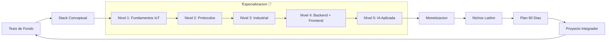
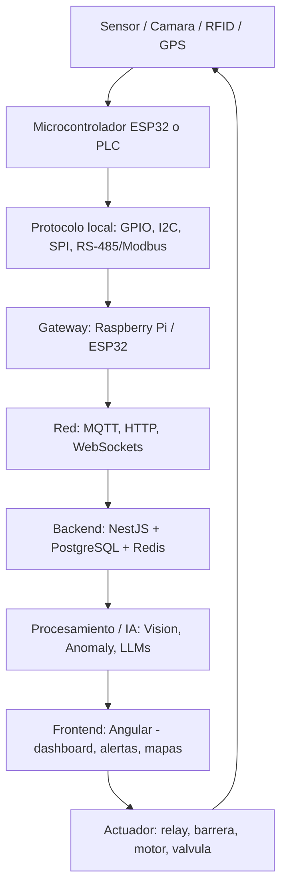
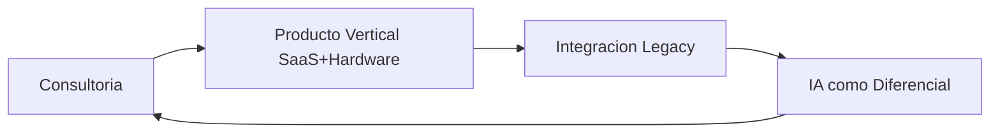

# 🚀 MASTERCLASS: Ruta de Aprendizaje Fullstack + IoT + AI 🧩🛰️🤖

## 🎯 INTRODUCCIÓN: POR QUÉ ESTA RUTA ES DIFERENTE 💡

La IA está comoditizando el desarrollo web puro: CRUDs, dashboards, APIs, auth, componentes UI. Cualquier LLM genera el 70-80% de ese código en minutos. Eso no significa que el web dev muera —significa que su margen se comprime.

Lo que la IA todavía no resuelve con "otro prompt" es la fricción del mundo físico: un sensor con ruido, un microcontrolador que se cuelga, una red 3G que se corta 20 veces al día, un PLC de hace 15 años que solo habla Modbus. Esa es la barrera de entrada real, y es la que conviene construir.

> **🎯 Objetivo de Aprendizaje** — Al final de esta ruta, tendrás un mapa progresivo para moverte de fullstack a "software que toca el mundo físico", sabrás qué cursos estudiar, cómo monetizarlo y tendrás un plan de 90 días ejecutable, todo aplicado con el método I Do / We Do / You Do.

> **⚠️ Advertencia honesta** — No existe el "100% future-proof". La ventaja que construyes es de tiempo, no eterna. Y un bug en un sistema que controla una barrera o una válvula puede causar daño físico real: la seguridad importa más acá que en un dashboard.

---

## 🗺️ MAPA DE LA RUTA DE APRENDIZAJE 🗺️



| Fase 🧩 | Pregunta que responde ❓ | Output principal 🎯 |
|------|-----------------------|------------------|
| **Tesis de fondo** 🧠 | ¿Por qué IoT+AI y no solo web? | Conviction y dirección |
| **Stack conceptual** 🔌 | ¿Cómo encaja el hardware con tu stack? | Mapa de capas |
| **5 niveles** 🪜 | ¿Qué saber y en qué orden? | Ruta técnica |
| **Ruta Platzi** 🎓 | ¿Qué cursos tomar? | Plan de estudio |
| **Monetización** 💰 | ¿Cómo cobrar esto? | Modelo de negocio |
| **Nichos** 🏭 | ¿Dónde aplicarlo primero? | Vertical concreto |
| **90 días** 🗓️ | ¿Cómo ejecutar? | Cronograma real |

---

## 📚 PARTE 1: LA TESIS DE FONDO (I DO — INSTRUCTOR) 🧠

### 1.1 La IA comoditiza el software puro

Un desarrollador fullstack hoy puede armar un CRUD en una tarde. Un LLM puede generar ese mismo CRUD en minutos. Cuando la barrera de entrada baja, el precio por hora también baja. No porque seas peor, sino porque hay más oferta que resuelve lo mismo.

> **📌 Idea clave** — El problema no es que la IA escriba código. Es que escribe el código que la mayoría de los clientes pedía hasta ayer. Tu valor percibido cae si sigues solo en esa zona.

### 1.2 La fricción del mundo físico no se resuelve con prompts

Lo que la IA no arregla con un chat es la realidad material:

- Un sensor que da falsos positivos por ruido eléctrico.
- Un microcontrolador que se cuelga por brownout.
- Una red industrial que se corta 20 veces al día.
- Un PLC de hace 15 años que solo habla Modbus RTU por RS-485.
- Un dispositivo que hay que actualizar remotamente sin ir al lugar.

| Lo que la IA resuelve solo 🤖 | Lo que NO resuelve (fricción física) 🔧 |
|-------------------------------|------------------------------------------|
| CRUD y dashboards | Sensores con ruido eléctrico |
| APIs simples y auth | Microcontroladores que se cuelgan |
| Landing pages y UI | Redes 3G/4G que se caen |
| Componentes estándar | PLCs viejos con Modbus/RS-485 |
| Generación de código | Actualización remota de firmware |

### 1.3 La web es tu ventaja competitiva

La conclusión correcta no es "abandonar la web". Es: **la web es tu diferencial cuando la combinás con hardware**, porque la mayoría de la gente que sabe hardware no sabe construir un backend ni un dashboard decente, y viceversa.

> **📌 Idea clave** — Vos ya dominás las dos capas de mayor valor percibido por el cliente (backend + frontend). Lo que sumás son los extremos: captura física (hardware) e inteligencia (IA aplicada a esos datos).

---

## 🔌 PARTE 2: EL STACK CONCEPTUAL (WE DO — COLABORATIVO) 🤝

### 2.1 El flujo completo de extremo a extremo



### 2.2 Ejercicio colaborativo: mapeá tu stack actual

**Escenario:** sos dev fullstack Angular / Node / NestJS / PostgreSQL. Marcá qué capas ya dominás y cuáles son nuevas.

| Capa 🔢 | La tenés 🟢 | La sumás 🟡 |
|---------|-------------|-------------|
| Frontend (Angular) | ✅ | |
| Backend (NestJS + PostgreSQL) | ✅ | |
| Mensajería tiempo real (Redis/MQTT) | | 🟡 |
| Protocolos de red (MQTT/WebSockets) | | 🟡 |
| Gateway / edge (Raspberry Pi) | | 🟡 |
| Microcontroladores (ESP32) | | 🟡 |
| Protocolos industriales (Modbus) | | 🟡 |
| IA aplicada (Vision/Anomaly/LLM) | | 🟡 |

> **📌 Idea clave** — No necesitás "convertirte en ingeniero electrónico". El objetivo es entender lo suficiente de hardware y protocolos para integrarlo con tu stack actual, no diseñar placas desde cero.

---

## 🪜 PARTE 3: LOS 5 NIVELES DE ESPECIALIZACIÓN (YOU DO — INDEPENDIENTE) 💪

### 3.1 Nivel 1 — Fundamentos de IoT y microcontroladores

**Objetivo:** perder el miedo al hardware. Entendés GPIO, sensores, actuadores y cómo un micro se conecta a la red.

| Tema 📋 | Qué aprendés 🎯 |
|---------|-----------------|
| Electrónica básica | Voltaje, corriente, resistencias, protoboard |
| ESP32 | GPIO, PWM, señales analógicas, Wi-Fi, servidor web embebido |
| Sensores | Temperatura, humedad, movimiento, distancia |
| Actuadores | Relays, motores |

### 3.2 Nivel 2 — Protocolos y comunicación IoT

**Objetivo:** que un dispositivo hable con tu backend de forma confiable.

| Tema 📋 | Qué aprendés 🎯 |
|---------|-----------------|
| HTTP/REST | Desde un microcontrolador |
| MQTT | Pub/sub — el protocolo estándar de IoT |
| WebSockets | Tiempo real |
| LoRa / RF | Largo alcance, bajo consumo |
| Raspberry Pi | Gateway / edge device |

### 3.3 Nivel 3 — Protocolos industriales (tu diferencial)

**Objetivo:** integrarte con la infraestructura vieja de fábricas y plantas. Acá está la barrera más alta.

| Tema 📋 | Qué aprendés 🎯 |
|---------|-----------------|
| RS-485 / Modbus | RTU y TCP |
| PLC / RTU / SCADA | Conceptos de control industrial |
| I2C / SPI | Sensórica de precisión |
| OPC-UA | Estándar moderno de comunicación industrial |

> **📌 Idea clave** — El Nivel 3 es donde menos gente cruza la barrera. Por eso tiene el ticket promedio más alto: paciencia con documentación vieja y hardware raro escasea.

### 3.4 Nivel 4 — Backend y frontend de producción

**Objetivo:** sumar tiempo real y mensajería, que en web "tradicional" se usa menos.

| Tema 📋 | Qué aprendés 🎯 |
|---------|-----------------|
| NestJS | WebSockets, integración con brokers MQTT |
| PostgreSQL | Series temporales (TimescaleDB) |
| Redis | Colas y estado en tiempo real |
| Angular | Dashboards, mapas, gráficas en vivo |

### 3.5 Nivel 5 — IA aplicada

**Objetivo:** que el sistema no solo muestre datos, sino que decida o alerte.

| Tema 📋 | Qué aprendés 🎯 |
|---------|-----------------|
| Computer Vision | OpenCV, YOLO: detección, matrículas, EPP |
| Anomaly detection | Series temporales (consumo, temperatura, vibración) |
| Mantenimiento predictivo | Básico |
| LLMs | Reportes, alertas en lenguaje natural |

### 3.6 Ejercicio: diseñá tu progresión de niveles

**Tarea:** definí cuántas semanas dedicás a cada nivel según tu punto de partida.

| Nivel 🪜 | Semanas estimadas 🗓️ | Prioridad 🔥 |
|----------|----------------------|--------------|
| 1. Fundamentos | | Alta |
| 2. Protocolos | | Alta |
| 3. Industrial | | Media |
| 4. Backend/Front | | Baja (ya sabés) |
| 5. IA aplicada | | Media-Alta |

---

## 🎓 PARTE 4: RUTA DE ESTUDIO EN PLATZI (I DO — INSTRUCTOR) 📚

### 4.1 Ruta troncal de IoT

Platzi tiene una **Ruta de Internet of Things** completa. Cursos clave:

- Fundamentos de Electricidad y Electrónica
- Introducción a IoT (incluye puerta de entrada a PLC/RTU)
- Desarrollo de Hardware con Arduino
- IoT: Protocolos de Comunicación (Wi-Fi, LoRa, RF, Raspberry Pi)
- IoT: Programación de Microcontroladores ESP32 (GPIO, PWM, FreeRTOS)
- IoT: Telecomunicaciones con LoRa
- **Node.js para IoT: Pub/Sub con MQTT, Testing y WebSockets** (clave: conecta tu Node con el mundo IoT)

> **📌 Idea clave** — Para RS-485/Modbus/PLC profundo, Platzi no tiene hoy ruta industrial tan profunda: complementá con documentación oficial o cursos puntuales fuera de Platzi.

### 4.2 Tu base para reforzar

| Área 🧱 | Cursos sugeridos 🎯 |
|---------|---------------------|
| Backend | NestJS API REST, Modular, Auth JWT, TypeORM, Redis, Ruta Node.js |
| Frontend | Angular Router Lazy Loading, RxJS y testing para streams en vivo |
| IA | Visión Artificial con Python (OpenCV/YOLO), Fundamentals AI/ML, CV con TensorFlow |

### 4.3 Orden sugerido de consumo

1. Introducción a IoT → Hardware con Arduino
2. Programación de Microcontroladores ESP32
3. IoT: Protocolos de Comunicación (MQTT, LoRa, Raspberry Pi)
4. **Node.js para IoT: Pub/Sub con MQTT** (bisagra hardware→backend)
5. Repaso rápido de NestJS avanzado (WebSockets, TypeORM, Auth) — si ya lo sabés, saltalo
6. Visión Artificial con Python (OpenCV/YOLO)
7. Proyecto integrador propio

---

## 💰 PARTE 5: CÓMO SE MONETIZA (WE DO — COLABORATIVO) 🤝

### 5.1 Los cuatro modelos de negocio



| Modelo 💡 | ¿En qué consiste? 🎯 | Ticket 💵 |
|-----------|----------------------|-----------|
| **1. Consultoría** | Resolvés un dolor operativo puntual | Alto + recurrente (mantenimiento) |
| **2. Producto vertical** | SaaS + hardware para un nicho (frío, acceso, logística) | Suscripción por dispositivo/sitio |
| **3. Integración legacy** | Puente entre PLC viejo y dashboard moderno | Muy alto, poca competencia |
| **4. IA como diferencial** | Anomalías, alertas, resúmenes LLM sobre datos que ya fluyen | Subís precio sin duplicar esfuerzo |

### 5.2 Ejercicio colaborativo: elegí tu modelo

**Escenario:** tenés un contacto con un depósito que pierde mercadería por temperatura.

| Decisión 🔍 | Opción recomendada ✅ | Justificación 🧠 |
|-------------|----------------------|------------------|
| Modelo | Consultoría + luego vertical | Arrancás resolviendo el dolor concreto |
| Primer entregable | Sensor temp → MQTT → NestJS → alerta | Portfolio piece rápido |
| Recurrencia | Mantenimiento mensual | Ingreso predecible |
| Diferencial | Alerta predictiva con IA | Subís el precio después |

> **📌 Idea clave** — El cliente no compra "un backend en NestJS" ni "un ESP32 con MQTT". Compra la automatización de una operación física. Vendé el resultado operativo, no la arquitectura.

---

## 🏭 PARTE 6: NICHOS CONCRETOS (YOU DO — INDEPENDIENTE) 💪

### 6.1 Dónde empezar en LatAm

Hay mucha infraestructura que no nació pensando en APIs: industria, logística, agro, seguridad, edificios. Tabla de entrada:

| Nicho 🏭 | Problema que resolvés 🔧 | Stack típico 🔌 |
|----------|--------------------------|-----------------|
| Fábrica / PyME | "Avisame si la máquina consume de más o se detiene" | Sensor → ESP32 → MQTT → NestJS → PostgreSQL → Angular → alerta WhatsApp |
| Logística | Seguimiento de flota, desvíos | GPS + gateway → backend → mapa en vivo → IA |
| Acceso inteligente | Matrícula/rostro abre barrera | Cámara → CV → LPR → backend → barrera |
| Gimnasio | QR/RFID + socio + cámara | RFID/QR + cámaras + backend + IA |
| Cámara de frío | Alerta temp fuera de rango | Temp → gateway → backend → alerta |
| Agro | Humedad de suelo, riego | Sensores + LoRa → backend → dashboard |

### 6.2 Ejercicio: elegí tu nicho

**Tarea:** elegí el nicho donde ya tengas un contacto o conocimiento de dominio. El primer proyecto real vale más que diez cursos.

| Criterio 📊 | Tu nicho elegido 🎯 |
|-------------|---------------------|
| Contacto directo | |
| Dolor operativo claro | |
| Hardware alcanzable | |
| Potencial de recurrencia | |

---

## 🗓️ PARTE 7: PLAN DE 90 DÍAS (I DO — INSTRUCTOR) 📅

### 7.1 Cronograma ejecutable

| Semanas 🗓️ | Enfoque 🎯 | Entregable 🏗️ |
|------------|-----------|---------------|
| 1-3 | Ruta IoT (Intro + Arduino + ESP32) | ESP32 comprado (~10-15 USD), prácticas replicadas |
| 4-5 | Protocolos + Node.js para IoT | ESP32 conectado a backend NestJS propio |
| 6 | Mini-proyecto end-to-end | Sensor → MQTT → NestJS → PostgreSQL → Angular en vivo |
| 7-9 | Visión Artificial (OpenCV/YOLO) | Segunda fuente: cámara con detección |
| 10-12 | Primer cliente piloto | Nicho elegido, caso de uso validado |

> **📌 Idea clave** — Al final de los 90 días tenés: conocimiento en las 5 capas, un proyecto demostrable y (idealmente) un primer cliente o caso validado.

---

## ⚠️ PARTE 8: ADVERTENCIAS HONESTAS (WE DO — COLABORATIVO) 🤝

### 8.1 Las cuatro verdades incómodas

| Advertencia 🚩 | Qué significa 🧠 |
|----------------|------------------|
| No hay "100% future-proof" | La ventaja es de tiempo, no eterna |
| No es camino instantáneo | Ciclos de hardware y testing físico llevan más que un CRUD |
| La seguridad importa más | Un bug puede causar daño físico real |
| No hace falta ser ingeniero electrónico | Entendés lo suficiente para integrar |

### 8.2 Ejercicio: assess de riesgos de tu proyecto

**Escenario:** tu primer cliente es una barrera automática en un estacionamiento.

| Riesgo 🔴 | Mitigación 🟢 |
|-----------|--------------|
| Red se corta y la barrera queda abajo | Modo seguro / fallback local |
| Falso positivo abre la barrera | Doble validación (LPR + QR) |
| Firmware bug | OTA con rollback |
| Intruso en MQTT | Auth + TLS + ACLs |

---

## 🧠 PARTE 9: RESUMEN EJECUTIVO (YOU DO — INDEPENDIENTE) 💪

### 9.1 Ejercicio de síntesis en una página

**Tarea:** completá este resumen con tus propias palabras y datos.

| Bloque 📦 | Tu conclusión en 1 línea 📝 |
|-----------|------------------------------|
| Tesis | |
| Stack | |
| Nivel más valioso | |
| Curso clave | |
| Modelo de ingreso | |
| Nicho inicial | |
| Primer hito (90 días) | |

> **📌 Idea clave** — El valor comercial no está en "hacer otro SaaS". Está en resolver problemas operativos reales de empresas que hoy dependen de procesos manuales o sistemas viejos desconectados. Ese es el terreno con menos competencia y mayor ticket.

---

## 🧩 PARTE 10: I DO / WE DO / YOU DO — EJERCICIOS PROGRESIVOS

### 10.1 I Do — Diagnosticar la tesis

**Objetivo:** confirmar por qué IoT+AI es una apuesta válida para un fullstack.

| Paso | Acción | Resultado esperado |
|------|--------|--------------------|
| 1 | Listar 3 tareas web que un LLM resuelve hoy | CRUD, auth, dashboard |
| 2 | Listar 3 fricciones físicas que no | Ruido sensor, red cortada, PLC viejo |
| 3 | Concluir tu ventaja | Web + hardware = diferencial |

**Interpretación guiada:**
- Si tu trabajo es solo CRUD, tu precio cae.
- Si sumás hardware, la barrera sube.
- El cliente paga por automatizar lo físico, no por el framework.

### 10.2 We Do — Mapear el stack

**Escenario:** empresa con PLCs viejos quiere un dashboard moderno.

| Decisión | Opción recomendada | Justificación |
|----------|--------------------|---------------|
| Leer PLC | RS-485/Modbus gateway | Estándar industrial |
| Backend | NestJS + PostgreSQL | Lo que ya sabés |
| Visualización | Angular en tiempo real | Dashboards vivos |
| Alerta | WhatsApp/email | Canal del cliente |

### 10.3 You Do — Tu Nivel 1 en vivo

**Tarea:** comprá un ESP32 y medí temperatura/humedad, mostrando el valor por serial.

Debes incluir:
- Conexión del sensor (I2C/DHT)
- Lectura en loop
- Envío por serial o Wi-Fi
- Un LED que parpadee como heartbeat

| Criterio | Peso |
|----------|------|
| Cableado correcto | 25% |
| Lectura estable | 25% |
| Conexión red | 25% |
| Claridad del código | 25% |

### 10.4 I Do — Primer MQTT

**Objetivo:** entender pub/sub conectando micro y broker.

| Paso | Acción | Validación |
|------|--------|------------|
| 1 | Levantar broker MQTT local | `mosquitto` corre |
| 2 | ESP32 publica `temp/01` | Mensaje llega |
| 3 | Suscriptor en Node | Recibe en consola |

```text
ESP32 --publish(topic: temp/01)--> Broker MQTT --> Node subscriber
```

### 10.5 We Do — Interpretar el flujo

**Caso:** el dashboard no actualiza aunque el sensor manda.

| Pregunta | Respuesta esperada |
|------------|--------------------|
| ¿Llega al broker? | Verificar suscriptor |
| ¿Caída la red? | Reintento con backoff |
| ¿Mal tópico? | Namespace consistente |
| ¿Auth falla? | Usuario/clave/MTLS |

### 10.6 You Do — Mini proyecto end-to-end

**Tarea:** sensor → MQTT → NestJS → PostgreSQL → Angular en vivo (Semana 6).

Debe incluir:
- ESP32 publicando por MQTT
- NestJS suscrito al broker
- Persistencia en PostgreSQL (serie temporal)
- Dashboard Angular con gráfica en tiempo real
- Alerta fuera de umbral

| Criterio | Peso |
|----------|------|
| Backend robusto | 25% |
| Frontend en vivo | 25% |
| Persistencia | 20% |
| Alerta | 15% |
| Documentación | 15% |

### 10.7 I Do — Visión aplicada

**Objetivo:** detectar un objeto con YOLO sobre una cámara.

| Paso | Acción | Validación |
|------|--------|------------|
| 1 | Instalar OpenCV/YOLO | `import cv2` ok |
| 2 | Correr inferencia en video | Boxes dibujados |
| 3 | Disparar evento al backend | POST recibido |

### 10.8 We Do — Diseñar un nicho

**Escenario:** gimnasio quiere control de acceso sin personal.

| Decisión | Opción | Justificación |
|----------|--------|---------------|
| Identificación | QR + RFID | Barato y confiable |
| Cámara | Conteo de personas | Evita colados |
| Backend | NestJS + IA | Lo que sabés |
| Alerta | App del dueño | Visibilidad |

### 10.9 You Do — Tu plan de 90 días

**Tarea:** adaptá el cronograma de la Parte 7 a tu calendario real.

| Semana | Tema | Entregable |
|--------|------|------------|
| 1-3 | | |
| 4-5 | | |
| 6 | | |
| 7-9 | | |
| 10-12 | | |

### 10.10 Cierre práctico

| Nivel | Debes poder hacer |
|-------|-------------------|
| **I Do** | Seguir un ejemplo completo: sensor → MQTT → backend → alerta |
| **We Do** | Mapear stack, interpretar fallos y diseñar un nicho con otro |
| **You Do** | Construir tu proyecto end-to-end, elegir nicho y ejecutar 90 días |

---

## ✅ CHECKLIST FINAL DE LA RUTA

| Bloque 📦 | Check ✔️ |
|--------|-------|
| Tesis | Entendés por qué IoT+AI > web puro hoy |
| Stack | Mapeaste capas y tu ventaja competitiva |
| Nivel 1 | ESP32, sensores y actuadores funcionando |
| Nivel 2 | MQTT/WebSockets conectando micro y backend |
| Nivel 3 | Modbus/RS-485 como diferencial industrial |
| Nivel 4 | NestJS + PostgreSQL + Angular en tiempo real |
| Nivel 5 | CV o anomaly detection aplicada |
| Estudio | Ruta Platzi ordenada y cursada |
| Monetización | Modelo de ingreso definido |
| Nicho | Vertical concreto elegido |
| 90 días | Cronograma y primer proyecto real |
| Seguridad | Fallback y modos seguros ante falla de red |

---

## 📝 PREGUNTAS DE VERIFICACIÓN

Responde cada pregunta basándote en los conceptos de esta ruta. Escribe tus respuestas para profundizar.

### Preguntas sobre la tesis

1. **Aplica**: Si un cliente pide "un dashboard web", ¿por qué deberías derivarlo hacia IoT+AI en lugar de solo hacer CRUD?

2. **Analiza**: ¿Qué fricción física específica no puede resolverse con "otro prompt" en un proyecto de cámara de frío?

### Preguntas sobre el stack y niveles

3. **Diseña**: Mapea un proyecto de barrera de estacionamiento en el stack conceptual (sensor → actuador). ¿Qué capas ya tenés y cuáles sumás?

4. **Reflexiona**: ¿Por qué el Nivel 3 (protocolos industriales) tiene el ticket promedio más alto?

### Preguntas sobre estudio y monetización

5. **Calcula**: Un proyecto de consultoría cobra $3.000 setup + $300/mes de mantenimiento. ¿Cuál es el ingreso recurrente anual si sumás 5 clientes iguales?

6. **Evalúa**: ¿Por qué "vender el resultado operativo, no la arquitectura" mejora la conversión con dueños no técnicos?

### Preguntas integradoras

7. **Conecta**: Explica cómo el Nivel 4 (backend/frontend que ya sabés) acelera todo el resto de la ruta. ¿Qué dejas de aprender?

8. **Propón un sistema**: Diseña un modelo de monetización para el nicho agro con sensores LoRa. ¿Suscripción, consultoría o ambas?

9. **Síntesis**: Tomá el nicho que elegiste en la Parte 6 y aplicale la ruta completa: nivel de entrada, curso Platzi, proyecto de 90 días y modelo de ingreso.

10. **Reflexión final**: De los 9 bloques de la ruta, ¿cuál consideras el más crítico para no fracasar en el primer cliente real? Justifica.

---

## 📖 GLOSARIO RÁPIDO

| Término | Definición |
|---------|------------|
| **IoT** | Internet of Things: dispositivos físicos conectados a la red |
| **ESP32** | Microcontrolador con Wi-Fi y GPIO, piedra angular del hobby/proto IoT |
| **MQTT** | Protocolo pub/sub ligero, estándar de facto en IoT |
| **Gateway** | Dispositivo que puentea protocolos locales con la red IP |
| **Modbus** | Protocolo industrial (RTU sobre RS-485, TCP sobre Ethernet) |
| **PLC** | Controlador lógico programable en plantas industriales |
| **SCADA** | Sistema de supervisión y control de procesos industriales |
| **Opc-UA** | Estándar moderno de comunicación industrial interoperable |
| **Computer Vision** | IA que interpreta imágenes (OpenCV, YOLO) |
| **Anomaly detection** | Detección de desvíos en series temporales |
| **Time-series** | Datos de sensores indexados por tiempo (TimescaleDB) |
| **Edge device** | Dispositivo que procesa cerca de la fuente, no en la nube |
| **Brownout** | Caída de voltaje que puede colgar un microcontrolador |
| **OTA** | Over-the-air: actualización remota de firmware |

---

## 🧰 ANEXO A: PATRÓN DE ENSEÑANZA APLICADO A ESTA GUÍA

Esta ruta misma usa el patrón de guías efectivas explicado en `skills/skill.md`. Resumen aplicable a tus propias guías:

| Regla 📐 | Cómo se aplicó aquí ✅ |
|----------|------------------------|
| Jerarquía visual clara | H1 título, H2 partes, H3 sub-temas |
| Párrafos cortos | Bloques de 200-400 palabras máximo |
| Espacio en blanco | Separadores `---` entre secciones |
| Secciones cortas | Cada parte con un foco único |
| Alternar patrones | Lista → tabla → Mermaid → código → resumen |
| Resúmenes frecuentes | Cajas `📌 Idea clave` cada 2-3 secciones |
| I Do / We Do / You Do | Ejercicios progresivos en Parte 10 |
| Evaluación | Preguntas de verificación al final |
| Glosario | Tabla de términos al cierre |

> **📌 Idea clave de diseño** — Una guía se lee mejor cuando el cerebro "escanea" sin leer todo. Jerarquía, blanco y cierres frecuentes reducen la carga cognitiva.

---

## 📚 ANEXO B: RECURSOS CURADOS (PLATZI + EXTERNOS)

### Ruta troncal IoT (Platzi)

| Curso 🎓 | Nivel 🪜 | Por qué importa 🎯 |
|----------|----------|---------------------|
| Fundamentos de Electricidad y Electrónica | 1 | Base sin miedo al hardware |
| Introducción a IoT | 1-3 | Incluye puerta a PLC/RTU |
| Hardware con Arduino | 1 | Primer contacto práctico |
| IoT: Protocolos de Comunicación | 2 | MQTT, LoRa, Raspberry Pi |
| IoT: Microcontroladores ESP32 | 2 | GPIO, PWM, FreeRTOS |
| Node.js para IoT (MQTT/WebSockets) | 2-4 | Bisagra hardware→backend |
| Visión Artificial con Python | 5 | OpenCV/YOLO aplicable |

### Reforzar tu base (Platzi)

| Área 🧱 | Cursos 🎓 |
|---------|-----------|
| Backend | NestJS API REST, Modular, Auth JWT, TypeORM, Redis |
| Frontend | Angular Router, RxJS, testing de streams |
| IA | Fundamentals AI/ML, CV con TensorFlow |

### Externos para el Nivel 3 (industrial)

| Recurso 🔗 | Uso 🛠️ |
|------------|--------|
| Documentación oficial Modbus | Referencia RTU/TCP |
| Guías RS-485 de fabricantes | Cableado y terminación |
| OPC-UA specs | Estándar moderno de integración |

---

> **📌 Idea clave final** — La IA abarata el software puro, pero no elimina la fricción del mundo físico. Para un fullstack, la barrera de entrada a IoT+AI no es tan alta como parece: la parte difícil de conseguir en el mercado (backend + frontend) ya la tenés. Lo que falta —hardware/protocolos e IA aplicada— es alcanzable en pocos meses con una ruta de estudio real.
