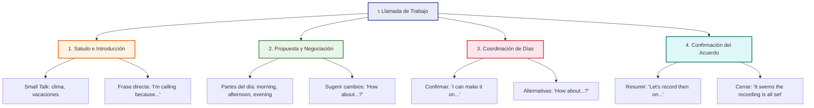

# 📅 MASTERCLASS: Scheduling in English — Coordinar Fechas y Horarios como Profesional

## 🎯 IDEA PRINCIPAL

Esta clase enseña cómo coordinar fechas, negociar horarios y agendar reuniones en inglés de forma natural y profesional mediante un diálogo de trabajo entre dos colegas (Andrew y Ravi).

Las preposiciones **at, in, on** no son solo gramática — son herramientas de comunicación que usas cada vez que agendas algo, propones un horario o confirmas una reunión.

---

## 🗣️ ETAPAS DE LA CONVERSACIÓN LABORAL



---

## 📞 ETAPA 1: Saludo e Introducción (Small Talk)

### 🧊 Ruptura de hielo

El primer minuto de cualquier llamada laboral importa. En inglés, el small talk no es opcional — es la puerta de entrada a la conversación profesional.

| Expresión | Uso | Emoji |
|-----------|-----|-------|
| **How's it going?** | Saludo informal y directo | 👋 |
| **Doing all right?** | Pregunta amigable sobre el estado | 😊 |
| **How's your week going?** | Interés genuino por la otra persona | 📅 |
| **Hope you're having a good day!** | Cortesía al inicio de la llamada | ☀️ |
| **Long time no talk!** | Ruptura de hielo si hace tiempo que no hablan | 🤝 |

### 🎯 Propósito claro

Para pasar de la conversación casual a la agenda de trabajo, se usa una frase directa que establece el motivo de la llamada:

> **"I'm calling you because we need to set a date."**

| Elemento | Ejemplo | Emoji |
|----------|---------|-------|
| Motivo | "I'm calling you because..." | 📞 |
| Acción | "we need to set a date" | 📅 |
| Resultado | Se abre la agenda de negociación | ✅ |

### 💡 Frases útiles para iniciar

| Situación | Frase | Emoji |
|-----------|-------|-------|
| Llamada programada | "Thanks for taking the time to talk today." | 🙏 |
| Llamada inesperada | "Sorry to catch you off guard, but..." | 📱 |
| Seguimiento | "Following up on our last conversation..." | 🔄 |
| Agenda clara | "I'd like to go over the schedule for next week." | 📋 |

---

## ⏰ ETAPA 2: Propuesta y Negociación de Horarios

### 🕐 Partes del día

Al proponer horarios, siempre es bueno preguntar la preferencia del otro usando las partes del día:

> **"Do you prefer to record in the morning, in the afternoon, or in the evening?"**

| Parte del día | Preposición | Ejemplo | Emoji |
|---------------|-------------|---------|-------|
| Mañana | **in** the morning | in the morning, at 9 AM | 🌅 |
| Tarde | **in** the afternoon | in the afternoon, at 2 PM | 🌤️ |
| Noche | **in** the evening | in the evening, at 7 PM | 🌙 |
| Medianoche | **at** night | at night, at midnight | 🌃 |

### 🔄 Sugerir cambios

Si una hora no conviene, la estructura **"How about...?"** es tu mejor aliada:

> **"That's too early. How about at 8:00 AM?"**

| Situación | Frase | Emoji |
|-----------|-------|-------|
| Muy temprano | "That's too early. How about...?" | ⏰ |
| Muy tarde | "That's too late. Could we try...?" | 🕛 |
| No disponible ese día | "I can't do that day. What about...?" | 📅 |
| Proponer alternativa | "How about we try...?" | 💡 |
| Confirmar que funciona | "That works for me!" | ✅ |
| Aceptar con ajuste | "That could work. Could we make it...?" | 🤝 |

### 📊 Diálogo de ejemplo: Negociación

```text
Andrew:  "Do you prefer to record in the morning or in the afternoon?"
Ravi:    "Morning works better for me."
Andrew:  "How about Tuesday at 10:00 AM?"
Ravi:    "That's too early for me. How about 11:00 AM?"
Andrew:  "11:00 AM works! Let's go with that."
```

---

## 📆 ETAPA 3: Coordinación de Días de la Semana

### ✅ Confirmar disponibilidad

Cuando el otro propone un día, la forma natural de confirmar es:

> **"I can make it on [Day]."**

| Confirmación | Ejemplo | Emoji |
|--------------|---------|-------|
| **I can make it on...** | I can make it on Monday and Wednesday | ✅ |
| **That works for me on...** | That works for me on Thursday | 👍 |
| **I'm available on...** | I'm available on Tuesday and Friday | 📅 |
| **Sure, I'm free on...** | Sure, I'm free on Wednesday | 🎯 |

### 🔄 Proponer alternativas

Si hay un cruce en la agenda, proponer un día diferente es clave:

> **"How about recording on Thursday?"**

| Alternativa | Frase | Emoji |
|-------------|-------|-------|
| Proponer otro día | "How about...?" | 💡 |
| Sugerir rango | "Would any day next week work?" | 📋 |
| Pedir opciones | "What days work best for you?" | 🤔 |
| Reorganizar | "Could we shift to...?" | 🔄 |

### 📊 Diálogo de ejemplo: Coordinación de días

```text
Andrew:  "I can make it on Monday and Wednesday."
Ravi:    "Monday works for me too. How about Wednesday?"
Andrew:  "Wednesday is fine. How about we also add Thursday?"
Ravi:    "Thursday works as well. Let's go with Monday, Wednesday, and Thursday."
```

---

## ✔️ ETAPA 4: Confirmación del Acuerdo

### 📋 Resumir los detalles finales

Para cerrar la llamada y evitar malentendidos, es clave resumir los detalles:

> **"Let's record then on Monday, Wednesday, and Thursday, starting at 8:00 AM and finishing at noon."**

| Elemento | Detalle | Preposición | Emoji |
|----------|---------|-------------|-------|
| Días | Monday, Wednesday, Thursday | **on** | 📅 |
| Hora de inicio | 8:00 AM | **at** | ⏰ |
| Hora de fin | noon | **at** | ⏰ |
| Duración | 4 hours | — | 🕐 |

### 🗣️ Frase clave de cierre

> **"It seems the recording is all set."**
> *(Todo está preparado / listo)*

| Cierre | Significado | Emoji |
|--------|-------------|-------|
| **It seems the recording is all set** | Todo está listo | ✅ |
| **So we're good then** | Entonces estamos de acuerdo | 🤝 |
| **Let me confirm the details** | Déjame confirmar los detalles | 📋 |
| **I'll send a calendar invite** | Enviaré una invitación al calendario | 📧 |
| **Does that work for everyone?** | ¿Funciona para todos? | 👥 |
| **Great, talk then!** | ¡Genial, hablamos entonces! | 👋 |

### 📊 Diálogo completo de ejemplo

```text
Andrew:  "Hi Ravi, how's it going?"
Ravi:    "Doing all right, thanks! How about you?"
Andrew:  "Good! I'm calling you because we need to set a date for the recording."
Ravi:    "Sure, what were you thinking?"
Andrew:  "Do you prefer to record in the morning, in the afternoon, or in the evening?"
Ravi:    "Morning works best for me."
Andrew:  "How about Tuesday at 10:00 AM?"
Ravi:    "That's too early. How about 11:00 AM?"
Andrew:  "11:00 AM works! What days are you available?"
Ravi:    "I can make it on Monday and Wednesday."
Andrew:  "How about also Thursday?"
Ravi:    "Thursday works too. Let's go with Monday, Wednesday, and Thursday."
Andrew:  "Perfect. Let's record then on Monday, Wednesday, and Thursday, starting at 8:00 AM and finishing at noon."
Ravi:    "It seems the recording is all set. I'll send the calendar invite."
Andrew:  "Great, talk then!"
```

---

## 📌 REGLA DE PREPOSICIONES (Clave de la clase)

### 🧱 Las 3 Reglas Fundamentales

| Preposición | Cuándo usarla | Ejemplos | Emoji |
|-------------|---------------|----------|-------|
| **IN** | Partes del día, meses, temporadas, periodos | **in** the morning, **in** December, **in** summer, **in** two weeks | 📦 |
| **ON** | Días específicos, fechas exactas | **on** Monday, **on** Wednesday, **on** July 3rd | 📅 |
| **AT** | Horas exactas, momentos puntuales, la noche | **at** 7:00 AM, **at** 8:00 AM, **at** noon, **at** night | ⏰ |

### 📊 Tabla de referencia completa

| Categoría | Preposición | Ejemplos | Emoji |
|-----------|-------------|----------|-------|
| **Partes del día** | 📦 **in** | in the morning, in the afternoon, in the evening | 🌅🌤️🌙 |
| **Meses** | 📦 **in** | in January, in December, in July | 📆 |
| **Temporadas** | 📦 **in** | in summer, in winter, in spring | 🌞❄️🌸 |
| **Periodos** | 📦 **in** | in two weeks, in a month, in the future | 📅 |
| **Días de la semana** | 📅 **on** | on Monday, on Wednesday, on Friday | 📆 |
| **Fechas exactas** | 📅 **on** | on July 3rd, on Christmas Day, on New Year's Eve | 🎄 |
| **Horas exactas** | ⏰ **at** | at 7:00 AM, at 8:00 AM, at noon | 🕐 |
| **Momentos puntuales** | ⏰ **at** | at noon, at midnight, at sunrise | 🌅 |
| **La noche** | ⏰ **at** | at night, at bedtime | 🌃 |

### 💡 Truco de memoria

```text
📦 IN = Interior, período amplio (caja grande)
📅 ON = Sobre, superficie o día específico (línea)
⏰ AT = Punto exacto, momento preciso (punto)

IN → La caja grande (meses, estaciones, partes del día)
ON → La línea del día (días de la semana, fechas)
AT → El punto exacto (horas, momentos puntuales)
```

### 🔄 Comparación visual

| Frase | Preposición | Por qué | Emoji |
|-------|-------------|---------|-------|
| **in** the morning | 📦 in | Parte del día = período amplio | 🌅 |
| **on** Monday | 📅 on | Día específico = línea concreta | 📆 |
| **at** 8:00 AM | ⏰ at | Hora exacta = punto preciso | 🕐 |
| **in** December | 📦 in | Mes = período amplio | 📆 |
| **on** July 3rd | 📅 on | Fecha exacta = línea concreta | 📅 |
| **at** noon | ⏰ at | Momento puntual = punto exacto | ⏱️ |
| **in** two weeks | 📦 in | Periodo futuro = caja amplia | 📅 |
| **at** night | ⏰ at | Momento específico del día | 🌃 |

---

## 🎧 PRÁCTICA CON EL DIÁLOGO

### Escucha activa 🎯

Escucha el diálogo entre Andrew y Ravi y responde:

1. ¿Qué hora propone Andrew primero? ⏰
2. ¿Por qué Ravi dice que es demasiado temprano? 🕐
3. ¿Qué días confirma Ravi? 📅
4. ¿Cuál es la hora de inicio y fin acordada? ⏰⏰
5. ¿Qué frase usa Ravi para cerrar la conversación? ✅

### Role play 🎭

**Practica con un compañero o en voz alta:**

| Rol | Personaje | Objetivo |
|-----|-----------|----------|
| A | Andrew (coordinador) | Proponer horarios y negociar |
| B | Ravi (participante) | Confirmar disponibilidad y sugerir alternativas |

**Guion de inicio:**

```text
A: "Hi! How's it going?"
B: "Doing all right, thanks! How about you?"
A: "Good! I'm calling because we need to set a date for the meeting."
B: "Sure, what time works for you?"
```

---

## ✅ EJERCICIOS PRÁCTICOS

### Ejercicio 1: Completa con in, on o at 🔤

| # | Oración | Respuesta | Emoji |
|---|---------|-----------|-------|
| 1 | The meeting is ___ Monday. | **on** | 📅 |
| 2 | We'll meet ___ 3:00 PM. | **at** | ⏰ |
| 3 | She works ___ the morning. | **in** | 🌅 |
| 4 | The deadline is ___ December. | **in** | 📆 |
| 5 | I'll call you ___ night. | **at** | 🌃 |
| 6 | The event is ___ July 15th. | **on** | 📅 |
| 7 | He prefers ___ the afternoon. | **in** | 🌤️ |
| 8 | The train leaves ___ noon. | **at** | ⏱️ |
| 9 | We're going ___ summer. | **in** | ☀️ |
| 10 | The party is ___ Friday. | **on** | 🎉 |

### Ejercicio 2: Negociación — Completa con "How about..." 💡

| # | Situación | Respuesta |
|---|-----------|-----------|
| 1 | La hora propuesta es muy temprana | "That's too early. **How about** ___?" |
| 2 | El día no funciona | "I can't do Wednesday. **How about** ___?" |
| 3 | Quiere proponer otra hora | "**How about** ___ at 2:00 PM?" |
| 4 | Acepta con un ajuste | "That could work. **How about** we ___?" |

### Ejercicio 3: Matching — Conectar frases 🤝

| Columna A | Columna B | Emoji |
|-----------|-----------|-------|
| **I can make it on...** | a) Proponer un cambio | ✅ |
| **How about...?** | b) Confirmar disponibilidad | 💡 |
| **That's too early** | c) Sugerir una alternativa | ⏰ |
| **It seems... is all set** | d) Cerrar el acuerdo | 🎯 |

### Ejercicio 4: Escribe tu propio diálogo de agendamiento ✍️

Usa las frases aprendidas para crear un diálogo donde:

1. 📞 Te saludes con small talk
2. 🎯 Expliques el propósito de la llamada
3. ⏰ Propongas 3 opciones de horario
4. 🔄 Negocia hasta llegar a un acuerdo
5. ✅ Cierres con un resumen de los detalles

---

## 📚 RESUMEN VISUAL

```
         IN                    ON                   AT
      (caja grande)        (día específico)     (punto exacto)
         │                     │                    │
    ┌────┴────┐          ┌────┴────┐         ┌────┴────┐
    │         │          │         │         │         │
  partes   meses     días de    fechas    horas    momentos
  del día  estaciones semana   exactas    exactas  puntuales
  verano   invierno   lunes     3 julio   8:00 AM  noon
  verano   verano     viernes   Navidad   midnight night
```

---

## 🧠 GLOSARIO RÁPIDO

| Término | Definición | Emoji |
|---------|------------|-------|
| **Small talk** | Conversación casual antes de entrar en tema serio | 🤝 |
| **Schedule** | Agenda o calendario de actividades | 📋 |
| **Negotiate** | Negociar o llegar a un acuerdo | 🤝 |
| **Availability** | Disponibilidad de alguien | 📅 |
| **Confirm** | Confirmar o asegurar un acuerdo | ✅ |
| **Alternative** | Opción diferente ante un conflicto | 💡 |
| **Deadline** | Fecha límite | ⏰ |
| **Calendar invite** | Invitación de calendario | 📧 |
| **All set** | Todo listo, todo preparado | 🎯 |
| **Wrap up** | Resumir y cerrar una conversación | 📦 |

---

## 📝 Preguntas de Verificación

1. **Aplica**: ¿Qué preposición usas para decir "La reunión es el lunes a las 3pm"? Escribe la oración completa. 📅⏰

2. **Analiza**: ¿Por qué decimos "in the morning" pero "at 8:00 AM"? ¿Cuál es la diferencia entre las dos preposiciones en este contexto? 🧠

3. **Negocia**: Tu compañero propone reunirse a las 7:00 AM y tú no puedes. Escribe cómo lo dices usando "How about...?" ⏰

4. **Coordina**: Escribe 3 días que puedas hacer y 1 alternativa si alguno no funciona. Usa "I can make it on..." y "How about...?" 📅

5. **Cierra**: Escribe el resumen final de una reunión que acordaste para el martes y jueves a las 10:00 AM. Usa "Let's... on..." y "starting at..." 📋

6. **Identifica**: Escucha un podcast o video en inglés sobre programación de reuniones. ¿Cuántas preposiciones diferentes escuchaste? ¿Cuáles? 🎧

7. **Producción**: Escribe un diálogo completo de 8-10 líneas entre dos colegas que están agendando una reunión. Usa small talk, negociación y cierre. ✍️

8. **Comparación**: ¿Cómo agendarías una reunión en tu idioma nativo? ¿Las preposiciones funcionan igual que en inglés? ¿Qué diferencias hay? 🌐

9. **Reflexión**: ¿Qué parte de la negociación de horarios te resultó más difícil? ¿Por qué? 🤔

10. **Síntesis**: Resume en 3 oraciones cómo usarías "at", "in" y "on" al agendar una reunión la próxima semana. 📝

---

## ✅ CHECKLIST FINAL

| Etapa | Check | Pregunta clave | Emoji |
|-------|-------|----------------|-------|
| 🤝 Saludo | ☐ | ¿Usé small talk antes de entrar en la agenda? | 👋 |
| 🎯 Introducción | ☐ | ¿Expliqué claramente el propósito de la llamada? | 📞 |
| ⏰ Negociación | ☐ | ¿Propuse horarios y usé "How about...?" para alternativas? | 💡 |
| 📆 Coordinación | ☐ | ¿Confirmé días con "I can make it on..." y propuse alternativas? | 📅 |
| ✔️ Cierre | ☐ | ¿Resumí los detalles finales y usé "It seems... is all set"? | ✅ |
| 📌 Preposiciones | ☐ | ¿Usé **in** para períodos, **on** para días y **at** para horas? | 🧠 |

---

## 🏁🚀 CIERRE

Agendar reuniones en inglés no se trata solo de gramática — se trata de comunicación clara, cortesía profesional y uso preciso de las preposiciones. Cada vez que dices **"in the morning"**, **"on Monday"** o **"at 8:00 AM"**, estás usando el sistema que los nativos emplean a diario.

> *"Las preposiciones son el pegamento del inglés. Con ellas, las reuniones se agendan, los horarios se coordinan y los proyectos avanzan."* 📅✨

Practica el diálogo completo, haz los ejercicios y en pocas semanas agendar reuniones en inglés será automático. 🎯🤝

---