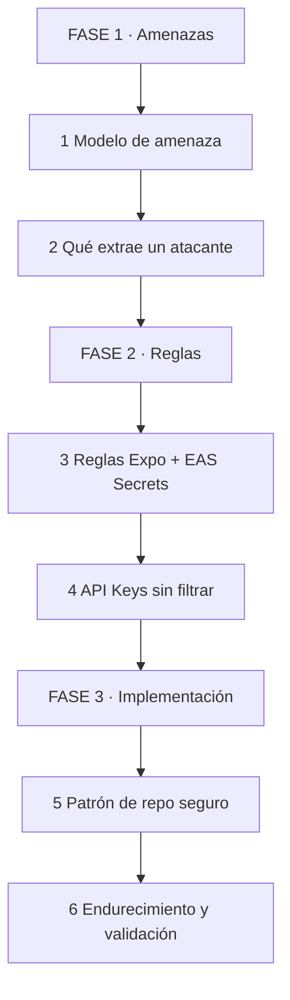
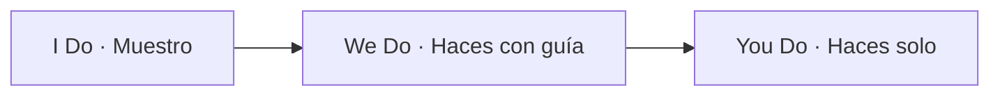
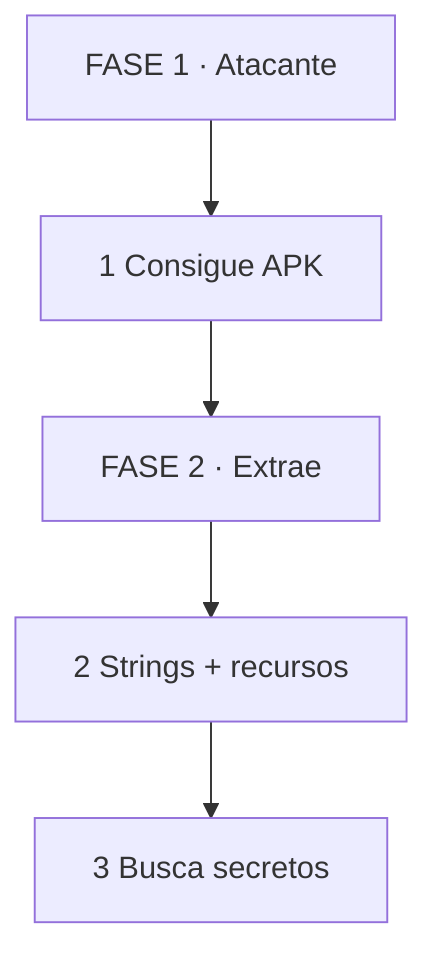
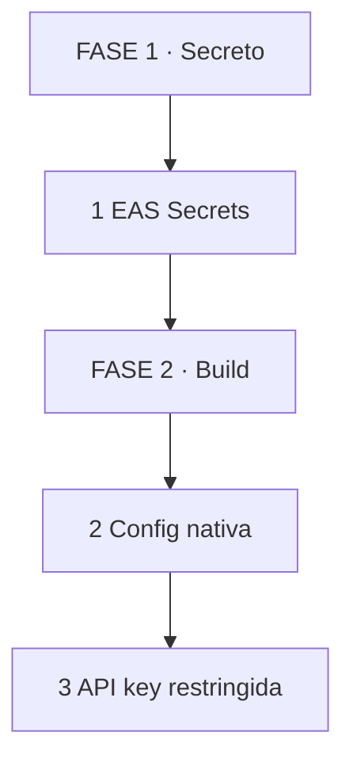
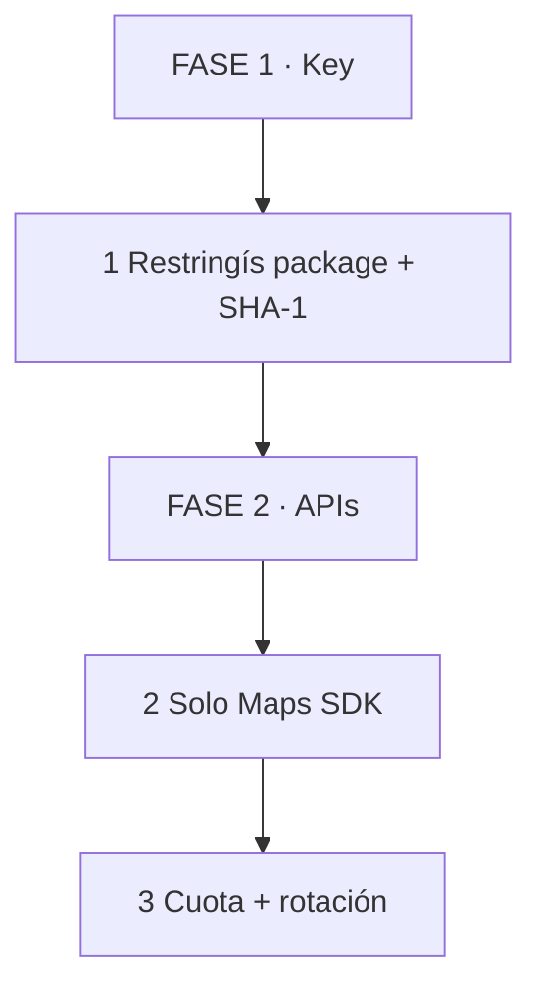
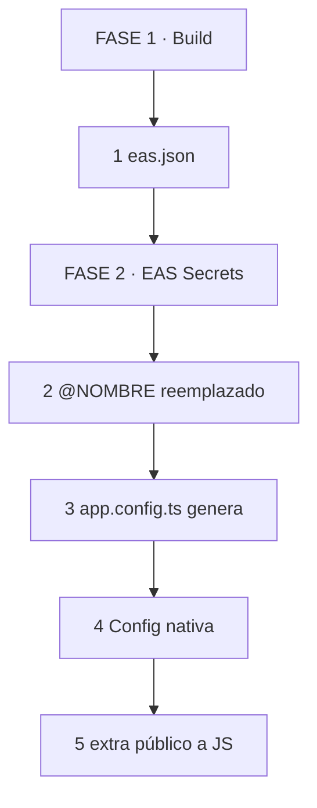
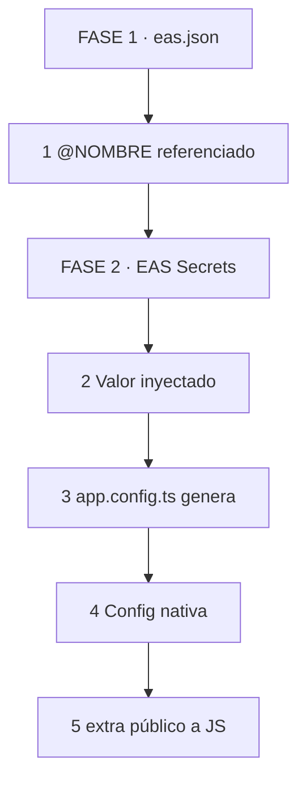
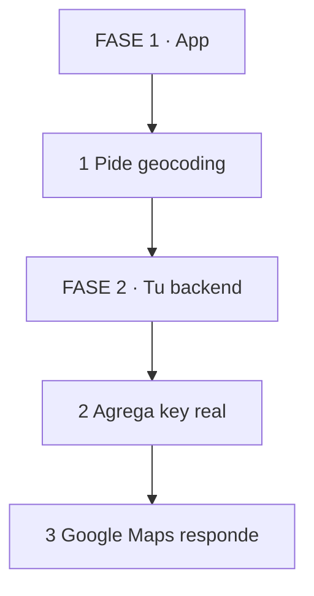
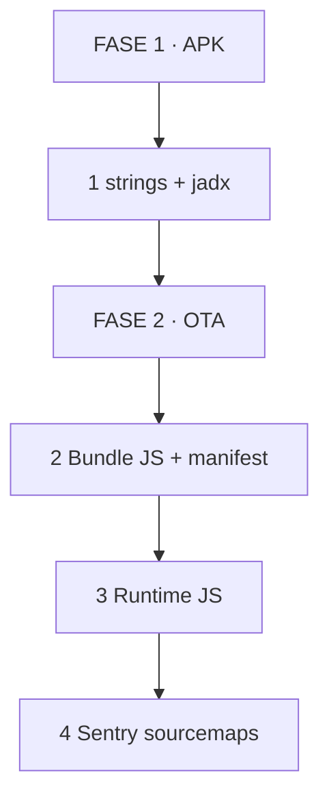

# 🛡️ Seguridad en Expo / React Native / EAS: De amenazas a implementación

## 🗺️ MAPA DE LA GUÍA



*Se lee de arriba hacia abajo. Entendés el riesgo, aplicás las reglas, implementás el patrón.*

| 🧩 Fase | ❓ Pregunta que responde | 📤 Resultado principal |
|---------|------------------------|------------------------|
| **FASE 1 · Amenazas** | ¿Qué puede extraer un atacante y dónde? | Mapa de riesgo |
| **FASE 2 · Reglas** | ¿Qué va en build-time, qué en OTA, qué en backend? | Línea de separación |
| **FASE 3 · Implementación** | ¿Cómo configuro el repo sin filtrar secretos? | Checklist y diffs |



*Se lee de izquierda a derecha. Muestro el patrón, lo aplicamos juntos, lo implementás solo.*

> **🎯 Objetivo** — Al final tendrás un modelo de amenaza claro, un patrón de configuración seguro para `eas.json` y `app.config.ts`, y un checklist para validar que ninguna API key aparece en el bundle JS ni en OTA.
> **⚠️ Advertencia** — Un secreto que llega al bundle JavaScript deja de ser secreto. La clave nunca viaja en `EXPO_PUBLIC_*`.

---

## 🧩 PARTE 1: MODELO DE AMENAZA — QUÉ PUEDE EXTRAER UN ATACANTE 🧩

### 1.1 ❓ PRETEST

¿Qué diferencia hay entre un secreto de build-time, una config nativa pública y un secreto real de backend?

> Respuesta esperada: Build-time se inyecta en el binario nativo durante la compilación y es accesable en el APK. Config nativa pública se diseña para ser visible (API key de mapas con restricción). Secreto real de backend nunca sale del servidor; solo el backend lo conoce.
> Si acertás: camino rápido → andá al punto 7.

### 1.2 🎯 POR QUÉ + LOGRO

Importa porque **sin modelo de amenaza, protegés cosas equivocadas**. Un atacante con el APK puede extraer strings, recursos nativos y configuraciones. Con un OTA, puede inspeccionar el bundle JS. Con Sentry, puede acceder a sourcemaps. Cada superficie requiere un tratamiento distinto. Vas a lograr **clasificar secretos por superficie y proteger cada una según su riesgo real**.

### 1.3 ⚡ VICTORIA RÁPIDA (<5 min)

Tomá tu APK o AAB. Ejecutá `strings app-release.apk | grep -i google`. Si aparece tu API key, ya tenés un hallazgo. Esa es la primera verificación.

### 1.4 💡 CONCEPTO

Analogía: Un APK es como **una caja de cristal** — se puede abrir, se pueden sacar fotos a cada cosa que hay adentro. OTA es como **un sobre abierto** — el contenido viaja sin cifrado de extremo a extremo y cualquier intermediario lo ve. Sourcemaps son como **el plano de la casa** — muestran exactamente cómo está construida por dentro.

Definición: Superficie 1 — APK/AAB: binario compilado, recursos nativos, AndroidManifest, strings.xml, assets. Superficie 2 — OTA Update: bundle JavaScript, manifest JSON, metadatos. Superficie 3 — Sentry/sourcemaps: código original ofuscado o no, nombres de variables, rutas internas. Superficie 4 — `expo-constants extra`: objeto accesible desde JS en runtime. Cada superficie tiene un nivel de exposición distinto.

### 1.5 👀 EJEMPLO RESUELTO

| Superficie | Acceso | Riesgo | Ejemplo |
|-----------|--------|--------|---------|
| APK/AAB | `strings`, jadx | Alto | API key en `google_maps_api_key.xml` |
| OTA Update | Manifest, bundle JS | Alto | Variables en `EXPO_PUBLIC_*` |
| Sourcemaps/Sentry | Upload de DIF | Medio | Rutas internas, nombres de archivo |
| `expo-constants extra` | `Constants.expoConfig.extra` en JS | Alto | Cualquier valor expuesto en runtime |



*Se lee de izquierda a derecha. Atacante obtiene binario, extrae recursos, busca secretos.*

### 1.6 ⚠️ CONTRA-EJEMPLO / Error Típico

Error: Creer que ofuscar el bundle JS con `expo-optimize` oculta las variables de entorno. `EXPO_PUBLIC_*` se reemplaza en compile-time, antes de cualquier ofuscación. El valor queda en plain-text.

Corrección: Nunca pongas secretos en `EXPO_PUBLIC_*`. Usa backend para secretos reales, configuración nativa para claves públicas con restricción, y EAS Secrets para valores de build-time que no deben llegar a JS.

### 1.7 🧪 PRÁCTICA

Clasificá estos 3 valores según la superficie donde viven y el riesgo: (a) clave de Google Maps, (b) token de backend para enviar pedidos, (c) flag de feature para mostrar mapa.

> Respuesta esperada / criterio: (a) nativa pública con restricción por package+SHA-1. (b) backend exclusivamente, nunca en el cliente. (c) puede ir en `extra` o `EXPO_PUBLIC_*` porque es pública.

### 1.8 🔁 RECALL — Nivel Bloom: Analizar

¿Por qué un sourcemap subido a Sentry es un riesgo aunque el bundle esté ofuscado? Respondé en 1 línea.

### 1.9 📌 IDEA CLAVE

No todo secreto tiene el mismo riesgo. Clasificá por superficie: APK, OTA, sourcemaps y runtime JS.

### 1.10 ✅ AUTO-CHEQUEO + SIGUIENTE

- [ ] Mapeé las 4 superficies y qué puede extraer un atacante de cada una
- [ ] Clasifiqué mis variables actuales en build-time, nativa pública y backend
- [ ] Verifiqué con `strings` que ninguna API key aparece en mi APK

Siguiente: Reglas de Expo y cuándo usar cada mecanismo de configuración.

---

## 🧩 PARTE 2: REGLAS EXPO — QUÉ VA A CADA LADO 🧩

### 2.1 ❓ PRETEST

¿Cuándo está prohibido usar `EXPO_PUBLIC_*`?

> Respuesta esperada: Cuando el valor es un secreto real (API key privada, token de backend, clave de cifrado). `EXPO_PUBLIC_*` se inlinea en el bundle JS en plain-text. Solo sirve para valores públicos que no dan acceso a recursos facturables o sensibles.
> Si acertás: camino rápido → andá al punto 7.

### 2.2 🎯 POR QUÉ + LOGRO

Importa porque **Expo ofrece 3 mecanismos de configuración que no son intercambiables**: variables de entorno de build-time, configuración nativa y valores expuestos a JS. Mezclarlas filtra secretos donde no deben estar. Vas a lograr **elegir el mecanismo correcto según la sensibilidad del dato**.

### 2.3 ⚡ VICTORIA RÁPIDA (<5 min)

Abrí tu `eas.json`. Buscá cualquier `EXPO_PUBLIC_*`. Si contiene una API key, ese es el hallazgo más rápido de corregir.

### 2.4 💡 CONCEPTO

Analogía: Las configuraciones de Expo son como **3 tipos de sobre** — uno que solo se abre en la fábrica (EAS Secrets), uno que viaja en el paquete cerrado pero se puede abrir con herramientas (config nativa), y uno que va pegado por fuera del paquete y cualquiera lo lee (`EXPO_PUBLIC_*`).

Definición: `EXPO_PUBLIC_*` → se reemplaza en compile-time y viaja en el bundle JS en plain-text. Cualquier valor que no debe ser público no puede estar aquí. EAS Secrets (`@NOMBRE`) → se inyectan como variables de entorno en el worker de EAS Build, no viajan en el bundle JS a menos que las inlinees manualmente. `app.config.ts` dinámico → lee variables de entorno en build-time y genera config nativa. `extra` → objeto que viaja a JS en runtime; lo que pongas aquí es accesible desde código.

### 2.5 👀 EJEMPLO RESUELTO

| Valor | Mecanismo correcto | Llega a JS | Se extrae del APK |
|-------|-------------------|-----------|------------------|
| API key Google Maps con restricción | Config nativa (`android.config.googleMaps.apiKey`) | No | Sí, pero es pública restringida |
| Token de backend | EAS Secrets + backend | No | No |
| Flag de feature | `extra` o `EXPO_PUBLIC_*` | Sí | No relevante |



*Se lee de izquierda a derecha. Secreto se inyecta en build, se escribe en config nativa, se restringe por platform.*

### 2.6 ⚠️ CONTRA-EJEMPLO / Error Típico

Error: Mover la API key de Google Maps a `EXPO_PUBLIC_GOOGLE_MAPS_API_KEY` porque "es más fácil de leer". Ahora la key está en el bundle JS, en OTA y en cualquier análisis estático del bundle.

Corrección: Dejá la key en `android.config.googleMaps.apiKey` y `ios.config.googleMapsApiKey`. Se lee desde código nativo, no desde JS, y sigue funcionando en producción.

### 2.7 🧪 PRÁCTICA

Revisá tu `eas.json` y tu `app.config.ts`. Identificá 1 variable que esté en el mecanismo incorrecto y proponé la corrección.

> Respuesta esperada / criterio: Si una variable sensible está en `EXPO_PUBLIC_*`, debe pasar a EAS Secrets o a config nativa. Si una variable pública está en EAS Secrets sin razón, puede pasar a `extra` o `EXPO_PUBLIC_*`.

### 2.8 🔁 RECALL — Nivel Bloom: Aplicar

¿Por qué `extra` no es un lugar seguro para API keys? Respondé en 1 línea.

### 2.9 📌 IDEA CLAVE

EAS Secrets = build-time. Config nativa = runtime nativo. `EXPO_PUBLIC_*` = bundle JS. Nunca mezcles secretos reales con valores públicos.

### 2.10 ✅ AUTO-CHEQUEO + SIGUIENTE

- [ ] No hay secretos reales en `EXPO_PUBLIC_*`
- [ ] EAS Secrets se usan solo para build-time
- [ ] `extra` solo contiene valores públicos o flags sin riesgo

Siguiente: Google Maps API Key restringida.

---

## 🧩 PARTE 3: GOOGLE MAPS API KEY — RESTRICCIÓN EFECTIVA 🧩

### 3.1 ❓ PRETEST

¿Qué significa restringir una API key por package name + SHA-1?

> Respuesta esperada: La key solo funciona si la app que la usa tiene ese identificador de Android y ese certificado de firma. Si un atacante extrae la key y la usa desde otra app o desde un certificado distinto, Google la rechaza.
> Si acertás: camino rápido → andá al punto 7.

### 3.2 🎯 POR QUÉ + LOGRO

Importa porque **una API key sin restricción es un acceso abierto a tu cuenta de Google Cloud**. Un atacante puede usarla para generar tráfico facturable a tu nombre, agotar cuota o acceder a servicios que no pensaste exponer. Vas a lograr **configurar la key con múltiples capas de restricción y separar la key móvil de la backend**.

### 3.3 ⚡ VICTORIA RÁPIDA (<5 min)

Abrí Google Cloud Console. Andá a APIs y servicios → Credenciales. Seleccioná tu API key. En "Restricciones de aplicación" elegí "Apps para Android" y agregá tu package name + SHA-1. Esa es la primera barrera.

### 3.4 💡 CONCEPTO

Analogía: Una API key sin restringir es como **una llave maestra** — cualquiera que la tenga puede abrir cualquier puerta. Restringir por package + SHA-1 es como **hacer una copia que solo abre tu casa** — aunque se la robes, no sirve en otro lugar.

Definición: Restricción Android por package name + SHA-1 debug/release/store. Allowlist de APIs habilitadas (solo Maps SDK for Android, no Cloud Translation ni servicios facturables). Cuota diaria por API. Rotación de keys sin deploy. Separación entre key pública móvil (con restricción) y key privada backend (sin restricción pero nunca expuesta al cliente).

### 3.5 👀 EJEMPLO RESUELTO

| Restricción | Dónde se configura | Efecto |
|------------|-------------------|--------|
| Package name + SHA-1 | Google Cloud Console | Key inválida desde otra app |
| APIs permitidas | Google Cloud Console | Solo Maps SDK, no otros servicios |
| Cuota diaria | Google Cloud Console | Límite de requests/día |
| Rotación | Nueva key + deploy | Key vieja deja de funcionar |



*Se lee de izquierda a derecha. Restringís identidad, limitás servicios, controlás consumo.*

### 3.6 ⚠️ CONTRA-EJEMPLO / Error Típico

Error: Usar la misma API key para Maps en la app y para geocoding en el backend. Si el backend necesita llamar a Places API, usa una key distinta sin restricción de Android, alojada en el servidor.

Corrección: Key móvil = Maps SDK + restricción package+SHA-1. Key backend = sin restricción de Android, pero con allowlist de APIs y proxy del servidor. Nunca compartas la misma key entre frontend y backend.

### 3.7 🧪 PRÁCTICA

Diseñá la restricción para tu API key de Google Maps. Definí: package name, SHA-1 debug, SHA-1 release, APIs permitidas, cuota diaria y plan de rotación.

> Respuesta esperada / criterio: Debe tener al menos 2 SHA-1 (debug y release), 1 package name, 1 lista de APIs permitidas (solo Maps), 1 cuota definida y 1 procedimiento de rotación documentado.

### 3.8 🔁 RECALL — Nivel Bloom: Aplicar

¿Por qué nunca debés mapear `@GOOGLE_API_KEY` a `EXPO_PUBLIC_*`? Respondé en 1 línea.

### 3.9 📌 IDEA CLAVE

Key móvil restringida por identidad. Key backend nunca expuesta. Nunca compartas la misma key entre ambos.

### 3.10 ✅ AUTO-CHEQUEO + SIGUIENTE

- [ ] API key restringida por package + SHA-1 en Google Cloud Console
- [ ] Solo Maps SDK habilitado, sin servicios facturables extra
- [ ] Tengo 2 keys separadas: móvil y backend

Siguiente: Patrón de configuración seguro para el repo.

---

## 🧩 PARTE 4: PATRÓN DE REPO SEGURO — QUÉ VA A CADA ARCHIVO 🧩

### 4.1 ❓ PRETEST

¿Cuál es la diferencia entre `eas.json env`, `app.config.ts` dinámico y `extra`?

> Respuesta esperada: `eas.json env` inyecta variables de entorno en el worker de EAS Build. `app.config.ts` dinámico lee esas variables y genera configuración nativa. `extra` expone valores a JS en runtime. Los secretos deben quedarse en EAS Secrets, no bajar a `extra` ni a JS.
> Si acertás: camino rápido → andá al punto 7.

### 4.2 🎯 POR QUÉ + LOGRO

Importa porque **un repo con secretos en `app.json` o `.env` commiteados es un incidente esperando pasar**. EAS ofrece mecanismos seguros si los usás en orden. Vas a lograr **un flujo donde los secretos reales nunca tocan el repo, los valores públicos se exponen sin riesgo y el build funciona en preview, demo y production**.

### 4.3 ⚡ VICTORIA RÁPIDA (<5 min)

Abrí tu `.gitignore`. Verificá que `.env`, `.env.local` y `eas.json` con valores sensibles estén ignorados. Si no, agregalos. Esa es la barrera mínima.

### 4.4 💡 CONCEPTO

Analogía: El repo es como **una oficina con sala de reuniones y caja fuerte**. `eas.json` y `app.config.ts` son la sala de reuniones: podés mostrar el plano, pero no las llaves de la caja. EAS Secrets es la caja fuerte: solo el build tiene acceso. `extra` es el tablero de anuncios: cualquiera lo lee.

Definición: `eas.json` define perfiles de build y variables de entorno. EAS Secrets (`@NOMBRE`) se reemplazan en el worker. `app.config.ts` dinámico lee `process.env` y construye la config Expo. `extra` viaja a JS en runtime. `.env.example` documenta variables sin valores reales. `environment.<env>.ts` organiza valores por ambiente. El flujo correcto es: secretos en EAS Secrets → `app.config.ts` lee y genera config nativa → solo valores públicos viajan a `extra`.

### 4.5 👀 EJEMPLO RESUELTO

| Archivo | Contenido | Llega a JS | Se commitea |
|---------|-----------|-----------|-------------|
| `eas.json` | Referencias `@GOOGLE_API_KEY` | No | Sí, sin valores |
| `app.config.ts` | Lee `process.env.GOOGLE_API_KEY` y escribe config nativa | No | Sí |
| `extra` | Solo valores públicos (flags, URLs públicas) | Sí | Sí |
| `.env` | Valores reales | No | No, en `.gitignore` |
| `.env.example` | Solo nombres de variables | No | Sí |



*Se lee de izquierda a derecha. Build inyecta secretos, app.config genera nativo, solo público viaja a JS.*

### 4.6 ⚠️ CONTRA-EJEMPLO / Error Típico

Error: Poner `EXPO_PUBLIC_GOOGLE_API_KEY: "@GOOGLE_API_KEY"` en `eas.json`. Aunque el valor viene de EAS Secrets, la variable `EXPO_PUBLIC_*` hace que el valor se inline en el bundle JS.

Corrección: Usá `GOOGLE_API_KEY: "@GOOGLE_API_KEY"` en `eas.json` (sin prefijo `EXPO_PUBLIC_`). En `app.config.ts` leé `process.env.GOOGLE_API_KEY` y asignalo a `android.config.googleMaps.apiKey` e `ios.config.googleMapsApiKey`. Nunca lo asignes a `extra`.

### 4.7 🧪 PRÁCTICA

Dibujá el flujo de tu configuración actual: desde `eas.json` hasta `app.config.ts` y `extra`. Marcá qué valores son sensibles y en qué paso podrían filtrarse a JS.

> Respuesta esperada / criterio: Debe mostrar claramente que `EXPO_PUBLIC_*` es el único camino a JS, y que los secretos deben quedarse en config nativa.

### 4.8 🔁 RECALL — Nivel Bloom: Aplicar

¿Qué variable de entorno en Expo viaja obligatoriamente al bundle JS? Respondé en 1 línea.

### 4.9 📌 IDEA CLAVE

Si un valor puede llegar a JS, asumí que es público. Los secretos reales deben quedarse en build-time nativo o backend.

### 4.10 ✅ AUTO-CHEQUEO + SIGUIENTE

- [ ] `eas.json` usa `@NOMBRE` sin `EXPO_PUBLIC_*`
- [ ] `app.config.ts` asigna secretos a config nativa, no a `extra`
- [ ] `.env` está en `.gitignore` y `.env.example` no tiene valores reales

Siguiente: Endurecimiento y validación.

---

## 🧩 PARTE 5: DIFS CONCRETOS Y PATRÓN DE REPO SEGURO 🧩

### 5.1 ❓ PRETEST

¿Qué debe contener `extra` en `app.config.ts` y qué nunca debe contener?

> Respuesta esperada: `extra` debe contener solo valores públicos o flags de feature sin riesgo. Nunca debe contener API keys, tokens de backend, claves de cifrado ni valores que permitan acceso a recursos facturables o sensibles.
> Si acertás: camino rápido → andá al punto 7.

### 5.2 🎯 POR QUÉ + LOGRO

Importa porque **la diferencia entre un repo seguro y uno inseguro está en los detalles de configuración**. Un caracter `EXPO_PUBLIC_` mal puesto filtra una key. Un `extra` con un valor sensible expone el backend. Vas a lograr **implementar el patrón correcto con diffs aplicables a tu repo hoy**.

### 5.3 ⚡ VICTORIA RÁPIDA (<5 min)

Abrí tu `eas.json`. Si ves `EXPO_PUBLIC_GOOGLE_API_KEY`, esa línea es el problema. La corrección es eliminar el prefijo `EXPO_PUBLIC_` y dejar solo `GOOGLE_API_KEY`.

### 5.4 💡 CONCEPTO

Analogía: Configurar el repo es como **organizar una caja de herramientas** — cada herramienta tiene su lugar. Si ponés un destornillador donde va un martillo, cuando lo necesites no lo encontrás o usás el equivocado.

Definición: `eas.json` con perfiles preview/demo/production, cada uno con sus EAS Secrets referenciados. `app.config.ts` dinámico que lee `process.env` y construye la config Expo por entorno. `environment.<env>.ts` con valores públicos por ambiente. `.env.example` como documentación de variables sin valores reales.

### 5.5 👀 EJEMPLO RESUELTO — DIFFS PROPUESTOS

**Diff 1: `eas.json` — eliminar `EXPO_PUBLIC_*`, usar EAS Secrets**

```json
{
  "cli": { "version": ">= 3.0.0" },
  "build": {
    "preview": {
      "distribution": "internal",
      "env": {
        "GOOGLE_API_KEY": "@GOOGLE_API_KEY",
        "MAPBOX_TOKEN": "@MAPBOX_TOKEN"
      }
    },
    "production": {
      "distribution": "store",
      "env": {
        "GOOGLE_API_KEY": "@GOOGLE_API_KEY",
        "MAPBOX_TOKEN": "@MAPBOX_TOKEN"
      }
    }
  }
}
```

*Cambios: Se eliminó `EXPO_PUBLIC_GOOGLE_API_KEY`. Ahora `GOOGLE_API_KEY` se inyecta como variable de entorno en el worker de EAS Build. No viaja al bundle JS a menos que lo inlinees manualmente.*

**Diff 2: `app.config.ts` — leer variables y asignar a config nativa**

```typescript
export default ({ config }: { config: ExpoConfig }) => {
  const googleMapsApiKey = process.env.GOOGLE_API_KEY;
  const mapboxToken = process.env.MAPBOX_TOKEN;

  return {
    ...config,
    extra: {
      ...config.extra,
      mapboxToken,
      buildType: process.env.BUILD_TYPE || 'development',
    },
    android: {
      ...config.android,
      config: {
        googleMaps: {
          apiKey: googleMapsApiKey,
        },
      },
    },
    ios: {
      ...config.ios,
      config: {
        googleMapsApiKey: googleMapsApiKey,
      },
    },
    runtimeVersion: {
      policy: 'appVersion',
    },
  };
};
```

*Cambios: `GOOGLE_API_KEY` se asigna a `android.config.googleMaps.apiKey` e `ios.config.googleMapsApiKey`. No se asigna a `extra`. `MAPBOX_TOKEN` sí puede ir en `extra` porque es un token de cliente público para Mapbox GL JS SDK.*

**Diff 3: `.env.example` — documentar sin valores reales**

```properties
GOOGLE_API_KEY=@GOOGLE_API_KEY
MAPBOX_TOKEN=@MAPBOX_TOKEN
BUILD_TYPE=development
```

*Cambios: Se usa `@NOMBRE` para indicar que el valor viene de EAS Secrets. No hay valores reales. Esto se commitea al repo.*

**Diff 4: `environment.ts` — valores públicos por ambiente**

```typescript
export const environment = {
  development: {
    apiUrl: 'https://api-dev.example.com',
    enableDebug: true,
  },
  demo: {
    apiUrl: 'https://api-demo.example.com',
    enableDebug: false,
  },
  production: {
    apiUrl: 'https://api.example.com',
    enableDebug: false,
  },
};
```

*Cambios: Solo valores públicos. No hay secretos. Se importa en `app.config.ts` para completar `extra`.*



*Se lee de izquierda a derecha. eas.json referencia secreto, EAS lo inyecta, app.config genera nativo, solo público viaja a JS.*

### 5.6 ⚠️ CONTRA-EJEMPLO / Error Típico

Error: Poner `EXPO_PUBLIC_GOOGLE_API_KEY: "@GOOGLE_API_KEY"` en `eas.json`. Aunque el valor viene de EAS Secrets, la variable `EXPO_PUBLIC_*` hace que el valor se inline en el bundle JS.

Corrección: Usá `GOOGLE_API_KEY: "@GOOGLE_API_KEY"` en `eas.json` (sin prefijo `EXPO_PUBLIC_`). En `app.config.ts` leé `process.env.GOOGLE_API_KEY` y asignalo a `android.config.googleMaps.apiKey` e `ios.config.googleMapsApiKey`. Nunca lo asignes a `extra`.

### 5.7 🧪 PRÁCTICA

Aplicá el Diff 1 a tu `eas.json`: eliminá cualquier `EXPO_PUBLIC_GOOGLE_API_KEY` y reemplazalo por `GOOGLE_API_KEY: "@GOOGLE_API_KEY"`.

> Respuesta esperada / criterio: No debe quedar ninguna variable `EXPO_PUBLIC_*` con valor sensible. `GOOGLE_API_KEY` debe estar referenciado como EAS Secret.

### 5.8 🔁 RECALL — Nivel Bloom: Aplicar

¿Qué variable de Expo viaja obligatoriamente al bundle JS? Respondé en 1 línea.

### 5.9 📌 IDEA CLAVE

Si un valor puede llegar a JS, asumí que es público. Los secretos reales deben quedarse en build-time nativo o backend.

### 5.10 ✅ AUTO-CHEQUEO + SIGUIENTE

- [ ] Apliqué Diff 1: `eas.json` sin `EXPO_PUBLIC_*`
- [ ] Apliqué Diff 2: `app.config.ts` asigna a config nativa
- [ ] `.env.example` documenta sin valores reales

Siguiente: Endurecimiento extra y validación.

---

## 🧩 PARTE 6: ENDURECIMIENTO EXTRA Y VALIDACIÓN 🧩

### 6.1 ❓ PRETEST

¿Qué es un backend proxy y por qué protege llamadas facturables?

> Respuesta esperada: Un backend proxy es un servidor propio que recibe la llamada del cliente, agrega la API key real y llama al servicio externo. El cliente nunca ve la key, solo tu dominio. Así protegés la key y podés agregar rate limiting, logging y validación.
> Si acertás: camino rápido → andá al punto 7.

### 6.2 🎯 POR QUÉ + LOGRO

Importa porque **la seguridad no es solo configuración, es arquitectura**. Si tu app llama directamente a Google Maps, Places o cualquier API facturable desde el cliente, la key está expuesta por definición. Vas a lograr **diseñar una arquitectura donde los secretos reales vivan en el backend y el cliente solo haga llamadas a tu dominio**.

### 6.3 ⚡ VICTORIA RÁPIDA (<5 min)

Abrí tu código. Buscá llamadas directas a APIs de Google Maps desde JS. Si encontrás alguna, ese es el hallazgo más rápido de migrar a backend proxy.

### 6.4 💡 CONCEPTO

Analogía: Un backend proxy es como **un recepcionista** — los clientes no entran a la oficina con tus llaves, le piden al recepcionista que haga el trámite. Vos le das la llave al recepcionista (backend), no a los clientes (app móvil).

Definición: Backend proxy = servidor propio que recibe solicitudes del cliente, agrega secretos y llama a servicios externos. No loguear keys = filtrar valores sensibles de logs de Sentry, consola y terminal. Limpiar Sentry/bundler = excluir archivos con secretos del upload de sourcemaps. Rotación de keys = procedimiento documentado para cambiar keys sin deploy forzado. Verificación = análisis estático del APK, bundle JS y OTA manifest.

### 6.5 👀 EJEMPLO RESUELTO

| Capa | Responsabilidad | Ejemplo |
|------|----------------|---------|
| App móvil | UI y llamadas a tu backend | `POST /api/geocode` |
| Backend proxy | Agrega key, llama a Google | `POST https://maps.googleapis.com/...` |
| Google Maps | Devuelve resultado | Solo ve la IP del backend |



*Se lee de izquierda a derecha. App pide, backend agrega secreto, servicio externo responde.*

### 6.6 ⚠️ CONTRA-EJEMPLO / Error Típico

Error: Llamar a `https://maps.googleapis.com/maps/api/geocode/json?address=...&key=TU_KEY` desde el cliente. La key viaja en la URL y es visible en proxies, logs y análisis de tráfico.

Corrección: Llamar a tu propio endpoint `/api/geocode` desde el cliente. Tu backend tiene la key y llama a Google. El cliente nunca ve la key.

### 6.7 🧪 PRÁCTICA

Identificá 1 llamada facturable o sensible en tu app que hoy haces directamente desde el cliente. Diseñá el endpoint de backend que la reemplazaría.

> Respuesta esperada / criterio: Endpoint definido en tu backend, método HTTP, parámetros, respuesta esperada. La key de Google nunca aparece en la respuesta al cliente.

### 6.8 🔁 RECALL — Nivel Bloom: Crear

¿Qué 3 capas de validación implementarías para asegurar que una key comprometida no cause daño? Respondé en 1 línea.

### 6.9 📌 IDEA CLAVE

Los secretos reales viven en backend. El cliente solo habla con tu dominio.

### 6.10 ✅ AUTO-CHEQUEO + SIGUIENTE

- [ ] Llamadas facturables pasan por backend proxy
- [ ] No hay keys en logs de Sentry ni consola
- [ ] Sourcemaps excluyen archivos con secretos
- [ ] Tengo procedimiento de rotación documentado

Siguiente: Checklist priorizado y validación.

---

## 🧩 PARTE 7: CHECKLIST PRIORIZADO Y VALIDACIÓN 🧩

### 7.1 ❓ PRETEST

¿Cómo verificás que una API key ya no aparece en el bundle JS pero el mapa sigue funcionando en el APK y en OTA?

> Respuesta esperada: Buscás la key en el bundle JS (`grep` sobre el contenido del update), la buscás en el APK con `strings`, y verificás que el mapa se renderiza en un dispositivo real o emulador. La key debe estar en recursos nativos, no en JS.
> Si acertás: camino rápido → andá al punto 7.

### 7.2 🎯 POR QUÉ + LOGRO

Importa porque **la validación es lo que convierte una teoría en evidencia**. Un checklist sin verificación es solo una lista de deseos. Vas a lograr **procedimientos concretos para auditar tu app y confirmar que las correcciones funcionaron**.

### 7.3 ⚡ VICTORIA RÁPIDA (<5 min)

Descargá tu último build de EAS. Ejecutá `eas build:list` para obtener el ID. Bajá el APK y ejecutá `strings app-release.apk | grep -i google`. Si no aparece la key, primer check aprobado.

### 7.4 💡 CONCEPTO

Analogía: Validar es como **hacer una inspección antes de mudarse** — revisás que las llaves cierran, que no hay filtraciones y que cada cosa está en su lugar.

Definición: Verificación 1 — APK/AAB: `strings`, `jadx`, `apktool` para buscar valores en recursos nativos. Verificación 2 — OTA: descargar el manifest JSON y el bundle JS, buscar con `grep` o `ripgrep`. Verificación 3 — Sourcemaps/Sentry: revisar upload de DIF, excluir archivos sensibles. Verificación 4 — Runtime: `Constants.expoConfig.extra` en consola de desarrollo para confirmar que solo valores públicos llegan a JS.

### 7.5 👀 EJEMPLO RESUELTO

| Verificación | Comando / Acción | Esperado |
|-------------|------------------|----------|
| APK | `strings app.apk \| grep GOOGLE_API_KEY` | No aparece en strings |
| APK nativo | `jadx` para buscar en `google_maps_api_key.xml` | Aparece solo en recursos nativos |
| OTA JS | `grep` sobre bundle JS del update | No aparece |
| OTA manifest | `curl` del manifest, buscar valores sensibles | Solo metadatos públicos |
| Runtime JS | `Constants.expoConfig.extra` en consola | Solo valores públicos |
| Sentry | Revisar DIF upload, excluir `.env.*` | No hay secretos en sourcemaps |



*Se lee de izquierda a derecha. Verificás binario, OTA, runtime y sourcemaps.*

### 7.6 ⚠️ CONTRA-EJEMPLO / Error Típico

Error: Confiar solo en el emulador para validar. El emulador puede tener un build de debug con configuraciones distintas a release. Siempre validá con un build de producción firmado.

Corrección: Usá `eas build:list` para descargar el APK/AAB de producción. Ejecutá las verificaciones sobre ese binario, no sobre un build local.

### 7.7 🧪 PRÁCTICA

Ejecutá las verificaciones 1 y 2 sobre tu último build de producción: APK con `strings` y OTA con `grep` sobre bundle JS. Documentá el resultado.

> Respuesta esperada / criterio: Comando ejecutado, resultado (key encontrada o no), y si no se encuentra en JS pero sí en recursos nativos, check aprobado.

### 7.8 🔁 RECALL — Nivel Bloom: Evaluar

¿Qué harías si encontrás tu API key de Google Maps en el bundle JS después de aplicar las correcciones? Respondé en 1 línea.

### 7.9 📌 IDEA CLAVE

Validar es obligatorio. Si no lo medís, no sabéis si funciona.

### 7.10 ✅ AUTO-CHEQUEO FINAL

- [ ] APK no expone secretos en `strings`
- [ ] Bundle JS de OTA no contiene valores sensibles
- [ ] `Constants.expoConfig.extra` en runtime solo tiene valores públicos
- [ ] Sentry no sube sourcemaps con secretos
- [ ] Procedimiento de rotación documentado y probado

---

## 📝 PREGUNTAS DE VERIFICACIÓN

1. **Aplica**: Clasificá estas 3 variables: API key de Google Maps, token de autenticación de backend, flag de feature para mostrar el mapa. ¿Dónde debe vivir cada una?
2. **Analiza**: ¿Por qué `EXPO_PUBLIC_*` es incompatible con secretos reales, incluso si usas EAS Secrets?
3. **Diseña**: Configurá una API key de Google Maps con 3 capas de restricción y un plan de rotación sin downtime.
4. **Reflexiona**: ¿Por qué un backend proxy es más seguro que restringir la key por package+SHA-1?
5. **Evalúa**: Revisá tu `eas.json` actual. ¿Hay alguna variable sensible en el mecanismo incorrecto?
6. **Conecta**: ¿Cómo se relacionan EAS Secrets, `app.config.ts` dinámico y `extra` en el flujo de build?
7. **Propón**: Diseñá un procedimiento de rotación de API keys para producción sin que los usuarios tengan que actualizar la app.
8. **Síntesis**: Explicá en 3 líneas cómo se conectan el modelo de amenaza, las reglas de Expo y el patrón de repo seguro en una app production-ready.

---

## 📚 GLOSARIO

| Término | Definición en 1 línea |
|---------|-----------------------|
| **EAS Secrets** | Variables de entorno seguras inyectadas en el worker de EAS Build |
| **EXPO_PUBLIC_*** | Variables que se inlinean en el bundle JS en plain-text |
| **app.config.ts** | Archivo de configuración dinámico de Expo que lee variables de entorno |
| **extra** | Objeto de configuración Expo que viaja a JS en runtime |
| **OTA Update** | Actualización over-the-air del bundle JavaScript sin rebuild nativo |
| **APK/AAB** | Binarios de Android: APK instalable, AAB para Play Store |
| **Sourcemap** | Archivo que mapea código ofuscado a código original |
| **Sentry DIF** | Debug Information File subido a Sentry para symbolication |
| **SHA-1** | Huella digital del certificado de firma de la app |
| **Package name** | Identificador único de la app en Android e iOS |
| **Backend proxy** | Servidor propio que agrega secretos y llama a servicios externos |
| **API Key restriction** | Límite de uso de una key por identidad, APIs permitidas y cuota |
| **Rotación de keys** | Procedimiento para reemplazar una key comprometida sin downtime |
| **strings** | Herramienta que extrae strings legibles de un binario |
| **jadx** | Descompilador de APK que muestra código y recursos en texto |
| **runtimeVersion** | Política de Expo para decidir si un OTA update es compatible |
| **BUILD_TYPE** | Variable de entorno que distingue dev/demo/production en build-time |
| **environment.ts** | Archivo que centraliza configuraciones públicas por ambiente |
