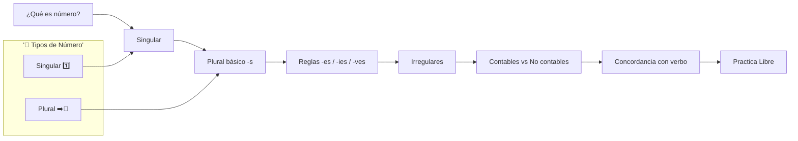
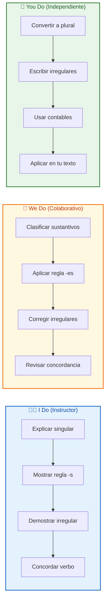
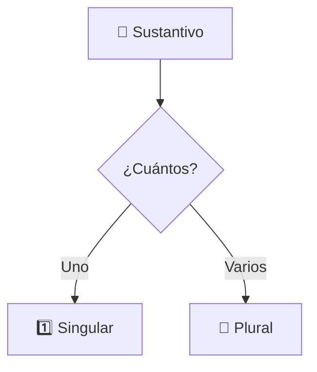
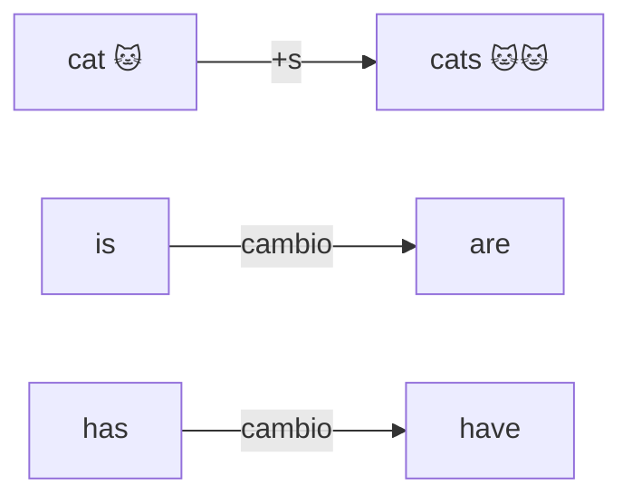
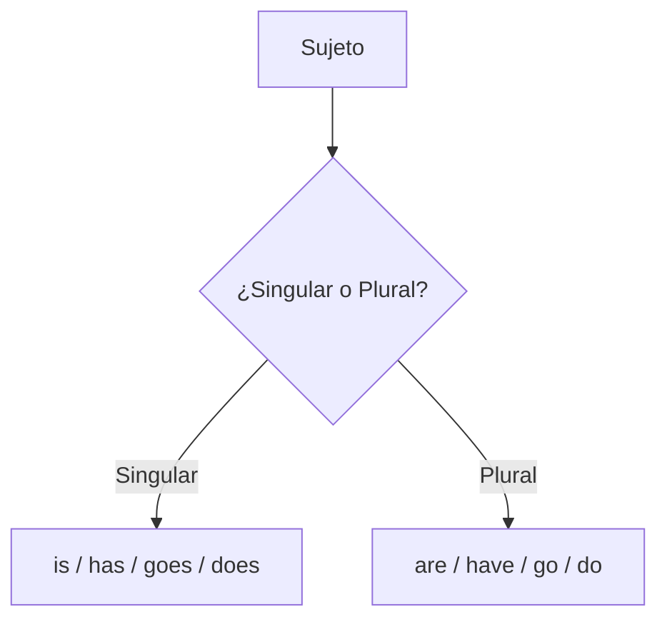

# MASTERCLASS: Singular y Plural en Inglés 🔢 — Número Gramatical ✨

## 📌 INTRODUCCIÓN: POR QUÉ ESTA MASTERCLASS ES DIFERENTE 🚀

En inglés, decir si hablas de **uno** o de **varios** cambia la palabra y a veces el verbo entero. ⚠️ Decir *"The cat is"* vs *"The cats are"* marca la diferencia entre sonar nativo o confundir a quien te escucha. 🐱🐱🐱

Esta masterclass construye un sistema claro para el **número gramatical**:

- 🟢 **Singular** = una sola persona, animal, cosa o idea.
- 🔵 **Plural** = más de una.

La meta no es memorizar listas sueltas. La meta es entender **cómo se forma el plural** y **cuándo el verbo debe concordar**, para que lo apliques sin pensar. 🎯

> **🎯 Objetivo de Aprendizaje** — Al final de esta guía, podrás convertir sustantivos del singular al plural (reglas e irregulares), usar correctamente los verbos `is/are` y `has/have`, y distinguir sustantivos contables de no contables.

> **⚠️ Nota educativa** — Este contenido es formativo. El número gramatical es una base esencial; domínalo en contexto real (lectura, escritura y conversación) para interiorizarlo.

---

## 🗺️ MAPA DE LA MASTERCLASS 🧭



| 🧩 Fase | ❓ Pregunta que responde | 📤 Resultado principal |
|------|-----------------------|------------------|
| **¿Qué es número?** | ¿Uno o varios? | Base del singular/plural |
| **Singular** | ¿Una entidad? | `cat`, `is`, `has` |
| **Plural -s** | ¿Regla general? | `cats`, `are`, `have` |
| **Reglas especiales** | ¿Termina en -s, -y, -f? | `-es`, `-ies`, `-ves` |
| **Irregulares** | ¿No siguen la regla? | `child→children`, `man→men` |
| **Contables** | ¿Se pueden contar? | `water` ❌, `apple` ✅ |
| **Concordancia** | ¿Verbo acorde? | `is/are`, `has/have` |



---

## 📖 PARTE 1: ¿QUÉ ES EL NÚMERO GRAMATICAL? 🔢

### 1.1 🧠 Principio Central

El **número** indica si un sustantivo se refiere a **uno** (singular) o a **más de uno** (plural). 👤 vs 👥



### 1.2 ✅ Regla de Oro

> **✨ Idea clave** — En inglés casi todo plural se forma agregando **-s** al final. Lo demás son matices y excepciones. 🧩

| 🟢 Singular | 🔵 Plural |
|-------------|-----------|
| cat | cats 🐱🐱 |
| book | books 📚 |
| dog | dogs 🐶🐶 |

---

## 🟢 PARTE 2: EL SINGULAR (ONE) 1️⃣

### 2.1 📍 Señales del singular

| 🔍 Señal | 🌰 Ejemplo |
|----------|-----------|
| Artículo `a/an` | **a** dog, **an** apple 🍎 |
| Verbo `is` | The cat **is** small. |
| Verbo `has` | He **has** a car. 🚗 |
| Demostrativo `this` | **This** book is new. 📘 |

### 2.2 🧪 Ejemplos

| 📝 Singular | 🔍 Nota |
|------------|---------|
| **A** student studies. 🧑‍🎓 | `a` + sustantivo |
| The child **is** happy. 🧒 | verbo `is` |
| She **has** a pen. 🖊️ | verbo `has` |

---

## 🔵 PARTE 3: EL PLURAL BÁSICO (-S) ➡️🔢

### 3.1 🧱 La regla general

Se añade **-s** a la mayoría de los sustantivos.

| 🟢 Singular | 🔵 Plural | 🔍 Cambio |
|-------------|-----------|-----------|
| car | cars 🚗🚗 | +s |
| teacher | teachers 👩‍🏫👨‍🏫 | +s |
| phone | phones 📱📱 | +s |

### 3.2 🔄 Cambio del verbo

| 🟢 Singular | 🔵 Plural |
|-------------|-----------|
| is | **are** |
| has | **have** |
| The cat **is**... | The cats **are**... 🐱🐱 |



> **✨ Idea clave** — Plural casi siempre = sustantivo en **-s** + verbo **are/have**. ⚡

---

## 🧩 PARTE 4: REGLAS ESPECIALES DE FORMACIÓN 🛠️

### 4.1 📊 Terminaciones que cambian

| 🔚 Termina en | 🔧 Regla | 🟢 Singular | 🔵 Plural |
|---------------|----------|-------------|-----------|
| **-s, -ss, -sh, -ch, -x, -z** | agregar **-es** | bus 🚌 | buses |
| | | dish 🍽️ | dishes |
| | | watch ⌚ | watches |
| **-y** tras consonante | `-y` → **-ies** | city 🏙️ | cities |
| **-y** tras vocal | solo **-s** | boy 🧒 | boys |
| **-f / -fe** | `-f` → **-ves** | leaf 🍃 | leaves |
| | | wife 👰 | wives |

### 4.2 🧪 Ejemplos de la clase

| 📝 Singular | 🔄 Plural | 🔍 Por qué |
|------------|-----------|------------|
| box 📦 | boxes | termina en -x → -es |
| baby 👶 | babies | -y tras consonante → -ies |
| key 🔑 | keys | -y tras vocal → -s |
| knife 🔪 | knives | -fe → -ves |

> **⚠️ Ojo** — Hay excepciones: `roof → roofs`, `belief → beliefs` (no cambian a -ves). 🏠

---

## 🌀 PARTE 5: PLURALES IRREGULARES ⚡

### 5.1 📊 Cambio de raíz (no -s)

| 🟢 Singular | 🔵 Plural | 🌰 |
|-------------|-----------|-----|
| man 👨 | men | The **men** work. |
| woman 👩 | women | The **women** talk. |
| child 🧒 | children | Three **children** play. |
| person 🧑 | people 👥 | Many **people** came. |
| foot 🦶 | feet | My **feet** hurt. |
| tooth 🦷 | teeth | Brush your **teeth**. |
| mouse 🐭 | mice | The **mice** ran. |
| goose 🦢 | geese | The **geese** flew. |

### 5.2 🔄 Igual en singular y plural

| 🟢/🔵 Forma | 🌰 |
|-------------|-----|
| sheep 🐑 | one sheep / two sheep |
| fish 🐟 | one fish / many fish |
| deer 🦌 | one deer / several deer |

### 5.3 🧪 Ejemplos

| 📝 Singular | 🔄 Plural |
|------------|-----------|
| A child laughs. 🧒 | **Children** laugh. 🧒🧒🧒 |
| The man drives. 👨 | The **men** drive. 👨👨 |

> **✨ Idea clave** — Los irregulares se aprenden de memoria; no les pongas -s. 🧠

---

## 🥤 PARTE 6: CONTABLES vs NO CONTABLES 🚰

### 6.1 📊 Diferencia esencial

| 🔢 Contable | 🚫 No contable |
|-------------|----------------|
| Se pueden contar | Son masa/abstractos |
| `a book`, `two books` 📚 | `water`, `money`, `information` 💧 |
| Tienen plural | ¡No tienen plural! |

### 6.2 🧪 Ejemplos

| 🟢 Contable ✅ | 🚫 No contable ❌ |
|----------------|-------------------|
| apple / apples 🍎 | water 💧 (nunca *waters) |
| idea / ideas 💡 | advice 🗣️ (nunca *advices) |
| chair / chairs 🪑 | furniture 🛋️ (nunca *furnitures) |

> **⚠️ Ojo** — Para no contables usa `much / a lot of`, no `many`. Y el verbo va en **singular**: "The water **is** cold." 💧

---

## 🤝 PARTE 7: CONCORDANCIA CON EL VERBO 🎯

### 7.1 📊 Verbos según número

| 🟢 Singular | 🔵 Plural | 🌰 |
|-------------|-----------|-----|
| is | are | He **is** / They **are** |
| has | have | She **has** / We **have** |
| goes | go | It **goes** / They **go** |
| does | do | He **does** / You **do** |

### 7.2 🧪 Ejemplos

| 📝 Oración | 🔍 Concordancia |
|------------|-----------------|
| The dog **is** big. 🐶 | singular + is |
| The dogs **are** big. 🐶🐶 | plural + are |
| He **has** a book. 📘 | singular + has |
| They **have** books. 📚 | plural + have |



> **✨ Idea clave** — El verbo debe coincidir con el sustantivo en número. ⚖️

---

## 🏋️ PARTE 8: EJERCICIOS DE LA CLASE PARA PRACTICAR ✍️

### 8.1 🎯 Convierte al plural

| 🟢 Singular | 🔵 Plural |
|-------------|-----------|
| The cat sat. 🐱 | The **cats** sat. 🐱🐱 |
| A bus stopped. 🚌 | The **buses** stopped. 🚌🚌 |
| One baby cried. 👶 | The **babies** cried. 👶👶 |
| A man spoke. 👨 | The **men** spoke. 👨👨 |
| The child played. 🧒 | The **children** played. 🧒🧒 |

### 8.2 🎯 Elige el verbo correcto

| 📝 Oración | ✅ Respuesta |
|------------|-------------|
| The books ___ on the table. | **are** 📚 |
| She ___ a dog. 🐶 | **has** |
| The mice ___ small. 🐭 | **are** |
| Water ___ cold. 💧 | **is** |

---

## 🧑‍🏫 PARTE 9: I DO / WE DO / YOU DO — EJERCICIOS PROGRESIVOS 🪜

### 9.1 🧑‍🏫 I Do — Formación guiada

**🎯 Objetivo:** pasar del singular al plural aplicando la regla correcta.

| 🔢 Paso | 🔍 Acción | ✅ Resultado esperado |
|------|--------|--------------------|
| 1 | 🔎 Ver el sustantivo | ¿Termina en qué? |
| 2 | 🧩 Aplicar regla | -s / -es / -ies / -ves |
| 3 | 🌀 ¿Irregular? | cambio de raíz |
| 4 | 🔄 Cambiar verbo | is→are, has→have |
| 5 | 🪞 ¿Contable? | si no, no pluralizar |
| 6 | 📝 Reescribir | oración completa |

**📝 Ejemplo resuelto:**

> "The box is open." → The **boxes** **are** open. 📦📦 ✅

### 9.2 🤝 We Do — Clasificar en equipo

**🎯 Escenario:** "city, man, sheep, watch, water".

| 🧩 Palabra | 🔧 Regla | 🔵 Plural / forma |
|----------|----------|-------------------|
| city 🏙️ | -ies | **cities** |
| man 👨 | irregular | **men** |
| sheep 🐑 | igual | **sheep** |
| watch ⌚ | -es | **watches** |
| water 💧 | no contable | **(sin plural)** |

### 9.3 💪 You Do — Construye tus plurales

**📋 Tarea:** convierte estas oraciones al plural.

1. "A leaf fell." → _______________________
2. "The woman sings." → _______________________
3. "He has a key." → _______________________
4. "The child is happy." → _______________________

| 🧩 Criterio | 🏅 Peso |
|----------|------|
| Regla correcta | 30% |
| Irregular correcto | 25% |
| Verbo concordante | 25% |
| Contable respetado | 10% |
| Naturalidad | 10% |

### 9.4 🧑‍🏫 I Do — Concordancia en acción

**🎯 Objetivo:** emparejar verbo y número.

| 📝 Caso | 🔍 Tipo | ✅ Verbo |
|-----------|----------|----------|
| The dog (uno) | Singular | **is** 🐶 |
| The dogs (varios) | Plural | **are** 🐶🐶 |
| Advice (no contable) | Singular | **is** 🗣️ |

### 9.5 🤝 We Do — Interpretar errores

**⚠️ Caso:** un estudiante escribe "The childs is happy."

| 🔢 Paso | 🔧 Acción |
|------|--------|
| 1 | Detectar "childs" (error) |
| 2 | Recordar irregular: child → children |
| 3 | Corregir → "The **children** **are** happy." |
| 4 | Explicar la regla |
| 5 | Practicar 2 más |

### 9.6 💪 You Do — Diseña con contables

**📋 Tarea:** escribe 3 oraciones con sustantivos no contables y verbo en singular. 💧

| 🧩 Criterio | 🏅 Peso |
|----------|------|
| No contable real | 40% |
| Verbo singular | 30% |
| Claridad | 30% |

### 9.7 🧑‍🏫 I Do — Verificación rápida

**🎯 Objetivo:** confirmar número antes de escribir.

| 🔢 Paso | 🔍 Acción | ✅ Validación |
|------|--------|------------|
| 1 | ¿Uno o varios? | singular/plural |
| 2 | ¿Terminación? | regla de -s |
| 3 | ¿Irregular? | memoria |
| 4 | ¿Contable? | pluralizar o no |
| 5 | ¿Verbo? | is/are, has/have |

### 9.8 🤝 We Do — Revisar lista

**⚠️ Escenario:** corregir "two informations".

| 🔢 Paso | 🔧 Acción |
|------|--------|
| 1 | Detectar "informations" (error) |
| 2 | Recordar: information es no contable |
| 3 | Corregir → "two **pieces of** information" 🧩 |
| 4 | Explicar por qué |
| 5 | Practicar con "furniture" |

### 9.9 💪 You Do — Monitorea tu progreso

**📋 Tarea:** registra plurales usados hoy.

| 📊 Widget | 🔤 Métrica | 🚨 Alerta |
|--------|---------|--------|
| Regla -s | Veces usado | confundir -es |
| Irregulares | Veces usado | agregar -s por error |
| No contable | Veces usado | pluralizarlo |
| Concordancia | is/are | desparejar |

### 9.10 🏁 Cierre práctico

| 🏆 Nivel | ✅ Debes poder hacer |
|-------|-------------------|
| **🧑‍🏫 I Do** | Seguir un ejemplo de formación y concordancia |
| **🤝 We Do** | Clasificar y corregir reglas en equipo |
| **💪 You Do** | Pluralizar tus propias oraciones con los 3 tipos |

---

## ✅ CHECKLIST FINAL DE NÚMERO GRAMATICAL 📋

| 🧩 Bloque | ✔️ Check |
|--------|-------|
| 💡 Propósito | Entendí singular (uno) vs plural (varios) |
| 🟢 Singular | Uso `a/an`, `is`, `has`, `this` |
| 🔵 Plural -s | Agrego -s y cambio a `are/have` |
| 🧩 Reglas | Aplico -es, -ies, -ves según terminación |
| 🌀 Irregulares | Recuerdo child→children, man→men, etc. |
| 🥤 Contables | No pluralizo agua/consejo/información |
| 🤝 Concordancia | Verbo coincide con el número |

---

## ❓ PREGUNTAS DE VERIFICACIÓN 📝

Responde cada pregunta basándote en los conceptos de esta master class. ✍️

### 🟢🔵 Preguntas sobre formación

1. **🔎 Aplica**: Convierte "The box on the shelf is red" al plural y explica cada cambio.

2. **🔍 Analiza**: ¿Por qué "city" se vuelve "cities" pero "boy" se vuelve "boys"?

### 🌀 Preguntas sobre irregulares

3. **🪞 Diseña**: Escribe el plural de "man, woman, child, foot" en una oración.

4. **💭 Reflexiona**: ¿Por qué "sheep" y "fish" son iguales en singular y plural?

### 🥤 Preguntas sobre contables

5. **🚫 Crea**: Escribe una oración con "information" en plural lógico (usando "pieces of").

6. **⚖️ Evalúa**: ¿Por qué decimos "The money is" y no "The money are"?

### 🧩 Preguntas Integradoras

7. **🔗 Conecta**: Explica cómo relacionas forma del plural con el verbo en "The mice are small".

8. **🛠️ Propón**: Diseña un truco para no olvidar los irregulares al hablar. ¿Qué harías?

9. **🧪 Síntesis**: Toma un párrafo tuyo y reescríbelo cambiando singular por plural. Señala los críticos.

10. **🌟 Reflexión final**: De las reglas especiales (-es, -ies, -ves), ¿cuál confundes más al principio? Justifica.

---

## 📖 GLOSARIO RÁPIDO ⚡

| 🔤 Término | 📚 Definición |
|---------|------------|
| **Singular** | Una sola persona, cosa o idea (1️⃣) |
| **Plural** | Más de una (🔢) |
| **Contable** | Sustantivo que se puede contar (tiene plural) |
| **No contable** | Masa/abstracto, sin plural (agua, dinero) |
| **Irregular** | Plural que no usa -s (child→children) |
| **Concordancia** | El verbo coincide en número con el sujeto |
| **-ies / -ves** | Cambios de terminación en plural |

---

## 🎁 ANEXO: FORMATO IDEAL PARA ARTÍCULOS EDUCATIVOS 📐

### 📏 Recomendaciones de ancho para lectura larga

El ancho óptimo para artículos educativos es **60–75 caracteres por línea** (incluyendo espacios). Equivale aproximadamente a:

- `max-width: 65ch` en CSS. 💻
- 550–750 px de ancho de contenido.

```css
.article-content {
  max-width: 65ch;
}
```

### 🧠 Lo que hace agradable una guía al cerebro 💚

1. **🏗️ Jerarquía visual clara** — Escaneable sin leer todo.
2. **📝 Párrafos cortos** — Bloques pequeños se perciben como avance.
3. **⬜ Espacio en blanco abundante** — Menos fatiga visual.
4. **🧩 Secciones cortas** — 200–400 palabras y un nuevo subtítulo.
5. **🔁 Alternar patronas** — Lista, diagrama, tabla, ejemplo, resumen.
6. **📌 Resúmenes frecuentes** — Cierres visuales con "Idea clave".
7. **🔤 Tipografía cómoda** — 18px, `line-height: 1.75`, `max-width: 65ch`.

```css
.article-content {
  font-size: 18px;
  line-height: 1.75;
  max-width: 65ch;
}
```

Con estos ajustes, una guía de gramática se siente cómoda, ligera y fácil de repasar. 🚀
