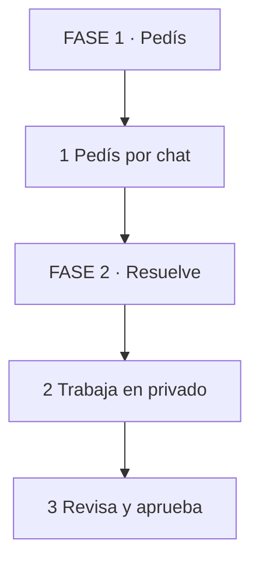

# SPEC: Cómo Escribir Guías que Enseñan de Verdad

> **DIRECTIVA INSTRUCCIONAL OBLIGATORIA — Cómo crear guías derivadas de este archivo**
>
> 1. **PROHIBIDO código ejecutable en el cuerpo.** Cero bloques de código. La lógica se muestra con lenguaje natural + tabla de pasos + ejemplo numérico concreto + micro-diagrama de máx. 4 pasos.
> 2. **Carga cognitiva primero.** Orden estricto fácil → difícil. Una idea nueva por sección. Secciones de 200–400 palabras. Tablas de máx. 4 filas. Diagramas de máx. 4 pasos. Nada de jerga sin analogía previa de 1 línea.
> 3. **Motivación sostenida.** Cada PARTE abre con victoria rápida en <5 min + "por qué importa" en 1 línea + "qué lograrás" concreto. Cada PARTE cierra con idea clave + checklist + próxima recompensa visible.
> 4. **Técnicas validadas (obligatorias).** I Do → We Do → You Do con fading. Recall activo al final de cada PARTE. Interleaving: Concepto → Ejemplo → Contra-ejemplo. Elaboración: "¿por qué funciona / cuándo falla?". Dual coding real: texto + visual que se complementen. Feynman: si no cabe en 1 línea, se reescribe.
> 5. **Progresión visible.** Mapa de 3 FASES al inicio. Niveles 1→5. Nunca 3 conceptos seguidos sin práctica. Nunca un ejercicio sin respuesta esperada debajo.
> 6. **Iconos abundantes (obligatorio).** Toda guía usa muchos iconos/emoji como señalización visual: cada PARTE y cada sección llevan icono, cada idea clave lleva 📌, cada checklist/práctica/recall/diagrama lleva su icono. Mínimo 3 iconos distintos por PARTE y 1 icono cada ≤150 palabras aprox. Solo emoji Unicode, nunca imágenes externas.

---

## 1. SPEC LIMPIO (evidencia graduada)

Leyenda: **Alta** = efecto replicado en múltiples estudios. **Media** = apoyo sólido con matices por dominio. **Heurística** = criterio de diseño propio, no se cita como ciencia.

### A. Estructura y carga cognitiva

| Regla | Fuente | Evidencia | Cómo se verifica |
|-------|--------|-----------|------------------|
| Una idea nueva por sección, 200–400 palabras (segmentación) | Mayer, segmentación | Alta/Media | Contar palabras; 1 subtítulo nuevo cada ≤400 |
| Tablas ≤4 filas, diagramas ≤4 pasos, lineales, sin ciclos | Heurística + coherencia (Mayer) | Heurística | Contar filas/flechas; ningún cierre en ciclo |
| Pre-entrenar: mapa + 5–8 términos antes de enseñar | Mayer, pre-training | Media | ¿Hay mapa y términos antes de la PARTE 1? sí/no |
| Señalizar cada visual con 1 línea ("cómo leerlo") | Mayer, señalización | Media | Cada visual tiene guía sí/no |

### B. Cómo se enseña cada concepto

| Regla | Fuente | Evidencia | Cómo se verifica |
|-------|--------|-----------|------------------|
| Analogía de 1 línea antes de cada jerga nueva | Andamiaje (Wood, Bruner y Ross) | Media | Cada término nuevo tiene analogía previa sí/no |
| Ejemplo resuelto paso a paso antes de pedir práctica | Sweller, worked examples (novatos) | Alta | Cada PARTE tiene ≥1 ejemplo resuelto sí/no |
| Soltar ayuda por fading: I Do → We Do → You Do | Sweller / van Merriënboer | Media | Cada PARTE tiene los 3 niveles o declara por qué no |
| Camino rápido: si pasa el pretest, salta al You Do | Kalyuga, expertise reversal | Media | ¿Hay regla de salida por pretest? sí/no |

### C. Práctica y memoria

| Regla | Fuente | Evidencia | Cómo se verifica |
|-------|--------|-----------|------------------|
| 1 pregunta evocadora por PARTE, sin mirar | Roediger y Karpicke, práctica de recuperación | Alta | Cada PARTE cierra con recall sí/no |
| Re-preguntar conceptos clave en PARTES posteriores | Cepeda et al., espaciado | Alta | Cada concepto reaparece ≥2 veces separado sí/no |
| Intercalar: Concepto → Ejemplo → Contra-ejemplo + sets mixtos | Rohrer / Taylor | Media | Nunca 3 conceptos sin práctica; hay práctica mixta sí/no |
| "¿Por qué funciona / cuándo falla?" + error típico y corrección | Chi et al., autoexplicación | Media/Alta | Cada ejemplo tiene porqué + error sí/no |

### D. Motivación y honestidad

| Regla | Fuente | Evidencia | Cómo se verifica |
|-------|--------|-----------|------------------|
| Por-qué + logro + victoria <5 min + checklist + siguiente paso | Keller (ARCS); Deci y Ryan (autodeterminación) | Media | Cada PARTE abre/cierra con el paquete sí/no |
| Respuesta esperada debajo de cada ejercicio | Hattie y Timperley (niveles de feedback); el plazo es heurística | Media / Heurística | Todo ejercicio tiene respuesta debajo sí/no |
| Dificultad deseable sin sobrecarga: variar contexto, exigir evocación | Bjork y Bjork | Media | Hay variación + recall sin saturar sí/no |
| Atribuir solo lo demostrado; lo demás se marca Heurística | Norma editorial del spec | Heurística | Cero citas inventadas o infladas sí/no |

### E. Iconos y señal visual abundante

| Regla | Fuente | Evidencia | Cómo se verifica |
|-------|--------|-----------|------------------|
| Muchos iconos: ≥3 iconos distintos por PARTE, 1 cada ≤150 palabras aprox. | Señalización (Mayer) + coherencia visual | Heurística | Contar iconos por PARTE; densidad sí/no |
| Iconos fijos por función: 📌 idea clave, ✅ checklist, 🧪 práctica, 🔁 recall, ⚠️ error, 🎯 logro, 🗺️ mapa, 👀 cómo leerlo | Norma editorial del spec | Heurística | Cada función usa su icono sí/no |

> **👀 Idea clave** — 📌 La evidencia manda en el qué; el diseño manda en el cómo. Nunca mezcles ambos.

### Aclaraciones de atribución (no negociables)

- Scaffolding es de Wood, Bruner y Ross (1976), no de Vygotsky (de él es la ZPD).
- Hattie y Timperley modelan niveles de feedback, no plazos; "feedback rápido" es heurística.
- Dual coding (Paivio) exige verbal + visual integrados; una tabla sola no es dual coding.
- Pareto 80/20 y "20 horas" (Kaufman) son gestión y divulgación, no ciencia del aprendizaje. Prohibido citarlos como evidencia.
- Feynman como "técnica" es heurística popular, no constructo validado.
- Bloom es taxonomía organizadora, no efecto causal.

---

## 2. PLANTILLA DE PARTE (orden fijo, copiable)

```
## 🧩 PARTE N: [Título] (Nivel X/5)

1. ❓ PRETEST — [1 pregunta, antes de enseñar] (Activa previas | Media)
   > Respuesta esperada: [...]
   > Si acertás: camino rápido → andá al punto 7.

2. 🎯 POR QUÉ + LOGRO — Importa porque [1 línea]. Vas a lograr [1 línea]. (Motivación | Media)

3. ⚡ VICTORIA RÁPIDA (<5 min) — [micro-tarea con éxito garantizado] (Motivación | Heurística)

4. 💡 CONCEPTO — Analogía: [1 línea]. Definición: [1–2 líneas]. (Pre-training + señalización | Media)

5. 👀 EJEMPLO RESUELTO — Pasos 1→3 con caso concreto + visual ≤4 pasos. (Worked example | Alta)

6. ⚠️ CONTRA-EJEMPLO / ERROR TÍPICO — [qué sale mal] → Corrección: [...] (Autoexplicación | Media-Alta)

7. 🧪 PRÁCTICA — [tarea corta, contexto distinto al ejemplo]
   > Respuesta esperada / criterio: [...] (Práctica + feedback | Media)

8. 🔁 RECALL — [1 pregunta sin mirar] (Nivel Bloom: [...]) (Recuperación | Alta)

9. 📌 IDEA CLAVE — [1 línea; si no entra, se reescribe] (Heurística Feynman | Heurística)

10. ✅ AUTO-CHEQUEO + SIGUIENTE — [ ] checklist de 3 ítems. Siguiente: [puntero]. (Metacognición | Media)
```

---

## 3. RÚBRICA DE AUTO-REVISIÓN (sí/no, 1 punto c/u, aprueba con ≥12/14)

1. ¿Cero bloques de código en el cuerpo?
2. ¿Cero tablas con >4 filas de datos (glosario exceptuado y declarado)?
3. ¿Cero diagramas con >4 pasos o con ciclo?
4. ¿Cada PARTE abre con pretest + respuesta?
5. ¿Cada PARTE tiene ejemplo resuelto + contra-ejemplo?
6. ¿Cada ejercicio tiene respuesta esperada debajo?
7. ¿Cada PARTE cierra con recall con nivel Bloom + idea clave de 1 línea?
8. ¿Toda jerga nueva tuvo analogía previa?
9. ¿Hay regla de camino rápido operativa?
10. ¿Los conceptos clave reaparecen espaciados ≥2 veces?
11. ¿Hay práctica mixta (no solo bloques por tema)?
12. ¿Cero restos (marcadores, secciones vacías, duplicados, typos)?
13. ¿Cero citas científicas inventadas o mal atribuidas?
14. ¿Iconos abundantes: cada PARTE tiene ≥3 iconos distintos, cada sección su icono de función (📌✅🧪🔁⚠️🎯), y densidad ≈1 icono cada ≤150 palabras?

---

## 4. HEURÍSTICAS VISUALES (diseño propio, no evidencia)

- Ancho de lectura 60–65ch, fuente 18–20px, interlineado 1.75. Escaneable antes que bonito.
- Párrafos cortos: un bloque largo se percibe como trabajo; tres cortos como avance.
- Alternar cada pocas pantallas: lista → tabla → diagrama → ejemplo → resumen.
- Resumen frecuente: cada tema cierra con idea clave; el cerebro retiene cierres, no densidad.
- 🎨 Iconos abundantes y consistentes (obligatorio, Heurística): solo emoji Unicode, nunca imágenes externas ni emoticonos ASCII.
  - Cada PARTE abre con emoji temático en el título (p. ej. 🧩🗺️🚀) + 🗺️ mapa de FASES al inicio de la guía.
  - Cada función siempre con el mismo icono: ❓ pretest, 🎯 por-qué/logro, ⚡ victoria, 💡 concepto, 👀 ejemplo/diagrama, ⚠️ error, 🧪 práctica, 🔁 recall, 📌 idea clave, ✅ checklist/siguiente.
  - Mínimo 3 iconos distintos por PARTE y densidad ≈1 icono cada ≤150 palabras; ningún subtítulo sin icono.
  - Los iconos señalizan, no decoran: van pegados al concepto que anuncian y no se repiten dos iguales seguidos salvo checklist.

## 5. REGLA DE DIAGRAMAS (cerebro-friendly)

- PROHIBIDO: jerga sin analogía, filas horizontales de >4 nodos, ciclos que se leen como "volver a empezar", subgrafos sueltos.
- OBLIGATORIO: patrón Concepto → Analogía → Tabla (≤4 filas) → Micro-diagrama (≤4 pasos) → Idea clave. Una línea debajo que diga cómo leerlo.
- Ejemplo:



*Se lee de arriba hacia abajo. 3 pasos de contenido + 2 etiquetas de FASE.*

## 6. GLOSARIO DE TÉCNICAS (1 línea cada una)

| Término | Definición |
|---------|-----------|
| Recuperación | Evocar sin mirar; fortalece memoria más que releer |
| Espaciado | Repartir repasos en el tiempo en vez de amontonar |
| Interleaving | Mezclar temas en la práctica en vez de bloquearlos |
| Elaboración | Preguntarse por qué y cuándo falla algo |
| Dual coding | Combinar palabra + imagen que se complementen |
| Carga cognitiva | Límite de memoria de trabajo; se diseña para no saturarla |
| Worked example | Ejemplo resuelto paso a paso antes de practicar |
| Fading | Retirar ayuda progresiva: muestro → hacemos → hacés |
| Expertise reversal | Al experto le sobra la ayuda que al novato le salva |
| Pretest | Pregunta previa que activa conocimiento anterior |
| Feedback formativo | Respuesta que dice qué corregir y cómo |
| Dificultad deseable | Esfuerzo justo que mejora retención sin frustrar |
| Scaffolding | Apoyo temporal ajustado a lo que el lector ya puede |
| ZPD | Distancia entre lo que hacés solo y con ayuda |
| Señalización | Marcar qué mirar en cada visual |
| Segmentación | Partir contenido en bloques digeribles |
| Pre-training | Enseñar nombres e ideas clave antes del tema |
| Metacognición | Monitorear tu propia comprensión y ajustar |

*Continúa la tabla (2/5) — partida en bloques de ≤4 para no saturar.*

| Término | Definición |
|---------|-----------|
| Camino rápido | Salida para quien ya domina, vía pretest aprobado |
| Bloom (recordar) | Nivel 1: recuperar datos tal cual |
| Bloom (comprender) | Nivel 2: explicar con tus palabras |
| Bloom (aplicar) | Nivel 3: usar en un caso nuevo |

*Continúa la tabla (3/5) — partida en bloques de ≤4 para no saturar.*

| Término | Definición |
|---------|-----------|
| Bloom (analizar) | Nivel 4: separar partes y relaciones |
| Bloom (evaluar) | Nivel 5: juzgar con criterios |
| Bloom (crear) | Nivel 6: producir algo nuevo |
| Idea clave | Cierre de 1 línea que condensa la PARTE |

