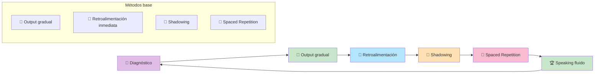

# Masterclass: Speaking A1-A2 - Cómo Hablar Inglés con Métodos Científicos 🗣️🔬🇬🇧

> **La premisa central de esta guía** — Hablar inglés no es cuestión de "tener talento para los idiomas": es cuestión de producir desde el primer día, recibir feedback y repetir. Esta guía te muestra el camino científico para pasar de no hablar nada a mantener conversaciones básicas en A1 y A2.

## Antes de empezar: 🎯 ¿qué vas a poder hacer al terminar esta guía?

Al terminar de leer y **aplicar** esta guía vas a poder:

- Entender por qué el speaking es la habilidad más difícil para muchos estudiantes.
- Aplicar 4 métodos científicos probados para mejorar el speaking (output gradual, retroalimentación inmediata, shadowing, spaced repetition).
- Diagnosticar tu nivel actual de speaking (A1 o A2).
- Seguir un plan de 12 semanas con ejercicios específicos para cada nivel.
- Producir frases y párrafos cortos con confianza.

---

## MAPA DEL WORKFLOW 🔄

---

## PARTE 1 — 🚨 Por qué el speaking es tan difícil (y no es tu culpa)

### El mito: "no tengo talento para los idiomas"

Muchos estudiantes creen que no pueden hablar inglés porque "no tienen talento" o "son tímidos". **Falso.**

El speaking es difícil porque:
1. **Requiere producción en tiempo real:** no tenés tiempo de pensar la frase perfecta.
2. **Combina múltiples habilidades:** vocabulario, gramática, pronunciación, ritmo y entonación al mismo tiempo.
3. **La retroalimentación es escasa:** si no hablás con alguien, no sabés si lo que decís es correcto.
4. **El miedo al error bloquea:** la ansiedad social genera sobrecarga cognitiva que te impide acceder al vocabulario que sí conocés.

### La métrica real del speaking en A1-A2

| Nivel | Lo que podés hacer | Ejemplo concreto |
|-------|-------------------|------------------|
| **A1** | Decir frases memorizadas y responder con sí/no | "My name is Maria. I live in Buenos Aires." |
| **A2** | Narrar experiencias pasadas y hacer predicciones | "Last week I went to the beach. It was fun." |

### El diagnóstico rápido

Hacé este test de 2 minutos:
1. Grabate hablando en inglés durante 60 segundos sobre tu trabajo o tu hobby.
2. Si usaste frases completas y te entendiste: estás en A2 o superior.
3. Si usaste frases cortas y te trabaste: estás en A1.
4. Si no pudiste hablar: estás en pre-A1 (necesitás más input y output guiado).

---

## PARTE 2 — 🔬 Los métodos científicos que usaremos

### Método 1: 🎯 Output gradual (Task-Based Learning)

> **Principio:** empezá con frases cortas y aumentá la complejidad gradualmente.

**En la práctica:**
- **Semana 1-3:** frases de 2-3 palabras.
- **Semana 4-6:** frases de 5-7 palabras.
- **Semana 7-12:** párrafos de 3-5 oraciones.

> **📊 Datos científicos:** un meta-análisis de 2020 (Alsowat) muestra que las **estrategias de aprendizaje** tienen el impacto más grande en **speaking** (d=0.90) de todas las habilidades. El output gradual es una de las estrategias más efectivas.

### Método 2: 🤖 Retroalimentación inmediata

> **Principio:** el error es información; necesitás feedback en el momento, no después de meses.

**En la práctica:**
- Usá un tutor de IA (ChatGPT, Claude) para simular conversaciones.
- Grabate y escuchate para identificar errores.
- Llevá un "error log" con las categorías que más se repiten.

> **📊 Datos científicos:** estudios de **dialogue-based CALL** (meta-análisis 2020) muestran que los efectos más grandes se dan en **vocabulario** (d=0.98) y **habla** (efectos significativos en producción), especialmente en niveles A1-A2. La retroalimentación inmediata es clave.

### Método 3: 🔁 Shadowing

> **Principio:** repetir inmediatamente lo que escuchás, copiando tono y ritmo.

**En la práctica:**
1. Escuchá una frase de 2-3 segundos.
2. Repetila inmediatamente, copiando el tono y ritmo.
3. No esperés a terminar la frase para repetir.
4. Hacé 10 minutos por día.

> **📊 Datos científicos:** el shadowing mejora la **pronunciación**, el **ritmo** y la **fluidez** más que cualquier otro ejercicio de speaking. Estudios muestran que 10 minutos diarios de shadowing generan mejoras medibles en 4 semanas.

### Método 4: 📅 Spaced Repetition para speaking

> **Principio:** repasar las mismas frases y estructuras en intervalos crecientes.

**En la práctica:**
- **Día 1:** practicá 5 frases nuevas.
- **Día 3:** repasá las 5 frases + 5 nuevas.
- **Día 7:** repasá las 10 frases + 5 nuevas.
- **Día 14:** repasá las 15 frases + 5 nuevas.
- Cada semana, consolidá 20 frases.

---

## PARTE 3 — 🗣️ Speaking A1: de palabras a frases

### 🎯 Objetivo del nivel A1

Producir frases cortas y memorizadas sobre ti y tu entorno.

### 🧩 Ejercicios específicos para A1

#### Ejercicio A1-1: Repetición de frases aisladas (Semanas 1-3)

**Objetivo:** automatizar los sonidos del inglés.

**Ejercicio diario (5 minutos):**
1. Escuchá una frase corta (2-3 palabras) en una app como **Duolingo** o **Memrise**.
2. Repetila en voz alta, copiando el tono y ritmo.
3. Grábate y compará con el original.
4. Repetí hasta que se parezca.

#### Ejercicio A1-2: Frases memorizadas (Semanas 4-6)

**Objetivo:** usar estructuras fijas sin pensar.

**Ejercicio diario (10 minutos):**
1. Memorizá 5 frases útiles por día:
   - "My name is..."
   - "I live in..."
   - "I like..."
   - "I don't like..."
   - "Can you help me?"
2. Practicá frente al espejo o grabándote.
3. Usá las frases en situaciones reales (si podés).

#### Ejercicio A1-3: Respuestas guiadas (Semanas 7-12)

**Objetivo:** responder preguntas simples con frases completas.

**Ejercicio diario (15 minutos):**
1. Usá un tutor de IA (ChatGPT, Claude) para responder preguntas:
   - "What is your name?"
   - "Where do you live?"
   - "What do you do?"
2. Respondé en voz alta, no por escrito.
3. El tutor te corrige la gramática y la pronunciación.
4. Repetí la respuesta corregida 2 veces.

---

## PARTE 4 — 🗣️ Speaking A2: de frases a párrafos

### 🎯 Objetivo del nivel A2

Producir párrafos cortos y mantener conversaciones simples.

### 🧩 Ejercicios específicos para A2

#### Ejercicio A2-1: Narración simple (Semanas 1-3)

**Objetivo:** narrar experiencias pasadas en 3-4 oraciones.

**Ejercicio diario (15 minutos):**
1. Elegí una experiencia reciente (un viaje, una fiesta, un día de trabajo).
2. Escribí 3-4 oraciones sobre esa experiencia usando pasado simple.
3. Grabate contando esa historia en voz alta.
4. Escuchate y corregí los errores.
5. Volvé a grabarte hasta que salga fluido.

#### Ejercicio A2-2: Presentaciones cortas (Semanas 4-6)

**Objetivo:** hablar durante 1-2 minutos sobre un tema.

**Ejercicio diario (20 minutos):**
1. Prepará un tema: tu trabajo, tu hobby, tu ciudad.
2. Escribí 5 puntos clave.
3. Practicá la presentación en voz alta 2 veces.
4. Grabate la tercera vez.
5. Escuchate y evaluá: ¿se entendió la idea? ¿qué errores repetiste?

#### Ejercicio A2-3: Conversaciones simuladas (Semanas 7-12)

**Objetivo:** mantener una conversación de 5 minutos.

**Ejercicio diario (25 minutos):**
1. Usá un tutor de IA para simular una conversación sobre:
   - Planes del fin de semana.
   - Experiencias pasadas.
   - Opiniones sobre películas o libros.
2. Respondé en voz alta, sin mirar el texto.
3. El tutor te corrige la gramática y la pronunciación.
4. Repetí la respuesta corregida 2 veces.

> **💡 Tip:** en A2, el secreto es la **práctica deliberada**: producir, recibir feedback, corregir, volver a producir. No importa si te equivocás; lo que importa es que corrijas.

---

## PARTE 5 — 📅 Plan de acción: 12 semanas para dominar el speaking A1-A2

### 🗓️ Semanas 1-3: Frases cortas y repetición

- [ ] 🎯 Aprendé 20 frases básicas (presentaciones, gustos, despedidas).
- [ ] 🔁 Practicá shadowing con audios cortos (5 min/día).
- [ ] 🗣️ Repetí frases frente al espejo (5 min/día).
- [ ] 🤖 Usá un tutor de IA para responder preguntas simples (10 min/día).
- [ ] 📊 Medí tu progreso: grabate hablando 30 segundos y contá cuántas frases completas usaste.

### 🗓️ Semanas 4-6: Narración simple

- [ ] 🎯 Aprendé 20 frases nuevas (pasado simple, descripciones).
- [ ] 🔁 Practicá shadowing con diálogos cortos (10 min/día).
- [ ] 🗣️ Narrá una experiencia pasada en 3-4 oraciones (10 min/día).
- [ ] 🤖 Simulá conversaciones con IA sobre tu semana (15 min/día).
- [ ] 📊 Medí tu progreso: grabate hablando 1 minuto sobre tu fin de semana.

### 🗓️ Semanas 7-9: Presentaciones y conversaciones

- [ ] 🎯 Aprendé 20 frases nuevas (futuro, comparativos, opiniones).
- [ ] 🔁 Practicá shadowing con videos de nativos (15 min/día).
- [ ] 🗣️ Hacé presentaciones de 1-2 minutos sobre tu hobby (15 min/día).
- [ ] 🤖 Simulá conversaciones de 5 minutos con IA (20 min/día).
- [ ] 📊 Medí tu progreso: mantené una conversación de 3 minutos con un compañero o tutor.

### 🗓️ Semanas 10-12: Consolidación

- [ ] 🎯 Repasá todas las frases con spaced repetition.
- [ ] 🔁 Practicá shadowing con audios A2 completos.
- [ ] 🗣️ Grabate hablando 2 minutos sobre tu vida.
- [ ] 🤖 Mantené una conversación de 5 minutos con IA sin ayuda.
- [ ] 📊 Hacé un speaking test oficial de Cambridge English A1 o A2.
- [ ] 🏆 Medí tu progreso final y compará con la semana 1.

---

## PARTE 6 — ⚠️ Errores comunes al practicar speaking

| Error | Por qué pasa | Solución |
|-------|--------------|----------|
| ❌ **Querer hablar fluido desde el día 1** | Expectativas irreales | En A1-A2, el objetivo es ser entendido, no ser fluido. Las frases cortas son suficientes. |
| ❌ **No recibir feedback** | Da miedo corregirse | Usá IA, grabate, o unite a una comunidad de intercambio. |
| ❌ **Hablar solo en tu cabeza** | Parece más fácil | El speaking es una habilidad motriz: tenés que hablar en voz alta para entrenarla. |
| ❌ **Enfocarse en la gramática antes que en la comunicación** | La escuela nos enseñó reglas primero | Primero comunicá la idea, después pulí la forma. |
| ❌ **Cambiar de recurso constantemente** | Creemos que más = mejor | Quedate con 1 podcast, 1 tutor de IA, 1 app por semana. |
| ❌ **No repasar** | Practicamos una vez y olvidamos | Usá spaced repetition: repasá las frases al día 1, 3, 7, 14, 30. |

---

## PARTE 7 — 📚 Glosario de conceptos clave

- 🗣️ **Speaking:** producción oral del inglés.
- 🎯 **Output gradual:** técnica de empezar con frases cortas y aumentar la complejidad gradualmente.
- 🤖 **Retroalimentación inmediata:** corrección en el momento de producir, no después de meses.
- 🔁 **Shadowing:** técnica de repetir inmediatamente lo que escuchás, copiando tono y ritmo.
- 📅 **Spaced Repetition:** repasar en intervalos crecientes para maximizar la retención.
- 🧠 **Retrieval Practice:** intentar recordar sin ayuda; más efectivo que volver a escuchar.
- 🎧 **Listening:** comprensión auditiva del inglés.
- 📝 **Dictado:** ejercicio de escribir lo que escuchaste, palabra por palabra.
- 🔗 **Linking:** conexión entre palabras habladas (ej: "I want to" → "I wanna").
- 🗣️ **Weak forms:** pronunciación reducida de palabras en contexto (ej: "to" → "tə").
- 📊 **Frecuencia de palabras:** las palabras más comunes del inglés; las 300 más frecuentes cubren el 65% del inglés oral.
- 🎯 **Sweet spot:** el punto óptimo de dificultad donde aprendés más (70-90% de comprensión).
- 🧠 **Procesamiento auditivo:** la capacidad del cerebro para decodificar sonidos y convertirlos en significado.
- 📈 **Velocidad de procesamiento:** la velocidad a la que podés entender inglés sin esfuerzo.

---

## PARTE 8 — 🧠 Resumen mental (para fijar el conocimiento)

Si tuvieras que recordar solo 3 ideas de esta masterclass:

1. 🎯 **El speaking se aprende produciendo, no escuchando.** Tenés que hablar desde el primer día, incluso si te equivocás. El output gradual es la clave.
2. 🤖 **La retroalimentación inmediata es indispensable.** Sin corrección, los errores se convierten en malos hábitos. Usá IA, grabate o un compañero.
3. 🔁 **El shadowing es el ejercicio más poderoso.** 10 minutos diarios de repetir lo que escuchás mejoran la pronunciación, el ritmo y la fluidez más que cualquier otro ejercicio.

---

## PARTE 9 — 🌐 Recursos para profundizar

- 📖 Libro: *"Teaching by Principles"* de H. Douglas Brown — fundamentos científicos de la enseñanza de speaking.
- 📖 Libro: *"Fluency Through TPR"* de Blaine Ray — metodología TPR para beginners.
- 🎧 Podcast: *"6 Minute English"* (BBC) — listening A1-A2 con transcripción para practicar shadowing.
- 🎧 Podcast: *"Elementary Podcasts"* (British Council) — listening A2 con actividades.
- 📱 App: **Anki** o **Quizlet** — spaced repetition para vocabulario.
- 📱 App: **Speechling** — feedback de pronunciación nativa.
- 🤖 Herramienta: **ChatGPT / Claude** — tutor conversacional para speaking con corrección inmediata.
- 🌐 Web: **BBC Learning English** — videos y audios con subtítulos en inglés.
- 🎥 Video: Maddie from POC English — *"How to actually speak English fluently"* (brecha input-output y speaking).
- 🎥 Video: Maddie from POC English — *"The English Journey & 5 Rules for Fast Improvement"* (los 6 peldaños del aprendizaje).

---

*Guía elaborada como síntesis de métodos científicos probados para mejorar el speaking en inglés niveles A1-A2: Output gradual (Task-Based Learning, Ellis), Retroalimentación inmediata (Alsowat 2020, dialogue-based CALL meta-análisis), Shadowing (evidencia de mejora en pronunciación y fluidez), Spaced Repetition (Ebbinghaus) y evidencia de meta-análisis recientes (Webb 2023, Alsowat 2020).*
