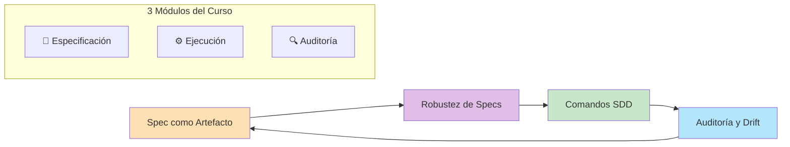
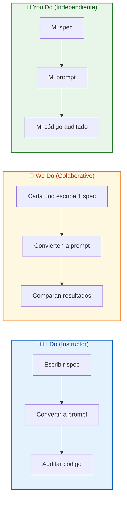
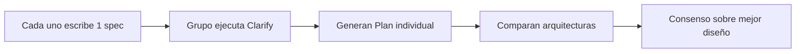
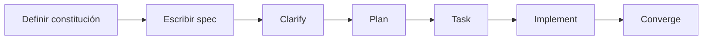

# MASTERCLASS: Spec Driven Development - Curso Práctico Completo 📝

## INTRODUCCIÓN: POR QUÉ ESTA MASTERCLASS ES DIFERENTE 🎯

La mayoría de los desarrolladores que usan IA generan código por "prompts sueltos" — pedidos aislados que se pierden en el historial del chat, generan deuda técnica invisible y rompen la consistencia del sistema. El Spec Driven Development (SDD) invierte ese paradigma: **la especificación es el artefacto central, el código es consecuencia**.

El objetivo no es "usar IA para escribir código más rápido", sino **generar código reproducible, auditable y mantenible** mediante contratos técnicos vivos.

> **🎯 Objetivo de Aprendizaje** — Al final de esta guía, podrás crear specs ejecutables, configurar el Spec Kit, convertir specs en prompts efectivos para LLMs, auditar código generado y gestionar cambios sin perder contexto.

> **⚠️ Advertencia profesional** — Este contenido es formativo. El SDD requiere disciplina de documentación y cambio de mentalidad: de "codificar primero" a "especificar primero".

---

## 🗺️ MAPA DE LA MASTERCLASS 🧭

| 🧩 Fase | ❓ Pregunta que responde | 📤 Resultado principal |
|---------|------------------------|------------------------|
| **📝 Especificación** | ¿Cómo evito el vibe coding y la deuda técnica? | Specs vivas como contratos |
| **⚙️ Ejecución** | ¿Cómo convierto una spec en código de calidad? | Tareas, plan y código generado |
| **🔍 Auditoría** | ¿Cómo garantizo que la IA respete la arquitectura? | Código validado y sin drift |

---

## 📝 PARTE 1: ESPECIFICACIÓN COMO ARTEFACTO CENTRAL DE IA 📝

### 1.1 ❓ PRETEST

¿Qué problema principal resuelve el Spec Driven Development?

> Respuesta esperada: La deuda técnica y pérdida de contexto del vibe coding.
> Si acertás: camino rápido → andá al punto 7.

### 1.2 🎯 POR QUÉ + LOGRO

Importa porque **el código generado por IA sin especificación es impredecible**: cada prompt genera una implementación distinta, con estilos diferentes y decisiones arquitectónicas inconsistentes. Vas a lograr **generar código reproducible** mediante contratos técnicos estables.

### 1.3 ⚡ VICTORIA RÁPIDA (<5 min)

Escribí 1 spec simple: "Especificación: servicio de salud. Debe responder GET /health con status 200 y JSON {status: 'ok'}". Esa es tu primer artefacto de SDD.

### 1.4 💡 CONCEPTO

Analogía: Una spec es como **el plano de un edificio** — si lo tenés escrito, cualquier constructor (humano o IA) puede construir exactamente lo mismo. Si solo tenés una idea verbal, cada constructor interpreta distinto.

Definición: En Spec Driven Development, la especificación es un documento vivo que define el comportamiento, estructura y contratos del sistema antes de escribir código. Sirve como entrada a LLMs para generar código consistente, auditable y alineado con la arquitectura.

### 1.5 👀 EJEMPLO RESUELTO

| Vibe Coding | Spec Driven Development |
|-------------|--------------------------|
| "Creame un API de usuarios" | "Especificación: API REST de usuarios con endpoints GET/POST/PUT/DELETE, validación de email, hash de password con bcrypt" |
| Código inconsistente cada vez | Misma implementación cada vez |
| Deuda técnica invisible | Specs versionadas y auditables |
| Contexto perdido en chats | Contexto centralizado en specs |

### 1.6 ⚠️ CONTRA-EJEMPLO / Error Típico

Error: "El prompt es suficiente, después lo ajusto".

Corrección: Un prompt es efímero, se pierde en el historial. Una spec es un documento versionado que puede reutilizarse, auditarse y evolucionar. Si no lo escribís, la próxima vez que lo necesites volvés a empezar desde cero.

### 1.7 🧪 PRÁCTICA

Escribí una spec para un endpoint simple: "GET /api/health". Definí: método, ruta, respuesta exitosa, respuesta de error, código de estado.

> Respuesta esperada / criterio: Debe ser un contrato claro y sin ambigüedades. Ejemplo: "GET /api/health → 200 {status: 'ok', timestamp: ISO8601}".

### 1.8 🔁 RECALL — Nivel Bloom: Analizar

¿Por qué una especificación reduce la deuda técnica más que un prompt?

### 1.9 📌 IDEA CLAVE

El código generado por IA es tan bueno como la especificación que lo alimenta: sin spec, tenés deuda técnica; con spec, tenés un contrato reproducible.

### 1.10 ✅ AUTO-CHEQUEO + SIGUIENTE

- [ ] Escribí mi primera spec simple
- [ ] Entiendo la diferencia entre prompt y spec
- [ ] Reconozco los riesgos del vibe coding

Siguiente: Configuración del Spec Kit y estructura de proyectos.

---

## 📦 PARTE 2: INSTALACIÓN Y CONFIGURACIÓN DEL SPEC KIT 📦

### 2.1 ❓ PRETEST

¿Qué comando se usa para inicializar el Spec Kit en un proyecto existente?

> Respuesta esperada: spec-kit init (o equivalente según herramienta).
> Si acertás: camino rápido → andá al punto 7.

### 2.2 🎯 POR QUÉ + LOGRO

Importa porque **el Spec Kit es la herramienta que materializa el SDD**. Sin configuración correcta, las specs son solo archivos markdown sin estructura. Vas a lograr **tener un proyecto con convenciones de specs** listo para generar código con IA.

### 2.3 ⚡ VICTORIA RÁPIDA (<5 min)

Inicializá el Spec Kit en una carpeta vacía con el comando de inicialización. Eso crea la estructura de directorios y el archivo de constitución del proyecto.

### 2.4 💡 CONCEPTO

Analogía: El Spec Kit es como **el sistema de carpetas de una oficina** — si todo está en la misma carpeta, es un caos. Si tenés carpetas por dominio, fecha y tipo, encontrás lo que necesitás en 2 segundos.

Definición: El Spec Kit es una herramienta que estructura las especificaciones en un proyecto, define convenciones de nombres, ubicación de archivos y reglas del proyecto (constitución). Permite que las specs sean consumibles por LLMs y mantenibles por equipos.

### 2.5 👀 EJEMPLO RESUELTO

| Acción | Comando/Archivo | Resultado |
|--------|-----------------|-----------|
| Inicializar proyecto | `spec-kit init` | Crea estructura de directorios |
| Definir constitución | `spec/Constitution.md` | Reglas globales del proyecto |
| Crear primera spec | `spec/001-initial/spec.md` | Especificación versionada |
| Configurar orchestrator | `spec/config.yaml` | Configuración de LLM y prompts |

### 2.6 ⚠️ CONTRA-EJEMPLO / Error Típico

Error: Guardar specs en cualquier lado sin convención de nombres.

Corrección: El Spec Kit impone estructura: `/spec/001-initial/spec.md`, `/spec/002-auth/spec.md`, etc. Esto permite versionado, búsqueda y auditoría. Si cada spec está en un lugar distinto, el proyecto se vuelve inmantenible.

### 2.7 🧪 PRÁCTICA

Inicializá el Spec Kit en una carpeta de prueba. Creá 2 specs: "001-salud" y "002-usuarios". Verificá que la estructura sea correcta.

> Respuesta esperada / criterio: Deben existir los directorios /spec/001-salud y /spec/002-usuarios, cada uno con su spec.md.

### 2.8 🔁 RECALL — Nivel Bloom: Aplicar

¿Por qué la estructura de directorios es importante en Spec Driven Development?

### 2.9 📌 IDEA CLAVE

Un Spec bien organizado es un activo; un spec perdido en el caos de archivos es deuda técnica disfrazada.

### 2.10 ✅ AUTO-CHEQUEO + SIGUIENTE

- [ ] Inicialicé Spec Kit en un proyecto
- [ ] Creé 2 specs con estructura correcta
- [ ] Entiendo la convención de nombres

Siguiente: Creación de la constitución del proyecto.

---

## 📜 PARTE 3: LA CONSTITUCIÓN DEL PROYECTO 📜

### 3.1 ❓ PRETEST

¿Qué es la constitución en Spec Driven Development?

> Respuesta esperada: Un documento con reglas globales, límites y estándares que rigen todas las specs.
> Si acertás: camino rápido → andá al punto 7.

### 3.2 🎯 POR QUÉ + LOGRO

Importa porque **sin reglas globales, cada spec es una isla**. La constitución define: estándares de código, patrones de diseño obligatorios, límites de complejidad y principios arquitectónicos. Vas a lograr **consistencia cross-spec** en todo el proyecto.

### 3.3 ⚡ VICTORIA RÁPIDA (<5 min)

Escribí 3 reglas para tu proyecto: 1) Todos los endpoints deben tener logging, 2) Las contraseñas se hashean con bcrypt, 3) Las respuestas de error siguen formato estándar.

### 3.4 💡 CONCEPTO

Analogía: La constitución es como **la ley fundamental de un país** — todas las leyes (specs) deben estar alineadas con ella. Si una spec contradice la constitución, esa spec es inválida.

Definición: La constitución del proyecto es un documento markdown que define reglas globales, estándares de código, patrones obligatorios, límites tecnológicos y principios arquitectónicos. Toda spec debe estar alineada con la constitución; si no, debe actualizarse la constitución primero.

### 3.5 👀 EJEMPLO RESUELTO

| Sección | Contenido |
|---------|-----------|
| **Estándares de código** | ESLint + Prettier, tipado estricto TypeScript |
| **Patrones obligatorios** | Repository pattern para acceso a datos, DTOs para entrada/salida |
| **Límites** | No usar `any` en TypeScript, no guardar secrets en código |
| **Principios** | SOLID, separación de responsabilidades, testability first |

### 3.6 ⚠️ CONTRA-EJEMPLO / Error Típico

Error: Escribir specs sin reglas globales, cada una con su estilo.

Corrección: Si una spec usa PostgreSQL y otra usa MongoDB sin justificación, el código generado es inconsistente. La constitución evita eso: define "usamos PostgreSQL para datos relacionales" y todas las specs se alinean.

### 3.7 🧪 PRÁCTICA

Escribí la constitución de tu proyecto: 3 reglas de código, 2 patrones obligatorios, 1 límite tecnológico.

> Respuesta esperada / criterio: Deben ser reglas concretas y medibles. Ejemplo: "Todo endpoint debe tener test unitario" es medible; "el código debe ser bueno" es subjetivo.

### 3.8 🔁 RECALL — Nivel Bloom: Crear

¿Por qué la constitución es más importante que cualquier spec individual?

### 3.9 📌 IDEA CLAVE

La constitución es el ADN del proyecto: si está bien definida, todas las specs generan código coherente sin esfuerzo adicional.

### 3.10 ✅ AUTO-CHEQUEO + SIGUIENTE

- [ ] Escribí la constitución de mi proyecto
- [ ] Definí 3 reglas, 2 patrones, 1 límite
- [ ] Entiendo cómo afecta la constitución a las specs

Siguiente: Conversión de specs a prompts efectivos para LLMs.

---

## 🤖 PARTE 4: CONVERSIÓN DE SPEC A PROMPT PARA LLMs 🤖

### 4.1 ❓ PRETEST

¿Qué elemento de una spec es más importante para generar código con IA?

> Respuesta esperada: Los criterios de aceptación y el contexto del sistema.
> Si acertás: camino rápido → andá al punto 7.

### 4.2 🎯 POR QUÉ + LOGRO

Importa porque **una spec bien escrita se convierte en un prompt perfecto**. La IA no adivina intenciones: si la spec es ambigua, el código generado es ambiguo. Vas a lograr **orquestar LLMs efectivamente** mediante specs estructuradas.

### 4.3 ⚡ VICTORIA RÁPIDA (<5 min)

Tomá la spec del endpoint GET /health y convertila en un prompt para Claude: "Generá un endpoint GET /health que responda 200 con JSON {status: 'ok', timestamp: ISO8601}. Seguí la constitución del proyecto: logging en cada request, manejo de errores estándar."

### 4.4 💡 CONCEPTO

Analogía: Convertir spec a prompt es como **traducir un manual de instrucciones a un pedido claro** — si el manual está bien escrito, el pedido es perfecto. Si el manual es confuso, el pedido también.

Definición: La conversión de spec a prompt consiste en transformar la especificación técnica en un prompt estructurado para LLMs, incluyendo: contexto del sistema, reglas de la constitución, criterios de aceptación y ejemplos de entrada/salida. Esto maximiza la calidad del código generado.

### 4.5 👀 EJEMPLO RESUELTO

| Elemento de Spec | Prompt para LLM |
|------------------|-----------------|
| **Contexto** | "Sistema de e-commerce, API Node.js + TypeScript" |
| **Reglas** | "Seguir la constitución: Repository pattern, bcrypt, logging" |
| **Endpoint** | "Generar endpoint GET /health" |
| **Comportamiento** | "Responder 200 con {status: 'ok', timestamp}" |
| **Errores** | "Manejar error 500 con formato estándar" |
| **Tests** | "Generar test unitario con Jest" |

### 4.6 ⚠️ CONTRA-EJEMPLO / Error Típico

Error: "Generame un API de usuarios" como prompt completo.

Corrección: Ese prompt carece de contexto, reglas y criterios. La IA generará código que quizás funcione, pero no estará alineado con tu arquitectura. La spec como prompt incluye TODOS los constraints.

### 4.7 🧪 PRÁCTICA

Convertí la spec del servicio de reseñas en un prompt efectivo. Incluí: contexto, reglas de constitución, comportamiento, errores y tests.

> Respuesta esperada / criterio: El prompt debe ser autocontenido: cualquier desarrollador (o IA) debería poder implementarlo sin preguntar nada más.

### 4.8 🔁 RECALL — Nivel Bloom: Aplicar

¿Por qué una spec bien estructurada genera mejores prompts que un prompt improvisado?

### 4.9 📌 IDEA CLAVE

Una spec es un prompt versionado y mejorado: cada vez que la usas, la calidad del código generado es consistente.

### 4.10 ✅ AUTO-CHEQUEO + SIGUIENTE

- [ ] Convertí 1 spec en prompt efectivo
- [ ] Incluí contexto, reglas, comportamiento y tests
- [ ] Entiendo la diferencia entre prompt y spec-prompt

Siguiente: Metodologías Given-When-Then y EARS para estructurar requerimientos.

---

## 📋 PARTE 5: GIVEN-WHEN-THEN Y EARS - REQUERIMIENTOS SIN AMBIGÜEDAD 📋

### 5.1 ❓ PRETEST

¿Qué metodología usa la estructura "Given [contexto], When [acción], Then [resultado]"?

> Respuesta esperada: Given-When-Then (Cucumber/BDD).
> Si acertás: camino rápido → andá al punto 7.

### 5.2 🎯 POR QUÉ + LOGRO

Importa porque **las ambigüedades en requerimientos generan código incorrecto**. Given-When-Then y EARS (Easy Approach to Requirements Syntax) son formatos estructurados que eliminan interpretaciones subjetivas. Vas a lograr **escribir specs que la IA entiende perfectamente**.

### 5.3 ⚡ VICTORIA RÁPIDA (<5 min)

Escribí 1 requerimiento en Given-When-Then: "Dado que un usuario existe, cuando envía POST /login con credenciales válidas, entonces recibe un token JWT."

### 5.4 💡 CONCEPTO

Analogía: Given-When-Then es como **una receta de cocina** — Given (ingredientes), When (pasos), Then (resultado esperado). Si la receta está completa, cualquier cocinero (humano o IA) puede reproducir el plato.

Definición: Given-When-Then es un formato BDD (Behavior-Driven Development) que estructura requerimientos: Given (precondiciones), When (acción), Then (resultado esperado). EARS (Easy Approach to Requirements Syntax) es una variante más estructurada: "Ubiquitous [system] shall [behavior] when [condition]".

### 5.5 👀 EJEMPLO RESUELTO

| Metodología | Ejemplo |
|-------------|---------|
| **Given-When-Then** | Given usuario con email "test@test.com", When envía POST /login con password correcto, Then recibe 200 con JWT |
| **EARS** | El sistema DEBE validar el token JWT en CADA request CUANDO el endpoint requiere autenticación |

### 5.6 ⚠️ CONTRA-EJEMPLO / Error Típico

Error: "El sistema debe manejar errores" como criterio de aceptación.

Corrección: Ese requerimiento es ambiguo. ¿Qué errores? ¿Cómo se manejan? ¿Qué respuesta se devuelve? Given-When-Then obliga a definir: Given un request con body inválido, When el usuario envía POST /login, Then devuelve 400 con mensaje de error específico.

### 5.7 🧪 PRÁCTICA

Escribí 3 requerimientos para un sistema de reseñas usando Given-When-Then.

> Respuesta esperada / criterio: Cada requerimiento debe tener Given, When, Then explícitos. Sin ambigüedades. Ejemplo: "Given producto con id 123, When usuario envía POST /reviews, Then se crea reseña asociada al producto."

### 5.8 🔁 RECALL — Nivel Bloom: Crear

¿Por qué Given-When-Then genera mejores specs que descripciones libres?

### 5.9 📌 IDEA CLAVE

Un requerimiento sin estructura es una opinión; un requerimiento con Given-When-Then es un contrato ejecutable.

### 5.10 ✅ AUTO-CHEQUEO + SIGUIENTE

- [ ] Escribí 3 requerimientos en Given-When-Then
- [ ] Escribí 2 requerimientos en EARS
- [ ] Entiendo cómo eliminan ambigüedades

Siguiente: Comandos Clarify, Plan, Task e Implement del Spec Kit.

---

## ⚙️ PARTE 6: COMANDOS DEL SPEC KIT - CLARIFY ⚙️

### 6.1 ❓ PRETEST

¿Qué comando del Spec Kit se usa para resolver ambigüedades antes de generar código?

> Respuesta esperada: Clarify.
> Si acertás: camino rápido → andá al punto 7.

### 6.2 🎯 POR QUÉ + LOGRO

Importa porque **las ambigüedades en specs generan código incorrecto o incompleto**. El comando Clarify identifica casos borde, supuestos ocultos y criterios faltantes antes de invertir tiempo en implementación. Vas a lograr **especificaciones completas** sin agujeros.

### 6.3 ⚡ VICTORIA RÁPIDA (<5 min)

Tomá una spec ambigua: "El sistema debe manejar errores". Ejecutá Clarify mentalmente: ¿qué errores? ¿de validación? ¿de red? ¿de base de datos? Esa es la lista de preguntas que debe responder.

### 6.4 💡 CONCEPTO

Analogía: Clarify es como **el proceso de aprobación de un préstamo** — el banco no te da el dinero hasta que le respondés todas las preguntas: ingresos, deudas, garantías. Si no respondés, el préstamo se rechaza o se otorga con riesgo alto.

Definición: El comando Clarify analiza la especificación y genera preguntas para resolver ambigüedades, casos borde no considerados y supuestos implícitos. Su objetivo es convertir una spec "buena" en una spec "completa y ejecutable".

### 6.5 👀 EJEMPLO RESUELTO

| Ambigüedad | Pregunta Clarify | Resolución |
|-------------|------------------|------------|
| "Manejar errores" | ¿Qué tipos de errores? | 400, 401, 404, 500 |
| "Usuario válido" | ¿Qué campos son obligatorios? | email, password, name |
| "Respuesta exitosa" | ¿Qué código HTTP? | 201 Created |
| "Sin límite" | ¿Cuántos reintentos? | 3 reintentos con backoff |

### 6.6 ⚠️ CONTRA-EJEMPLO / Error Típico

Error: Saltar Clarify porque "la spec se entiende".

Corrección: Lo que se entiende para vos puede ser ambiguo para la IA o para otro desarrollador. Clarify no es burocracia: es la diferencia entre código que funciona y código que falla en producción.

### 6.7 🧪 PRÁCTICA

Tomá la spec del endpoint de login. Ejecutá Clarify: listá 5 preguntas que deberías responder antes de implementar.

> Respuesta esperada / criterio: Deben ser preguntas específicas, no generales. Ejemplo: "¿El email debe ser único?" es buena; "¿qué pasa con los errores?" es ambigua.

### 6.8 🔁 RECALL — Nivel Bloom: Analizar

¿Por qué Clarify es el paso que más reduce deuda técnica?

### 6.9 📌 IDEA CLAVE

Una spec sin ambigüedades es un contrato que la IA puede ejecutar sin interpretaciones.

### 6.10 ✅ AUTO-CHEQUEO + SIGUIENTE

- [ ] Apliqué Clarify a 1 spec ambigua
- [ ] Identifiqué 5 ambigüedades y resolví 3
- [ ] Entiendo el valor de las preguntas aclaratorias

Siguiente: Comando Plan para arquitectura de código.

---

## 🏗️ PARTE 7: COMANDO PLAN - ARQUITECTURA DE CÓDIGO 🏗️

### 7.1 ❓ PRETEST

¿Qué produce el comando Plan en el Spec Kit?

> Respuesta esperada: Un plan de arquitectura de código con componentes, responsabilidades y dependencias.
> Si acertás: camino rápido → andá al punto 7.

### 7.2 🎯 POR QUÉ + LOGRO

Importa porque **especificar el qué no es suficiente: hay que definir el cómo**. El comando Plan traduce la especificación en una arquitectura de código: servicios, módulos, interfaces y flujos de datos. Vas a lograr **tener un blueprint antes de escribir código**.

### 7.3 ⚡ VICTORIA RÁPIDA (<5 min)

Tomá la spec de API de usuarios. Plan: "Arquitectura: servicio de usuarios con controlador, servicio, repositorio y modelo. Dependencias: bcrypt para passwords, JWT para auth. Flujo: POST /users → validar → hashear → guardar → responder."

### 7.4 💡 CONCEPTO

Analogía: Plan es como **el arquitecto que hace los planos de la casa** — la especificación dice "necesito una casa de 3 habitaciones", el plan dice "la cocina va acá, las habitaciones acá, el baño acá, y estos son los materiales".

Definición: El comando Plan recibe una especificación y genera un plan de arquitectura de código: estructura de directorios, componentes principales, interfaces, dependencias y flujos. Es el puente entre el "qué" (spec) y el "cómo" (implementación).

### 7.5 👀 EJEMPLO RESUELTO

| Capa | Componente | Responsabilidad |
|------|------------|-----------------|
| **Controlador** | UserController | Manejar HTTP requests/responses |
| **Servicio** | UserService | Lógica de negocio: crear, validar, hashear |
| **Repositorio** | UserRepository | Acceso a datos: SELECT, INSERT |
| **Modelo** | User | Entidad: id, email, password_hash |
| **DTO** | CreateUserRequest | Validación de entrada |
| **Util** | PasswordHasher | Wrapper de bcrypt |

### 7.6 ⚠️ CONTRA-EJEMPLO / Error Típico

Error: Implementar directamente desde la spec sin planificar la arquitectura.

Corrección: Sin plan, cada servicio se implementa distinto. Un servicio usa clases, otro usa funciones, otro mezcla lógica con SQL. El plan unifica la arquitectura antes de escribir código.

### 7.7 🧪 PRÁCTICA

Tomá la spec de sistema de reseñas. Escribí el Plan: estructura de carpetas, componentes por capa, dependencias y flujo de datos.

> Respuesta esperada / criterio: Debe incluir: 1) Estructura de directorios, 2) Componentes por capa, 3) Dependencias externas, 4) Flujo de datos.

### 7.8 🔁 RECALL — Nivel Bloom: Crear

¿Por qué el comando Plan es indispensable antes de Implement?

### 7.9 📌 IDEA CLAVE

Un plan arquitectura lo que la IA no puede adivinar: la estructura del sistema, las capas y las responsabilidades.

### 7.10 ✅ AUTO-CHEQUEO + SIGUIENTE

- [ ] Generé el Plan de 1 spec
- [ ] Definí estructura de carpetas y componentes
- [ ] Entiendo la diferencia entre Plan e Implement

Siguiente: Comando Task para desglose de tareas.

---

## 📋 PARTE 8: COMANDO TASK - DESGLOSE DE TRABAJO 📋

### 8.1 ❓ PRETEST

¿Qué produce el comando Task?

> Respuesta esperada: Una lista de tareas ordenadas con dependencias claras.
> Si acertás: camino rápido → andá al punto 7.

### 8.2 🎯 POR QUÉ + LOGRO

Importa porque **un plan arquitectura no es ejecutable**: necesita ser desglosado en tareas concretas, ordenadas y dependientes. El comando Task convierte el plan en un backlog accionable. Vas a lograr **implementar en el orden correcto** sin saltos ni bloqueos.

### 8.3 ⚡ VICTORIA RÁPIDA (<5 min)

Tomá el Plan del servicio de usuarios. Task: 1) Crear entidad User, 2) Crear repositorio, 3) Crear servicio, 4) Crear controlador, 5) Crear tests. Esa es la secuencia lógica.

### 8.4 💡 CONCEPTO

Analogía: Task es como **la lista de pasos de una receta** — el plan dice "hacer una torta", Task dice "1) mezclar harina y huevos, 2) agregar azúcar, 3) hornear 30 minutos". Sin pasos, no sabés por dónde empezar.

Definición: El comando Task recibe el Plan y lo desglosa en tareas ejecutables, cada una con: descripción, dependencias (qué debe estar hecho antes), criterios de aceptación y estimación de esfuerzo.

### 8.5 👀 EJEMPLO RESUELTO

| # | Tarea | Depende de | Criterio de aceptación |
|---|-------|------------|------------------------|
| 1 | Crear entidad User | — | Modelo con id, email, password_hash |
| 2 | Crear UserRepository | 1 | Métodos: save, findByEmail, findById |
| 3 | Crear UserService | 2 | Lógica: crear usuario, hashear password |
| 4 | Crear UserController | 3 | Endpoints: POST /users, GET /users/:id |
| 5 | Tests unitarios | 3 | Coverage >80% |

### 8.6 ⚠️ CONTRA-EJEMPLO / Error Típico

Error: Implementar el controlador antes del repositorio "porque es más visible".

Corrección: Si el controlador llama al repositorio y este no existe, el código no compila. Las dependencias existen por una razón: respetar el orden evita bloqueos.

### 8.7 🧪 PRÁCTICA

Tomá el Plan del sistema de reseñas. Escribí las 5 primeras tareas con sus dependencias.

> Respuesta esperada / criterio: Deben estar ordenadas por dependencia. Ejemplo: "Entidad Review" antes de "ReviewRepository", antes de "ReviewService".

### 8.8 🔁 RECALL — Nivel Bloom: Crear

¿Por qué las dependencias en Task son fundamentales para el orden de implementación?

### 8.9 📌 IDEA CLAVE

Las tareas bien ordenadas evitan bloqueos: cada paso construye sobre el anterior, como piezas de LEGO.

### 8.10 ✅ AUTO-CHEQUEO + SIGUIENTE

- [ ] Desglosé 1 Plan en 5 tareas
- [ ] Definí dependencias entre tareas
- [ ] Entiendo el flujo Plan → Task → Implement

Siguiente: Comando Implement para generar código.

---

## 🚀 PARTE 9: COMANDO IMPLEMENT - EJECUCIÓN DE CÓDIGO 🚀

### 9.1 ❓ PRETEST

¿Qué recibe el comando Implement como entrada?

> Respuesta esperada: Una tarea específica del backlog generada por Task.
> Si acertás: camino rápido → andá al punto 7.

### 9.2 🎯 POR QUÉ + LOGRO

Importa porque **la ejecución del código debe ser controlada y auditable**. Implement no es "pedir código a la IA": es ejecutar una tarea específica con contexto completo (spec + plan + constitución) y generar código que cumpla con criterios de aceptación. Vas a lograr **generar código de calidad** sin sorpresas.

### 9.3 ⚡ VICTORIA RÁPIDA (<5 min)

Tomá la tarea 1 del servicio de usuarios: "Crear entidad User". Ejecutá Implement: prompt con spec, plan, constitución y criterios de aceptación.

### 9.4 💡 CONCEPTO

Analogía: Implement es como **el albañil que recibe el plano detallado** — no tiene que decidir dónde va la pared, solo ejecutar según las especificaciones. Si el plano es bueno, el resultado es predecible.

Definición: El comando Implement recibe una tarea del backlog, la especificación completa, el plan de arquitectura y la constitución del proyecto. Genera código que cumple con los criterios de aceptación, siguiendo los patrones definidos en la constitución.

### 9.5 👀 EJEMPLO RESUELTO

| Entrada | Contenido |
|---------|-----------|
| **Tarea** | "Crear entidad User con validación de email" |
| **Spec** | "Usuario tiene id, email único, password_hash" |
| **Plan** | "Entidad en /src/domain/entities/User.ts" |
| **Constitución** | "TypeScript estricto, class-validator para DTOs" |
| **Criterios** | "Email único, password hasheado con bcrypt" |

### 9.6 ⚠️ CONTRA-EJEMPLO / Error Típico

Error: Pedir "generame el código" sin pasar la spec, el plan ni la constitución.

Corrección: Si la IA no tiene contexto, generará código que quizás compile pero no esté alineado con tu arquitectura. Implement funciona porque recibe TODO el contexto necesario.

### 9.7 🧪 PRÁCTICA

Tomá la tarea 1 del sistema de reseñas. Escribí el prompt de Implement completo: tarea + spec + plan + constitución + criterios.

> Respuesta esperada / criterio: El prompt debe ser autocontenido: la IA debería poder generar el código sin hacer preguntas.

### 9.8 🔁 RECALL — Nivel Bloom: Aplicar

¿Por qué Implement es más confiable que el vibe coding?

### 9.9 📌 IDEA CLAVE

Implement no es magia: es ejecución controlada. La calidad del código depende de la calidad de la tarea, la spec y la constitución.

### 9.10 ✅ AUTO-CHEQUEO + SIGUIENTE

- [ ] Escribí el prompt de Implement para 1 tarea
- [ ] Incluí spec, plan, constitución y criterios
- [ ] Entiendo el flujo completo Spec → Plan → Task → Implement

Siguiente: Auditoría de código generado con el comando Converge.

---

## 🔍 PARTE 10: AUDITORÍA DE CÓDIGO - COMANDO CONVERGE 🔍

### 10.1 ❓ PRETEST

¿Qué verifica el comando Converge en el código generado por IA?

> Respuesta esperada: Que el código cumpla con la especificación, la constitución y los criterios de aceptación.
> Si acertás: camino rápido → andá al punto 7.

### 10.2 🎯 POR QUÉ + LOGRO

Importa porque **generar código no es suficiente: hay que verificar que cumpla con lo especificado**. Converge audita automáticamente: ¿la implementación respeta la arquitectura? ¿cumple los criterios de aceptación? ¿está alineada con la constitución? Vas a lograr **entregas de calidad sin revisión manual exhaustiva**.

### 10.3 ⚡ VICTORIA RÁPIDA (<5 min)

Tomá el código generado para la entidad User. Verificá: ¿tiene los campos especificados? ¿usa bcrypt? ¿tiene tests? Esa es la auditoría básica.

### 10.4 💡 CONCEPTO

Analogía: Converge es como **el inspector de obra** — revisa que lo construido coincida con el plano, que los materiales sean los correctos y que cumpla con el código de edificación. Si hay desviaciones, las detecta antes de entregar.

Definición: El comando Converge ejecuta una auditoría automática del código generado contra la especificación, el plan y la constitución. Verifica: cumplimiento de criterios de aceptación, alineación arquitectónica, ausencia de deuda técnica y cobertura de tests.

### 10.5 👀 EJEMPLO RESUELTO

| Verificación | Resultado esperado | Acción si falla |
|--------------|-------------------|-----------------|
| ¿Cumple criterios de aceptación? | Sí: POST /users crea usuario | Rechazar y regenerar |
| ¿Usa bcrypt para passwords? | Sí: password_hash en entidad | Rechazar si usa texto plano |
| ¿Tiene tests unitarios? | Sí: coverage >80% | Rechazar si falta |
| ¿Respeta la arquitectura? | Sí: capas separadas | Rechazar si mezcla lógica |

### 10.6 ⚠️ CONTRA-EJEMPLO / Error Típico

Error: Confiar ciegamente en el código generado sin auditar.

Corrección: La IA puede alucinar, omitir criterios o violar la constitución. Converge es el checkpoint que valida antes de merge.

### 10.7 🧪 PRÁCTICA

Tomá el código generado para el endpoint POST /users. Escribí 4 verificaciones de Converge: 2 de comportamiento y 2 de arquitectura.

> Respuesta esperada / criterio: Deben ser verificaciones objetivas. Ejemplo: "¿El endpoint devuelve 201 al crear usuario?" es buena; "¿el código se ve bien?" es subjetiva.

### 10.8 🔁 RECALL — Nivel Bloom: Evaluar

¿Por qué Converge es el paso que garantiza calidad sin revisión manual exhaustiva?

### 10.9 📌 IDEA CLAVE

Converge convierte la generación de código en un proceso confiable: spec → implement → verify → merge.

### 10.10 ✅ AUTO-CHEQUEO + SIGUIENTE

- [ ] Apliqué Converge a 1 entrega de código
- [ ] Verifiqué 4 aspectos: comportamiento, arquitectura, tests, deuda
- [ ] Entiendo el flujo de auditoría automática

Siguiente: Gestión de Spec Drift cuando los requerimientos cambian.

---

## 🔄 PARTE 11: SPEC DRIFT - GESTIÓN DE CAMBIOS 🔄

### 11.1 ❓ PRETEST

¿Qué es Spec Drift?

> Respuesta esperada: La divergencia entre la especificación y el código implementado cuando los requerimientos cambian.
> Si acertás: camino rápido → andá al punto 7.

### 11.2 🎯 POR QUÉ + LOGRO

Importa porque **los requerimientos cambian**: el negocio pide nuevas features, se agregan casos borde, se modifican reglas. Si no gestionás el drift, la spec se desactualiza, el código se desalinea y la deuda técnica crece. Vas a lograr **evolucionar el sistema sin perder el control**.

### 11.3 ⚡ VICTORIA RÁPIDA (<5 min)

Cambiá el requerimiento: "Ahora el endpoint de health también devuelve la versión de la API". Actualizá la spec, regenerá el código con Implement y auditá con Converge.

### 11.4 💡 CONCEPTO

Analogía: Spec Drift es como **un mapa desactualizado** — si el camino cambió (nuevo requerimiento) pero el mapa no se actualiza, te perdés. La solución no es tirar el mapa, es actualizarlo.

Definición: Spec Drift es la divergencia entre la especificación y el sistema implementado. Se gestiona actualizando la spec (versionado), regenerando el código afectado y re-ejecutando Converge para verificar que la nueva implementación cumpla con los cambios.

### 11.5 👀 EJEMPLO RESUELTO

| Cambio | Acción en SDD |
|--------|---------------|
| Nuevo requerimiento | Actualizar spec.md con nuevo comportamiento |
| Cambio de regla | Actualizar constitución si es global |
| Nuevo caso borde | Agregar criterio de aceptación en spec |
| Refactor | Actualizar plan si cambia arquitectura |

### 11.6 ⚠️ CONTRA-EJEMPLO / Error Típico

Error: Modificar el código directamente sin actualizar la spec.

Corrección: Si modificás el código sin actualizar la spec, generás drift. La próxima vez que alguien lea la spec, verá algo que no coincide con la realidad. Siempre: spec primero, código después.

### 11.7 🧪 PRÁCTICA

Tomá la spec del endpoint de login. Agregá un requerimiento nuevo: "El login debe bloquearse después de 5 intentos fallidos". Actualizá la spec y escribí las tareas afectadas.

> Respuesta esperada / criterio: La spec debe reflejar el nuevo comportamiento, y las tareas deben incluir: entidad Attempt, lógica de bloqueo, respuesta de error.

### 11.8 🔁 RECALL — Nivel Bloom: Analizar

¿Por qué Spec Drift es inevitable pero controlable?

### 11.9 📌 IDEA CLAVE

El drift no es un bug, es una característica de los sistemas vivos. SDD lo controla mediante versionado y regeneración continua.

### 11.10 ✅ AUTO-CHEQUEO + SIGUIENTE

- [ ] Simulé 1 cambio de requerimiento
- [ ] Actualicé la spec correspondiente
- [ ] Entiendo el ciclo Spec → Plan → Task → Implement → Converge

Siguiente: Cómo combinar todo en tu flujo profesional de SDD.

---

## 🎓 PARTE 12: I DO / WE DO / YOU DO - FLUJO PROFESIONAL 🎓

### 12.1 🧭 I Do — Flujo completo de Spec Driven Development

**🎯 Objetivo**: Recorrer el ciclo completo desde spec hasta código auditado.

| 📌 Paso | 📝 Acción | ⏱️ Tiempo |
|---------|-----------|-----------|
| 1 | Escribir spec con Given-When-Then | 15 min |
| 2 | Ejecutar Clarify para resolver ambigüedades | 10 min |
| 3 | Generar Plan de arquitectura | 10 min |
| 4 | Desglosar en Tasks | 10 min |
| 5 | Implementar tarea por tarea | 30 min |
| 6 | Ejecutar Converge para auditar | 15 min |
| 7 | Gestionar drift si hay cambios | 10 min |

**📋 Ejemplo guiado**:
- Spec: API de reseñas con endpoints CRUD
- Clarify: ¿una reseña requiere producto existente? ¿rating mínimo 1 máximo 5?
- Plan: 3 capas (controlador, servicio, repositorio), entidades Review y Product
- Tasks: 1) Entidad Review, 2) Repositorio, 3) Servicio, 4) Controlador, 5) Tests
- Implement: Generar código con prompts estructurados
- Converge: Verificar tests pasan, arquitectura respetada, sin deuda

### 12.2 🤝 We Do — Especificación y revisión colaborativa

**👥 Ejercicio grupal**: Cada persona escribe una spec, el grupo ejecuta Clarify y Plan, y comparan resultados.

**📜 Reglas del ejercicio**:
1. Sin preferencias personales: usar criterios objetivos
2. Cada spec debe tener criterios de aceptación medibles
3. Clarify debe resolver al menos 3 ambigüedades por spec
4. El Plan debe incluir estructura de carpetas y dependencias

### 12.3 🚀 You Do — Tu flujo profesional de SDD

**📋 Tarea**: Diseñá tu workflow de Spec Driven Development para un proyecto real.

**✅ Checklist de implementación**:

- [ ] 📝 Creé la constitución de mi proyecto
- [ ] 📋 Escribí 3 specs con Given-When-Then
- [ ] ❓ Ejecuté Clarify en cada spec
- [ ] 🏗️ Generé el Plan de arquitectura para cada una
- [ ] 📋 Desglosé en Tasks con dependencias
- [ ] 🚀 Implementé 1 tarea completa con prompt estructurado
- [ ] 🔍 Ejecuté Converge y verifiqué calidad
- [ ] 🔄 Gestioné 1 cambio de requerimiento (Spec Drift)

---

## 🧩 PREGUNTAS DE VERIFICACIÓN 📝✅

1. **📊 Aplica**: Escribí una spec completa para un endpoint de login con Given-When-Then, ejecutá Clarify, generá el Plan y desglosá en 3 tareas.

2. **🔍 Analiza**: ¿Por qué el Spec Driven Development reduce la deuda técnica más que el vibe coding?

3. **🛠️ Diseña**: Creá la constitución de un proyecto: 3 reglas de código, 2 patrones obligatorios, 1 límite tecnológico.

4. **💭 Reflexiona**: ¿Qué pasa cuando una especificación queda desactualizada y no se gestiona el drift?

5. **📅 Crea**: Diseñá tu flujo profesional de SDD: desde que recibís un requerimiento hasta que el código está en producción.

---

## 📖 GLOSARIO RÁPIDO 📚

| Término | Definición |
|---------|------------|
| **Spec Driven Development** | Metodología donde la especificación es el artefacto central |
| **Vibe Coding** | Desarrollo por prompts sueltos sin especificación estructurada |
| **Spec** | Documento vivo que define comportamiento y contratos del sistema |
| **Constitución** | Reglas globales, patrones y límites del proyecto |
| **Given-When-Then** | Formato BDD para requerimientos sin ambigüedades |
| **EARS** | Easy Approach to Requirements Syntax: "Ubiquitous shall when" |
| **Clarify** | Comando para resolver ambigüedades en specs |
| **Plan** | Comando que genera arquitectura de código desde una spec |
| **Task** | Comando que desglosa el plan en tareas ejecutables |
| **Implement** | Comando que ejecuta una tarea generando código |
| **Converge** | Comando que audita código contra spec y constitución |
| **Spec Drift** | Divergencia entre spec y código cuando cambian requerimientos |

---

## 🎓 NOTAS FINALES 🎓✨

El Spec Driven Development no es una herramienta: es una mentalidad. Cambia el foco de "escribir código rápido" a "generar código correcto, mantenible y reproducible". La IA es el motor, pero la especificación es el volante.

Recuerda:
1. **📝 La spec es el contrato** — si no está escrita, no existe
2. **⚙️ Los comandos son el flujo** — Clarify → Plan → Task → Implement → Converge
3. **📜 La constitución es la ley** — todas las specs deben alinearse
4. **🔍 Converge es el checkpoint** — sin auditoría, no hay confianza
5. **🔄 El drift es inevitable** — gestionalo con versionado y regeneración

> **🌟 Mensaje final**: El futuro del desarrollo no es "IA vs desarrolladores", es "desarrolladores que especifican bien vs desarrolladores que no". El Spec Driven Development te pone en el primer grupo: generas código de calidad, reproducible y escalable, sin depender de la suerte del prompt.

---

**Creado con propósito educativo. El Spec Driven Development se aprende practicando: escribí specs, ejecutá el flujo completo y medí la calidad del código generado.**

📝✨
