## ¿Qué vas a aprender

En este contenido dominarás las prácticas y herramientas de DevOps y operaciones modernas:

- Contenerización con Docker y orquestación con Kubernetes
- Pipelines de CI/CD, despliegues automatizados y rollbacks seguros
- Infraestructura como código: Terraform, provisionamiento y configuración
- Observabilidad: métricas, logs, trazas y alertas
- Escalabilidad, seguridad en producción y cultura DevOps aplicada


# 🏗️ MASTERCLASS DE ARQUITECTURA DE SOFTWARE MODERNA

### La guía definitiva para pensar como un Arquitecto de Software Senior

> _"La arquitectura no es sobre tecnología. Es sobre decisiones, tradeoffs y consecuencias."_
> — Staff Engineer, ex-Google

---

## 📋 TABLA DE CONTENIDOS

1. [Fundamentos de Arquitectura de Software](#1-fundamentos)
2. [Arquitectura Monolítica](#2-monolito)
3. [Clean Architecture](#3-clean-architecture)
4. [Arquitectura Hexagonal (Ports & Adapters)](#4-hexagonal)
5. [Domain-Driven Design (DDD)](#5-ddd)
6. [Microservicios](#6-microservicios)
7. [Arquitectura Orientada a Eventos](#7-eventos)
8. [Arquitecturas Frontend](#8-frontend)
9. [Cloud-Native Architecture](#9-cloud-native)
10. [Arquitecturas AI-Native](#10-ai-native)
11. [Escalabilidad y System Design](#11-escalabilidad)
12. [Bases de Datos y Arquitecturas de Datos](#12-databases)
13. [Arquitecturas Backend Modernas](#13-backend)
14. [Observabilidad y Confiabilidad](#14-observabilidad)
15. [Frameworks de Decisión Arquitectónica](#15-decision)
16. [Casos de Estudio del Mundo Real](#16-casos)
17. [Errores Comunes de Arquitectura](#17-errores)
18. [El Futuro de la Arquitectura de Software](#18-futuro)

---

# 1. Fundamentos de Arquitectura de Software {#1-fundamentos}

## ¿Qué es realmente la Arquitectura de Software?

Muchos desarrolladores confunden arquitectura con patrones de diseño, frameworks o infraestructura. Empecemos con claridad absoluta.

> **Arquitectura de software** es el conjunto de decisiones estructurales fundamentales sobre un sistema que son difíciles o costosas de cambiar una vez tomadas.

La arquitectura define:

- **Qué componentes** existen en el sistema
- **Cómo se comunican** entre sí
- **Qué responsabilidades** tiene cada uno
- **Qué restricciones** y reglas deben seguirse
- **Qué tradeoffs** se han aceptado conscientemente

### La Gran Diferencia: Arquitectura vs Todo Lo Demás

| Concepto               | ¿Qué es?                                               | Ejemplo                                          |
| ---------------------- | ------------------------------------------------------ | ------------------------------------------------ |
| **Arquitectura**       | Estructura fundamental del sistema, difícil de cambiar | Monolito vs Microservicios, REST vs Event-Driven |
| **Patrones de Diseño** | Soluciones reutilizables a problemas comunes de código | Singleton, Factory, Observer, Strategy           |
| **Frameworks**         | Herramientas que implementan decisiones técnicas       | NestJS, Django, Spring Boot                      |
| **Infraestructura**    | El hardware/cloud donde corre el software              | AWS EC2, Kubernetes, Vercel                      |

**La metáfora del edificio:**

Imagina construir un rascacielos:

- **Arquitectura** = La planta del edificio, la estructura de soporte, cuántos pisos tiene y dónde van los pilares. Cambiar esto una vez construido es demoler y reconstruir.
- **Patrones de Diseño** = Cómo se distribuye cada apartamento internamente.
- **Frameworks** = Los materiales de construcción (acero, concreto, vidrio).
- **Infraestructura** = El terreno donde se construye.

---

## Las Propiedades Fundamentales de un Sistema

Un arquitecto senior siempre evalúa un sistema en función de estas dimensiones:

### 🔄 Escalabilidad

La capacidad de un sistema de manejar crecimiento.

```
Escalabilidad Vertical (Scale Up):  🖥️ → 🖥️💪
Más RAM, más CPU en la misma máquina
Límite: el hardware más grande disponible

Escalabilidad Horizontal (Scale Out): 🖥️ → 🖥️🖥️🖥️
Más máquinas corriendo el mismo servicio
Límite: casi ilimitado (con la arquitectura correcta)
```

### 🛡️ Confiabilidad (Reliability)

La capacidad de funcionar correctamente bajo condiciones adversas. Un sistema confiable falla de manera predecible y controlada.

### 🔧 Mantenibilidad

¿Qué tan fácil es cambiar el sistema? ¿Cuánto tiempo le toma a un nuevo desarrollador entenderlo?

### 📈 Extensibilidad

¿Qué tan fácil es agregar nuevas funcionalidades sin romper lo existente?

### 💪 Resiliencia

La capacidad de recuperarse de fallos. Un sistema resiliente no es uno que nunca falla, sino uno que falla bien.

### ⚡ Rendimiento (Performance)

- **Latencia**: tiempo de respuesta para una solicitud individual
- **Throughput**: cuántas solicitudes puede manejar por segundo
- **P99 / P999**: percentil 99 / 99.9 de latencia (los casos extremos)

### 🟢 Disponibilidad (Availability)

```
Disponibilidad = Tiempo funcional / Tiempo total

99%    = ~87.6 horas caídas/año    ❌ Inaceptable
99.9%  = ~8.76 horas caídas/año    ⚠️  Aceptable para uso interno
99.99% = ~52.6 minutos caídas/año  ✅ Bueno para producción
99.999%=  ~5.26 minutos caídas/año  🏆 Mission-critical (bancos, hospitales)
```

---

## El Teorema CAP

El teorema CAP es una de las verdades fundamentales de los sistemas distribuidos. Todo arquitecto debe internalizarlo.

> **Teorema CAP**: En un sistema distribuido, solo puedes garantizar **dos de tres** propiedades simultáneamente:

```
           Consistency (Consistencia)
                    /\
                   /  \
                  /    \
                 /      \
                /  Solo  \
               /  2 de 3  \
              /______________\
Availability               Partition
(Disponibilidad)           Tolerance
```

| Propiedad                   | Significado                                                           |
| --------------------------- | --------------------------------------------------------------------- |
| **Consistency (C)**         | Todos los nodos ven los mismos datos al mismo tiempo                  |
| **Availability (A)**        | Cada request recibe una respuesta (sin garantía de estar actualizada) |
| **Partition Tolerance (P)** | El sistema funciona aunque se pierdan mensajes entre nodos            |

**La realidad:** En sistemas distribuidos, las particiones de red siempre pueden ocurrir. Por lo tanto, **siempre debes elegir entre CP o AP**.

| Sistema | Tipo                                                  | Ejemplo                                   |
| ------- | ----------------------------------------------------- | ----------------------------------------- |
| **CP**  | Consistente bajo partición, puede no estar disponible | Zookeeper, HBase, MongoDB (modo estricto) |
| **AP**  | Disponible bajo partición, puede ser inconsistente    | Cassandra, DynamoDB, CouchDB              |
| **CA**  | Solo en sistemas no distribuidos                      | PostgreSQL en single node                 |

**Ejemplo real:** Un banco procesa un pago. ¿Prefieres CP o AP?

- **CP**: El pago puede fallar si hay problemas de red (no disponible)
- **AP**: El pago siempre responde, pero puede haber inconsistencias de saldo

Un banco elige **CP**. La consistencia es no negociable.

---

## Coupling vs Cohesion

Dos conceptos que definen la calidad estructural de cualquier sistema:

```
ALTA COHESIÓN: Las cosas que van juntas, están juntas.
BAJO ACOPLAMIENTO: Los módulos no dependen fuertemente entre sí.
```

### Tipos de Acoplamiento (de peor a mejor)

| Tipo        | Descripción                                        | Ejemplo                           |
| ----------- | -------------------------------------------------- | --------------------------------- |
| **Content** | Módulo A modifica directamente datos internos de B | ❌ Acceder a variables internas   |
| **Common**  | Dos módulos comparten datos globales               | ❌ Variables globales mutables    |
| **Control** | A controla el flujo de B pasando flags             | ⚠️ `processOrder(isUrgent: true)` |
| **Stamp**   | Comparten estructura de datos compleja             | ⚠️ Pasar objetos enormes          |
| **Data**    | Solo comparten datos simples                       | ✅ Pasar parámetros primitivos    |
| **Message** | Comunicación solo vía mensajes/eventos             | ✅✅ Event-driven                 |

---

## Deuda Técnica

> La deuda técnica es el costo implícito de retrabajo causado por elegir una solución fácil ahora en lugar de usar un mejor enfoque que tomaría más tiempo.

```
Deuda técnica no es necesariamente mala.
Es un préstamo: a veces tiene sentido tomarlo.
El problema es cuando no sabes que lo tienes,
o cuando no lo pagas.
```

| Tipo            | Descripción                             | Ejemplo                                                      |
| --------------- | --------------------------------------- | ------------------------------------------------------------ |
| **Deliberada**  | Sabes que es un shortcut, lo documentas | "Por ahora hardcodeamos esto, en Sprint 5 lo refactorizamos" |
| **Inadvertida** | No sabías que era un mal enfoque        | Arquitectura legacy de hace 10 años                          |
| **Bit rot**     | Era buena pero el contexto cambió       | Tecnología obsoleta                                          |

---

## Los Grandes Tradeoffs en Ingeniería

Todo en arquitectura es un tradeoff. No existen soluciones perfectas, solo decisiones con consecuencias.

| Decisión                           | Opción A                | Opción B                 |
| ---------------------------------- | ----------------------- | ------------------------ |
| Consistencia vs Disponibilidad     | Datos siempre correctos | Sistema siempre responde |
| Simplicidad vs Flexibilidad        | Fácil de entender       | Fácil de extender        |
| Velocidad de desarrollo vs Calidad | Lanzar rápido           | Sistema robusto          |
| Costo vs Performance               | Infraestructura barata  | Baja latencia            |
| Autonomía vs Coordinación          | Equipos independientes  | Coherencia global        |

> **La habilidad más importante de un arquitecto no es saber todas las tecnologías. Es saber cuándo usar cuál, y aceptar conscientemente los tradeoffs.**

---

# 2. Arquitectura Monolítica {#2-monolito}

## El Monolito: El Incomprendido

El monolito tiene mala fama que no siempre merece. Entendámoslo correctamente.

> Un **monolito** es una aplicación donde todos los componentes están desplegados como una sola unidad.

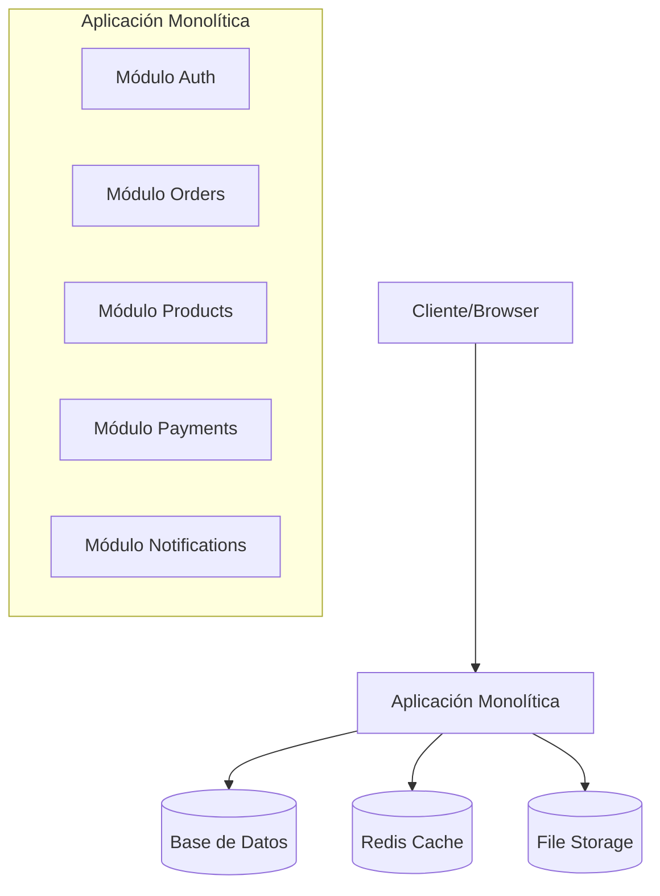

## Tipos de Monolitos

### 1. Monolito Tradicional (Big Ball of Mud)

El peor caso. Sin estructura, sin límites claros, todo depende de todo.

```
❌ src/
   ├── index.js          (5000 líneas)
   ├── helpers.js        (todo está aquí)
   ├── utils.js          (más cosas aquí)
   └── database.js       (queries mezcladas con lógica)
```

### 2. Monolito en Capas (Layered Architecture)

La estructura más común. Separa el código por tipo técnico.

```
✅ src/
   ├── controllers/      # Manejo HTTP
   │   ├── user.controller.ts
   │   └── order.controller.ts
   ├── services/         # Lógica de negocio
   │   ├── user.service.ts
   │   └── order.service.ts
   ├── repositories/     # Acceso a datos
   │   ├── user.repository.ts
   │   └── order.repository.ts
   └── models/           # Modelos de datos
       ├── user.model.ts
       └── order.model.ts
```

**Flujo de capas:**

```
HTTP Request → Controller → Service → Repository → Database
HTTP Response ← Controller ← Service ← Repository ←
```

### 3. Monolito Modular (La joya oculta)

La mejor opción para la mayoría de startups y equipos medianos. Separado por **dominio de negocio**, no por tipo técnico.

```
✅✅ src/
    ├── modules/
    │   ├── auth/
    │   │   ├── auth.controller.ts
    │   │   ├── auth.service.ts
    │   │   ├── auth.repository.ts
    │   │   └── auth.module.ts
    │   ├── orders/
    │   │   ├── orders.controller.ts
    │   │   ├── orders.service.ts
    │   │   ├── orders.repository.ts
    │   │   └── orders.module.ts
    │   ├── products/
    │   │   └── ...
    │   └── payments/
    │       └── ...
    ├── shared/
    │   ├── database/
    │   ├── config/
    │   └── utils/
    └── main.ts
```

### 4. Arquitectura Feature-Based

Similar al modular pero centrado en features del usuario:

```
src/
├── features/
│   ├── checkout/
│   │   ├── components/     (Frontend)
│   │   ├── hooks/
│   │   ├── services/
│   │   └── types/
│   ├── user-profile/
│   └── product-catalog/
└── shared/
```

---

## Pros y Contras del Monolito

|                          | Monolito                        | Microservicios                        |
| ------------------------ | ------------------------------- | ------------------------------------- |
| **Desarrollo inicial**   | ✅ Simple                       | ❌ Complejo                           |
| **Debugging**            | ✅ Fácil (un solo proceso)      | ❌ Difícil (trazabilidad distribuida) |
| **Deployment**           | ✅ Un solo artefacto            | ❌ Múltiples servicios                |
| **Testing**              | ✅ Tests de integración simples | ❌ Mocking complejo                   |
| **Latencia interna**     | ✅ Llamadas en memoria          | ❌ Network hops                       |
| **Escalabilidad**        | ⚠️ Escala todo junto            | ✅ Escala partes específicas          |
| **Autonomía de equipos** | ⚠️ Todos en el mismo código     | ✅ Equipos independientes             |
| **Resiliencia**          | ⚠️ Un fallo puede afectar todo  | ✅ Fallos aislados                    |

---

## ¿Cuándo usar un Monolito?

```
✅ Usa un Monolito Modular cuando:
   - Estás validando una idea (startup early-stage)
   - El equipo es pequeño (< 10 devs)
   - El dominio no está bien entendido todavía
   - Necesitas velocidad de iteración
   - No tienes experiencia operacional con microservicios

❌ Evita el Monolito cuando:
   - Diferentes partes del sistema tienen requisitos de escala muy distintos
   - Tienes múltiples equipos grandes trabajando en paralelo
   - Necesitas deployments independientes por dominio
   - El tiempo de build/test del monolito supera los 10-15 minutos
```

> **La gran verdad:** La mayoría de las startups que fracasan con microservicios hubieran sobrevivido con un monolito modular bien diseñado. Shopify, Stack Overflow y Basecamp son monolitos que escalan a millones de usuarios.

---

## Limitaciones de Escalabilidad del Monolito

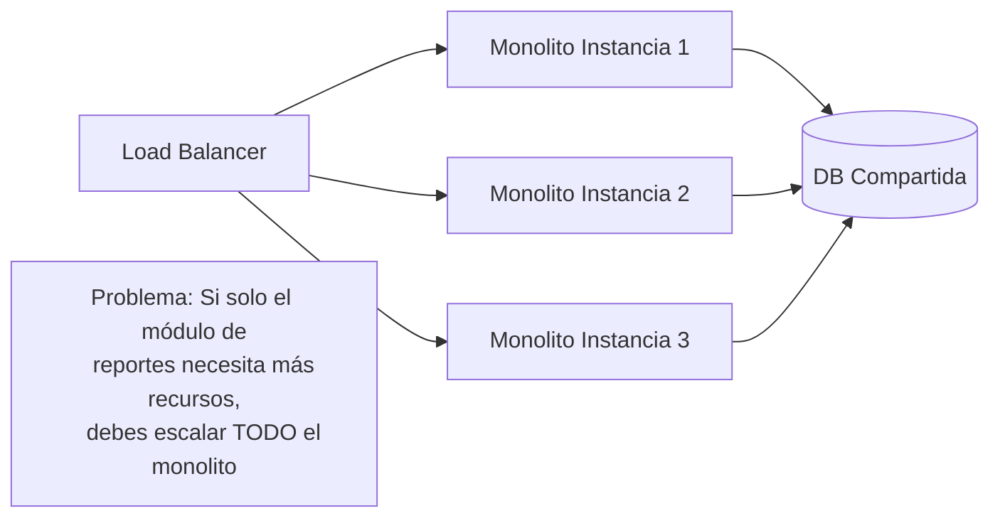

**El problema real:** Imagina que tu módulo de generación de reportes consume 16GB de RAM durante picos. Con un monolito, debes darle 16GB a CADA instancia, aunque el resto del sistema solo necesite 2GB.

---

# 3. Clean Architecture {#3-clean-architecture}

## La Visión de Uncle Bob

Robert C. Martin (Uncle Bob) publicó Clean Architecture en 2017. La idea central es simple pero poderosa:

> **El código de negocio no debe saber nada sobre las tecnologías que lo rodean.**

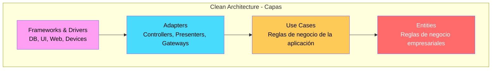

**La Regla de Dependencia:** Las dependencias siempre apuntan hacia adentro. El círculo interior no sabe nada del exterior.

## Las Capas Explicadas

### Capa 1: Entities (Entidades)

Las reglas de negocio más fundamentales. No dependen de NADA externo.

```typescript
// ✅ Entity pura - sin imports externos
export class Order {
  private items: OrderItem[] = [];
  private status: OrderStatus = OrderStatus.PENDING;

  addItem(product: Product, quantity: number): void {
    if (quantity <= 0) throw new Error("Quantity must be positive");
    this.items.push(new OrderItem(product, quantity));
  }

  calculateTotal(): Money {
    return this.items.reduce(
      (total, item) => total.add(item.subtotal()),
      Money.zero(),
    );
  }

  canBeConfirmed(): boolean {
    return this.items.length > 0 && this.status === OrderStatus.PENDING;
  }

  confirm(): void {
    if (!this.canBeConfirmed()) throw new Error("Order cannot be confirmed");
    this.status = OrderStatus.CONFIRMED;
  }
}
```

### Capa 2: Use Cases (Casos de Uso)

Orquestan el flujo de la aplicación. Solo conocen Entities e interfaces (ports).

```typescript
// ✅ Use Case - solo depende de interfaces y entidades
export class CreateOrderUseCase {
  constructor(
    private readonly orderRepository: IOrderRepository, // Interface
    private readonly productRepository: IProductRepository, // Interface
    private readonly eventBus: IEventBus, // Interface
  ) {}

  async execute(command: CreateOrderCommand): Promise<OrderId> {
    const product = await this.productRepository.findById(command.productId);
    if (!product) throw new ProductNotFoundException(command.productId);

    const order = new Order(command.customerId);
    order.addItem(product, command.quantity);

    await this.orderRepository.save(order);
    await this.eventBus.publish(new OrderCreatedEvent(order.id));

    return order.id;
  }
}
```

### Capa 3: Interface Adapters

Traducen entre el mundo externo y los use cases.

```typescript
// ✅ Controller (Adapter) - convierte HTTP a Use Case command
@Controller("orders")
export class OrderController {
  constructor(private readonly createOrderUseCase: CreateOrderUseCase) {}

  @Post()
  async create(@Body() dto: CreateOrderDto): Promise<{ id: string }> {
    const orderId = await this.createOrderUseCase.execute({
      customerId: dto.customerId,
      productId: dto.productId,
      quantity: dto.quantity,
    });

    return { id: orderId.value };
  }
}
```

### Capa 4: Frameworks & Drivers

NestJS, Express, TypeORM, bases de datos. Son detalles de implementación.

```typescript
// ✅ Repository Implementation - implementa la interface del dominio
@Injectable()
export class TypeOrmOrderRepository implements IOrderRepository {
  constructor(
    @InjectRepository(OrderEntity)
    private readonly repo: Repository<OrderEntity>,
  ) {}

  async save(order: Order): Promise<void> {
    const entity = OrderMapper.toEntity(order);
    await this.repo.save(entity);
  }

  async findById(id: OrderId): Promise<Order | null> {
    const entity = await this.repo.findOne({ where: { id: id.value } });
    return entity ? OrderMapper.toDomain(entity) : null;
  }
}
```

## Estructura de Proyecto Completa (NestJS)

```
src/
├── domain/                          # Capa: Entities
│   ├── orders/
│   │   ├── order.entity.ts
│   │   ├── order-item.entity.ts
│   │   ├── order.repository.interface.ts
│   │   └── events/
│   │       └── order-created.event.ts
│   └── products/
│       ├── product.entity.ts
│       └── product.repository.interface.ts
│
├── application/                     # Capa: Use Cases
│   ├── orders/
│   │   ├── create-order/
│   │   │   ├── create-order.use-case.ts
│   │   │   ├── create-order.command.ts
│   │   │   └── create-order.use-case.spec.ts
│   │   └── cancel-order/
│   │       └── cancel-order.use-case.ts
│   └── shared/
│       └── interfaces/
│           └── event-bus.interface.ts
│
├── infrastructure/                  # Capa: Frameworks & Adapters
│   ├── persistence/
│   │   ├── typeorm/
│   │   │   ├── entities/
│   │   │   │   └── order.orm-entity.ts
│   │   │   ├── repositories/
│   │   │   │   └── typeorm-order.repository.ts
│   │   │   └── mappers/
│   │   │       └── order.mapper.ts
│   └── messaging/
│       └── rabbitmq-event-bus.ts
│
└── presentation/                    # Capa: Interface Adapters
    ├── http/
    │   ├── controllers/
    │   │   └── order.controller.ts
    │   └── dtos/
    │       └── create-order.dto.ts
    └── graphql/
        └── resolvers/
            └── order.resolver.ts
```

## Ventajas y Desventajas

| Ventajas                                                   | Desventajas                                      |
| ---------------------------------------------------------- | ------------------------------------------------ |
| Lógica de negocio totalmente testeable sin infraestructura | Más boilerplate inicial                          |
| Cambiar de base de datos sin tocar business logic          | Curva de aprendizaje alta                        |
| Frontends pueden cambiar sin afectar el dominio            | Puede ser overengineering para proyectos simples |
| Independencia tecnológica                                  | Muchos archivos y capas                          |

## Misconceptions Comunes

```
❌ Mito: "Clean Architecture = 4 carpetas específicas"
✅ Realidad: Es sobre la dirección de las dependencias

❌ Mito: "Siempre necesito todas las capas"
✅ Realidad: Adapta la cantidad de capas a la complejidad

❌ Mito: "Entity = tabla de la base de datos"
✅ Realidad: Entity = objeto de dominio con comportamiento

❌ Mito: "Más capas = mejor arquitectura"
✅ Realidad: La mínima complejidad que resuelve el problema
```

---

# 4. Arquitectura Hexagonal (Ports & Adapters) {#4-hexagonal}

## ¿Qué es la Arquitectura Hexagonal?

Propuesta por Alistair Cockburn, la arquitectura hexagonal (también llamada Ports & Adapters) tiene una idea central:

> **El núcleo de la aplicación debe poder funcionar igual sin importar cómo se invoca (HTTP, CLI, tests, mensajes) y sin importar con qué tecnologías se conecta (Postgres, MongoDB, Kafka, REST APIs externas).**

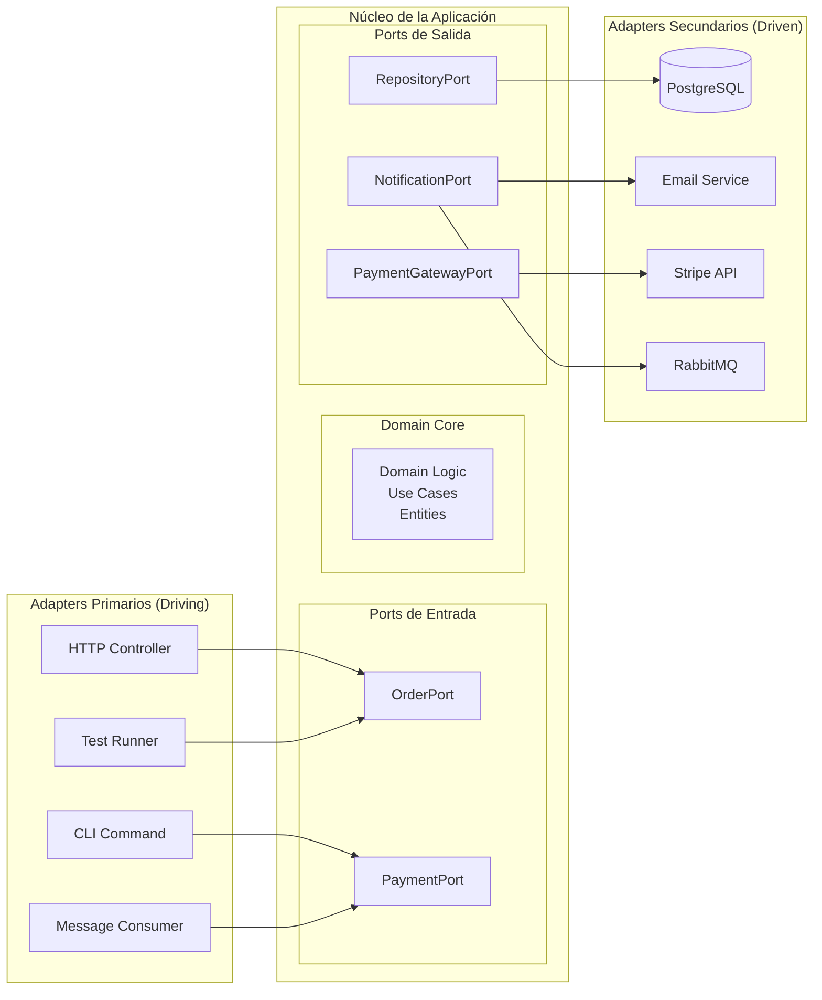

## Ports y Adapters Explicados

### Ports (Puertos)

Son **interfaces** que define el núcleo de la aplicación. Son contratos.

```typescript
// Puerto de ENTRADA (Input Port) - lo que la app expone
export interface IOrderApplicationService {
  createOrder(command: CreateOrderCommand): Promise<OrderId>;
  cancelOrder(command: CancelOrderCommand): Promise<void>;
  getOrderStatus(query: OrderStatusQuery): Promise<OrderStatus>;
}

// Puerto de SALIDA (Output Port) - lo que la app necesita
export interface IOrderRepository {
  save(order: Order): Promise<void>;
  findById(id: OrderId): Promise<Order | null>;
  findByCustomerId(customerId: CustomerId): Promise<Order[]>;
}

export interface IPaymentGateway {
  charge(amount: Money, customerId: string): Promise<PaymentResult>;
  refund(paymentId: string): Promise<void>;
}

export interface INotificationService {
  sendOrderConfirmation(order: Order, customer: Customer): Promise<void>;
}
```

### Adapters (Adaptadores)

Son **implementaciones** de los ports. Viven fuera del núcleo.

```typescript
// Adapter PRIMARIO - expone el puerto de entrada via HTTP
@Controller("orders")
export class OrderHttpAdapter {
  constructor(
    private readonly orderService: IOrderApplicationService, // El Port
  ) {}

  @Post()
  async createOrder(@Body() dto: CreateOrderDto) {
    const orderId = await this.orderService.createOrder(
      new CreateOrderCommand(dto.customerId, dto.items),
    );
    return { id: orderId.value };
  }
}

// Adapter SECUNDARIO - implementa el puerto de salida con Stripe
@Injectable()
export class StripePaymentAdapter implements IPaymentGateway {
  private stripe = new Stripe(process.env.STRIPE_KEY);

  async charge(amount: Money, customerId: string): Promise<PaymentResult> {
    const intent = await this.stripe.paymentIntents.create({
      amount: amount.inCents(),
      currency: amount.currency,
      customer: customerId,
    });
    return new PaymentResult(intent.id, intent.status);
  }
}

// Adapter SECUNDARIO - implementa el puerto de salida con TypeORM
@Injectable()
export class PostgresOrderRepository implements IOrderRepository {
  async save(order: Order): Promise<void> {
    // Implementación con TypeORM
  }
}
```

## Hexagonal vs Clean Architecture vs Layered

|                    | Layered                     | Clean Architecture               | Hexagonal                     |
| ------------------ | --------------------------- | -------------------------------- | ----------------------------- |
| **Foco**           | Separar por tipo técnico    | Separar por nivel de abstracción | Separar dominio de tecnología |
| **Test**           | Difícil sin infraestructura | Posible con mocks                | Muy fácil (swap adapters)     |
| **Cambiar DB**     | Requiere refactoring        | Implementar nueva interface      | Implementar nuevo adapter     |
| **Dirección dep.** | Top-down                    | Hacia adentro                    | Hacia el núcleo               |
| **Complejidad**    | Baja                        | Alta                             | Media                         |

## Caso Práctico: Sistema de Notificaciones

```typescript
// PORT: El dominio solo conoce esta interface
export interface INotificationPort {
  send(notification: Notification): Promise<void>;
}

// DOMAIN USE CASE: Completamente ignorante de la tecnología
export class SendOrderConfirmationUseCase {
  constructor(private readonly notificationPort: INotificationPort) {}

  async execute(order: Order, customer: Customer): Promise<void> {
    const notification = Notification.orderConfirmation(order, customer);
    await this.notificationPort.send(notification);
  }
}

// ADAPTER 1: SendGrid Email
export class SendGridAdapter implements INotificationPort {
  async send(notification: Notification): Promise<void> {
    await sendgrid.send({
      to: notification.recipient.email,
      subject: notification.subject,
      html: notification.body,
    });
  }
}

// ADAPTER 2: Twilio SMS
export class TwilioAdapter implements INotificationPort {
  async send(notification: Notification): Promise<void> {
    await twilio.messages.create({
      to: notification.recipient.phone,
      body: notification.body,
    });
  }
}

// ADAPTER 3: Test (sin efectos secundarios)
export class InMemoryNotificationAdapter implements INotificationPort {
  public sentNotifications: Notification[] = [];

  async send(notification: Notification): Promise<void> {
    this.sentNotifications.push(notification);
  }
}
```

---

# 5. Domain-Driven Design (DDD) {#5-ddd}

## ¿Qué es DDD?

Domain-Driven Design, propuesto por Eric Evans en su libro de 2003, es un enfoque de desarrollo donde:

> **El modelo de dominio (cómo el negocio funciona) es el centro del diseño del software, y el lenguaje del negocio se convierte en el lenguaje del código.**

DDD tiene dos niveles:

- **Strategic Design**: Cómo organizar el sistema a gran escala
- **Tactical Design**: Cómo implementar el código dentro de cada módulo

## Strategic Design

### Bounded Contexts (Contextos Acotados)

Un Bounded Context es un límite semántico dentro del cual un modelo de dominio específico aplica.

**Ejemplo E-commerce:**

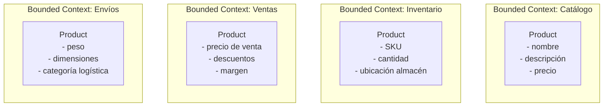

**¡El mismo "Producto" tiene diferentes modelos en cada contexto!** Esta es la idea clave.

### Ubiquitous Language (Lenguaje Ubicuo)

El lenguaje del negocio debe ser el lenguaje del código. Sin traducción.

```typescript
// ❌ MAL: Lenguaje técnico, no del negocio
class CartItemManager {
  addProduct(userId: string, productId: string, qty: number) {}
  removeProduct(userId: string, productId: string) {}
  calculateCartValue(userId: string): number {}
}

// ✅ BIEN: Lenguaje del dominio de e-commerce
class ShoppingCart {
  addItem(product: Product, quantity: Quantity): void {}
  removeItem(productId: ProductId): void {}
  calculateTotal(): Money {}
  applyDiscount(coupon: DiscountCoupon): void {}
  checkout(): Order {}
}
```

### Context Map

Define las relaciones entre Bounded Contexts:

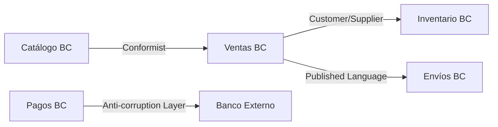

| Relación                  | Significado                                                                   |
| ------------------------- | ----------------------------------------------------------------------------- |
| **Customer/Supplier**     | Un BC es cliente del otro (el supplier prioriza las necesidades del customer) |
| **Conformist**            | Un BC adopta el modelo del otro sin filtro                                    |
| **Anti-corruption Layer** | Un BC traduce el modelo externo al suyo propio                                |
| **Published Language**    | Un BC expone un lenguaje formal que otros consumen                            |
| **Shared Kernel**         | Dos BCs comparten parte del modelo (¡peligroso!)                              |

## Tactical Design

### Aggregates (Agregados)

Un Aggregate es un grupo de objetos que se tratan como una unidad para propósitos de cambio de datos. Tiene un **Aggregate Root** que controla el acceso.

```typescript
// Order es el Aggregate Root
export class Order {
  private readonly id: OrderId;
  private readonly customerId: CustomerId;
  private items: OrderItem[] = []; // Objetos dentro del aggregate
  private status: OrderStatus;
  private readonly createdAt: Date;

  // REGLA: Solo el Aggregate Root puede ser referenciado externamente
  // Los OrderItems no se acceden directamente desde afuera

  addItem(productId: ProductId, price: Money, quantity: Quantity): void {
    // Invariante: no se puede agregar items a una orden confirmada
    this.ensureOrderIsPending();

    const existingItem = this.items.find((i) => i.productId.equals(productId));
    if (existingItem) {
      existingItem.increaseQuantity(quantity);
    } else {
      this.items.push(new OrderItem(productId, price, quantity));
    }
  }

  // Invariante de negocio encapsulada en el aggregate
  private ensureOrderIsPending(): void {
    if (this.status !== OrderStatus.PENDING) {
      throw new OrderCannotBeModifiedException(this.id);
    }
  }
}
```

### Entities vs Value Objects

|                 | Entity          | Value Object               |
| --------------- | --------------- | -------------------------- |
| **Identidad**   | Tiene ID único  | Definido por sus atributos |
| **Mutabilidad** | Puede cambiar   | Siempre inmutable          |
| **Comparación** | Por ID          | Por valor                  |
| **Ejemplo**     | Customer, Order | Money, Address, Email      |

```typescript
// Value Object: Money
export class Money {
  private constructor(
    private readonly amount: number,
    private readonly currency: string,
  ) {
    if (amount < 0) throw new Error("Amount cannot be negative");
  }

  static of(amount: number, currency: string): Money {
    return new Money(amount, currency);
  }

  add(other: Money): Money {
    if (!this.currency === other.currency) throw new Error("Currency mismatch");
    return new Money(this.amount + other.amount, this.currency); // Nuevo objeto!
  }

  equals(other: Money): boolean {
    return this.amount === other.amount && this.currency === other.currency;
  }

  // Value Objects son inmutables - nunca exponer setters
}

// Entity: Customer
export class Customer {
  constructor(
    private readonly id: CustomerId, // ID único
    private name: CustomerName,
    private email: Email,
  ) {}

  changeName(newName: CustomerName): void {
    this.name = newName; // Puede mutar, mantiene su identidad por ID
  }

  equals(other: Customer): boolean {
    return this.id.equals(other.id); // Comparación por ID
  }
}
```

### Domain Events (Eventos de Dominio)

Representan algo importante que ocurrió en el dominio.

```typescript
// Domain Event: algo que ya ocurrió (pasado)
export class OrderPlacedEvent {
  readonly occurredAt: Date = new Date();

  constructor(
    public readonly orderId: OrderId,
    public readonly customerId: CustomerId,
    public readonly totalAmount: Money,
  ) {}
}

// El Aggregate emite eventos
export class Order {
  private domainEvents: DomainEvent[] = [];

  place(): void {
    this.ensureOrderIsPending();
    this.status = OrderStatus.PLACED;

    // Emite el evento - no sabe quién lo escucha
    this.addDomainEvent(
      new OrderPlacedEvent(this.id, this.customerId, this.calculateTotal()),
    );
  }

  pullDomainEvents(): DomainEvent[] {
    const events = [...this.domainEvents];
    this.domainEvents = [];
    return events;
  }
}
```

## ¿Cuándo usar DDD?

```
✅ DDD es apropiado cuando:
   - El dominio es complejo y los expertos del negocio tienen conocimiento profundo
   - Múltiples equipos trabajan en diferentes partes del sistema
   - Los requisitos de negocio son el principal driver de complejidad
   - El sistema va a evolucionar durante años

❌ DDD es overkill cuando:
   - Es un CRUD simple (formularios que guardan datos)
   - El equipo es pequeño y el dominio es simple
   - El tiempo de lanzamiento es más importante que la estructura
   - No tienes acceso a expertos del dominio
```

---

# 6. Microservicios {#6-microservicios}

## La Promesa (y la Realidad) de los Microservicios

Los microservicios fueron adoptados masivamente en los 2010s. La promesa era enorme. La realidad es más matizada.

> **Microservicios**: Una arquitectura donde la aplicación se construye como un conjunto de servicios pequeños, independientes, cada uno corriendo en su propio proceso y comunicándose via APIs o mensajes.

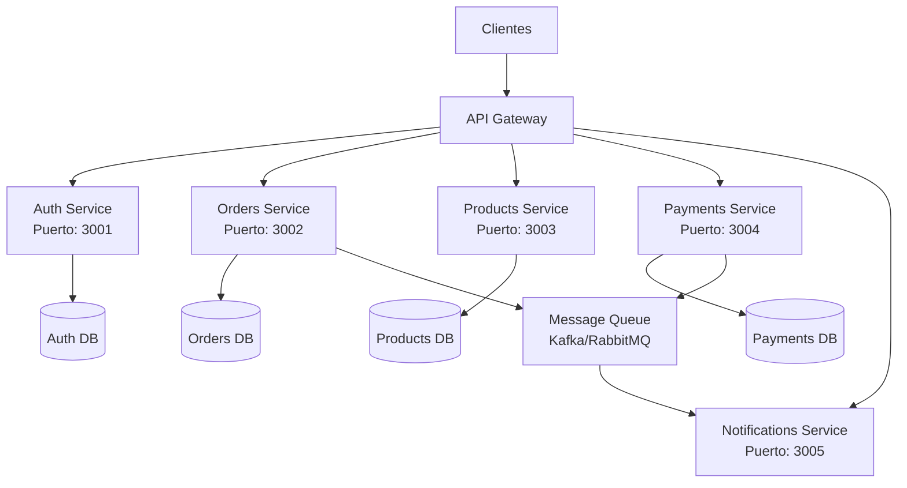

## Comunicación entre Servicios

### Síncrona (Request/Response)

```typescript
// HTTP REST (servicio de orders llama a products)
@Injectable()
export class OrderService {
  constructor(private readonly httpClient: HttpService) {}

  async createOrder(command: CreateOrderCommand): Promise<Order> {
    // Llamada síncrona al servicio de productos
    const product = await this.httpClient
      .get(`http://products-service/products/${command.productId}`)
      .toPromise();

    // Si products-service está caído, esta llamada falla
    // y el request del usuario falla también
    return this.buildOrder(product, command);
  }
}
```

**Problema:** Acoplamiento temporal. Si el Products Service está caído, el Orders Service también falla.

### Asíncrona (Event-Driven)

```typescript
// Orders Service publica un evento y sigue su vida
@Injectable()
export class OrderService {
  constructor(private readonly eventBus: IEventBus) {}

  async createOrder(command: CreateOrderCommand): Promise<OrderId> {
    const order = Order.create(command);
    await this.orderRepository.save(order);

    // Publica el evento - no espera respuesta
    await this.eventBus.publish(new OrderCreatedEvent(order));

    return order.id;
  }
}

// Inventory Service escucha y reacciona
@EventsHandler(OrderCreatedEvent)
export class OrderCreatedHandler {
  async handle(event: OrderCreatedEvent): Promise<void> {
    await this.inventoryService.reserveStock(event.items);
  }
}
```

## Patrones Críticos de Microservicios

### 1. API Gateway

El punto de entrada único. Maneja:

- Autenticación/Autorización
- Rate limiting
- Load balancing
- Request routing
- SSL termination

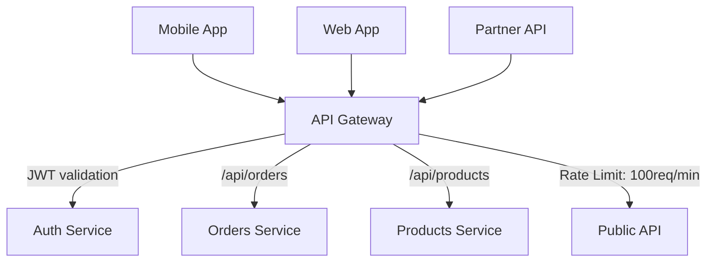

### 2. Circuit Breaker (Disyuntor)

Previene cascadas de fallos.

```typescript
// Sin Circuit Breaker: un fallo en cascade destruye todo
// Con Circuit Breaker:
@Injectable()
export class ProductClient {
  private circuitBreaker = new CircuitBreaker(this.fetchProduct, {
    timeout: 3000, // 3 segundos máximo
    errorThresholdPercentage: 50, // Abre si >50% de requests fallan
    resetTimeout: 30000, // Intenta de nuevo en 30 segundos
  });

  async getProduct(id: string): Promise<Product | null> {
    try {
      return await this.circuitBreaker.fire(id);
    } catch (error) {
      // Circuit está abierto - retorna fallback
      return this.getFallbackProduct(id);
    }
  }
}
```

**Estados del Circuit Breaker:**

```
CLOSED → Funciona normal, monitorea errores
   ↓ (demasiados errores)
OPEN → No llama al servicio, retorna fallback inmediato
   ↓ (después de timeout)
HALF-OPEN → Permite algunos requests para probar
   ↓ (si funciona)
CLOSED → De vuelta a normal
```

### 3. Saga Pattern (Transacciones Distribuidas)

Cuando necesitas coordinar transacciones entre múltiples servicios:

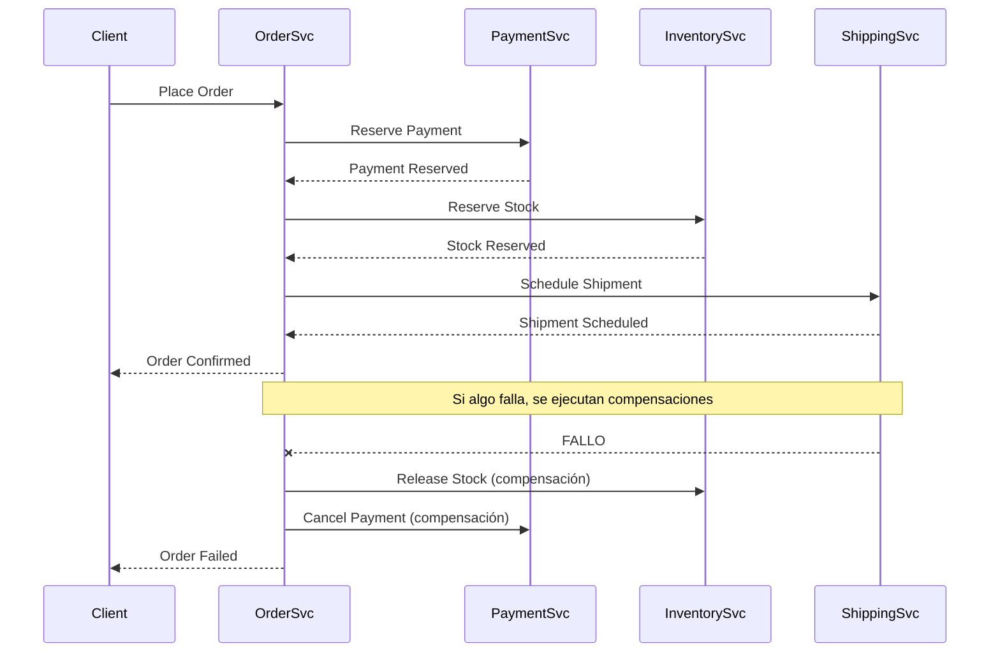

### 4. Service Discovery

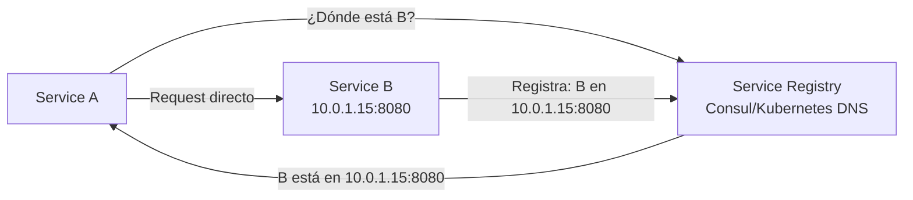

## La Complejidad Oculta de los Microservicios

Antes de elegir microservicios, considera:

| Problema                 | Solución Necesaria              | Overhead    |
| ------------------------ | ------------------------------- | ----------- |
| Distributed tracing      | Jaeger, Zipkin, OpenTelemetry   | Alto        |
| Service mesh             | Istio, Linkerd                  | Muy Alto    |
| Distributed transactions | Saga Pattern, 2PC               | Alto        |
| Data consistency         | Eventual consistency            | Complejidad |
| Testing                  | Contract tests, E2E distribuido | Alto        |
| Deployment               | Kubernetes, Docker              | Muy Alto    |
| Debugging                | Log correlation, tracing        | Alto        |
| Network latency          | Caché, async                    | Diseño      |

> **La pregunta real no es "¿microservicios o monolito?" sino "¿estamos listos para operar sistemas distribuidos?"**

---

# 7. Arquitectura Orientada a Eventos {#7-eventos}

## El Paradigma Event-Driven

En una arquitectura orientada a eventos, los componentes se comunican produciendo y consumiendo eventos, en lugar de llamarse directamente.

```
ANTES (acoplado):
ServiceA.doSomething() → ServiceB.doSomethingElse() → ServiceC.finish()

DESPUÉS (desacoplado):
ServiceA publica "OrderCreated" → [Bus de Mensajes]
                                        ↓
                    ServiceB reacciona a "OrderCreated"
                    ServiceC reacciona a "OrderCreated"
                    ServiceD reacciona a "OrderCreated"
```

## Componentes del Ecosistema

### Message Brokers: Kafka vs RabbitMQ

|                 | Apache Kafka                         | RabbitMQ                     |
| --------------- | ------------------------------------ | ---------------------------- |
| **Modelo**      | Log distribuido                      | Message broker tradicional   |
| **Retención**   | Largo plazo (días/semanas/siempre)   | Hasta que se consume         |
| **Replay**      | ✅ Puede repetir mensajes del pasado | ❌ No                        |
| **Throughput**  | Millones msg/segundo                 | Cientos de miles msg/segundo |
| **Ordering**    | Garantizado por partición            | Por queue                    |
| **Use Case**    | Event sourcing, analytics, streaming | Task queues, RPC             |
| **Complejidad** | Alta                                 | Media                        |

### Kafka: Anatomía

```
Topic: "order-events"
├── Partition 0: [OrderCreated:1] → [OrderConfirmed:2] → [OrderShipped:5]
├── Partition 1: [OrderCreated:3] → [OrderCancelled:4]
└── Partition 2: [OrderCreated:6] → [OrderConfirmed:7]

Consumer Group "inventory-service":
├── Consumer 0 → lee Partition 0
├── Consumer 1 → lee Partition 1
└── Consumer 2 → lee Partition 2

Consumer Group "notification-service":
└── Consumer 0 → lee TODAS las partitions (independiente del otro grupo)
```

## Event Sourcing

En lugar de guardar el estado actual, guardas todos los eventos que ocurrieron.

```typescript
// Estado tradicional en DB:
// orders tabla: { id: 1, status: "shipped", total: 100, updatedAt: ... }

// Event Sourcing - guardas los eventos:
const events = [
  { type: "OrderCreated",   payload: { items: [...], customerId: "x" }, timestamp: T1 },
  { type: "PaymentApplied", payload: { amount: 100, method: "card" },   timestamp: T2 },
  { type: "OrderConfirmed", payload: { confirmedBy: "system" },          timestamp: T3 },
  { type: "OrderShipped",   payload: { trackingNumber: "ABC123" },       timestamp: T4 },
];

// El estado actual se reconstruye reproduciendo los eventos
function rebuildOrderState(events: OrderEvent[]): Order {
  return events.reduce((order, event) => {
    switch (event.type) {
      case 'OrderCreated':   return order.applyCreated(event.payload);
      case 'PaymentApplied': return order.applyPayment(event.payload);
      case 'OrderConfirmed': return order.applyConfirmation(event.payload);
      case 'OrderShipped':   return order.applyShipment(event.payload);
    }
  }, Order.empty());
}
```

**Ventajas:**

- Auditoría completa e inmutable
- Capacidad de replay (reproducir eventos)
- Time travel debugging (ver el estado en cualquier momento del pasado)
- Múltiples proyecciones del mismo dato

## CQRS (Command Query Responsibility Segregation)

Separa las operaciones de escritura (Commands) de las de lectura (Queries).

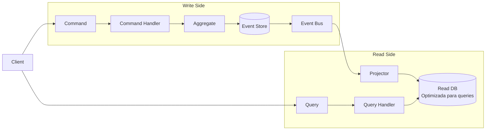

```typescript
// COMMAND SIDE: optimizado para escribir
export class CreateOrderCommandHandler {
  async handle(command: CreateOrderCommand): Promise<void> {
    const order = Order.create(command);
    const events = order.pullDomainEvents();
    await this.eventStore.save(events); // Guarda eventos, no estado
  }
}

// READ SIDE: optimizado para leer (desnormalizado para performance)
// Esta tabla puede estar completamente desnormalizada para lectura rápida
export interface OrderReadModel {
  orderId: string;
  customerName: string; // Desnormalizado desde Customer
  customerEmail: string; // Desnormalizado desde Customer
  totalAmount: number;
  status: string;
  itemCount: number;
  createdAt: Date;
  // Todo lo que el frontend necesita en una sola query
}
```

## Idempotencia

Fundamental en sistemas event-driven: procesar el mismo evento dos veces no debe causar efectos duplicados.

```typescript
@EventsHandler(PaymentProcessedEvent)
export class UpdateOrderStatusHandler {
  async handle(event: PaymentProcessedEvent): Promise<void> {
    // Verificar si ya procesamos este evento
    const alreadyProcessed = await this.idempotencyStore.hasBeenProcessed(
      event.eventId,
    );

    if (alreadyProcessed) {
      this.logger.log(`Event ${event.eventId} already processed, skipping`);
      return; // Idempotente: no hacemos nada
    }

    // Procesar el evento
    await this.orderService.markAsPaid(event.orderId);

    // Marcar como procesado
    await this.idempotencyStore.markAsProcessed(event.eventId);
  }
}
```

---

# 8. Arquitecturas Frontend {#8-frontend}

## El Espectro de Rendering

La decisión más importante en frontend moderno es **dónde y cuándo** se renderiza el HTML.

```
SSG          ISR          SSR          CSR/SPA
(más rápido) ←————————————————————→  (más dinámico)
Build Time   Build+Revalidate  Request Time  Browser Time
```

### Comparativa de Estrategias de Rendering

| Estrategia  | Cuándo renderiza     | TTFB       | SEO     | Datos frescos      | Uso ideal                   |
| ----------- | -------------------- | ---------- | ------- | ------------------ | --------------------------- |
| **CSR/SPA** | En el browser        | Lento      | ❌ Malo | ✅ Siempre         | Dashboards, apps privadas   |
| **SSR**     | En cada request      | Medio      | ✅      | ✅ Siempre         | E-commerce, feeds           |
| **SSG**     | En build time        | Rápido     | ✅      | ❌ Solo en rebuild | Blogs, docs, landing pages  |
| **ISR**     | Build + revalidación | Rápido     | ✅      | ⚠️ Eventual        | Catálogos, pricing          |
| **Edge**    | En el CDN            | Muy rápido | ✅      | ⚠️ Limitado        | Auth gates, personalización |

### Next.js como Plataforma Híbrida

```typescript
// SSG: Generado en build
export async function generateStaticParams() {
  const products = await getProducts();
  return products.map(p => ({ slug: p.slug }));
}

export default async function ProductPage({ params }) {
  const product = await getProduct(params.slug);  // Datos en build time
  return <ProductDetail product={product} />;
}

// ISR: SSG con revalidación automática
export const revalidate = 3600; // Revalidar cada hora

// SSR: Datos en cada request
export default async function Dashboard() {
  const data = await fetch('...', { cache: 'no-store' });  // Sin caché
  return <DashboardView data={data} />;
}
```

## Clean Architecture en Frontend

```
src/
├── domain/              # Reglas de negocio del frontend
│   ├── entities/
│   │   └── Cart.ts      # Lógica de carrito (no depende de React)
│   └── use-cases/
│       └── AddToCart.ts # Caso de uso puro
│
├── infrastructure/      # Implementaciones externas
│   ├── api/
│   │   └── CartApiRepository.ts
│   └── storage/
│       └── LocalStorageRepository.ts
│
└── presentation/        # React components, hooks, state
    ├── components/
    ├── hooks/
    │   └── useCart.ts   # Conecta UI con use cases
    └── pages/
```

## Microfrontends

Para equipos grandes, cada equipo es dueño de su propia aplicación frontend.

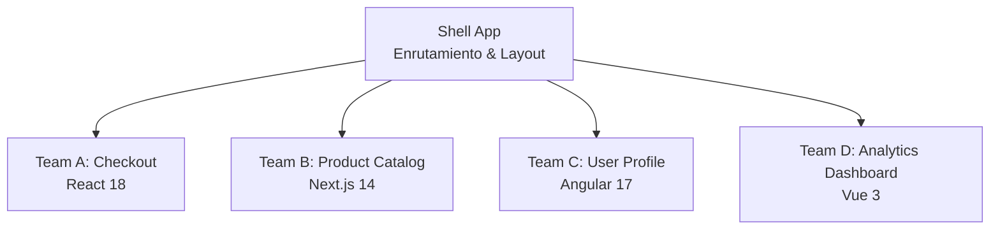

```typescript
// Module Federation (Webpack 5)
// Shell App webpack.config.js
new ModuleFederationPlugin({
  remotes: {
    checkout: 'checkout@https://checkout.myapp.com/remoteEntry.js',
    catalog:  'catalog@https://catalog.myapp.com/remoteEntry.js',
  },
});

// En el Shell App
const CheckoutApp = React.lazy(() => import('checkout/CheckoutApp'));

function App() {
  return (
    <Routes>
      <Route path="/checkout/*" element={
        <Suspense fallback={<Loading />}>
          <CheckoutApp />
        </Suspense>
      } />
    </Routes>
  );
}
```

## Arquitectura de Estado Escalable

```typescript
// Para apps enterprise: Zustand + React Query

// Server State: React Query (datos del servidor)
export function useOrders() {
  return useQuery({
    queryKey: ["orders"],
    queryFn: () => orderApi.getAll(),
    staleTime: 5 * 60 * 1000, // 5 minutos
  });
}

// Client State: Zustand (UI state)
const useUIStore = create<UIState>()(
  devtools(
    persist(
      (set) => ({
        sidebarOpen: false,
        toggleSidebar: () => set((s) => ({ sidebarOpen: !s.sidebarOpen })),

        selectedFilters: {},
        setFilter: (key, value) =>
          set((s) => ({
            selectedFilters: { ...s.selectedFilters, [key]: value },
          })),
      }),
      { name: "ui-storage" },
    ),
  ),
);
```

---

# 9. Cloud-Native Architecture {#9-cloud-native}

## ¿Qué es Cloud-Native?

Cloud-native no es "correr en la nube". Es **diseñar para la nube** desde el principio.

Los 4 pilares:

```
1. Microservicios     → Servicios pequeños e independientes
2. Containers         → Empaquetado estándar y portable
3. Orquestación       → Kubernetes gestiona el ciclo de vida
4. CI/CD Automático   → Deployments frecuentes y seguros
```

## Containers y Docker

```dockerfile
# Dockerfile multi-stage: imagen de producción pequeña y segura
FROM node:20-alpine AS builder
WORKDIR /app
COPY package*.json ./
RUN npm ci --only=production
COPY . .
RUN npm run build

FROM node:20-alpine AS production
WORKDIR /app
# Solo copiar lo necesario
COPY --from=builder /app/dist ./dist
COPY --from=builder /app/node_modules ./node_modules
# No correr como root
USER node
EXPOSE 3000
CMD ["node", "dist/main.js"]
```

## Kubernetes: El Orquestador

```yaml
# deployment.yaml
apiVersion: apps/v1
kind: Deployment
metadata:
  name: orders-service
spec:
  replicas: 3 # 3 instancias
  strategy:
    type: RollingUpdate # Zero-downtime deployment
    rollingUpdate:
      maxUnavailable: 1
      maxSurge: 1
  template:
    spec:
      containers:
        - name: orders-service
          image: myapp/orders:v2.3.1
          resources:
            requests:
              memory: "128Mi"
              cpu: "100m"
            limits:
              memory: "256Mi"
              cpu: "500m"
          readinessProbe: # ¿Listo para recibir tráfico?
            httpGet:
              path: /health
              port: 3000
            initialDelaySeconds: 10
          livenessProbe: # ¿Sigue vivo?
            httpGet:
              path: /health
              port: 3000

---
# Horizontal Pod Autoscaler
apiVersion: autoscaling/v2
kind: HorizontalPodAutoscaler
metadata:
  name: orders-service-hpa
spec:
  scaleTargetRef:
    name: orders-service
  minReplicas: 2
  maxReplicas: 20
  metrics:
    - type: Resource
      resource:
        name: cpu
        target:
          type: Utilization
          averageUtilization: 70 # Escala cuando CPU > 70%
```

## Serverless

```typescript
// AWS Lambda / Vercel Edge Function
// No gestionas servidores - solo código

export async function handler(event: APIGatewayEvent) {
  const { productId } = event.pathParameters;

  const product = await db.products.findById(productId);

  return {
    statusCode: 200,
    body: JSON.stringify(product),
  };
}

// Vercel Edge Function (corre en 30+ regiones globalmente)
export const config = { runtime: "edge" };

export default function handler(request: Request) {
  const country = request.headers.get("x-vercel-ip-country");

  return Response.json({
    message: `Hola desde ${country}!`,
    timestamp: Date.now(),
  });
}
```

## Infrastructure as Code

```typescript
// CDK (Cloud Development Kit) - Infraestructura en código TypeScript
export class OrdersServiceStack extends Stack {
  constructor(scope: Construct, id: string) {
    super(scope, id);

    // Base de datos
    const database = new rds.DatabaseInstance(this, "OrdersDB", {
      engine: rds.DatabaseInstanceEngine.postgres({
        version: rds.PostgresEngineVersion.VER_15,
      }),
      instanceType: ec2.InstanceType.of(
        ec2.InstanceClass.T3,
        ec2.InstanceSize.MEDIUM,
      ),
      multiAz: true,
      backupRetention: Duration.days(7),
    });

    // Servicio en ECS (contenedores)
    const service = new ecs.FargateService(this, "OrdersService", {
      cluster,
      taskDefinition: new ecs.FargateTaskDefinition(this, "Task", {
        cpu: 512,
        memoryLimitMiB: 1024,
      }),
      desiredCount: 3,
    });

    // Auto-scaling
    const scaling = service.autoScaleTaskCount({ maxCapacity: 20 });
    scaling.scaleOnCpuUtilization("CpuScaling", {
      targetUtilizationPercent: 70,
    });
  }
}
```

---

# 10. Arquitecturas AI-Native {#10-ai-native}

## La Nueva Realidad: Software con IA en el Centro

El software de 2024+ ya no trata la IA como un feature adicional. La IA es la arquitectura.

## RAG: Retrieval-Augmented Generation

La arquitectura más importante para aplicaciones de IA empresarial.

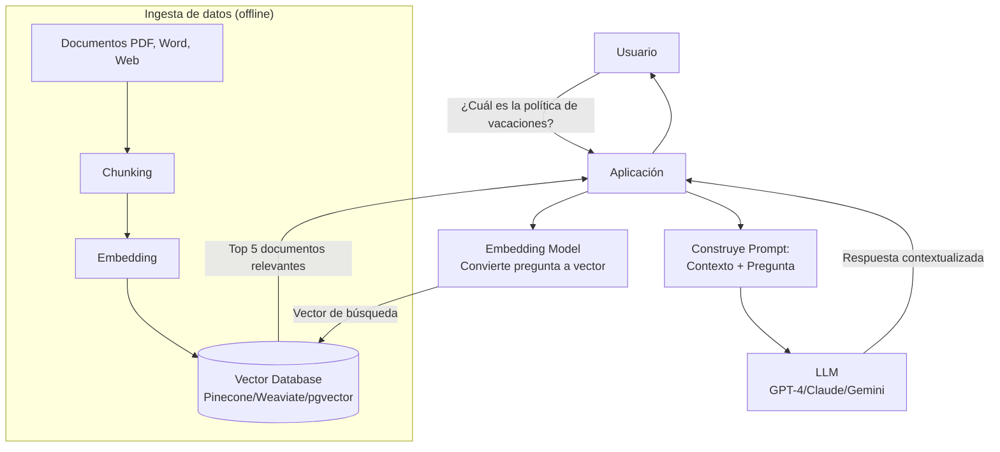

```typescript
// Implementación RAG con TypeScript
export class RAGService {
  async query(userQuestion: string): Promise<string> {
    // 1. Convertir pregunta a embedding
    const questionVector = await this.embeddingModel.embed(userQuestion);

    // 2. Buscar documentos similares en la base vectorial
    const relevantDocs = await this.vectorDB.similaritySearch(questionVector, {
      topK: 5,
      minSimilarity: 0.7,
    });

    // 3. Construir prompt con contexto
    const context = relevantDocs.map((d) => d.content).join("\n\n");
    const prompt = `
      Contexto relevante de nuestra base de conocimiento:
      ${context}
      
      Pregunta del usuario: ${userQuestion}
      
      Responde basándote únicamente en el contexto proporcionado.
    `;

    // 4. Llamar al LLM
    const response = await this.llm.generate(prompt);
    return response;
  }
}
```

## AI Agents y Multi-Agent Systems

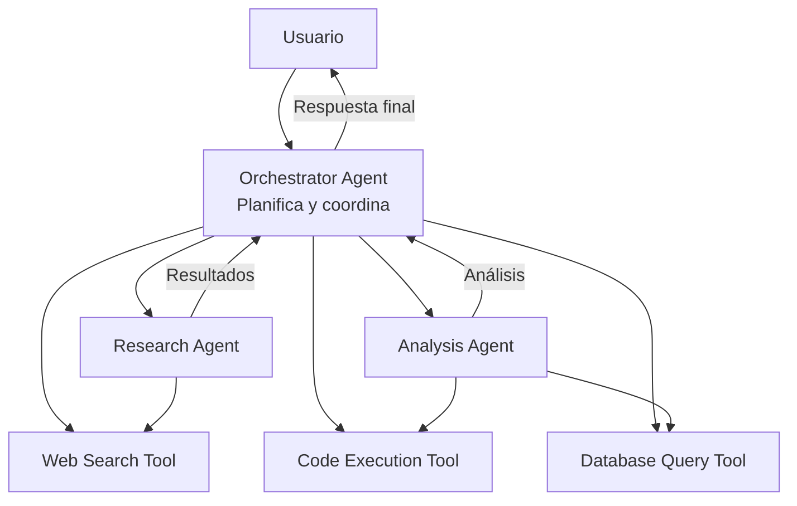

```typescript
// AI Agent con Tool Calling
export class ResearchAgent {
  private tools = [
    {
      name: "web_search",
      description: "Search the web for current information",
      parameters: {
        type: "object",
        properties: {
          query: { type: "string", description: "Search query" },
        },
      },
    },
    {
      name: "save_to_database",
      description: "Save research findings to database",
      parameters: {
        type: "object",
        properties: {
          data: { type: "object" },
        },
      },
    },
  ];

  async run(task: string): Promise<string> {
    const messages = [{ role: "user", content: task }];

    while (true) {
      const response = await this.llm.complete({
        messages,
        tools: this.tools,
      });

      // Si el modelo quiere usar una tool
      if (response.tool_calls) {
        for (const toolCall of response.tool_calls) {
          const result = await this.executeTool(
            toolCall.name,
            toolCall.arguments,
          );
          messages.push({ role: "tool", content: result });
        }
        continue; // El modelo procesa los resultados
      }

      // El modelo terminó - tiene una respuesta final
      return response.content;
    }
  }
}
```

## MCP: Model Context Protocol

El estándar emergente (2024) para conectar LLMs con herramientas externas.

```typescript
// Servidor MCP - expone herramientas al LLM
import { Server } from "@modelcontextprotocol/sdk/server/index.js";

const server = new Server({
  name: "company-data-server",
  version: "1.0.0",
});

// Tool que el LLM puede llamar
server.setRequestHandler(CallToolRequestSchema, async (request) => {
  if (request.params.name === "get_customer_data") {
    const { customerId } = request.params.arguments;
    const customer = await db.customers.findById(customerId);

    return {
      content: [
        {
          type: "text",
          text: JSON.stringify(customer),
        },
      ],
    };
  }
});
```

---

# 11. Escalabilidad y System Design {#11-escalabilidad}

## Los Fundamentos de Escalar

```
Escalar = Manejar más trabajo con el mismo nivel de calidad
```

### Load Balancing

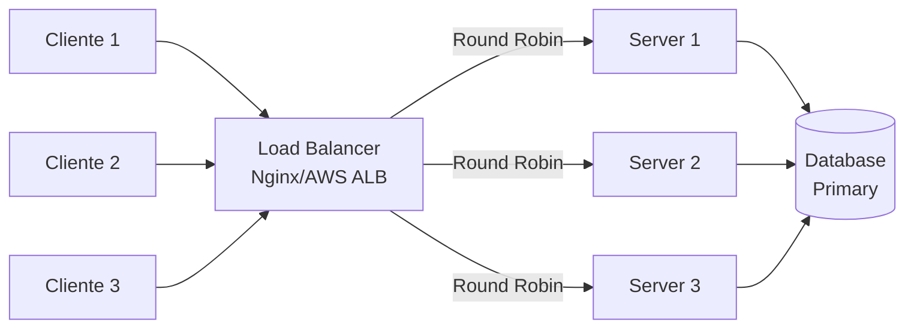

**Algoritmos de Load Balancing:**
| Algoritmo | Descripción | Cuándo usar |
|-----------|-------------|-------------|
| Round Robin | Turno rotativo | Requests homogéneos |
| Least Connections | Al servidor con menos carga | Requests variables |
| IP Hash | Mismo cliente → mismo servidor | Sesiones con estado |
| Weighted | Servidores con diferente capacidad | Hardware heterogéneo |

### Caching Strategy

```typescript
// Cache-Aside Pattern (el más común)
export class ProductService {
  async getProduct(id: string): Promise<Product> {
    // 1. Buscar en caché
    const cached = await this.redis.get(`product:${id}`);
    if (cached) return JSON.parse(cached);

    // 2. Cache miss - buscar en DB
    const product = await this.db.products.findById(id);

    // 3. Guardar en caché con TTL
    await this.redis.setex(
      `product:${id}`,
      3600, // TTL: 1 hora
      JSON.stringify(product),
    );

    return product;
  }

  async updateProduct(id: string, data: UpdateProductDto): Promise<Product> {
    const product = await this.db.products.update(id, data);

    // CRÍTICO: Invalidar caché al actualizar
    await this.redis.del(`product:${id}`);

    return product;
  }
}
```

**Estrategias de caché:**

| Estrategia    | Cuándo usar                  | Riesgo                  |
| ------------- | ---------------------------- | ----------------------- |
| Cache-Aside   | Datos de lectura frecuente   | Cache stampede          |
| Write-Through | Consistencia crítica         | Latencia en escritura   |
| Write-Behind  | Alto throughput de escritura | Pérdida de datos si cae |
| Read-Through  | Simplificar el código        | Primer request lento    |

### Database Scaling

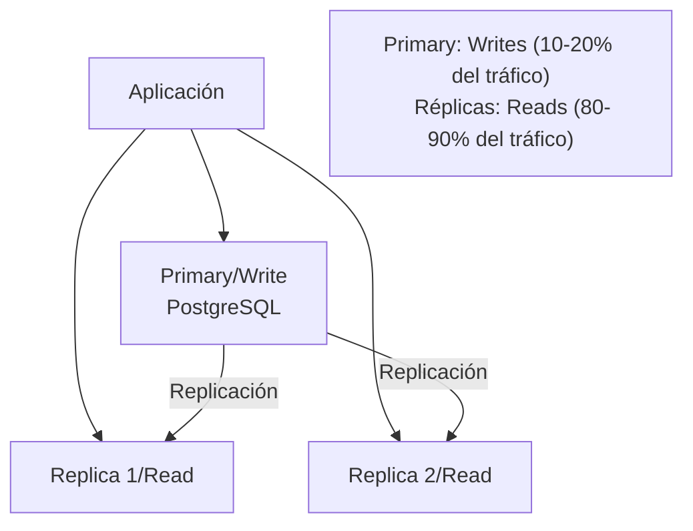

**Sharding (cuando la replicación no alcanza):**

```
Base de datos de Users:
Shard 0: userId % 4 == 0  → users_0 (IDs 0, 4, 8, ...)
Shard 1: userId % 4 == 1  → users_1 (IDs 1, 5, 9, ...)
Shard 2: userId % 4 == 2  → users_2 (IDs 2, 6, 10, ...)
Shard 3: userId % 4 == 3  → users_3 (IDs 3, 7, 11, ...)
```

## System Design: WhatsApp

**Requisitos:** 2 mil millones de usuarios, mensajes en tiempo real, alta disponibilidad.

```mermaid
graph TD
    Client[Cliente WhatsApp] -->|WebSocket| WS[WebSocket Servers<br/>Mantienen conexión persistente]

    WS --> MR[Message Router<br/>Determina destino]
    MR --> MQ[Message Queue<br/>Kafka]

    MQ --> MS[Message Service]
    MS --> MDB[(Message DB<br/>Cassandra - Alta escritura)]
    MS --> WS2[WebSocket Server<br/>del destinatario]
    WS2 --> Recipient[Destinatario]

    MQ --> Push[Push Notification Service]
    Push -->|Offline users| APNS[APNs/FCM]

    Client -->|Media files| CDN[CDN/S3<br/>Imágenes y videos]

    subgraph "User Status"
        WS --> Presence[Presence Service<br/>Redis - "visto a las 2:00pm"]
    end
```

**Decisiones clave:**

- **Cassandra** para mensajes: Optimizada para escritura masiva, escalabilidad horizontal
- **WebSockets** para tiempo real: Conexión persistente bidireccional
- **CDN** para media: Imágenes/videos no pasan por los servidores
- **Redis** para presencia: Datos efímeros de "en línea/offline"

---

# 12. Bases de Datos y Arquitecturas de Datos {#12-databases}

## El Mapa Completo de Bases de Datos

```
                   ¿Necesitas ACID completo?
                          │
              Sí ─────────┴──────── No
              │                      │
        ¿Relacional?          ¿Qué tipo de datos?
              │                      │
    Sí ───────┴─── No      ┌────────┬────────┬────────┐
    │              │        │        │        │        │
PostgreSQL    NewSQL    Documento  Clave/Val  Wide Col  Grafos
MySQL         (Spanner)  MongoDB   Redis      Cassandra Neo4j
              CockroachDB          DynamoDB   HBase
```

## SQL vs NoSQL: La Guía Real

|                   | PostgreSQL               | MongoDB            | Redis            | Cassandra         | Elasticsearch       |
| ----------------- | ------------------------ | ------------------ | ---------------- | ----------------- | ------------------- |
| **Modelo**        | Relacional               | Documento          | K/V              | Wide Column       | Inverted Index      |
| **ACID**          | ✅ Full                  | ✅ Por doc         | ⚠️ Limitado      | ❌ Eventual       | ❌ No               |
| **Escalabilidad** | Vertical + Read replicas | Horizontal         | Cluster          | Horizontal masivo | Horizontal          |
| **Latencia**      | Media                    | Media              | Microsegundos    | Baja              | Media               |
| **Queries**       | SQL complejo             | Query operators    | Get/Set/Commands | CQL (limitado)    | Full-text search    |
| **Ideal para**    | Transacciones, analytics | Contenido variable | Caché, sesiones  | IoT, logs, series | Búsqueda, analytics |

## PostgreSQL: El Rey para la Mayoría

```sql
-- Indexing estratégico
CREATE INDEX CONCURRENTLY idx_orders_customer_status
ON orders(customer_id, status)
WHERE status != 'completed';  -- Partial index - más pequeño y rápido

-- Particionamiento por tiempo
CREATE TABLE orders (
    id BIGSERIAL,
    customer_id UUID,
    created_at TIMESTAMP
) PARTITION BY RANGE (created_at);

CREATE TABLE orders_2024_q1 PARTITION OF orders
    FOR VALUES FROM ('2024-01-01') TO ('2024-04-01');
CREATE TABLE orders_2024_q2 PARTITION OF orders
    FOR VALUES FROM ('2024-04-01') TO ('2024-07-01');

-- Las queries a un rango de fechas solo tocan la partición relevante

-- EXPLAIN ANALYZE - tu mejor amigo
EXPLAIN (ANALYZE, BUFFERS, FORMAT JSON)
SELECT o.*, c.name
FROM orders o
JOIN customers c ON c.id = o.customer_id
WHERE o.status = 'pending' AND o.created_at > NOW() - INTERVAL '7 days';
```

## Cuándo Usar Cada Base de Datos

| Caso de Uso                        | Solución Recomendada | Por qué                          |
| ---------------------------------- | -------------------- | -------------------------------- |
| Transacciones financieras          | PostgreSQL           | ACID, consistencia               |
| Perfil de usuario, contenido       | MongoDB              | Schema flexible                  |
| Sesiones, caché                    | Redis                | Sub-ms latencia                  |
| Feed de actividad (alta escritura) | Cassandra            | Escala horizontal masiva         |
| Búsqueda de texto completo         | Elasticsearch        | Índice invertido optimizado      |
| Embeddings de IA                   | pgvector / Pinecone  | Búsqueda por similitud vectorial |
| Grafos sociales                    | Neo4j                | Traversal eficiente              |
| Analytics en tiempo real           | ClickHouse           | OLAP columnar                    |

---

# 13. Arquitecturas Backend Modernas {#13-backend}

## REST vs GraphQL vs gRPC

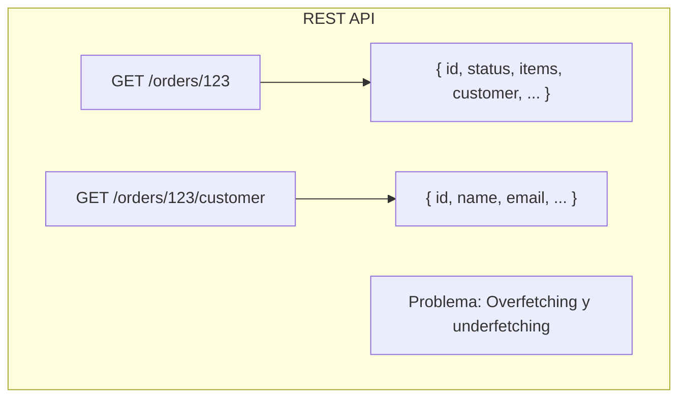

```graphql
# GraphQL: El cliente pide exactamente lo que necesita
query GetOrderWithCustomer {
  order(id: "123") {
    id
    status
    items {
      productName
      quantity
    }
    customer {
      name
      email
    }
  }
}
# Un solo request, exactamente los campos necesarios
```

```protobuf
// gRPC: Contratos binarios de alta performance
syntax = "proto3";

service OrderService {
  rpc CreateOrder (CreateOrderRequest) returns (Order);
  rpc GetOrder (GetOrderRequest) returns (Order);
  rpc StreamOrderUpdates (GetOrderRequest) returns (stream OrderUpdate);
}

message Order {
  string id = 1;
  string customer_id = 2;
  repeated OrderItem items = 3;
  OrderStatus status = 4;
}
```

|                     | REST                  | GraphQL               | gRPC                         |
| ------------------- | --------------------- | --------------------- | ---------------------------- |
| **Protocolo**       | HTTP/1.1              | HTTP/1.1              | HTTP/2                       |
| **Payload**         | JSON/XML              | JSON                  | Protocol Buffers (binario)   |
| **Performance**     | Buena                 | Buena                 | Excelente                    |
| **Flexibilidad**    | Fija por endpoint     | Alta (cliente decide) | Fija por contrato            |
| **Streaming**       | ⚠️ Server-Sent Events | ⚠️ Subscriptions      | ✅ Nativo                    |
| **Browser support** | ✅                    | ✅                    | ⚠️ Requiere grpc-web         |
| **Ideal para**      | APIs públicas         | BFF, apps complejas   | Comunicación inter-servicios |

## BFF Pattern (Backend for Frontend)

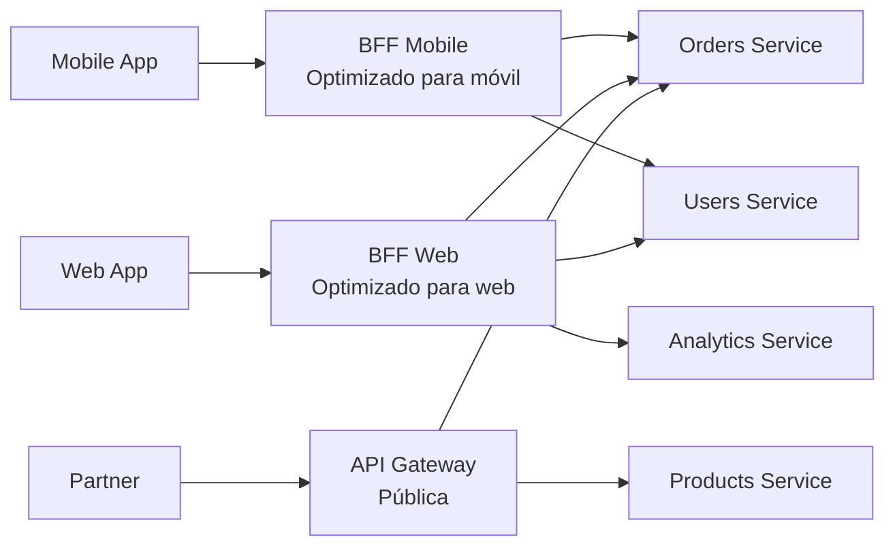

## Autenticación y Autorización

```typescript
// JWT Authentication Flow
export class AuthService {
  async login(credentials: LoginDto): Promise<AuthTokens> {
    const user = await this.validateCredentials(credentials);

    const accessToken = this.jwt.sign(
      { sub: user.id, role: user.role },
      { expiresIn: '15m' }     // Corta duración
    );

    const refreshToken = this.jwt.sign(
      { sub: user.id, type: 'refresh' },
      { expiresIn: '30d' }     // Larga duración, guardado seguro
    );

    // Guardar refresh token hash en DB (para revocación)
    await this.tokenRepository.save({
      userId: user.id,
      tokenHash: await bcrypt.hash(refreshToken, 10),
      expiresAt: addDays(new Date(), 30),
    });

    return { accessToken, refreshToken };
  }
}

// RBAC (Role-Based Access Control)
@Injectable()
export class PermissionsGuard implements CanActivate {
  canActivate(context: ExecutionContext): boolean {
    const requiredPermissions = this.reflector.get<Permission[]>(
      'permissions',
      context.getHandler()
    );
    const user = context.switchToHttp().getRequest().user;

    return requiredPermissions.every(permission =>
      user.permissions.includes(permission)
    );
  }
}

// Uso
@Get('admin/orders')
@RequirePermissions(Permission.READ_ALL_ORDERS)
async getAllOrders() { ... }
```

---

# 14. Observabilidad y Confiabilidad {#14-observabilidad}

## Los 3 Pilares de la Observabilidad

```
LOGS       → ¿Qué pasó?         "ERROR: Payment failed for order 123"
METRICS    → ¿Cuánto?            "p99 latency: 450ms, error rate: 0.1%"
TRACES     → ¿Por qué / dónde?  "Request tardó 450ms: 400ms en DB query"
```

### OpenTelemetry: El Estándar

```typescript
// Instrumentación con OpenTelemetry
import { trace, metrics } from "@opentelemetry/api";

const tracer = trace.getTracer("orders-service");
const meter = metrics.getMeter("orders-service");

// Métricas
const orderCounter = meter.createCounter("orders.created.total");
const orderProcessingTime = meter.createHistogram("orders.processing.duration");

export class OrderService {
  async createOrder(command: CreateOrderCommand): Promise<Order> {
    // Span para tracing distribuido
    return tracer.startActiveSpan("createOrder", async (span) => {
      span.setAttribute("order.customerId", command.customerId);

      const startTime = Date.now();

      try {
        const order = await this.processOrder(command);

        // Métrica de éxito
        orderCounter.add(1, { status: "success", channel: command.channel });
        orderProcessingTime.record(Date.now() - startTime, {
          status: "success",
        });

        span.setStatus({ code: SpanStatusCode.OK });
        return order;
      } catch (error) {
        // Métrica de error
        orderCounter.add(1, { status: "error", error: error.name });
        span.recordException(error);
        span.setStatus({ code: SpanStatusCode.ERROR });
        throw error;
      } finally {
        span.end();
      }
    });
  }
}
```

## SRE: Site Reliability Engineering

### SLI, SLO y SLA

```
SLI (Service Level Indicator): La métrica que mides
Ejemplo: "Porcentaje de requests con latencia < 200ms"

SLO (Service Level Objective): El objetivo interno
Ejemplo: "99.9% de requests deben responder en < 200ms"

SLA (Service Level Agreement): El compromiso contractual con el cliente
Ejemplo: "Garantizamos 99.5% de uptime mensual o crédito del 25%"

Error Budget = 100% - SLO
Si SLO = 99.9%, Error Budget = 0.1% = ~43 minutos/mes de downtime permitido
```

```typescript
// Error Budget Dashboard
export class ErrorBudgetService {
  async getMonthlyBudget(service: string): Promise<ErrorBudget> {
    const slo = await this.sloConfig.get(service); // ej: 99.9%
    const totalMinutes = 30 * 24 * 60; // 43,200 min/mes
    const allowedDowntime = totalMinutes * (1 - slo / 100); // 43.2 min

    const actualDowntime = await this.metrics.getDowntime(service, "month");
    const consumed = (actualDowntime / allowedDowntime) * 100;

    return {
      budgetMinutes: allowedDowntime,
      consumedMinutes: actualDowntime,
      remainingPercent: Math.max(0, 100 - consumed),
      // Si consumedPercent > 80%, frenar nuevos deployments
      shouldFreezeDeploys: consumed > 80,
    };
  }
}
```

---

# 15. Frameworks de Decisión Arquitectónica {#15-decision}

## ¿Cómo Elige un Arquitecto Senior?

### Framework 1: The C4 Decision Model

Antes de elegir, responde estas preguntas:

```
1. ¿CUÁL es el contexto?
   - ¿Startup validando idea o empresa con 10M usuarios?
   - ¿Equipo de 2 o de 200?
   - ¿Dominio simple o complejo?

2. ¿CUÁLES son los drivers de calidad?
   - ¿Velocidad de desarrollo o escalabilidad?
   - ¿Costo o performance?
   - ¿Flexibilidad o consistencia?

3. ¿CUÁLES son las restricciones?
   - Presupuesto, equipo, tiempo, regulaciones

4. ¿CUÁL es el riesgo de equivocarse?
   - ¿Se puede cambiar después? ¿A qué costo?
```

### Framework 2: Matriz de Decisión Arquitectónica

| Criterio                | Peso | Monolito Modular | Microservicios | Serverless |
| ----------------------- | ---- | ---------------- | -------------- | ---------- |
| Velocidad de desarrollo | 30%  | 9                | 5              | 7          |
| Escalabilidad           | 25%  | 6                | 9              | 8          |
| Costo operacional       | 20%  | 8                | 4              | 7          |
| Facilidad de debugging  | 15%  | 9                | 4              | 6          |
| Autonomía de equipos    | 10%  | 5                | 9              | 7          |
| **Score Total**         |      | **7.55**         | **6.35**       | **7.15**   |

### Framework 3: El Test de Martin Fowler

> _"No te muevas a microservicios a menos que hayas encontrado el límite de tu monolito modular."_

```
¿Estás en alguna de estas situaciones?

✅ Tu monolito tarda > 15 min en compilar/testear
✅ Tienes > 5 equipos trabajando en el mismo repositorio
✅ Necesitas deployar partes del sistema de forma completamente independiente
✅ Diferentes partes del sistema tienen requisitos de escala órdenes de magnitud diferentes
✅ Tienes madurez operacional (DevOps, observability, CI/CD sólido)

Si marcaste < 3, probablemente NO necesitas microservicios todavía.
```

### Framework 4: Build vs Buy vs Open Source

```
BUILD (construir internamente) cuando:
- Es tu ventaja competitiva core
- No existe solución que se ajuste
- Tienes el expertise necesario

BUY (SaaS/vendor) cuando:
- Es funcionalidad commodity
- El costo de build > costo de suscripción
- La velocidad de lanzamiento es crítica

OPEN SOURCE cuando:
- Existe solución madura y activa
- Tienes capacidad de operar y mantenerlo
- No quieres vendor lock-in
```

---

# 16. Casos de Estudio del Mundo Real {#16-casos}

## Caso 1: Plataforma SaaS B2B

**Escenario:** CRM para PyMEs, 500 clientes, 50k usuarios activos.

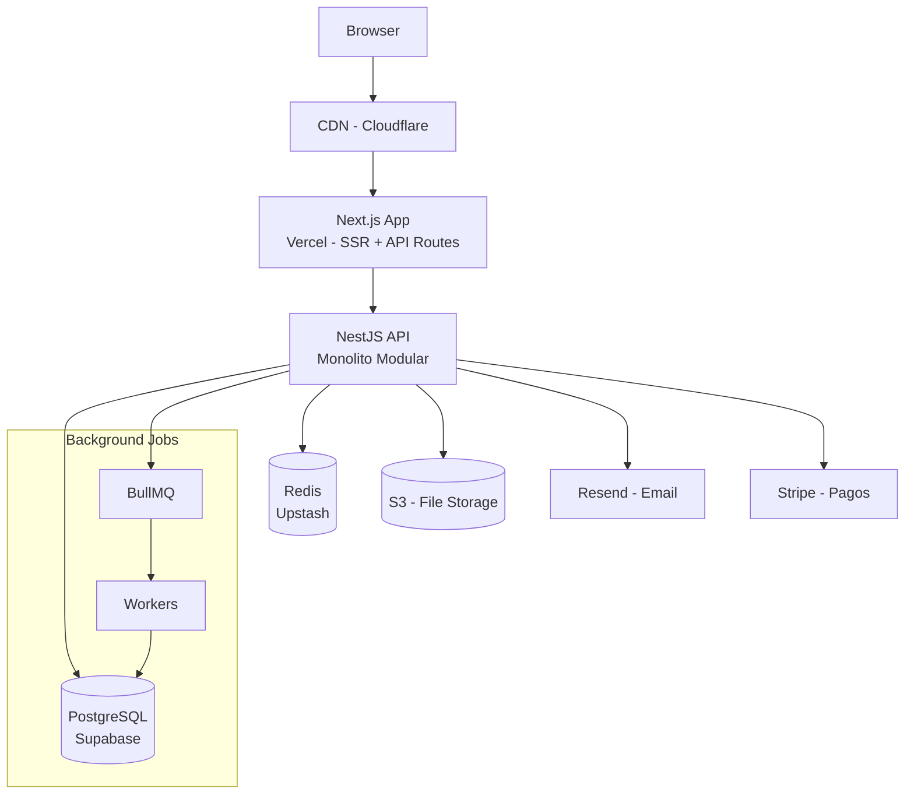

**Decisiones:**

- **Monolito Modular** (no microservicios): Equipo pequeño, velocidad de desarrollo prioritaria
- **Supabase**: PostgreSQL gestionado con auth incluido, row-level security para multi-tenancy
- **Vercel**: Zero-config deployment, escala automática
- **Multi-tenancy**: Schema por tenant en PostgreSQL para aislamiento de datos

## Caso 2: Plataforma de Logística

**Escenario:** Tracking de envíos en tiempo real, 10M paquetes/día.

```mermaid
graph TD
    Devices[Dispositivos IoT<br/>GPS Scanners] --> MQTT[MQTT Broker<br/>AWS IoT Core]
    MQTT --> Kafka[Apache Kafka<br/>100k events/sec]

    Kafka --> Loc[Location Service<br/>Actualiza posición]
    Kafka --> Alert[Alert Service<br/>Excepciones y demoras]
    Kafka --> Analytics[Analytics Service<br/>Métricas y reporting]

    Loc --> Redis[(Redis<br/>Posición actual - tiempo real)]
    Loc --> PG[(PostgreSQL<br/>Historial de ubicaciones)]

    Client[App del cliente] --> WS[WebSocket Service]
    WS --> Redis

    Alert --> SQS[AWS SQS]
    SQS --> Notif[Notification Service]
    Notif --> Email[Email/SMS/Push]
```

**Decisiones:**

- **Kafka**: Ingesta masiva de eventos IoT sin pérdida
- **Redis** para posición actual: O(1) lookup, TTL automático
- **Event-driven**: Los servicios son independientes, pueden escalar por separado
- **WebSockets**: Actualización de posición en tiempo real para el cliente

## Caso 3: AI SaaS (Generador de Contenido)

```mermaid
graph TD
    User[Usuario] --> Web[Next.js Frontend]
    Web --> API[API Gateway]

    API --> Auth[Auth Service]
    API --> Credits[Credits Service<br/>Manejo de tokens/créditos]

    API --> Queue[Job Queue<br/>BullMQ/Redis]
    Queue --> Worker[AI Worker]
    Worker --> LLM[OpenAI/Anthropic API]
    Worker --> Vector[(pgvector<br/>Embeddings para RAG)]

    Worker -->|Job completo| WS[WebSocket<br/>Notifica al usuario]
    Worker --> Storage[(S3<br/>Guarda resultado)]

    subgraph "Rate Limiting & Costs"
        Credits --> PG[(PostgreSQL<br/>Balance de créditos)]
    end
```

**Decisiones:**

- **Queue para AI requests**: Los modelos son lentos (5-30 seg), no bloquear HTTP
- **WebSockets**: Notificar al usuario cuando el job completa
- **pgvector**: RAG integrado en PostgreSQL, sin base de datos vectorial separada
- **Credits system**: Control de costos de API por usuario

---

# 17. Errores Comunes de Arquitectura {#17-errores}

## Los 10 Anti-Patrones que Destruyen Proyectos

### 1. Premature Microservices (El más común)

```
❌ Síntomas:
- "Somos solo 3 devs pero tenemos 12 microservicios"
- "Cada deploy requiere coordinar 5 repos"
- "El bug era que el contrato entre Service A y B cambió sin avisar"

✅ Solución: Monolito modular hasta que realmente lo necesites
```

### 2. Anemic Domain Model

```typescript
// ❌ MAL: El objeto Order no tiene comportamiento - es solo datos
class Order {
  id: string;
  status: string;
  items: OrderItem[];
  total: number;
}

// La lógica está dispersa en servicios
class OrderService {
  calculateTotal(order: Order) {
    /* lógica aquí */
  }
  canCancel(order: Order) {
    /* lógica aquí */
  }
  validateItems(order: Order) {
    /* lógica aquí */
  }
}

// ✅ BIEN: La lógica vive donde pertenece - en el dominio
class Order {
  calculateTotal(): Money {
    /* encapsulado */
  }
  canBeCancelled(): boolean {
    /* encapsulado */
  }
  cancel(): void {
    /* con invariantes protegidas */
  }
}
```

### 3. Shared Database Anti-Pattern

```
❌ MAL: Dos microservicios comparten la misma base de datos
Service A → orders table ←→ Service B
                ↑
        Acoplamiento de datos = no hay independencia real

✅ BIEN: Cada servicio tiene su propia base de datos
Service A → orders_db
Service B → inventory_db
Comunicación → via eventos o APIs
```

### 4. Abstracciones Prematuras

```typescript
// ❌ MAL: Abstracción antes de entender el problema
interface IGenericProcessor<TInput, TOutput, TContext, TConfig> {
  process(input: TInput, context: TContext, config: TConfig): Promise<TOutput>;
}

// ✅ BIEN: Empieza concreto, abstrae cuando hay 3+ casos similares (Rule of Three)
class EmailNotificationSender {
  send(to: string, subject: string, body: string): Promise<void> {}
}
// Cuando también necesitas SMS y Push → ENTONCES abstrae
```

### 5. Overengineering (Gold Plating)

```
❌ Señales de overengineering:
- "Implementé un sistema de plugins para que pueda ser extensible en el futuro"
  (Nadie pidió extensibilidad, y nunca se extendió)
- "Usé CQRS y Event Sourcing para el módulo de configuración de usuarios"
  (Un CRUD simple habría bastado)
- "Tenemos 6 capas de abstracción para evitar dependencias"
  (Ahora nadie entiende el código)

✅ Principio YAGNI: "You Ain't Gonna Need It"
Construye lo que necesitas HOY. No lo que podrías necesitar MAÑANA.
```

### 6. Falta de Idempotencia

```typescript
// ❌ Procesar el mismo evento dos veces cobra dos veces al cliente
@EventsHandler(PaymentRequested)
async handle(event: PaymentRequested) {
  await this.stripe.charge(event.amount, event.cardId);  // PELIGROSO
}

// ✅ Siempre verificar si ya se procesó
@EventsHandler(PaymentRequested)
async handle(event: PaymentRequested) {
  const alreadyCharged = await this.paymentLog.exists(event.idempotencyKey);
  if (alreadyCharged) return;

  const charge = await this.stripe.charge(event.amount, event.cardId);
  await this.paymentLog.save(event.idempotencyKey, charge.id);
}
```

### 7. No Planear para el Fallo

```
Ley de Murphy en producción:
- Las redes fallan
- Los servicios externos tienen downtime
- Los discos se llenan
- La memoria se agota
- Los timeouts ocurren

✅ Diseña para el fallo:
- Siempre implementar timeouts
- Siempre tener fallbacks
- Usar circuit breakers
- Implementar retries con exponential backoff
- Graceful degradation (funcionar con menos features)
```

### 8. Logging Inadecuado

```typescript
// ❌ MAL: Logs inútiles en producción
logger.log("Entering function");
logger.log("Done");
logger.error("Error occurred"); // ¿Qué error? ¿En qué contexto?

// ✅ BIEN: Logs estructurados y contextualizados
logger.info({
  message: "Order created successfully",
  orderId: order.id,
  customerId: order.customerId,
  totalAmount: order.total.amount,
  itemCount: order.items.length,
  traceId: context.traceId, // Para correlación distribuida
  duration: Date.now() - startTime,
});

logger.error({
  message: "Payment processing failed",
  orderId: order.id,
  paymentProvider: "stripe",
  errorCode: error.code,
  errorMessage: error.message,
  retryCount: attempt,
  traceId: context.traceId,
});
```

---

# 18. El Futuro de la Arquitectura de Software {#18-futuro}

## Las Tendencias que Están Redefiniendo la Ingeniería

### 1. AI-First Engineering

El código ya no se escribe únicamente a mano. Los arquitectos del futuro definen **intenciones y restricciones**, y la IA genera implementaciones.

```
HOY (2024-2025):
- AI asiste al desarrollador (Copilot, Cursor, Claude)
- Los devs siguen siendo responsables de la arquitectura

2026-2027:
- AI genera servicios completos a partir de especificaciones
- Los ingenieros validan, revisan y dirigen

2028-2030:
- Sistemas que se auto-optimizan y se auto-refactorizan
- El ingeniero define QUÉ, la IA define CÓMO
```

### 2. Edge-Native Architecture

El procesamiento se mueve al borde de la red, cerca del usuario.

```mermaid
graph LR
    User[Usuario en Tokyo] --> Edge1[Edge Node Tokyo<br/>< 5ms]
    User2[Usuario en Madrid] --> Edge2[Edge Node Madrid<br/>< 5ms]
    User3[Usuario en NY] --> Edge3[Edge Node NY<br/>< 5ms]

    Edge1 --> Origin[Origin Server<br/>50-200ms para datos que edge no puede manejar]
    Edge2 --> Origin
    Edge3 --> Origin

    note["Cloudflare Workers, Vercel Edge, AWS Lambda@Edge
    Código JavaScript corriendo en 300+ ubicaciones globales"]
```

### 3. Platform Engineering

La siguiente evolución de DevOps. Los equipos de plataforma crean "Internal Developer Platforms" que abstraen la complejidad de infraestructura.

```
ANTES: El dev configura Kubernetes, Helm charts, CI/CD, monitoring...
DESPUÉS: El dev corre `platform deploy my-service` y todo se configura automáticamente

La plataforma provee:
- Templates de servicios (golden paths)
- CI/CD automático
- Observability incluida
- Security por defecto
- Self-service para los equipos
```

### 4. Data Mesh

Los datos dejan de ser responsabilidad de un equipo centralizado. Cada dominio de negocio es dueño de sus propios datos.

```
ANTES:
Todos los equipos → Data Team centralizado → Data Warehouse → Análisis

DESPUÉS (Data Mesh):
Equipo Orders → Orders Data Product (con SLA, calidad, API)
Equipo Products → Products Data Product
Equipo Customers → Customers Data Product
↓
Plataforma de datos self-service que conecta todo
```

### 5. FinOps y Cloud Cost Architecture

La arquitectura del futuro considera el costo como constraint de primera clase.

```typescript
// El código tiene impacto directo en el costo
// Los arquitectos deben pensar en costo/request

// ❌ Sin pensar en costos
async function processAllOrders() {
  const orders = await db.orders.findAll(); // Puede ser 1M de registros
  for (const order of orders) {
    await expensiveAICall(order); // $0.01 por llamada = $10,000 total
  }
}

// ✅ Arquitectura consciente del costo
async function processAllOrders() {
  const batchSize = 100;
  // Procesar en batches, con rate limiting
  // Caché de resultados de AI
  // Procesamiento solo de los que realmente cambiaron
}
```

## Predicciones para los Próximos 10 Años

| Año       | Tendencia                         | Impacto                                              |
| --------- | --------------------------------- | ---------------------------------------------------- |
| 2025-2026 | AI agents en producción masiva    | Los sistemas se vuelven autónomos parcialmente       |
| 2026-2027 | Edge computing mainstream         | Latencia < 5ms global se vuelve esperada             |
| 2027-2028 | Arquitecturas auto-curativas      | Sistemas que detectan y corrigen sus propios fallos  |
| 2028-2029 | Low-code/AI para 80% del software | Los ingenieros se especializan más en systems design |
| 2029-2030 | Computación cuántica en la nube   | Nuevo paradigma para criptografía y optimización     |

## Lo que Nunca Cambiará

Independientemente de las tecnologías, estos principios permanecen:

```
1. Los tradeoffs son inevitables
   No existe la arquitectura perfecta, solo la correcta para el contexto

2. La simplicidad es siempre una victoria
   El código más simple es el mejor código

3. El dominio es más importante que la tecnología
   Entiende el negocio antes de elegir la tecnología

4. Las personas construyen sistemas, no las herramientas
   La cultura del equipo define la arquitectura

5. Iteración sobre perfección
   Lanza, aprende, mejora - la arquitectura evoluciona con el producto
```

---

## 🎯 Conclusión: El Mindset del Arquitecto

Después de este masterclass, el cambio más importante no es técnico. Es mental.

```
Un arquitecto senior piensa:

"¿Cuál es el problema real que estamos resolviendo?"
antes de
"¿Qué tecnología deberíamos usar?"

"¿Cuáles son los tradeoffs de esta decisión?"
antes de
"¿Cuál es la mejor práctica?"

"¿Qué pasa si esto falla?"
antes de
"¿Cómo hacemos que esto funcione?"

"¿Podemos empezar más simple?"
antes de
"¿Cómo hacemos esto escalable desde el día 1?"
```

> **La arquitectura de software no es sobre construir sistemas perfectos. Es sobre tomar las mejores decisiones posibles con la información disponible, aceptar conscientemente los tradeoffs, y mantener la capacidad de cambiar cuando aprendemos algo nuevo.**

---

## 📚 Recursos para Continuar

### Libros Fundamentales

- **"Clean Architecture"** - Robert C. Martin (Uncle Bob)
- **"Domain-Driven Design"** - Eric Evans
- **"Designing Data-Intensive Applications"** - Martin Kleppmann ⭐ (El más importante)
- **"Building Microservices"** - Sam Newman
- **"A Philosophy of Software Design"** - John Ousterhout
- **"The Staff Engineer's Path"** - Tanya Reilly

### Para Profundizar en System Design

- **"System Design Interview"** - Alex Xu
- **High Scalability Blog** (highscalability.com)
- **Martin Fowler's Blog** (martinfowler.com)

### Canales y Recursos Online

- ByteByteGo (system design visual)
- Architecture Notes Newsletter
- InfoQ Architecture Articles

---

_Guía creada como masterclass de arquitectura de software moderna._
_Versión 1.0 | 2024_
