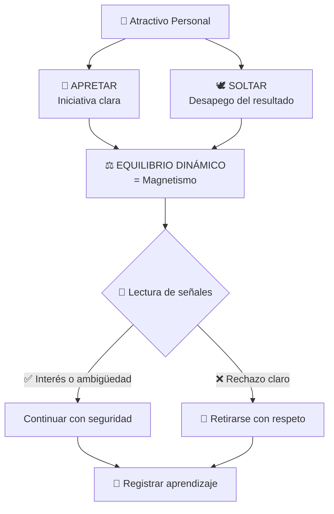
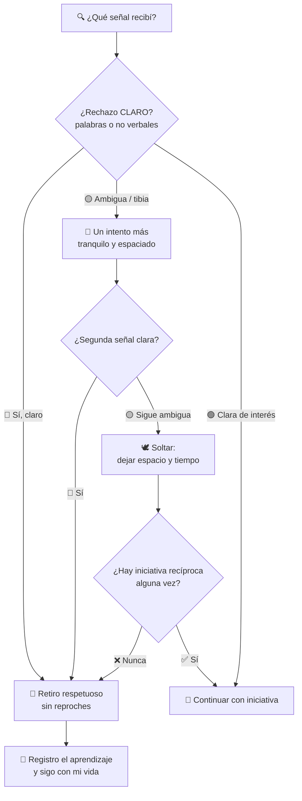

# MASTERCLASS: La Técnica 'Apretar y Soltar' — El Método de Héctor Latorre ⚖️🔥

## INTRODUCCIÓN: POR QUÉ ESTA MASTERCLASS ES DIFERENTE 🎯

La mayoría de los consejos sobre atracción caen en uno de dos extremos ❌:

1. 😤 **"Insiste hasta que ceda"** → produce necesidad, incomodidad y rechazo.
2. 😴 **"Solo trabaja en ti y espera"** → produce años de pasividad y cero resultados.

Esta masterclass enseña el camino intermedio que propone Héctor Latorre: la técnica **"apretar y soltar"** ⚖️ — una dinámica de *actitud interna* donde combinas **iniciativa clara** (apretar 💪) con **desapego del resultado** (soltar 🕊️).

No es una colección de frases mágicas. Es un **marco de comportamiento repetible** para interactuar con claridad, seguridad y respeto.

> **🎯 Objetivo de Aprendizaje** — Al final de esta guía, podrás diagnosticar tu patrón dominante (apretar en exceso o soltar en exceso), aplicar ambos polos en una misma interacción, leer señales de interés y rechazo sin ambigüedad, y ejecutar un plan de práctica de 6 días. 🚀

> **⚠️ Advertencia ética no negociable** — Esta técnica describe una actitud interna (cuánta iniciativa tomas y cuánto apego tienes al resultado). **Nunca** es un permiso para ignorar el desinterés real de otra persona. Respetar la voluntad y las señales claras de rechazo no es negociable 🚫, y ninguna técnica debería usarse para presionar a alguien que ya comunicó —con palabras o sin ellas— que no está interesado. Esto se profundiza en la Parte 4. 🛑

---

## MAPA DEL MÉTODO 🗺️



### Las 4 fases del aprendizaje 📚

| Fase | Qué harás | Dónde |
|------|-----------|-------|
| 🧠 **Comprender** | La lógica psicológica detrás de la técnica | Partes 1–3 |
| 👀 **Reconocer** | Cómo se manifiesta (o falta) este equilibrio en ti | Partes 4–5 |
| 🛠️ **Aplicar** | Herramientas concretas y accionables | Partes 6–8 |
| 🔁 **Consolidar** | Ejercicios de repaso y hábitos de refuerzo | Partes 7–9 |

Cada parte incluye: **explicación** 📖, **ejemplo aplicado** 🧩, **ejercicio práctico** ✅ y **punto clave** 💡.

---

## PARTE 1: EL MITO DE "SOLO TRABAJA EN TI" 🔧🚫

### 1.1 Principio central

El desarrollo personal (salud 🏋️, finanzas 💰, metas 🎯, confianza 🦁) es valioso **por sí mismo** — pero esperar pasivamente a que el resultado romántico llegue solo por "mejorar como persona" **no es una estrategia realista**. 📉

El crecimiento personal construye la **base**, pero no reemplaza la **acción directa** y la **iniciativa social**. 🏗️➡️🏃

> 🧩 **Analogía del instructor:** Trabajar en ti mismo es como afilar una herramienta 🔪 — necesaria, pero inútil si nunca la usas. La mejora personal sin acción social deja todo en manos del azar. 🎲

### 1.2 Los tres errores del "esperador profesional" 😴

| Error | Cómo se ve | Costo real |
|-------|------------|------------|
| 📚 **Acumular teoría** | Lees 50 libros de seducción sin hablar con nadie | Cero experiencia social |
| 🏆 **Esperar estar "listo"** | "Cuando tenga más músculo/dinero/confianza..." | Perfeccionismo infinito |
| 🍀 **Delegar al azar** | "Si tiene que ser, será" | La oportunidad pasa de largo |

### 1.3 La fórmula correcta ✅

```text
Desarrollo personal (base) + Iniciativa social (acción) = Resultados posibles 📈
```

| Componente | Rol | Ejemplo |
|------------|-----|---------|
| 💪 Gimnasio | Base física | Entrenas 3x/semana |
| 💼 Carrera | Base económica | Avanzas en tus proyectos |
| 🧘 Mentalidad | Base emocional | Gestionas tu diálogo interno |
| 🗣️ **Interacciones reales** | **Motor** | Inicias conversaciones cada semana |

Sin el último componente, los otros cuatro son potencia sin descarga. ⚡🚫

### ✅ Ejercicio práctico 1

Responde honestamente por escrito ✍️:

- ¿Cuánto de tu "trabajo personal" reciente se tradujo en interacciones sociales reales? 🤔
- ¿Estás mejorando como estrategia para **evitar** tomar la iniciativa, o como **complemento** a ella?

> 💡 **Punto clave:** El desarrollo personal es la base, **no el sustituto** de la acción. 🏗️≠🏃

---

## PARTE 2: APRETAR 💪 — TOMAR LA INICIATIVA

### 2.1 Definición 📖

**"Apretar"** significa tomar el rol activo en la interacción:

- 🗣️ Iniciar la conversación
- ⏱️ Sostener el ritmo
- 💯 Mostrar interés de forma clara
- 🪜 Llevar el peso de avanzar las etapas

...en vez de esperar que la otra persona haga todo el trabajo. 🛋️❌

### 2.2 Por qué importa 🌟

Sin "apretar", la interacción se estanca 🛑:

| Sin iniciativa 😶 | Con iniciativa 💪 |
|-------------------|-------------------|
| Ambigüedad eterna | Claridad de intención |
| Nadie propone nada | Tú propones planes |
| Se enfría en días | Mantiene momentum |
| Se percibe indecisión | Comunica seguridad |

Tomar la iniciativa comunica dos cosas simultáneamente: **seguridad** 🦁 e **interés genuino** ❤️.

### 2.3 Las 5 acciones de apretar 🎬

| # | Acción | Ejemplo concreto |
|---|--------|------------------|
| 1️⃣ | **Abrir** | Ser tú quien inicia la conversación primero |
| 2️⃣ | **Profundizar** | Preguntas que van más allá de lo superficial |
| 3️⃣ | **Proponer** | "Me encantó hablar contigo, ¿seguimos tomando algo la próxima semana?" ☕ |
| 4️⃣ | **Cerrar** | Pedir el número / fijar el plan antes de despedirse 📱 |
| 5️⃣ | **Avanzar** | Proponer el siguiente paso cuando corresponde |

> 🧩 **Ejemplo aplicado:** En lugar de esperar una señal explícita antes de proponer un plan, ser tú quien sugiere: *"Me encantó hablar contigo, ¿te gustaría que sigamos esta conversación tomando algo la próxima semana?"* ☕✨

### 2.4 Apretar NO es... 🚦

| ❌ No es agresividad | ✅ Sí es claridad |
|----------------------|-------------------|
| Insistir tras un "no" | Comunicar intención sin rodeos |
| Invadir espacio personal | Reducir ambigüedad |
| Presionar con reproches | Proponer con naturalidad |

> 💡 **Punto clave:** La iniciativa no es agresividad — es **claridad de intención comunicada con seguridad**. 🎯

### ✅ Ejercicio práctico 2

Identifica una interacción reciente donde esperaste que "la otra persona diera el primer paso". Escribe qué acción concreta podrías haber tomado tú en su lugar. 📝🔄

---

## PARTE 3: SOLTAR 🕊️ — EL DESAPEGO DEL RESULTADO

### 3.1 Definición 📖

**"Soltar"** es la contraparte de "apretar": actuar **sin necesidad ni ansiedad por el resultado**, manteniendo tu independencia emocional incluso mientras muestras interés.

⚠️ No es indiferencia fingida ni juegos de "hacerse el difícil". Es no depositar tu bienestar en la respuesta de la otra persona. 🧘

### 3.2 Necesidad vs Desapego 😰 vs 🧘

| Señal | 😰 Necesidad | 🧘 Desapego |
|-------|-------------|-------------|
| 📱 Mensajes | Revisas el teléfono cada 2 minutos | Sigues con tu día normalmente |
| 🗣️ Tono | Voz tensa, respuestas rápidas y nerviosas | Ritmo pausado, cómodo |
| 🚫 Rechazo | Lo tomas como juicio sobre tu valor | Lo lees como información útil |
| 🔄 Repetición | Relees la conversación mil veces | Una lectura, una decisión |
| ❤️ Autoestima | Depende de su respuesta | No depende de nadie externo |

> 🧩 **Ejemplo aplicado:** Propones el plan (apretar 💪) y, sin importar la respuesta, sigues disfrutando tu noche 🎉, tu semana 🌅, tu vida — sin quedar pendiente de una respuesta ni revisando el teléfono con ansiedad. 📵

### 3.3 Por qué importa 🌟

La necesidad se percibe **incluso sin palabras** — en el tono 🎙️, en el lenguaje corporal 🕺, en la insistencia ansiosa 📲📲📲.

El desapego, en cambio, comunica abundancia:

> *"Mi valor no depende de tu respuesta."* 🦁✨

### 3.4 El error clásico: confundir soltar con indiferencia 🥶

| ❌ Indiferencia fingida | ✅ Desapego real |
|-------------------------|------------------|
| Ignorar mensajes a propósito | Responder cuando puedes, con calma |
| Fingir que no te importa | Te importa, pero no te define |
| Juegos de poder | Autenticidad con estabilidad emocional |
| Frío calculado | Calidez sin dependencia |

La paradoja 🌀: cuanto menos necesitas la aprobación, más atractiva resulta tu atención genuina.

> 💡 **Punto clave:** Apretar sin soltar se vuelve **necesidad**. Soltar sin apretar se vuelve **pasividad**. El equilibrio entre ambos es la clave de la técnica completa. ⚖️

### ✅ Ejercicio práctico 3

La próxima vez que muestres interés en alguien, practica conscientemente **no revisar el resultado con ansiedad** — continúa tu día con normalidad después de dar el paso. 📵🌅

---

## PARTE 4: SEÑALES Y EL LÍMITE NO NEGOCIABLE 🚦🛑

Esta es la parte **más importante de toda la masterclass**. Léela dos veces. 📖📖

### 4.1 Diferencias generales señaladas en el método 🧠

Latorre plantea que, en promedio, los hombres tienden a procesar la atracción de forma más visual e inmediata 👁️, mientras que las mujeres suelen dar más peso a **cómo se sienten durante la interacción** — la energía ⚡, la seguridad 🦁 y la conexión emocional 💞 que perciben en el otro.

> 🧩 **Nota importante:** Son **tendencias generales**, no reglas universales. Cada persona es distinta. Úsalas como marco de referencia, nunca como verdad absoluta sobre un individuo. 🎲❌

### 4.2 Los "filtros" 🧹

Según esta teoría, algunas personas muestran inicialmente una actitud reservada para evaluar la seguridad y determinación real de quien se acerca — filtrando a quienes se rinden ante la primera señal ambigua. 🔍

**Traducción práctica:** una respuesta tibia ≠ rechazo. Puede ser evaluación. Ahí es donde la persistencia *tranquila* (no ansiosa) marca la diferencia. 🧊🔥

### 4.3 Tabla maestra de señales 👀📊

| ✅ Señales de INTERÉS | ❌ Señales de RECHAZO |
|------------------------|------------------------|
| 👁️ Contacto visual sostenido y sonrisas | 😐 Evita mirarte, cara neutra o incómoda |
| 🧲 Reduce distancia, gira su cuerpo hacia ti | 🧱 Se aleja, hombros cerrados, cuerpo girado away |
| ❓ Te hace preguntas sobre ti | 💤 Respuestas monosilábicas ("sí", "no", "ah") |
| 💬 Extiende temas, ríe con naturalidad | 📱 Mira el teléfono constantemente |
| 🕐 Busca prolongar la conversación | ⏰ Busca salir de ella ("bueno, me voy...") |
| 📅 Responde propuestas con alternativas | 🚫 Rechaza sin ofrecer alternativa alguna |
| 🔁 Reinicia conversaciones ella/o él mismo | 🤐 Solo habla si tú hablas primero, siempre |

### 4.4 La insistencia — y su límite absoluto 🛑

El video plantea que la insistencia, **bien entendida**, puede comunicar interés genuino en lugar de desgana. Pero aquí está el punto más importante de todo el método:

> 🚦 **EL LÍMITE ES ABSOLUTO:** Existe una diferencia radical entre **persistir con seguridad ante una respuesta AMBIGUA** 🟡 e **ignorar una señal CLARA de rechazo** 🔴. Esa distinción separa la seguridad personal del acoso — y debe respetarse siempre, sin excepción, sin importar cuánto te interese la persona. 🚫

**En la práctica, esto significa:** si la otra persona se aleja 🚶, evita el contacto visual 👀❌, da respuestas cortantes ✂️, cambia de tema repetidamente 🔄, o de cualquier forma comunica —con palabras o sin ellas— que no quiere continuar...

> ## 🛑 LA RESPUESTA CORRECTA ES RETIRARSE. NO INSISTIR MÁS.

Ninguna técnica de atracción justifica lo contrario. **Punto.** 🏁

### 4.5 Matriz de decisión rápida 🧭



**Regla de oro:** 🟡 = máximo 1-2 intentos espaciados. 🔴 = retiro inmediato. Siempre hay duda → asume que es un no y protégelo. 🛡️

> 💡 **Punto clave:** La confianza y la insistencia solo son atractivas cuando van acompañadas de la capacidad de **leer y respetar** al otro. Sin esa capacidad, dejan de ser seducción y se convierten en un problema. ⚖️🚨

### ✅ Ejercicio práctico 4

Haz una lista de al menos **5 señales no verbales** que indicarían que alguien **no** está interesado (ej.: mira el teléfono 📱, aleja el cuerpo 🧱, respuestas de una palabra 💤, busca con la mirada a otras personas 👀↗️, cambia de tema constantemente 🔄). Memorízalas. Reconocerlas rápido te permite actuar sin ambigüedad. 📝🧠

---

## PARTE 5: LA PARADOJA DEL ÉXITO ⚖️🌀

### 5.1 La idea central

El máximo atractivo surge de la combinación —aparentemente contradictoria— de dos actitudes:

- 💪 **Determinación** (apretar): tomar la iniciativa con claridad
- 🕊️ **Desapego** (soltar): no necesitar el resultado para sentirte bien

Un hombre que muestra interés genuino **sin depender emocionalmente de la respuesta** es mucho más magnético que uno que solo aprieta (se vuelve ansioso 😰) o que solo suelta (se vuelve pasivo 😶).

### 5.2 Matriz de los cuatro perfiles 📊

| | 🕊️ CON desapego | 😰 SIN desapego |
|---|---|---|
| 💪 **CON iniciativa** | ⚖️ **MAGNÉTICO** 🦁✨ | 😰 Ansioso / necesitado |
| 😶 **SIN iniciativa** | 😶 Pasivo / invisible | 🚫 Bloqueado / frustrado |

Solo **una** de las cuatro casillas genera atracción consistente. 🎯

### 5.3 Cómo se ve en la realidad 🎬

> 🧩 **Ejemplo aplicado:** Propones un plan con seguridad (apretar 💪) y, si la respuesta tarda o es tibia, sigues disfrutando tu vida sin ansiedad ni reproches (soltar 🕊️) — sin dejar de ser respetuoso y atento si la respuesta finalmente es un "no" claro. 🛑🤝

### 5.4 Por qué funciona psicológicamente 🧠

| Mecanismo | Explicación |
|-----------|-------------|
| 🪞 **Percepción de valor** | Quien no necesita la aprobación transmite que ya tiene opciones |
| 🧘 **Regulación emocional** | Estabilidad bajo presión = señal de madurez |
| 🎁 **Libertad de elección** | La persona siente que puede elegir libremente, sin presión — y eso reduce defensas |
| 🔥 **Tensión saludable** | Interés claro + no-desperación = intriga agradable |

> 💡 **Punto clave:** No es un interruptor on/off — es un **equilibrio dinámico** que se ajusta interacción por interacción, siempre dentro del límite de respeto de la Parte 4. ⚖️🚦

### ✅ Ejercicio práctico 5

Evalúa tu propia tendencia: ¿te inclinas más hacia **apretar en exceso** (ansiedad, necesidad 😰) o hacia **soltar en exceso** (pasividad, falta de iniciativa 😶)? Define una acción concreta para equilibrar tu tendencia dominante esta semana. 📝🎯

---

## PARTE 6: PLAN DE APLICACIÓN DE 6 DÍAS 📅🔥

| Día | Enfoque 🎯 | Acción concreta ✅ |
|-----|------------|--------------------|
| 1️⃣ | 🔍 **Diagnóstico** | Identifica si tu patrón habitual es "apretar en exceso" o "soltar en exceso". Escríbelo con 3 evidencias de tu conducta reciente |
| 2️⃣ | 💪 **Apretar** | Toma la iniciativa en UNA interacción donde normalmente esperarías (abrir conversación, proponer plan) |
| 3️⃣ | 🕊️ **Soltar** | Tras mostrar interés, practica desapego consciente: cero revisión ansiosa del teléfono durante 24h 📵 |
| 4️⃣ | 👀 **Lectura de señales** | Observa y anota señales de interés vs. desinterés en 3 interacciones distintas (tus u observadas) |
| 5️⃣ | ⚖️ **Equilibrio** | Combina ambos polos en UNA sola interacción real: propón (apretar) y relájate después (soltar) |
| 6️⃣ | 📓 **Reflexión** | Evalúa: ¿qué funcionó? ¿qué se sintió forzado? ¿qué señales respetaste correctamente? 🏆 |

### Bitácora sugerida 📓

```text
Día X — [fecha]
Interacción: [contexto breve]
Qué apliqué: [apretar / soltar / ambos]
Señales observadas: [interés ✅ / rechazo ❌ / ambigüedad 🟡]
Cómo respondí: [avancé / solté / me retiré]
Lección: [una frase]
```

> 🧩 **Nota del instructor:** El progreso no se mide solo en resultados románticos, sino en tu capacidad de mantenerte **seguro** 🦁, **presente** 🧘 y **respetuoso** 🤝 al mismo tiempo — las tres cosas son parte del mismo equilibrio. ⚖️

---

## PARTE 7: I DO / WE DO / YOU DO — PRÁCTICA PROGRESIVA 🏋️🎓

Siguiendo la metodología de instrucción profesional: primero **observas** 👀, luego **practicas acompañado** 🤝, finalmente **actúas independiente** 🚀.

### 7.1 🎬 I Do — Diagnóstico guiado de mi propio patrón

**Objetivo:** ver cómo el instructor analiza un patrón dominante.

| Paso | Acción | Resultado esperado |
|------|--------|--------------------|
| 1 | Revisar últimas 10 interacciones sociales | Lista cronológica |
| 2 | Marcar dónde esperé pasivamente | Conteo de pasividades 😶 |
| 3 | Marcar dónde insistí pese a señales frías | Conteo de necesidades 😰 |
| 4 | Clasificar patrón dominante | "Aprieto demasiado" o "sueldo demasiado" |
| 5 | Elegir UNA acción correctora | Acción específica y medible |

### 7.2 🤝 We Do — Diseñar una interacción completa juntos

**Escenario:** conociste a alguien en una clase 🎨. Hubo buena charla, risas 😄, y te dio su Instagram 📱. Desde entonces: respondió tus primeros dos mensajes con entusiasmo, pero lleva 2 días sin contestar el tercero. 🤔

**Analiza en equipo (o contigo mismo):**

| Pregunta | Respuesta orientadora |
|----------|-----------------------|
| ¿Es rechazo claro? 🔴 | No — silencio de 2 días ≠ rechazo explícito |
| ¿Es interés garantizado? 🟢 | No — es zona gris 🟡 |
| ¿Qué hace APRETAR aquí? 💪 | Un único mensaje ligero, sin reclamo, con propuesta concreta |
| ¿Qué hace SOLTAR aquí? 🕊️ | Enviarlo y seguir con tu día; sin dobles textos 📵 |
| ¿Y si sigue el silencio? 🛑 | Retiro tranquilo. Sin drama, sin "visto y no me contestsó" |
| ¿Qué NUNCA hacer? ❌ | Reclamar, exigir explicación, bombardear de mensajes |

### 7.3 🚀 You Do — Tu propia práctica de campo

**Tarea:** aplica el framework completo en TU vida durante 7 días.

Debes incluir:

- 🎯 3 iniciativas nuevas (abrir/proponer)
- 🕊️ 3 prácticas de desapego post-iniciativa
- 👀 1 bitácora de señales observadas
- 🛑 1 retiro voluntario ante señal fría (¡practicarlo también!)
- 📓 1 reflexión final escrita

| Criterio de éxito | Peso |
|--------------------|------|
| Iniciativas tomadas | 25% |
| Calidad del desapego (cero ansiedad visible) | 25% |
| Precisión leyendo señales | 25% |
| Respeto del límite en todo momento | 25% obligatorio ✅ |

### 7.4 🎬 I Do — Casos de lectura de señales

**Caso A:** Ella mantiene contacto visual, gira su cuerpo hacia ti, te pregunta dónde estudias. → 🟢 Interés. Continúa con iniciativa.

**Caso B:** Respuestas cortantes, brazos cruzados, mira la puerta. → 🔴 Rechazo. Retiro amable: *"Bueno, te dejo. ¡Suerte con todo!"* 🤝

**Caso C:** Ríe pero revisa el teléfono dos veces y responde lento. → 🟡 Ambiguo. Mantén conversación liviana; no propongas aún; observa 2-3 minutos más.

### 7.5 🤝 We Do — Interpretar el escenario ambiguo

**Caso:** Propones café ☕. Responde: *"Uff, este fin de semana estoy full... ya te digo"* y luego silencio.

| Interpretación posible | Probabilidad según regla | Acción correcta |
|-------------------------|--------------------------|-----------------|
| Ocupada de verdad | Posible 🟡 | Espera ~1 semana, un mensaje ligero más |
| Rechazo indirecto | Posible 🟡 | Si no ofrece alternativa nueva → tratarlo como no |
| Prueba de paciencia | Imposible de saber | Irrelevante — tu conducta no cambia |

**Regla unificada:** sin alternativa concreta ofrecida = tratarlo como no 🛑. Tu dignidad agradece la política. 🦁

### 7.6 🚀 You Do — Diseña tu sistema personal permanente

Construye tu propio protocolo post-masterclass:

1. 📅 Ritual semanal mínimo de interacciones (número concreto)
2. 🚦 Tu lista personalizada de señales rojas y verdes
3. ⚖️ Tu frase ancla de desapego (*"Propuse, ahora vivo mi vida"*)
4. 📓 Formato de bitácora que usarás
5. 🛑 Tu script de retiro elegante (memorizado)

---

## PARTE 8: +30 CONSEJOS DE ORO 💎🔥

### 💬 Conversación en persona

1. 🎯 **Abre con lo contextual, no con frases ensayadas** — algo del entorno es más natural que un piropo recitado.
2. 👂 **Escucha 60%, habla 40%** — las preguntas sobre lo que acaba de decir valen oro.
3. 😄 **Sonríe primero con los ojos** — el lenguaje corporal abre puertas que las palabras cierran.
4. 🧊 **Normaliza el silencio breve** — no rellenes cada segundo; la comodidad en el silencio comunica seguridad.
5. 🎭 **Cuenta historias, no currículums** — "el otro día me pasó esto..." > "trabajo en X y estudio Y".
6. 🪜 **Profundiza en escalera** — de lo casual a lo personal, gradualmente, siguiendo su reciprocidad.
7. 🚫 **No interrumpas para brillar** — si esperas tu turno para hablar, no estás conversando.

### 📱 Mensajes y redes

8. ⏱️ **Responde cuando puedas, no cuando "toca" por estrategia** — ni en 3 segundos ni en 3 días por juego; autenticidad con vida propia.
9. 🎣 **Cierra con pregunta o propuesta, no con "jajaja"** — evita conversaciones zombis que no van a ningún lado.
10. 📞 **Del chat al mundo rápido** — 2-4 días de buen chat es momento de proponer plan presencial; el chat no es la relación.
11. 🚫 **Un mensaje sin respuesta = uno solo más, semanas después, o nada** — nunca cadenas de textos. Jamás.
12. 🧾 **Propón planes concretos** — "¿café el jueves a las 19 en el centro?" > "algún día deberíamos salir".
13. 🔇 **Cero reclamos públicos o privados por falta de respuesta** — el "¿por qué me dejaste en visto?" mata cualquier posibilidad instantáneamente.

### 🍽️ Citas y encuentros

14. ☕ **Primera cita simple y barata** — café o caminata; la sofisticación prematura presiona y aburre.
15. 🎮 **Planifica tú, pregunta sus gustos también** — liderazgo + consideration = combinación ganadora.
16. 📵 **Teléfono guardado toda la cita** — la atención plena es el halago más caro que existe. 💎
17. 🤝 **Al final, di claramente si te gustó** — "me encantó conocerte, quiero verte de nuevo" no es debilidad, es madurez.
18. 🚗 **No prolongues citas muertas por desesperación** — si la energía murió, cierre elegante y a casa. Dignidad > insistencia.
19. 💰 **Paga sin drama, acepta sin drama** — la flexibilidad financiera sin ego es atractiva en ambas direcciones.

### 🧠 Mentalidad y desapego

20. 🏝️ **Construye una vida que no quieras escapar** — hobbies, amigos, metas; la pareja suma a una vida llena, no la rellena.
21. 🎲 **Piensa en abundancia estadística** — una sola persona no es tu única opción del universo; eso baja la ansiedad estructuralmente.
22. 🧘 **Tu emoción la gestionas ANTES de la interacción** — respiración, postura, preparación mental; llegas regulado o llegas necesitado.
23. 📈 **Mide procesos, no resultados** — "tomé 3 iniciativas esta semana" ✔️ vs "¿me querrá?" ❌.
24. 🔄 **Reencadre el rechazo como filtro** — cada no temprano te ahorra meses de inversión equivocada. 🎁
25. 🦁 **Autoestima de fondo, humildad de superficie** — vales mucho Y no eres para todos; ambas verdades a la vez.

### 👀 Lectura de señales

26. 📊 **Lee patrones, no momentos aislados** — una risa cortesía no es interés; cinco comportamientos coherentes sí son información.
27. 🎥 **Prioriza lo no verbal sobre lo verbal educado** — cuerpo y energía dicen la verdad que la educación disfraza.
28. ⚖️ **Calibra interacción por interacción** — lo que funcionó con una persona puede ser neutro o negativo con otra.
29. 🛑 **Ante duda sostenida, protege su derecho a decir no** — retirarte ante la duda nunca es perder; acosar sin duda siempre lo es.

### ❌ Errores que matan la atracción

30. 📲 **El doble/triple texto ansioso** — comunica necesidad pura; borra ese hábito hoy.
31. 🎭 **Fingir indiferencia con juegos** — la frialdad calculada se detecta y repele más que la necesidad misma.
32. 🪞 **Hablar solo de ti** — monólogo = ausencia de conexión.
33. ⏳ **Quedarte meses en zona ambigua** — si tras varias señales no hay reciprocidad, la respuesta era no; libérate.
34. 😤 **Presionar tras un no** — además de moralmente inaceptable 🚫, es el destructor definitivo de tu reputación social.
35. 🧩 **Cambiar tu personalidad completa por gustar** — adaptarte es humano; desaparecer como persona, fatal.

> 💡 **Consejo maestro que resume los 35:** Sé alguien con una vida tan interesante que compartirte sea un privilegio — y comunícalo con claridad, sin necesidad, y con respeto absoluto por la libertad del otro. ⚖️✨

---

## CHECKLIST FINAL DE LA TÉCNICA ✅📋

| Bloque | Check |
|--------|-------|
| 🏗️ **Base** | Desarrollo personal en marcha (salud, metas, mentalidad) |
| 💪 **Apretar** | Tomas iniciativa: abrir, proponer, cerrar, avanzar |
| 🕊️ **Soltar** | Desapego real post-iniciativa: cero ansiedad visible |
| 👀 **Señales** | Sabes distinguir interés ✅ / ambigüedad 🟡 / rechazo 🔴 |
| 🛑 **Límite** | Retiro inmediato y respetuoso ante señal clara — SIEMPRE |
| ⚖️ **Equilibrio** | Combinas ambos polos en una misma interacción |
| 📅 **Práctica** | Plan de 6 días ejecutado con bitácora |
| 📈 **Medición** | Evalúas procesos (acciones), no validación ajena |
| 🔁 **Iteración** | Cada interacción alimenta tu aprendizaje siguiente |
| 🤝 **Integridad** | Tu conducta sería defendible ante cualquier testigo |

---

## PREGUNTAS DE VERIFICACIÓN 📝🧠

Responde cada pregunta basándote en los conceptos de esta masterclass. Escribe tus respuestas o compártelas para profundizar tu aprendizaje. ✍️

### Sobre los fundamentos

1. **Explica** 📖: ¿Por qué el desarrollo personal por sí solo no garantiza éxito romántico según el método? ¿Qué papel juega entonces?
2. **Define con tus palabras** 🗣️: ¿Qué es "apretar"? Da un ejemplo concreto de TU vida donde faltó.

### Sobre la técnica

3. **Contrasta** ⚖️: ¿Qué diferencia hay entre "soltar" (desapego) e "indiferencia fingida" (juegos)?
4. **Aplica** 🎬: Propones un plan y reciben un "ya te digo" sin alternativa. ¿Cuál es la secuencia correcta de acciones según el framework?
5. **Analiza** 🧠: ¿Por qué la necesidad se percibe incluso sin palabras? Nombra 3 canales por los que se filtra.

### Sobre los límites

6. **Distingue** 🚦: ¿Cuál es la diferencia fundamental entre insistir con seguridad ante ambigüedad y presionar ante rechazo claro?
7. **Enumera** 📋: Al menos 5 señales no verbales de rechazo que exigen retiro inmediato.
8. **Justifica** 🛑: ¿Por qué la regla de límite es absoluta y no depende de cuánto te interese la persona?

### Integradoras

9. **Sintetiza** ⚖️: Explica la "paradoja del éxito" usando la matriz de 4 perfiles. ¿Por qué solo una casilla funciona?
10. **Reflexión final** 💭: De todo el framework, ¿qué componente te costará más trabajar según tu patrón dominante? ¿Cuál será tu primera acción correctora mañana?

---

## GLOSARIO RÁPIDO 📚⚡

| Término | Definición |
|---------|------------|
| 💪 **Apretar** | Tomar la iniciativa activa: abrir, sostener ritmo, proponer, avanzar etapas |
| 🕊️ **Soltar** | Actuar sin apego al resultado; independencia emocional mientras hay interés |
| ⚖️ **Paradoja del éxito** | La combinación determinación + desapego produce máximo magnetismo |
| 😰 **Necesidad** | Dependencia emocional de la aprobación ajena; se filtra en tono y cuerpo |
| 🧘 **Desapego** | No depositar el bienestar propio en la respuesta de la otra persona |
| 🧹 **Filtro** | Conducta reservada inicial (real o supuesta) para evaluar seguridad ajena |
| 👀 **Señal clara** | Comunicación verbal o no verbal inequívoca de interés o de rechazo |
| 🟡 **Zona ambigua** | Respuesta tibia sin confirmación ni rechazo; admite máx. 1-2 intentos espaciados |
| 🛑 **Retiro respetuoso** | Alejarse con elegancia ante rechazo; sin reproches, drama ni insistencia |
| ⏱️ **Momentum** | Ritmo de avance de la interacción mantenido por iniciativa oportuna |
| 🎯 **Claridad de intención** | Comunicar interés sin rodeos, sin agresividad ni presión |
| 📈 **Proceso vs Resultado** | Medir tus acciones controlables, no la aprobación externa |

---

## CIERRE DEL INSTRUCTOR 🎓🔥

> Practica el equilibrio entre iniciativa y desapego en tu próxima interacción social 🎯 — y recuerda que la habilidad más importante de todas, **por encima de cualquier técnica**, es saber leer y respetar genuinamente a la otra persona. 🤝💙
>
> La seguridad atrae. El despego estabiliza. El respeto lo hace todo sostenible. ⚖️🦁🕊️

---

*Guía elaborada como material de instrucción avanzado basado en el planteamiento de Héctor Latorre sobre la técnica "apretar y soltar". El contenido resume esa perspectiva con fines formativos; el respeto por la voluntad expresa de otra persona prima siempre por encima de cualquier técnica.* 📜✅
