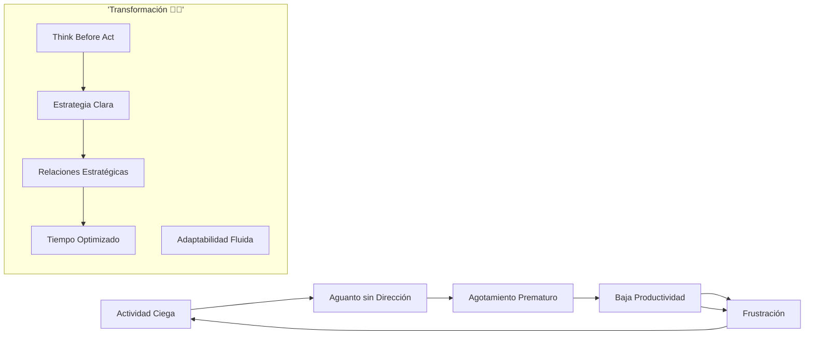
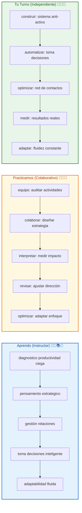

# 🚀 MASTERCLASS: Trabajo Estratégico vs Esfuerzo Ciego — La Productividad Inteligente 🔥🧠🎯💡

## 🎯 INTRODUCCIÓN: POR QUÉ ESTE MASTERCLASS ES DIFERENTE 💡⚡🚀

La cultura celebra al que "trabaja más duro". Pero el éxito no premia el sacrificio, premia los **resultados**. Trabajar largas horas sin dirección es el camino hacia el agotamiento, no hacia la realización.

Este masterclass te transformará de productivo activo a **productivo inteligente**: identificarás qué acciones generan mayor impacto, construirás pensamiento estratégico y aprenderás a adaptarte como el agua, no como la roca.

> **🎯 Objetivo de Aprendizaje** — Al final de esta guía, entenderás la diferencia entre actividad y productividad estratégica, tomarás decisiones con claridad, gestionarás relaciones efectivamente y adaptarás tu enfoque como el agua fluye.

> **⚠️ Advertencia** — Este contenido es formativo. La productividad estratégica requiere práctica constante. La zona de confort es el enemigo del progreso.

---

## 🗺️ MAPA DEL WORKFLOW DEL PRODUCTIVO INTELIGENTE 🗺️🚀🧠⚡



| Fase 🌍 | Desafío ❓ | Output principal 🎯 |
|--------|------------|------------------|
| **Actividad Ciega** 🔄 | ¿Qué haces sin propósito? | Identificación de distracciones |
| **Agotamiento Prematuro** 💔 | ¿Qué te quita energía? | Reconocimiento del hámster |
| **Baja Productividad** 📉 | ¿Qué no genera resultados? | Mapeo de actividades vacías |
| **Frustración** 😞 | ¿Qué te frustra delante? | Motivación para cambio |
| **Claridad Estratégica** 🎯 | ¿Qué te acerca a metas? | Direccionamiento preciso |
| **Relaciones Inteligentes** 👥 | ¿Quién abre puertas? | Red estratégica activada |
| **Adaptabilidad Fluida** 🌊 | ¿Cómo te adaptas? | Flexibilidad sin perder rumbo |

---



---

## 🔄⚡ PARTE 1: EL MITO DEL ESFUERZO CIEGO 🔄✨❌🔥💔

### 1.1 🔄🔥💥 El mito destructivo de "trabajar más duro" ❌💼⏰

"El éxito premia los resultados, no el sacrificio." — Brian Tracy adaptado

Trabajar largas horas sin plan:
- **Consume energía sin ROI** ⚡🔋📉
- **Genera ilusión de productividad** 🎭✨🚫
- **Lleva al agotamiento crónico** 💔🥱😩
- **Desvía del propósito real** 🎯❌🧭

### 1.2 📊📋 Tabla: Actividad vs Productividad Estratégica

| Actividad Ciega 🚫 | Productividad Estratégica ✅ |
|------------------|----------------------------|
| Largo tiempo, baja salida | Alto impacto, tiempo mínimo |
| Tareas urgentes sin importancia | Tareas importantes sin prisa |
| Multitarea constante | Enfoque profundo |
| Sin dirección clara | Meta definida |
| Energía malgastada | Energía direccionada |
| Resultados impredecibles | Resultados medibles |

### 1.3 🛠️🔧📋 Framework: romper el ciclo de actividad vacía 🔁✂️💡

```
🔄 Audit de productividad ⏱️📊:
1. ¿Qué hago que no se acerca a mis metas? ⏱️🎯❌
2. ¿Qué actividad consume más energía? 🔥⚡💔
3. ¿Qué no me genera ingresos ni aprendizaje? 💰📚🚫
4. ¿Qué me deja con sensación de vacío? 😞🌀💭
5. ¿Qué puedo delegar o eliminar hoy? ✂️👥⏭️
```

---

## 🧠🎯 PARTE 2: PENSAMIENTO ESTRATÉGICO — LA VERDADERA INTELIGENCIA 🧠✨🔍♟️

### 2.1 🧠♟️⚡ El cerebro estratega vs el hámster activo 🐹🔄🚫

**Inteligencia estratégica 🧠🌟✨:**
- Observa antes de actuar 🔍👁️🧠
- Anticipa consecuencias 🎯🔮📈
- Identifica actividades de alto impacto ⚡🚀💥
- Piensa como ajedrez, no como carrera ♟️🧠⚡

**Actividad ciega 🔄❌🚫:**
- Reacciona sin filtro 🔄⚡🚨
- Persigue lo urgente sin importancia ⏰📱💢
- Multitarea sin prioridad 📱🔄🚫
- Trabaja como hámster en rueda 🐹🌀😩

### 2.2 📊📈 Tabla: Pensamiento estratégico en acción

| Acción Estratégica 🎯 | Pregunta Clave ❓ | Resultado 💡 |
|---------------------|------------------|-------------|
| Analizar entorno | ¿Qué está funcionando a mi alrededor? | Identificar oportunidades |
| Entender reglas | ¿Qué normas nadie me dijo? | Jugar efectivamente |
| Anticipar consecuencias | ¿Qué pasa en 6 meses si persisto? | Evitar errores costosos |
| Priorizar impacto | ¿Qué actividad genera 80% de resultados? | Enfocar energía |
| Cuestionar actividades | ¿Esta tarea me acerca a metas? | Eliminar distracciones |

### 2.3 🛠️⚡📋 Ejercicio: el "Think Before Act" 🧠⏱️🎯💡

```
🧠 Rutina estratégica matutina ☀️📅:
1. ¿Cuál es mi resultado ideal hoy? 🎯 (5 min) ⏱️
2. ¿Qué 3 actividades lo generan? 🔑 (5 min) 🧠
3. ¿Qué evitaría a toda costa? ⚠️ (3 min) 🚫
4. ¿Quién puede ayudarme? 🤝 (2 min) 👥
5. ¿Qué me prepara para mañana? 📅 (5 min) 🔮

⏰ Total: 20 minutos piando = 8 horas ganadas 🕐✨🚀
```

---

## 🎯⚡ PARTE 3: CLARIDAD VS VELOCIDAD — LA ILUSIÓN PELIGROSA 🎯✨🚀⚠️

### 3.1 🎯🚀⚠️ La velocidad sin rumbo es retroceso disfrazado 🏎️🌀❌

"La velocidad sin dirección es una ilusión peligrosa" — Brian Tracy 🔥💡⚠️

| Sin Claridad 🚫❌🌀 | Con Claridad ✅🎯🌟 |
|-------------------|-------------------|
| Multiplica esfuerzos inútiles 🔄💪🚫 | Multiplica resultados efectivos 🎯🚀✨ |
| Genera estrés constante 😤😩💢 | Genera paz con propósito 😌🎯💚 |
| Corrige errores sin fin 🔧🔄😩 | Previene errores estratégicamente ✅🛡️🧠 |
| Se frustra fácilmente 😞💔😩 | Se motiva con avance visible 😊🚀🌟 |
| Pierde tiempo corrigiendo ⏱️🔄🚫 | Invierte tiempo direccionando 🎯🧠💡 |

### 3.2 📊📋 Tabla: señales de falta de claridad

| Señal ⚠️ | Ejemplo 💬 | Acción Correctiva 🎯 |
|---------|-----------|-------------------|
| "Siempre haciendo" | "No paro de trabajar" | Definir 1 resultado diario |
| Multitarea sin fin | "Hago 10 cosas a la vez" | Elegir 1 prioridad máxima |
| Sin sentido de avance | "Al final voy igual" | Medir progreso hoy |
| Agotamiento emocional | "Todo me cuesta esfuerzo" | Preguntar "¿para qué?" |
| Frase "más tarde" | "Lo haré cuando pueda" | Empezar con lo mínimo |

### 3.3 🛠️🎯📋 Script: cuestionar cada actividad 🤔🔍❓

```
🎯 Preguntas de claridad 🧠💡❓:
1. ¿Esta actividad me acerca a mi meta en 7 días? 📅🎯📈
2. ¿Qué pasa si no la hago hoy? ⚖️🔄❓
3. ¿Quién más puede hacerla mejor que yo? 👤🤝⚡
4. ¿Qué haría si solo tuviera 2 horas hoy? ⏱️🏎️🎯
5. ¿Estoy evitando algo más importante? 🎭🚫🎯
```

---

## 👥🤝 PARTE 4: GESTIÓN ESTRATÉGICA DE RELACIONES 👥✨🤝🔓🌟

### 4.1 👥🔓🚀 Por qué las relaciones abren más puertas que el esfuerzo 💪🚪🔑

El esfuerzo solitario tiene límites. Las relaciones:
- **Multiplican oportunidades** 📈🚀✨
- **Aceleran resultados** ⚡⚡⚡
- **Dan acceso a recursos ocultos** 🔑👑💎
- **Generan confianza que vende** 💰🤝💼

### 4.2 📊📈 Tabla: gestión de relaciones efectiva

| Relación Pasiva 🚫 | Relación Estratégica ✅ |
|-------------------|----------------------|
| Conocer gente por conocer | Construir confianza real 🤝 |
| Esperar que otros actúen | Ofrecer valor primero 💡 |
| Reuniones sin propósito | Reuniones con objetivo 🎯 |
| Preguntar sin contribuir | Preguntar + aportar ⚖️ |
| Olvidar contactos | Mantener conexión 🌱 |

### 4.3 🛠️🤝📋 Framework: red de contactos productiva 👥🤝🚀

```
👥 Sistema relacional 🤝🌟📈:
1. ¿Qué 5 personas pueden ayudarme esta semana? 🎯👥⚡
2. ¿Qué valor ofrezco sin esperar retorno? 💡🎁🌟
3. ¿Qué pregunto para entender sus metas? ❓🎯🧠
4. ¿Cómo mantengo conexión sin agobiar? 🌱💌🕊️
5. ¿Qué colaboración co-creadora propongo? ✨🤝🚀
```

---

## ⏱️💎 PARTE 5: EL VALOR DEL TIEMPO COMO RECURSO MÁS VALIOSO ⏱️✨💰🔄⚠️

### 5.1 ⏱️💰 El tiempo no se renueva: invertierlo con inteligencia

Tu tiempo es el único recurso que no puedes recuperar. Cada minuto mal invertido:
- **Te quita oportunidades reales** ⚡
- **Te genera estrés postergado** 😞
- **Reduce tu capacidad futura** 📉
- **Te aleja de metas definidas** 🎯

### 5.2 📊📈 Tabla: gestión inteligente del tiempo

| Mal Gasto de Tiempo 🚫 | Inversión Inteligente ✅ |
|-----------------------|------------------------|
| Multitarea constante | Enfoque en 1 prioridad 🧠 |
| Reuniones sin fin | Reuniones con agenda ✂️ |
| Redes sociales compulsivas | Redes con propósito 🎯 |
| Perfeccionismo paralizante | Buenas decisiones rápidas ⚡ |
| Esperar inspiración | Actuar con lo disponible 🚀 |

### 5.3 🛠️⏱️ Script: cambiar dirección a tiempo

```
⏱️ Señales para pivotar:
1. ¿Llevo 2 semanas sin avanzar real? ⏳
2. ¿Siento resistencia constante al avanzar? 🛑
3. ¿Mis indicadores no mejoran en 30 días? 📊
4. ¿Mis energías están disociadas del impacto? 💔
5. ¿Qué dirección tomaría si empezara hoy? 🔄

🎯 Regla: Si no avanza en 30 días, cambia el rumbo
```

---

## 🌊💧 PARTE 6: ADAPTABILIDAD COMO EL AGUA 🌊✨🔄🌟🔮

### 6.1 🌊🔮 El arte de fluir sin perder forma

"El agua fluye alrededor de obstáculos, la roca choca contra ellos" — Brian Tracy adaptado

| Adaptabilidad Fluida 🌊 | Rigidez Destructiva 🏔️ |
|-----------------------|------------------------|
| Cambia estrategia sin perder meta | Mantiene táctica hasta el fracaso |
| Aprende de retrocesos | Se aferra a errores como orgullo |
| Se reinventa constantemente | Se repite sin evolucionar |
| Fluye con circunstancias | Choca con realidades |

### 6.2 📊📋 Tabla: adaptabilidad en acción

| Situación ⚠️ | Respuesta Rígida 🚫 | Respuesta Fluida ✅ |
|-------------|--------------------|-------------------|
| Mercado cambia | Insistir en lo viejo | Aprender nuevas reglas |
| Cliente dice NO | Repetir propuesta | Adaptar enfoque de valor |
| Competidor gana | Criticar estrategia | Estudiar y mejorar |
| Recursos limitados | Detenerse por falta | Innovar con lo disponible |
| Feedback negativo | Defender posición | Ajustar rumbo |

### 6.3 🛠️🌊 Framework: adaptabilidad consciente

```
🌊 Proceso de adaptación:
1. Observar la realidad sin juzgar 👁️
2. Identificar qué funciona a mi favor 🎯
3. Preguntar "¿qué puedo aprender de esto?" 📚
4. Ajustar estrategia sin perder meta 🔄
5. Ejecutar nuevo rumbo en 48 horas ⚡
```

---

## 🎓🏫 PARTE 7: I DO / WE DO / YOU DO — EJERCICIOS PRÁCTICOS 🎓✨🏫👥🎯

### 7.1 🏫📝 I Do — Diagnosticar productividad ciega

| Paso 🚶 | Acción ⚡ | Resultado esperado ✅ |
|------|--------|--------------------|
| 1️⃣ 🎯 | Listar 10 actividades diarias | Clarity total de distracciones |
| 2️⃣ 📊 | Calificar cada una (-2 a +2) | Identificación de vacías |
| 3️⃣ ⏱️ | Medir tiempo real invertido | Ladrillo de tiempo detectado |
| 4️⃣ 💡 | Definir 1 prioridad máxima | Dirección clara al día |

### 7.2 👥🤝 We Do — Diseñar estrategia colaborativa

**Tarea colaborativa en grupo:**

```
👥 Estrategia conjunta:
1. Comparto mi actividad más vacía 🔄
2. Identifican alternativa estratégica 🎯
3. Diseñamos juntos mi prioridad hoy 💡
4. Definimos quién me ayuda esta semana 👥
5. Compromiso: reportar avance en 48h 📈
```

### 7.3 🎯🚀 You Do — Sistema anti-actividad ciega

**Tarea personal:**

| Sistema 🛠️ | Acción ⚡ | Alerta 🔔 |
|------------|---------|----------|
| 🔄 Audit | Eliminar 3 actividades vacías | Sin cambios en 7 días |
| 🎯 Estrategia | Definir 1 prioridad diaria | Sin prioridad en 3 días |
| 👥 Relaciones | Contactar 2 personas clave | Sin conexión en 14 días |
| ⏱️ Tiempo | Bloque 2h sin distracciones | Sin enfoque profundo |
| 🌊 Adaptación | Cambiar 1 estrategia fracasada | Sin pivot en 30 días |

---

## ✅🏆 PARTE 8: CHECKLIST FINAL 🏁✨✔️🎯💪🔥

| Bloque 🧩 | Check ✅ |
|--------|-------|
| **Actividad ciega identificada** | 🔄 Eliminé distracciones |
| **Pensamiento estratégico activado** | 🧠 Pienso antes de actuar |
| **Claridad de propósito clara** | 🎯 Tengo meta definida hoy |
| **Relaciones estratégicas** | 👥 Tengo apoyo real |
| **Gestión del tiempo optimizada** | ⏱️ Invierto en lo que importa |
| **Adaptabilidad fluida** | 🌊 Me ajusto sin perder rumbo |
| **Sistema anti-actividad establecido** | 🛡️ Rutina estratégica vivida |

---

## 📝🔍 PARTE 9: PREGUNTAS DE VERIFICACIÓN 📝✨❓💭🎯

Responde cada pregunta basándote en los conceptos. Escribe o comparte para profundizar. 📝

### Preguntas sobre Actividad Ciega

1. **🔄 Aplica**: ¿Qué actividad realizas diariamente que no se acerca a tus metas? ¿Qué harías si dejaras de hacerla 1 semana?

2. **⏱️ Analiza**: ¿Has trabajado "mucho pero sin avanzar"? ¿Qué te dice tu cuerpo sobre el esfuerzo ciego?

### Preguntas sobre Pensamiento Estratégico

3. **🧠 Diseña**: Si solo tuvieras 2 horas hoy, ¿qué harías exactamente? ¿Quién más podría ayudarte?

4. **🎯 Evalúa**: ¿Qué 80% de resultados genera tu 20% de actividades? ¿Cómo medirías ese impacto?

### Preguntas sobre Relaciones

5. **👥 Reflexiona**: ¿Qué 3 personas pueden abrirme puertas esta semana? ¿Qué valor ofrecería primero?

6. **🤝 Calcula**: Si inviertes 30 minutos en relaciones estratégicas semanales, ¿qué oportunidades emergen en 60 días?

### Preguntas Integradoras

7. **🌊 Conecta**: ¿Cómo se relaciona tu resistencia al cambio con tu frustración por no avanzar?

8. **💡 Propón un sistema**: Diseña un sistema de 15 minutos matutinos que combine estrategia, relaciones y claridad.

---

## 📚📖 PARTE 10: GLOSARIO RÁPIDO 📚✨📖🧠💡

| Término 📝 | Definición 📋 | Icono |
|---------|------------|-------|
| **Productividad estratégica** 🎯 | Actividades que generan resultados reales | 🎯🚀 |
| **Actividad ciega** 🔄 | Esfuerzo sin dirección ni propósito | 🔄❌ |
| **Pensamiento ajedrez** ♟️ | Anticipar consecuencias antes de actuar | ♟️🧠 |
| **Relaciones estratégicas** 👥 | Conexiones que multiplican oportunidades | 👥🤝 |
| **Adaptabilidad fluida** 🌊 | Cambiar estrategia sin perder meta | 🌊🔄 |
| **Tiempo invertido** ⏱️ | Minutos dedicados a resultados reales | ⏱️💎 |
| **Claridad de propósito** 🎯 | Dirección precisa hacia metas | 🎯🧭 |
| **Multitarea destructiva** 📱 | Distracción que divide atención | 📱🚫 |

---

## 📐📏 ANEXO: FORMATO IDEAL PARA MASTERCLASS EDUCATIVAS 📐✨📏🎨

### 📏🎨 Estructura visual recomendada

El ancho óptimo 📏 para masterclasses educativas es **60–75 caracteres por línea** 📐.

```css
.article-content {
  🎨 font-size: 18px;
  📏 line-height: 1.75;
  📐 max-width: 65ch;
}
```

### 🎯🔥 CIERRE PRÁCTICO

| Nivel 📊 | Debes poder hacer ✨ |
|-------|------------------|
| **🏫 I Do** | ✅ Diagnosticar y redirigir actividad |
| **👥 We Do** | 🤝 Construir estrategia colectiva |
| **🎯 You Do** | 🚀 Sistematizar productividad inteligente |

---

## 🎁🚀 RECURSOS ADICIONALES 🎁✨📚🎥💻

- 📖 [📚 Brian Tracy - Productividad](https://www.briantracy.com)
- 🎥 [🎬 Video original: "Trabajo Estratégico"]
- 💻 [💻 Apps: Notion, Clockify, Cal Newport Deep Work]
- 🛠️ [🛠️ Libros: "Deep Work", "The 80/20 Principle"]

---

**🎉 Felicitaciones! Has completado la masterclass del productivo inteligente. 🧠 Ahora tienes el sistema para trabajar menos, lograr más y adaptarte sin perder tu esencia.**

> **💡 Próximo paso:** La próxima vez que sientas "tanto que hacer", detente 5 minutos. Pregunta: "¿Cuál es mi prioridad máxima hoy?" Luego actúa SOLO en eso. El resto fluye después. 🌊🎯