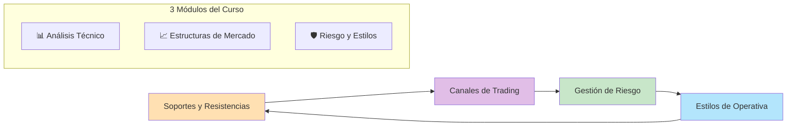
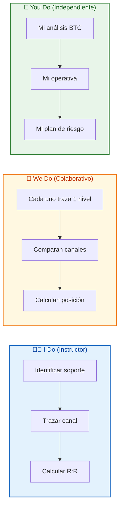
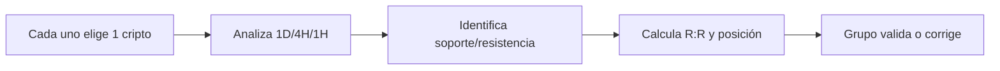
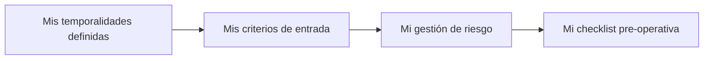

# MASTERCLASS: Trading de Criptomonedas - Análisis Técnico, Canales y Gestión de Riesgo 📈

## INTRODUCCIÓN: POR QUÉ ESTA MASTERCLASS ES DIFERENTE 🎯

El trading de criptomonedas se caracteriza por alta volatilidad, liquidez 24/7 y movimientos extremos. La mayoría de los traders pierden dinero por falta de disciplina, mal manejo del riesgo y ausencia de un método estructurado.

Esta guía se enfoca en **análisis técnico aplicado a cripto**, con énfasis en soportes/resistencias, canales de trading, estilos de operativa y gestión de riesgo profesional.

> **🎯 Objetivo de Aprendizaje** — Al final de esta guía, podrás identificar niveles clave de precio, trazar canales de trading, calcular ratio riesgo/beneficio, definir stop loss y take profit, y elegir el estilo de trading según tu perfil.

> **⚠️ Advertencia profesional** — Este contenido es formativo. El trading de criptomonedas conlleva riesgo financiero. Nunca operes con dinero que no estés dispuesto a perder. Practica primero en demo.

---

## 🗺️ MAPA DE LA MASTERCLASS 🧭

| 🧩 Fase | ❓ Pregunta que responde | 📤 Resultado principal |
|---------|------------------------|------------------------|
| **📊 Soportes/Resistencias** | ¿Dónde es probable que el precio rebote o rompa? | Zonas clave identificadas |
| **📈 Canales** | ¿Cómo operar dentro de una tendencia canalizada? | Puntos de entrada y salida |
| **🛡️ Riesgo** | ¿Cuánto arriesgar y cómo calcular el ratio R:R? | Tamaño de posición y stops |

---

## 📊 PARTE 1: SOPORTES Y RESISTENCIAS - LOS CIMIENTOS DEL ANÁLISIS 📊

### 1.1 ❓ PRETEST

¿Qué diferencia hay entre un soporte y una resistencia?

> Respuesta esperada: Soporte = nivel donde el precio rebota hacia arriba. Resistencia = nivel donde el precio es rechazado hacia abajo.
> Si acertás: camino rápido → andá al punto 7.

### 1.2 🎯 POR QUÉ + LOGRO

Importa porque **los soportes y resistencias son los niveles donde se toman decisiones de entrada y salida**. Sin ellos, operás a ciegas. Vas a lograr **identificar zonas de alto interés institucional** y evitar entradas en momentos de alta incertidumbre.

### 1.3 ⚡ VICTORIA RÁPIDA (<5 min)

Abrí TradingView, elegí BTC/USDT en 4H. Marcá el mínimo y máximo de los últimos 20 candles. Esos son tus primeros soporte y resistencia.

### 1.4 💡 CONCEPTO

Analogía: Un soporte es como **un suelo de cemento** — las órdenes de compra acumuladas son tan fuertes que el precio no puede perforarlo. Una resistencia es como **un techo de cristal** — la oferta (ventas) es tan concentrada que el precio no puede subir más.

Definición: Un soporte es una zona de demanda donde la presión compradora supera a la vendedora, generando un rebote. Una resistencia es una zona de oferta donde la presión vendedora supera a la compradora, generando un rechazo. Cuando un nivel se rompe con volumen, suele invertir su rol: una resistencia rota se convierte en soporte, y viceversa.

### 1.5 👀 EJEMPLO RESUELTO

| Tipo de Nivel | Característica | Ejemplo en BTC |
|---------------|----------------|----------------|
| **Soporte fuerte** | Múltiples rebotes, alto volumen | $60,000 en BTC (mínimos repetidos con volumen creciente) |
| **Resistencia fuerte** | Múltiples rechazos, alto volumen | $70,000 en BTC (máximos repetidos con ventas masivas) |
| **Soporte débil** | Solo 1 rebote, bajo volumen | Nivel accidental sin historia |
| **Resistencia débil** | Rechazo único, sin volumen | Nivel psicológico sin confirmación |
| **Cambio de rol** | Resistencia rota → nuevo soporte | $70,000 resistido → roto con volumen → ahora soporte en pullback |

### 1.6 ⚠️ CONTRA-EJEMPLO / Error Típico

Error: Trazar una línea fina y esperar que el precio respete ese nivel exacto, o comprar en un soporte "porque siempre rebota" sin confirmación de volumen.

Corrección: El precio se mueve dentro de zonas, no de líneas perfectas. Para marcar correctamente:
- Necesitás al menos **2 puntos de contacto** para validar la zona.
- Dibujalas como **rectángulos**, no como líneas.
- Definí el ancho en pips según el activo: 100, 200 o hasta 1000 pips.
- Ajustá el grosor con la práctica para evitar entradas falsas.

Una zona muy delgada te expone a fakeouts. Por eso conviene apoyarte en **dos o tres indicadores adicionales** que confirmen el cambio de tendencia antes de entrar.

### 1.7 🧪 PRÁCTICA

Abrí cualquier gráfico de cripto en TradingView. Identificá: 1 soporte fuerte, 1 resistencia fuerte, 1 soporte débil. Marcálos con líneas horizontales.

> Respuesta esperada / criterio: El soporte/resistencia fuerte debe tener al menos 2-3 toques previos. El débil debe tener solo 1 toque o ser un nivel psicológico sin historia.

### 1.8 🔁 RECALL — Nivel Bloom: Aplicar

¿Por qué un nivel que fue resistencia, al ser roto, se convierte en soporte?

### 1.9 📌 IDEA CLAVE

Los soportes y resistencias son zonas de equilibrio: cuando el precio las rompe con volumen, el equilibrio se invierte.

### 1.10 ✅ AUTO-CHEQUEO + SIGUIENTE

- [ ] Identifiqué 1 soporte y 1 resistencia en un gráfico real
- [ ] Distinguí niveles fuertes de débiles
- [ ] Entiendo el cambio de rol tras ruptura
- [ ] Marqué zonas como rectángulos, no líneas finas

Siguiente: Tipos de soportes y resistencias según su naturaleza.

---

## 📐 PARTE 1.5: COMPORTAMIENTO DEL PRECIO DENTRO DE ZONAS 📐

### 1.5.1 ❓ PRETEST

¿Qué indica una perforación del soporte que no se sostiene y el precio vuelve arriba?

> Respuesta esperada: Un fakeout o falso breakout: el precio atravesó la zona pero la demanda volvió a dominar.
> Si acertás: camino rápido → andá al punto 7.

### 1.5.2 🎯 POR QUÉ + LOGRO

Importa porque **dentro de un soporte válido vas a ver intentos de perforación que no prosperan**. Entender este comportamiento te ayuda a no salir por pánico ni entrar demasiado temprano. Vas a lograr **leer la intención real del mercado** observando cómo reacciona dentro de la zona.

### 1.5.3 ⚡ VICTORIA RÁPIDA (<5 min)

Mirá el último toque del precio en un soporte de BTC. ¿Cuántas mechas perforaron la zona? ¿El candle cerró dentro o fuera? Esa es la diferencia entre rebote y ruptura.

### 1.5.4 💡 CONCEPTO

Analogía: Dentro de un soporte, el precio es como **una pelota que rebota contra el suelo** — a veces hace una mecha hacia abajo (toca el suelo y sigue), pero si el rebote es fuerte, la pelota vuelve a subir. En una resistencia ocurre lo opuesto: la pelota sube, toca el techo y cae.

Definición: En un soporte válido, el precio puede perforar la zona temporalmente (mecha inferior), pero el cierre del candle se mantiene por encima del nivel, confirmando que la demanda es superior. En una resistencia, el precio puede tener mechas superiores, pero el cierre se mantiene por debajo, confirmando que la oferta domina.

### 1.5.5 👀 EJEMPLO RESUELTO

| Comportamiento | Interpretación | Acción |
|----------------|----------------|--------|
| Mecha perfora soporte, cierre arriba | Rebote confirmado | Entrada en largo |
| Cierre por debajo del soporte con volumen | Ruptura real | No comprar, esperar retest |
| Múltiples mechas en resistencia, cierres abajo | Resistencia fuerte | No entrar en largo |
| Precio gira antes de llegar a la línea superior del canal | Movimiento pierde fuerza | Posible ruptura del canal |

### 1.5.6 ⚠️ CONTRA-EJEMPLO / Error Típico

Error: Vender por pánico cuando el precio hace una mecha perforando el soporte, sin esperar el cierre del candle.

Corrección: Las mechas son señales de intención, no de confirmación. Esperá el cierre del candle (4H, 1H) para confirmar si la perforación fue real o un fakeout.

### 1.5.7 🧪 PRÁCTICA

Buscá un soporte reciente en BTC/USDT 4H. Verificá: ¿hubo mechas perforando el nivel? ¿El cierre fue arriba o abajo? ¿Qué indicó?

> Respuesta esperada / criterio: Deben analizar el candle completo, no solo la mecha. Ejemplo: "Mecha de $58,800, pero cierre en $60,100 → rebote confirmado."

### 1.5.8 🔁 RECALL — Nivel Bloom: Analizar

¿Por qué el cierre del candle es más importante que la mecha para confirmar un soporte/resistencia?

### 1.5.9 📌 IDEA CLAVE

El precio deja huellas en las zonas: las mechas son intenciones, los cierres son hechos.

### 1.5.10 ✅ AUTO-CHEQUEO + SIGUIENTE

- [ ] Analicé 1 soporte con mechas y cierres
- [ ] Entiendo la diferencia entre intención y confirmación
- [ ] Sé por qué el cierre del candle es el verdadero confirmador

---

## 📐 PARTE 2: TIPOS DE SOPORTES Y RESISTENCIAS 📐

### 2.1 ❓ PRETEST

¿Qué tipo de soporte/resistencia se forma en números redondos como $50,000 o $100,000?

> Respuesta esperada: Psicológico.
> Si acertás: camino rápido → andá al punto 7.

### 2.2 🎯 POR QUÉ + LOGRO

Importa porque **no todos los niveles son iguales**: un soporte estático tiene historia, un dinámico se mueve con el precio y un psicológico actúa por la expectativa colectiva. Vas a lograr **clasificar los niveles** para priorizar los más confiables.

### 2.3 ⚡ VICTORIA RÁPIDA (<5 min)

En BTC/USDT, marcá: 1) Un mínimo histórico (estático), 2) La EMA 200 (dinámica), 3) El nivel psicológico $100,000. Esa es la base de los 3 tipos.

### 2.4 💡 CONCEPTO

Analogía: Los soportes y resistencias son como **distintos tipos de protección** — el estático es un muro de piedra (histórico, sólido), el dinámico es un guardia móvil (media móvil que se actualiza), el psicológico es un cartel que todos ven (números redondos que generan expectativa).

Definición: Los soportes y resistencias estáticas se basan en precios históricos repetidos. Los dinámicos se basan en indicadores como medias móviles que se actualizan con el precio. Los psicológicos se forman en números redondos o niveles significativos para la psicología del mercado.

### 2.5 👀 EJEMPLO RESUELTO

| Tipo | Base | Ejemplo en Cripto | Confiabilidad |
|------|------|-------------------|---------------|
| **Estático** | Precios históricos | Mínimos de BTC en $30,000 (2022) | Alta |
| **Dinámico** | Indicadores técnicos | EMA 200 en $45,000 | Media-Alta |
| **Psicológico** | Números redondos | $50,000, $100,000 | Variable |

### 2.6 ⚠️ CONTRA-EJEMPLO / Error Típico

Error: Tratar todos los niveles psicológicos como soportes/resistencias igual de fuertes.

Corrección: $50,000 es más confiable que $49,123 porque más traders lo ven y actúan en él. Los niveles psicológicos son profecías autocumplidas: si todos creen que $50,000 es soporte, muchos compran ahí, generando el rebote.

### 2.7 🧪 PRÁCTICA

En un gráfico de ETH/USDT, identificá: 1 soporte estático, 1 dinámico (EMA 50) y 1 psicológico. Explicá por qué cada uno tiene esa clasificación.

> Respuesta esperada / criterio: Deben argumentar la base de cada nivel. Ejemplo: "EMA 50 es dinámica porque se mueve con el precio; $2,000 es psicológico porque es número redondo."

### 2.8 🔁 RECALL — Nivel Bloom: Analizar

¿Por qué los niveles psicológicos pueden ser más débiles que los estáticos en cripto?

### 2.9 📌 IDEA CLAVE

Un nivel es tan fuerte como el volumen y la historia que lo respalda: el precio no miente, pero los números redondos pueden ser espejismos.

### 2.10 ✅ AUTO-CHEQUEO + SIGUIENTE

- [ ] Clasifiqué 3 niveles en un gráfico real
- [ ] Entiendo la diferencia entre estático, dinámico y psicológico
- [ ] Sé priorizar niveles por confiabilidad

Siguiente: Cómo confirmar si un nivel resistirá o será roto.

---

## ✅ PARTE 3: CRITERIOS DE CONFIRMACIÓN - REBOTE VS RUPTURA ✅

### 3.1 ❓ PRETEST

¿Qué indica una ruptura de resistencia con alto volumen?

> Respuesta esperada: Que la presión compradora es fuerte y el precio probablemente siga subiendo.
> Si acertás: camino rápido → andá al punto 7.

### 3.2 🎯 POR QUÉ + LOGRO

Importa porque **no todos los rebotes son verdaderos ni todas las rupturas son reales**. Los fakeouts (rupturas falsas) son comunes en cripto. Vas a lograr **distinguir entre breakout real y trampa**, evitando entradas en momentos de alta volatilidad.

### 3.3 ⚡ VICTORIA RÁPIDA (<5 min)

Mirá el último intento de ruptura de resistencia en BTC. ¿Fue con volumen alto o bajo? Si fue alto, probablemente sea real. Si fue bajo, probablemente sea fakeout.

### 3.4 💡 CONCEPTO

Analogía: Un breakout es como **saltar una valla** — si saltás con impulso (volumen alto), pasás del otro lado. Si saltás sin impulso (volumen bajo), tropezás y volvés a caer (fakeout).

Definición: Un breakout es la ruptura de un nivel de resistencia o soporte con volumen significativo. Un fakeout es una ruptura que se revierte rápidamente, atrapando traders que entraron en el movimiento. La confirmación de un nivel requiere: múltiples toques, volumen creciente y candles de cierre fuera del nivel.

### 3.5 👀 EJEMPLO RESUELTO

| Escenario | Volumen | Candle | Interpretación |
|-----------|---------|--------|----------------|
| Ruptura de resistencia | Alto | Cierre por encima | Breakout real, entrada posible |
| Ruptura de resistencia | Bajo | Mecha arriba, cierre abajo | Fakeout, no entrar |
| Rebote en soporte | Alto | Candle verde largo | Rebote confirmado, entrada posible |
| Rebote en soporte | Bajo | Mecha abajo, cierre arriba | Débil, esperar confirmación |

### 3.6 ⚠️ CONTRA-EJEMPLO / Error Típico

Error: Entrar en una ruptura "porque está subiendo" sin ver el volumen.

Corrección: En cripto, las rupturas falsas son comunes. Si el volumen no acompaña, el breakout probablemente falle. Esperá un cierre confirmado por encima de la resistencia con volumen > 1.5x el promedio.

### 3.7 🧪 PRÁCTICA

Buscá una ruptura reciente en BTC/USDT. Verificá: 1) ¿El volumen fue alto? 2) ¿El candle cerró fuera del nivel? 3) ¿Fue breakout o fakeout? Justificá.

> Respuesta esperada / criterio: Deben analizar volumen y tipo de candle. Ejemplo: "Volumen 2x promedio, cierre por encima de $70,000 → breakout real."

### 3.8 🔁 RECALL — Nivel Bloom: Evaluar

¿Por qué el volumen es el mejor confirmador de un breakout en cripto?

### 3.9 📌 IDEA CLAVE

Un breakout sin volumen es solo un suspiro: no tiene fuerza para sostener el movimiento.

### 3.10 ✅ AUTO-CHEQUEO + SIGUIENTE

- [ ] Verifiqué 1 breakout reciente en un gráfico
- [ ] Confirmé con volumen y tipo de candle
- [ ] Entiendo la diferencia entre breakout y fakeout

Siguiente: Ruptura agresiva y confirmación de continuación.

---

## ✅ PARTE 3.5: RUPTURA AGRESIVA Y CONFIRMACIÓN ✅

### 3.5.1 ❓ PRETEST

¿Qué indica una ruptura agresiva seguida de un retest del nivel roto?

> Respuesta esperada: Confirmación de continuación del movimiento.
> Si acertás: camino rápido → andá al punto 7.

### 3.5.2 🎯 POR QUÉ + LOGRO

Importa porque **una ruptura agresiva con retest es una de las señales más confiables de continuación**. El precio no solo rompe el nivel, sino que vuelve a tocarlo como nuevo soporte/resistencia, confirmando que la ruptura fue real. Vas a lograr **entrar con mayor seguridad** en la dirección del movimiento.

### 3.5.3 ⚡ VICTORIA RÁPIDA (<5 min)

Mirá el último breakout de BTC en $70,000. ¿El precio volvió a tocar los $70,000 después de la ruptura? Si lo hizo y rebotó, es una confirmación.

### 3.5.4 💡 CONCEPTO

Analogía: La ruptura agresiva es como **saltar una valla y volver a tocarla para asegurarse de que no vuelve a caer**. Si tocas la valla desde el otro lado y no te caes, sabés que la ruptura fue real y podés seguir corriendo.

Definición: Una ruptura agresiva ocurre cuando una vela cierra con fuerza fuera del canal o nivel. El retest es cuando el precio vuelve a tocar el nivel roto (ahora convertido en soporte/resistencia) y rebota, confirmando la continuación del movimiento. Esta secuencia da una entrada más segura que el breakout inicial.

### 3.5.5 👀 EJEMPLO RESUELTO

| Fase | Acción del Precio | Interpretación |
|------|-------------------|----------------|
| 1. Ruptura agresiva | Vela cierra por encima de la resistencia con volumen alto | Breakout real, posible continuación |
| 2. Retest | Precio vuelve a tocar la resistencia rota (ahora soporte) | Confirma que el nivel se invirtió |
| 3. Rebote | Precio rebota desde el nuevo soporte | Entrada segura en dirección de la ruptura |
| 4. Objetivo | Proyección del ancho del canal desde el punto de ruptura | TP basado en geometría del canal |

### 3.5.6 ⚠️ CONTRA-EJEMPLO / Error Típico

Error: Entrar en el primer candle de ruptura sin esperar el retest.

Corrección: El primer candle de ruptura puede ser un fakeout. El retest confirma que el nivel se invirtió realmente. Esperá el retest para entrar con mayor probabilidad de éxito.

### 3.5.7 🧪 PRÁCTICA

Buscá un breakout reciente en BTC/USDT. Verificá: ¿hubo retest del nivel roto? ¿El precio rebotó? ¿Fue una entrada más segura que el breakout inicial?

> Respuesta esperada / criterio: Deben analizar las 3 fases: ruptura, retest, rebote. Ejemplo: "Ruptura en $70,000, retest en $70,200, rebote → entrada en $70,200."

### 3.5.8 🔁 RECALL — Nivel Bloom: Analizar

¿Por qué el retest después de una ruptura agresiva es más confiable que entrar en el primer candle?

### 3.5.9 📌 IDEA CLAVE

La ruptura agresiva con retest es la confirmación definitiva: el precio no solo rompió, sino que validó el nuevo nivel como soporte/resistencia.

### 3.5.10 ✅ AUTO-CHEQUEO + SIGUIENTE

- [ ] Identifiqué 1 ruptura agresiva con retest
- [ ] Confirmé las 3 fases: ruptura, retest, rebote
- [ ] Entiendo por qué el retest es más seguro que el breakout inicial

---

## 📈 PARTE 4: CANALES DE TRADING - OPERANDO DENTRO DE LA TENDENCIA 📈

### 4.1 ❓ PRETEST

¿Cómo se traza un canal alcista?

> Respuesta esperada: Línea inferior conectando mínimos ascendentes, línea superior paralela conectando máximos ascendentes.
> Si acertás: camino rápido → andá al punto 7.

### 4.2 🎯 POR QUÉ + LOGRO

Importa porque **los canales definen el rango de movimiento del precio dentro de una tendencia**. Operar dentro de un canal te da puntos de entrada y salida objetivos. Además, la ruptura del canal te alerta sobre cambios de tendencia. Vas a lograr **maximizar el ratio riesgo/beneficio** comprando en la parte inferior y vendiendo en la superior.

### 4.3 ⚡ VICTORIA RÁPIDA (<5 min)

En BTC/USDT 4H, trazá: línea inferior por 2 mínimos ascendentes, línea superior paralela por 2 máximos ascendentes. Esa es tu canal alcista. El precio debería rebotar en la parte inferior.

### 4.4 💡 CONCEPTO

Analogía: Un canal es como **una autopista con límites** — el precio viaja entre dos líneas paralelas. Cuando toca el límite inferior (soporte), rebota hacia el superior (resistencia), y viceversa. Si el precio deja de tocar uno de los extremos, es señal de debilidad y posible ruptura.

Definición: Un canal de trading es una figura técnica formada por dos líneas paralelas que contienen el movimiento del precio. Los canales alcistas tienen pendiente positiva, los bajistas negativa y los laterales son horizontales. El ancho del canal mide la volatilidad del activo. Cuando el precio rompe el canal con volumen, se proyecta un objetivo medido por el ancho del canal desde el punto de ruptura.

### 4.5 👀 EJEMPLO RESUELTO

| Tipo de Canal | Línea Inferior | Línea Superior | Estrategia | Señal de Ruptura |
|---------------|----------------|----------------|------------|------------------|
| **Alcista** | Mínimos ascendentes | Paralela superior | Comprar en soporte, vender en resistencia | Precio no llega a la línea superior → posible ruptura bajista |
| **Bajista** | Máximos descendentes | Paralela inferior | Vender en resistencia, cubrir en soporte | Precio no llega a la línea inferior → posible ruptura alcista |
| **Lateral** | Precio en rango | Precio en rango | Comprar en bajo, vender en alto | Cierre fuera del rango con volumen |

### 4.6 ⚠️ CONTRA-EJEMPLO / Error Típico

Error: Comprar en la parte inferior de un canal bajista "porque está barato", o mantener una operación cuando el precio deja de tocar la línea superior del canal alcista.

Corrección: En un canal bajista, el precio sigue bajando. "Barato" puede volverse "más barato". Si el precio gira antes de llegar a la última línea del canal, el movimiento pierde fuerza: si tocó el suelo pero ya no llega al techo, lo más probable es que rompa hacia abajo.

### 4.7 🧪 PRÁCTICA

En un gráfico de tu cripto favorita, trazá un canal de los últimos 30 candles. Definí: tipo de canal, puntos de entrada, take profit y señal de posible ruptura.

> Respuesta esperada / criterio: El canal debe tener al menos 2 toques en cada línea. Entrada = parte inferior, TP = parte superior. Si el precio no toca una de las líneas, es señal de debilidad.

### 4.8 🔁 RECALL — Nivel Bloom: Aplicar

¿Por qué el ancho del canal es importante para calcular el ratio R:R y proyectar objetivos tras una ruptura?

### 4.9 📌 IDEA CLAVE

Un canal te da el mapa: sabés dónde entrar, dónde salir y, cuando se rompe, hasta dónde podría llegar el precio.

### 4.10 ✅ AUTO-CHEQUEO + SIGUIENTE

- [ ] Trazé 1 canal en un gráfico real
- [ ] Identifiqué puntos de entrada y TP
- [ ] Entiendo la señal de ruptura del canal
- [ ] Sé proyectar objetivo de ganancia tras breakout

Siguiente: Proyección de objetivos de ganancia tras ruptura.

---

## 📏 PARTE 4.5: PROYECCIÓN DE OBJETIVOS TRAS RUPTURA 📏

### 4.5.1 ❓ PRETEST

¿Cómo se calcula el objetivo de ganancia después de una ruptura de canal?

> Respuesta esperada: Midiendo el ancho del canal y proyectándolo desde el punto de ruptura.
> Si acertás: camino rápido → andá al punto 7.

### 4.5.2 🎯 POR QUÉ + LOGRO

Importa porque **después de una ruptura, el precio tiende a recorrer una distancia similar al ancho del canal**. Esta proyección te da un objetivo concreto para tu take profit. Vas a lograr **salir de la operación con ganancia antes de que el movimiento se agote**.

### 4.5.3 ⚡ VICTORIA RÁPIDA (<5 min)

Medí el ancho de un canal en BTC/USDT: desde la línea inferior a la superior son $5,000. El precio rompió la resistencia superior en $70,000. Objetivo proyectado: $75,000.

### 4.5.4 💡 CONCEPTO

Analogía: La proyección es como **saltar una valla** — la energía que usaste para saltar (ancho del canal) te impulsa la misma distancia después de pasar la valla (ruptura). Si el canal valía $5,000, el movimiento posterior probablemente recorra otros $5,000.

Definición: La proyección de ganancia tras una ruptura se calcula midiendo el ancho del canal (distancia entre las dos líneas paralelas) y proyectando esa misma distancia desde el punto de ruptura. Esto da un precio objetivo estimado. No coloques el take profit exactamente en ese nivel: sé conservador porque a veces el precio se queda corto. Usá stop loss móvil para asegurar ganancias.

### 4.5.5 👀 EJEMPLO RESUELTO

| Paso | Acción | Resultado |
|------|--------|-----------|
| 1 | Medir ancho del canal | $5,000 (de $60k a $65k) |
| 2 | Identificar punto de ruptura | $65,000 |
| 3 | Proyectar objetivo | $65,000 + $5,000 = $70,000 |
| 4 | Ajustar conservadoramente | TP en $69,000 (no exactamente $70k) |
| 5 | Mover SL a breakeven cuando el precio llega a mitad | SL sube a entrada |

### 4.5.6 ⚠️ CONTRA-EJEMPLO / Error Típico

Error: Colocar el take profit exactamente en la proyección y esperar sin mover el stop.

Corrección: El precio puede quedarse corto o superar la proyección. Si no ajustás el stop, una ganancia segura se convierte en pérdida. Usá trailing stop o mové el SL a breakeven cuando el precio llegue a la mitad del objetivo.

### 4.5.7 🧪 PRÁCTICA

En un gráfico con canal lateral, medí el ancho y proyectá el objetivo tras ruptura bajista. Definí: ancho, punto de ruptura, objetivo, TP conservador y SL.

> Respuesta esperada / criterio: Deben calcular correctamente el ancho y proyectarlo. Ejemplo: "Ancho $2,000, ruptura en $50,000, objetivo $48,000, TP en $47,500, SL en $50,500."

### 4.5.8 🔁 RECALL — Nivel Bloom: Aplicar

¿Por qué es importante ser conservador con el take profit después de proyectar el objetivo?

### 4.5.9 📌 IDEA CLAVE

La proyección es una estimación, no una ley física: ajustá con experiencia y protegé la ganancia con trailing stop.

### 4.5.10 ✅ AUTO-CHEQUEO + SIGUIENTE

- [ ] Medí ancho de canal y proyecté objetivo
- [ ] Entiendo por qué ser conservador con TP
- [ ] Sé mover SL a breakeven para proteger ganancia

Siguiente: Gestión de riesgo y estilos de operativa en cripto.

---

## 🛡️ PARTE 5: GESTIÓN DE RIESGO - EL VERDADERO EDGE 🛡️

### 5.1 ❓ PRETEST

¿Qué es el ratio Riesgo/Beneficio (R:R) y por qué es fundamental?

> Respuesta esperada: Es la relación entre lo que arriesgás y lo que ganás por operación. R:R de 1:3 significa arriesgar $1 para ganar $3.
> Si acertás: camino rápido → andá al punto 7.

### 5.2 🎯 POR QUÉ + LOGRO

Importa porque **el trading no se gana por acertar más, sino por perder menos cuando te equivocás**. Una mala gestión de riesgo destruye cuentas incluso con estrategias ganadoras. Vas a lograr **diseñar un sistema de riesgo** que sobreviva meses de volatilidad extrema.

### 5.3 ⚡ VICTORIA RÁPIDA (<5 min)

Calculá: cuenta de $1,000, riesgo 1% por operación, stop loss a 2%, R:R 1:3. ¿Cuánto ganás si acertás? ¿Cuánto perdés si fallás?

### 5.4 💡 CONCEPTO

Analogía: La gestión de riesgo es como **llevar un paracaídas** — no evita que te lances, pero define si sobrevivís al aterrizaje. Sin paracaídas, un pequeño error es fatal. Con paracaídas, podés equivocarte varias veces y seguir volando.

Definición: La gestión de riesgo en trading incluye: 1) Position sizing (qué % de la cuenta arriesgar por operación, típicamente 1-2%), 2) Stop loss (nivel donde se cierra la operación si el precio va en contra), 3) Take profit (nivel donde se toma ganancia), 4) Ratio R:R (relación entre riesgo y beneficio, idealmente ≥ 1:2).

### 5.5 👀 EJEMPLO RESUELTO

| Parámetro | Valor | Cálculo |
|-----------|-------|---------|
| Cuenta | $1,000 | — |
| Riesgo por operación | 1% = $10 | $1,000 × 0.01 |
| Stop loss | 2% del precio de entrada | Si entrás en $50, SL en $49 |
| Tamaño de posición | $500 | $10 / 0.02 = $500 |
| Take profit (R:R 1:3) | 6% del precio | $50 × 1.06 = $53 |
| Ganancia si acierta | $30 | $500 × 0.06 |
| Pérdida si falla | $10 | $500 × 0.02 |
| Trailing stop | Mover SL a $51 cuando precio llega a $52 | Asegura $2 de ganancia mínima |
| Breakeven | Mover SL a precio de entrada cuando TP se alcanza a mitad | Elimina riesgo |

### 5.6 ⚠️ CONTRA-EJEMPLO / Error Típico

Error: "Pongo stop loss muy lejos porque no quiero que me saque", o no mover el stop cuando el precio se acerca al take profit.

Corrección: Un stop loss lejos aumenta la pérdida real. Si entrás en $50 y ponés SL en $45 (10%), arriesgás más de lo permitido. El stop debe estar donde tu análisis se invalida, no donde "esperás que rebote". Además, cuando el precio se acerca al TP, usá trailing stop o mové el SL a breakeven para asegurar ganancias.

### 5.7 🧪 PRÁCTICA

Diseñá 1 operación: cuenta $2,000, entrada en $100, SL en 2%, R:R 1:3. Calculá: tamaño de posición, SL, TP, ganancia y pérdida. Ahora definí: ¿en qué precio moverías el SL a breakeven? ¿En qué precio activarías el trailing stop?

> Respuesta esperada / criterio: Deben calcular correctamente: riesgo $20, posición $1,000, TP $106, ganancia $60, pérdida $20. Breakeven cuando el precio llega a mitad del TP ($103), trailing stop activo cuando precio > $104.

### 5.8 🔁 RECALL — Nivel Bloom: Aplicar

¿Por qué un R:R de 1:3 es mejor que 1:1 incluso con menor tasa de acierto?

### 5.9 📌 IDEA CLAVE

Podés equivocarte 7 de 10 veces con R:R 1:3 y still ganar dinero. Con R:R 1:1, necesitás acertar más del 50% para no perder.

### 5.10 ✅ AUTO-CHEQUEO + SIGUIENTE

- [ ] Calculé 1 operación con R:R 1:3
- [ ] Entiendo position sizing y stop loss
- [ ] Sé por qué el riesgo % es más importante que el monto

Siguiente: Estilos de trading en cripto y cuál elegir.

---

## 🎯 PARTE 6: ESTILOS DE TRADING EN CRIPTO - CUÁL ELEGIR 🎯

### 6.1 ❓ PRETEST

¿Cuál es la diferencia principal entre scalping y swing trading en cripto?

> Respuesta esperada: Scalping opera en minutos, swing trading en horas/días.
> Si acertás: camino rápido → andá al punto 7.

### 6.2 🎯 POR QUÉ + LOGRO

Importa porque **no todos los estilos se adaptan a tu personalidad, horario y tolerancia al riesgo**. El scalping requiere atención full-time, el swing trading permite más flexibilidad. Vas a lograr **elegir el estilo que mejor se adapte a tu vida**.

### 6.3 ⚡ VICTORIA RÁPIDA (<5 min)

Escribí 1 operación de cada estilo: scalping (compra en 1M, venta en 5 min), day trading (compra en 15M, venta en 1H), swing trading (compra en 4H, venta en 1D).

### 6.4 💡 CONCEPTO

Analogía: Los estilos de trading son como **deportes** — el scalping es un sprint de 100m (rápido, intenso, full attention), el day trading es un partido de fútbol (90 minutos, requiere estrategia), el swing trading es una maratón (días/semanas, resistencia), el position trading es un tour de Francia (semanas/meses, paciencia).

Definición: Scalping opera en temporalidades de 1-5 minutos con operaciones de minutos. Day trading abre y cierra operaciones en el mismo día. Swing trading mantiene posiciones de horas a días. Position trading mantiene posiciones de semanas a meses. En cripto, la volatilidad alta favorece estilos de corto plazo, pero el swing trading es el más popular por equilibrio entre tiempo y retorno.

### 6.5 👀 EJEMPLO RESUELTO

| Estilo | Temporalidad | Duración | Trades/día | Tolerancia al ruido | Capital recomendado |
|--------|--------------|----------|-------------|---------------------|---------------------|
| **Scalping** | 1M - 5M | Minutos | 10-50 | Alta | Alto (comisiones importan) |
| **Day Trading** | 15M - 1H | Horas | 1-5 | Media-Alta | Medio-Alto |
| **Swing Trading** | 4H - 1D | Días | 1-3 | Media | Medio |
| **Position Trading** | 1D - 1W | Semanas/Meses | <1 | Baja | Cualquier |

### 6.6 ⚠️ CONTRA-EJEMPLO / Error Típico

Error: Empezar con scalping porque "ganas dinero rápido".

Corrección: El scalping requiere experiencia, spreads bajos y comisiones bajas. Un principiante en scalping quema la cuenta en semanas. Empezá por swing trading para aprender sin la presión del tiempo.

### 6.7 🧪 PRÁCTICA

Elegí tu estilo según tu perfil: ¿cuánto tiempo podés dedicar? ¿cuál es tu tolerancia al estrés? ¿cuál es tu experiencia? Justificá en 1 párrafo.

> Respuesta esperada / criterio: Debe alinearse con la realidad del usuario. Ejemplo: "Trabajo 8 horas, no puedo mirar gráficos todo el día → swing trading en 4H."

### 6.8 🔁 RECALL — Nivel Bloom: Evaluar

¿Por qué el swing trading es el estilo más recomendado para traders de cripto principiantes?

### 6.9 📌 IDEA CLAVE

El mejor estilo no es el que más dinero promete, es el que podés ejecutar sin estrés y con disciplina.

### 6.10 ✅ AUTO-CHEQUEO + SIGUIENTE

- [ ] Elegí mi estilo de trading según mi perfil
- [ ] Entiendo los 4 estilos y sus temporalidades
- [ ] Sé por qué el swing trading es ideal para principiantes

Siguiente: Validación multi-temporalidad para confirmar tendencias.

---

## 🕐 PARTE 7: VALIDACIÓN MULTI-TEMPORALIDAD - DE MACRO A MICRO 🕐

### 7.1 ❓ PRETEST

¿Qué temporalidad se usa para identificar la tendencia macro en cripto?

> Respuesta esperada: Diario (1D) o 4H.
> Si acertás: camino rápido → andá al punto 7.

### 7.2 🎯 POR QUÉ + LOGRO

Importa porque **operar contra la tendencia macro es como nadar contra la corriente**: podés lograrlo, pero gastás mucha más energía. La validación multi-temporalidad te asegura operar a favor de la tendencia mayor. Vas a lograr **entrar en el lado correcto del mercado** con mayor probabilidad de éxito.

### 7.3 ⚡ VICTORIA RÁPIDA (<5 min)

Abrí BTC/USDT: miá 1D para ver la tendencia macro, 4H para la tendencia media, 1H para el punto de entrada. Esa es la validación multi-temporalidad.

### 7.4 💡 CONCEPTO

Analogía: La validación multi-temporalidad es como **mirar un mapa antes de salir a caminar** — el mapa de 1D te dice si la ciudad (mercado) está creciendo o decreciendo. El 4H te dice si el barrio (tendencia media) está en la misma dirección. El 1H te dice si la calle (punto de entrada) es segura.

Definición: La validación multi-temporalidad consiste en analizar el mercado desde temporalidades altas a bajas: 1D/4H para tendencia macro, 1H/30M para tendencia media, 15M/5M para punto de entrada. Solo se opera en la dirección de la tendencia macro para aumentar la probabilidad de éxito.

### 7.5 👀 EJEMPLO RESUELTO

| Temporalidad | Propósito | Acción |
|--------------|-----------|--------|
| **1D** | Tendencia macro | Alcista → solo buscar compras |
| **4H** | Estructura de mercado | Canal alcista confirmado |
| **1H** | Punto de entrada | Retroceso a soporte/EMA 20 |

### 7.6 ⚠️ CONTRA-EJEMPLO / Error Típico

Error: Entrar en 1M porque "está subiendo" sin mirar 4H ni 1D.

Corrección: En 1M ves ruido, no tendencia. Si la tendencia en 1D es bajista, un rebote en 1M es un pullback dentro de la caída. Operar sin validación multi-temporalidad es jugar a la ruleta.

### 7.7 🧪 PRÁCTICA

Elegí BTC/USDT. Analizá: 1D (tendencia macro), 4H (canal), 1H (punto de entrada). ¿Podés operar en la dirección de la tendencia macro?

> Respuesta esperada / criterio: Deben coincidir todas las temporalidades. Ejemplo: "1D alcista + 4H en canal alcista + 1H retrocede a soporte → entrada en largo."

### 7.8 🔁 RECALL — Nivel Bloom: Analizar

¿Por qué operar en la dirección de la tendencia macro aumenta la probabilidad de éxito?

### 7.9 📌 IDEA CLAVE

La tendencia macro es tu amiga: operar a favor de ella es como remar con la corriente, no contra ella.

### 7.10 ✅ AUTO-CHEQUEO + SIGUIENTE

- [ ] Analicé 1 cripto en 3 temporalidades
- [ ] Identifiqué tendencia macro, canal y punto de entrada
- [ ] Entiendo el flujo 1D → 4H → 1H

Siguiente: Cómo combinar todo en tu sistema de trading profesional.

---

## 🎓 PARTE 8: I DO / WE DO / YOU DO - TU SISTEMA DE TRADING 🎓

### 8.1 🧭 I Do — Análisis completo y operativa

**🎯 Objetivo**: Combinar soportes/resistencias, canales, gestión de riesgo y multi-temporalidad en una operación real.

| 📌 Paso | 📝 Acción | ⏱️ Tiempo |
|---------|-----------|-----------|
| 1 | Identificar tendencia macro en 1D | 5 min |
| 2 | Trazar canales en 4H | 5 min |
| 3 | Identificar soporte/resistencia en 1H | 5 min |
| 4 | Calcular R:R y position sizing | 5 min |
| 5 | Definir SL y TP | 5 min |

**📋 Ejemplo guiado**:
- BTC/USDT 1D: tendencia alcista (EMA 20 > EMA 50)
- 4H: canal alcista, precio en soporte del canal
- 1H: retroceso a EMA 20, volumen de compra aumentando
- Entrada: $62,000, SL: $60,000 (2%), TP: $68,000 (6%), R:R 1:3
- Posición: $1,000 cuenta, riesgo 1% = $10 → tamaño $500

### 8.2 🤝 We Do — Análisis colaborativo de mercado

**👥 Ejercicio grupal**: Cada persona analiza 1 cripto y presenta su operativa. El grupo valida niveles, R:R y temporalidades.

**📜 Reglas del ejercicio**:
1. Sin FOMO: no elegir la que más subió ese día
2. Cada análisis debe tener: tendencia, canal, nivel, SL, TP, R:R
3. Si R:R < 1:2, no es una operación válida
4. Respetar el riesgo máximo del 1-2% por operación

### 8.3 🚀 You Do — Tu sistema personal de trading

**📋 Tarea**: Diseñá tu protocolo de trading para cripto.

**✅ Checklist de implementación**:

- [ ] 📊 Definí mis temporalidades (1D macro, 4H estructura, 1H entrada)
- [ ] 📈 Trazé mi canal de trading en 1 cripto
- [ ] 🎯 Definí mis criterios de entrada (soporte + volumen + divergencia)
- [ ] 🛡️ Establecí mi riesgo máximo por operación (1-2%)
- [ ] 📐 Calculé mi R:R mínimo (1:2)
- [ ] 📏 Sé proyectar objetivos tras ruptura de canal
- [ ] 🔄 Identifico retest como confirmación de entrada
- [ ] 📝 Creé mi checklist pre-operativa (5 ítems)
- [ ] 🧪 Compromiso de 2 semanas en demo antes de real
- [ ] 🔄 Definí mi día de revisión semanal

---

## 🧩 PREGUNTAS DE VERIFICACIÓN 📝✅

1. **📊 Aplica**: En BTC/USDT 4H, identificá 1 soporte y 1 resistencia como zonas (rectángulos), no líneas. Trazá un canal alcista. Definí entrada, SL y TP con R:R 1:3. Proyectá el objetivo tras ruptura del canal.

2. **🔍 Analiza**: ¿Por qué es mejor marcar soportes/resistencias como zonas rectangulares en vez de líneas finas? ¿Qué ventaja da el retest después de una ruptura agresiva?

3. **🛠️ Diseña**: Calculá una operación: cuenta $3,000, entrada $100, SL 2%, R:R 1:3. ¿Cuál es el tamaño de posición? Ahora calculá la proyección de ganancia si el canal tiene ancho de $2,000.

4. **💭 Reflexiona**: ¿Por qué el swing trading es más recomendable para principiantes que el scalping en cripto? ¿Cómo influye la validación multi-temporalidad en tu estilo?

5. **📅 Crea**: Diseñá tu rutina semanal: cuándo analizas 1D, cuándo buscas entradas en 4H/1H, cuándo revisas posiciones abiertas y ajustás stops.

---

## 📖 GLOSARIO RÁPIDO 📚

| Término | Definición |
|---------|------------|
| **Soporte** | Nivel donde el precio rebota hacia arriba por presión compradora |
| **Resistencia** | Nivel donde el precio es rechazado hacia abajo por presión vendedora |
| **Breakout** | Ruptura de resistencia o soporte con volumen significativo |
| **Fakeout** | Ruptura falsa que se revierte rápidamente |
| **Canal alcista** | Línea inferior por mínimos ascendentes, superior paralela |
| **Canal bajista** | Línea superior por máximos descendentes, inferior paralela |
| **R:R (Risk:Reward)** | Relación entre lo arriesgado y lo ganado por operación |
| **Position Sizing** | Cálculo del tamaño de posición según % de riesgo |
| **Stop Loss (SL)** | Nivel donde se cierra la operación para limitar pérdidas |
| **Take Profit (TP)** | Nivel donde se toma ganancia |
| **Scalping** | Trading en temporalidades de 1-5 minutos, operaciones cortas |
| **Day Trading** | Operaciones abiertas y cerradas en el mismo día |
| **Swing Trading** | Posiciones mantenidas de horas a días |
| **Position Trading** | Posiciones mantenidas de semanas a meses |
| **Validación multi-temporalidad** | Análisis desde temporalidad alta (macro) a baja (entrada) |
| **Zona de soporte/resistencia** | Rectángulo que marca el área de precio, no una línea exacta |
| **Pips** | Unidad de medida de variación de precio en cripto/trading |
| **Fakeout** | Ruptura falsa que se revierte rápidamente, atrapando traders |
| **Retest** | Retorno del precio al nivel roto para confirmar la continuación |
| **Proyección de canal** | Objetivo estimado = ancho del canal proyectado desde la ruptura |
| **Stop Loss Móvil (Trailing Stop)** | Stop que se ajusta a favor del precio para asegurar ganancias |
| **Breakeven** | Punto donde el stop loss se mueve al precio de entrada, eliminando riesgo |

---

## 🎓 NOTAS FINALES 🎓✨

El trading de criptomonedas no es un juego de azar: es un negocio basado en probabilidades, gestión de riesgo y disciplina. Los soportes y resistencias son tu mapa, los canales son tu carretera, y la gestión de riesgo es tu paracaídas.

Recuerda:
1. **📊 Soportes y resistencias como zonas** — márcalas como rectángulos, no líneas finas
2. **📈 Canales te dan dirección** — opera a favor de la tendencia
3. **✅ Confirma con volumen** — sin volumen, no hay breakout real
4. **🛡️ Gestioná riesgo antes de buscar ganancia** — 1-2% máximo por operación
5. **📐 R:R mínimo 1:2** — podés acertar 40% y still ganar
6. **🕐 Multi-temporalidad siempre** — 1D → 4H → 1H es tu filtro

7. **🎯 Elegí tu estilo** — el mejor estilo es el que podés ejecutar sin estrés
8. **📏 Proyectá objetivos tras ruptura** — ancho del canal proyectado desde el breakout
9. **🔄 Retest confirma** — la ruptura agresiva con retest es la entrada más segura
10. **📍 Stop loss móvil** — protegé ganancias con trailing stop o breakeven

> **🌟 Mensaje final**: El mercado cripto recompensa la disciplina, no la intuición. Definí tu sistema, respetá tu gestión de riesgo y operá con probabilidades, no con esperanzas. La consistencia viene del proceso, no de la operación individual.

---

**Creado con propósito educativo. El trading de criptomonedas conlleva riesgo financiero. Nunca operes con dinero que no estés dispuesto a perder. Practica primero en demo.**

📈✨
