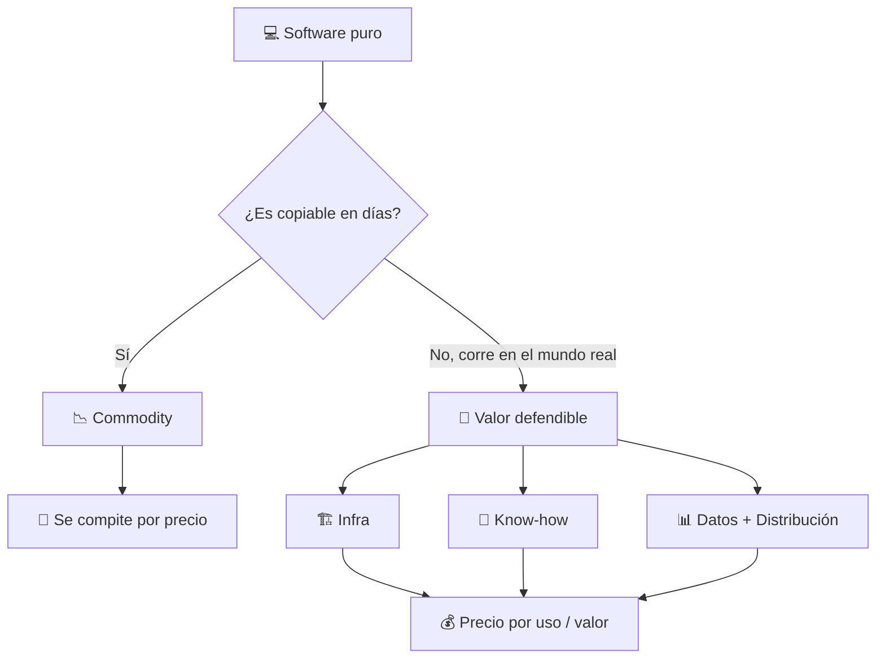
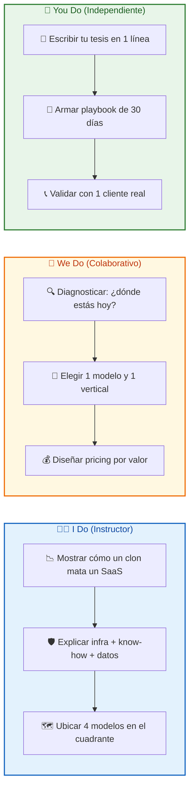
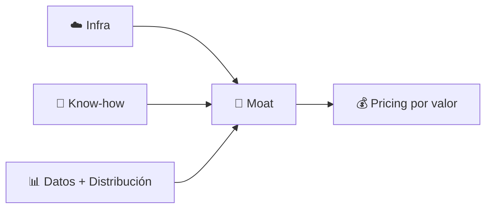
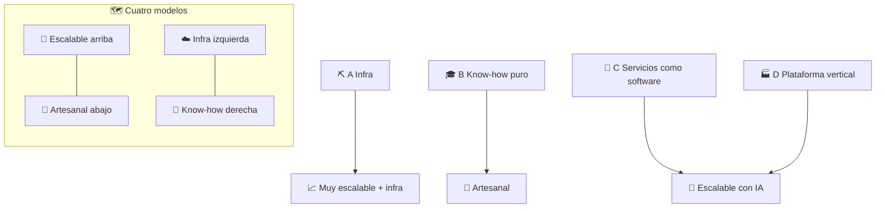
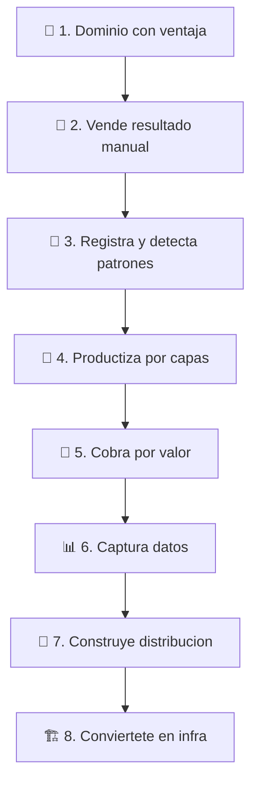

## 🎯 ¿Qué vas a aprender

En esta masterclass vas a cambiar tu forma de vender tecnología:

- 💡 La tesis en una línea: por qué el código se abarató y qué se paga bien
- 📉 Por qué el software solo perdió valor (y qué sigue valiendo)
- 🛡️ Los 3 activos defendibles: infra, know-how y datos + distribución
- 🗺️ Los 4 modelos: infra, know-how puro, servicios como software y plataforma vertical
- 💰 Cómo monetizar: por uso, por resultado, revenue share e implementación + licencia
- 🚀 Qué negocios están surgiendo y cómo montarte en la ola
- 🧭 El playbook de 8 pasos para armar tu propio negocio
- ❌ Errores comunes que te dejan vendiendo commodity
- 🇦🇷 El ángulo local: LatAm y Argentina como oportunidad

---

# 💎 MASTERCLASS: No vendas software. Vendé infra, vendé know-how

## 🎬 INTRODUCCIÓN: POR QUÉ ESTA MASTERCLASS ES DIFERENTE

La mayoría de los devs y agencias siguen vendiendo lo mismo: horas, features, apps.

El problema es que eso es exactamente lo que la IA hace más barato cada mes. 🤖📉

> **"No vendas software. Vendé infra, vendé know-how."**

No es un eslogan. Es una estrategia de supervivencia:

- ⚙️ Producir software es cada vez más barato y más fácil de copiar.
- 🏗️ Lo escaso —y lo que se paga bien— es lo que hace que el software **funcione en el mundo real**: la infraestructura sobre la que corre y el conocimiento para aplicarlo a un problema concreto.
- 🎯 El cliente no quiere software. Quiere un resultado: cobrar más rápido, reducir fraude, bajar costos logísticos, cumplir una norma.

> **🎓 Objetivo de Aprendizaje** — Al final de esta guía podrás explicar la tesis en 1 minuto, identificar en qué cuadrante está tu negocio, elegir un modelo de monetización por valor y armar un plan de 30 días para dejar de vender horas.

> **⚠️ Advertencia educativa** — Contenido formativo. No sustituye asesoría legal, fiscal ni financiera. Los ejemplos de precios y modelos son ilustrativos: validalos con tu mercado.

---

## 🗺️ MAPA DEL MODELO: DÓNDE ESTÁ EL VALOR



| 🧱 Capa | 📦 Qué vendés | 🧲 Por qué te pagan |
|-----------|---------------|---------------------|
| **💻 Software puro** | App, features, horas | Te comparan con un clon más barato |
| **☁️ Infra** | Rieles: pagos, cómputo, datos, identidad, integraciones | Sin vos no opera |
| **🧠 Know-how** | Cómo se resuelve X en la práctica | Ahorrás años de errores |
| **📊 Datos + Distribución** | Datos propietarios + acceso al cliente | Efecto red, cada uso te hace más fuerte |



---

## 📉 PARTE 1: POR QUÉ EL SOFTWARE SOLO PERDIÓ VALOR

### 🎯 1.1 La tesis en una línea

> **💡 Producir software es cada vez más barato y más fácil de copiar. Lo escaso, y por lo tanto lo que se paga bien, es lo que hace que el software funcione en el mundo real: la infraestructura sobre la que corre y el conocimiento para aplicarlo a un problema concreto.**

El software no murió. Cambió de rol:

- 🚗 Ya no es el producto, es el **vehículo**.
- 🏠 La infra es el **dónde corre**.
- 🧠 El know-how es el **por qué funciona**.

> Quien controla los dos últimos puede cambiar el primero cuando quiera. 🔑

### 🤖 1.2 El costo de escribir código tiende a cero

| 📌 Causa | 🔍 Qué pasa | 📉 Efecto en tu precio |
|----------|-------------|------------------------|
| **🤖 IA generativa** | Cualquiera replica una app en días | Tu diferencial "tenemos la app" es frágil |
| **⚡ Clones veloces** | Las features se copian antes que tu roadmap | El producto se comoditiza |
| **🧰 Low-code / no-code** | Un analista resuelve lo que antes pedía un dev | El ticket "form + DB + API" ya no necesita ingeniero |
| **🌐 Open-weight y SLM** | Modelos chicos corren en tu servidor o celular | La ventaja pasa de "tener modelo" a "tener datos y flujos" |

**Resultado:** si vendés "una app con IA" sin dominio ni datos propios, vendés lo más fácil de copiar. 🪞

### 💎 1.3 El cliente no quiere software, quiere resultado

El cliente te contrata porque:

- 🤕 Tiene un dolor que le cuesta plata: cobra lento, tiene fraude, pierde logística, incumple norma.
- ⏳ No tiene tiempo, equipo ni estructura para resolverlo solo.
- 🛡️ Necesita que alguien asuma el riesgo operativo, legal o técnico.

> **📌 Idea clave** — Si tu propuesta empieza por "hacemos un sistema con React y Node", vendés commodity. Si empieza por "💸 reducimos tu costo operativo 30% en 6 meses con servicio gestionado", vendés know-how.

### 🚨 1.4 Señales de que estás vendiendo commodity

| ❌ Señal | 😰 Por qué es un problema |
|----------|---------------------------|
| 🛠️ Tu propuesta empieza por tecnología, no por dolor | Compites por precio, no por valor |
| 📋 Te piden "una app similar a X" sin métricas | Te ven como intercambiable |
| 💸 Tu diferencial es "somos más baratos" | Siempre habrá alguien más barato offshore |
| 📦 Vendés el código y te desconectás | Sin recurrencia, sin relación, sin datos |
| 🧾 Tu portfolio es lista de tecnologías, no de resultados | El mercado compra transformaciones, no stacks |

### 🏋️ 1.5 I Do — El test del clon

**🎯 Objetivo:** en 5 minutos, saber si tu negocio es copiable.

| Paso | 🔨 Acción | 🎁 Resultado |
|------|-----------|--------------|
| 1️⃣ | Escribí qué vendés hoy en 1 frase | Oferta actual |
| 2️⃣ | Preguntate: ¿un clon con IA lo replica en 2 semanas? | Sí / No |
| 3️⃣ | Si es Sí → marcá qué te salvaría: infra, know-how o datos | Activo a construir |

### 🤝 1.6 We Do — Traducir features a resultados

**🎭 Escenario:** vendés "sistema de turnos con WhatsApp".

| 🛠️ Antes (feature) | 💎 Después (resultado) |
|---------------------|------------------------|
| App de turnos en React | 📉 Reducimos 40% inasistencias en clínicas |
| Panel admin + DB | ⏳ Ahorramos 15 hs/semana a recepción |
| Notificaciones | 💰 Recuperamos $X/mes en turnos perdidos |

### 📝 1.7 You Do — Tu tesis en 1 línea

```text
🎯 Mi cliente ideal:
__________________________________________________

🤕 Dolor caro que resuelvo:
__________________________________________________

💎 Resultado medible que vendo (no la app):
__________________________________________________
```

---

## 🛡️ PARTE 2: LOS TRES ACTIVOS QUE SÍ SON DEFENDIBLES

### 🏗️ 2.1 La tabla maestra

| 🏆 Activo | 📦 Qué es | 🧱 Por qué es difícil de copiar |
|-----------|-----------|---------------------------------|
| **☁️ Infra** | Rieles sobre los que otros construyen: pagos 💳, cómputo ⚡, datos 🗄️, identidad 🪪, integraciones 🔌, cumplimiento 📜 | Requiere capital, licencias, escala, confianza y años de operación |
| **🧠 Know-how** | Conocimiento aplicado de un dominio: cómo se resuelve X en la práctica | Está en la experiencia, los casos y los errores, no en el código |
| **📊 Datos + Distribución** | Datos propietarios generados por el uso + acceso directo al cliente | Se acumulan con el tiempo y crean efecto red 🔁 |

> **💡 Regla de oro** — Los mejores negocios combinan **al menos dos**. Infra sola se comoditiza. Know-how solo no escala. Datos solos sin distribución no llegan.



### ☁️ 2.2 Infra en detalle

Incluye:

- ☁️ Servicios gestionados: hosting, monitoreo 24/7, backups, updates.
- 🔄 Procesos: CI/CD, rollback, alertas, runbooks.
- 🔒 Seguridad y compliance: parches, accesos, auditoría.
- 📜 SLAs: uptime, tiempo de respuesta, tiempo de reparación.

El cliente paga porque **no quiere operarlo**. Quiere dormir tranquilo. 😴✅

**Dónde está el moat:** licencias, integraciones difíciles, confiabilidad, costos de cambio.

**Referencias conocidas:** Stripe 💳, Twilio 📩, Plaid 🏦, nube y cómputo para IA ☁️⚡.

### 🧠 2.3 Know-how en detalle

| 🧩 Tipo | 💼 Ejemplo | 💰 Cómo se cobra |
|---------|------------|------------------|
| **🏗️ Arquitectura** | Migración legacy → microservicios | Proyecto fijo + bonus |
| **📐 Gobernanza** | Modelo de riesgo, compliance | Consultoría por valor |
| **🛡️ Mitigación** | Auditoría, red teaming, performance | Por resultado / por día |
| **🧭 Estrategia** | Roadmap IA, selección de modelos | Retainer mensual |
| **🎓 Entrenamiento** | Capacitación, adopción | Por programa / licencia de método |

**Dónde está el moat:** reputación 🌟, casos reales 📚, marca personal o institucional.

**Límite:** si no lo productizás, escala con tus horas. ⏳❌

### 📊 2.4 Datos + distribución

- 📊 Datos propietarios: los genera el uso, nadie más los tiene (agro, logística, salud, energía).
- 📢 Distribución: contenido, comunidad, alianzas, canal directo al cliente.
- 🔁 Efecto red: cada cliente te da datos para mejorar el producto para el siguiente.

> **📌 Idea clave** — El know-how que no se ve no se vende. Sin distribución, el mejor experto es invisible.

---

## 🗺️ PARTE 3: EL MAPA MENTAL — CUATRO MODELOS

```
                    🚀 ESCALABLE
                        │
     ☁️ INFRA           │          💎 PLATAFORMA + KNOW-HOW
  (picks & shovels)     │      (vertical con datos propios)
                        │
 ───────────────────────┼───────────────────────
                        │
   🧠 KNOW-HOW PURO      │        🤖 SERVICIOS COMO SOFTWARE
 (consultoría, educación │     (vendés el resultado, la IA
  comunidades)          │      hace buena parte del trabajo)
                        │
                    🧵 ARTESANAL
```



| 🧭 Modelo | 🎯 Qué vendés | 💰 Cómo se cobra | 🛡️ Moat |
|-----------|---------------|------------------|----------|
| **⛏️ A) Infra** | Rieles, no el destino | Por uso: transacción, token, consulta, hora cómputo | Licencias, integraciones, confiabilidad |
| **🎓 B) Know-how puro** | Lo que sabés, empaquetado | Proyecto, retainer, comunidad, licencia de método | Reputación, casos, marca |
| **🤖 C) Servicios como software** | El trabajo hecho, no la herramienta | Por resultado: factura procesada, caso resuelto, lead calificado | Workflow + datos + supervisión experta |
| **🏭 D) Plataforma vertical** | Software de industria con saber embebido | Implementación + licencia recurrente | Producto que aprende del dominio |

### ⛏️ 3.1 A) Infra: picks & shovels

En la fiebre del oro ganó quien vendió las palas. ⛏️

**Qué es:** APIs de pagos 💳, identidad / KYC 🪪, mensajería 📩, cómputo / GPU ⚡, orquestación de agentes 🤖, observabilidad 📊, pipelines de datos 🗄️, banking-as-a-service 🏦.

**Ejemplos de lógica:** si sos dev, no hagas "otro CRM". Hacé el riel que 100 CRMs necesitan.

### 🎓 3.2 B) Know-how puro

**Qué es:** consultoría especializada, auditorías 🔍, formación 🎓, cohortes 👥, comunidades de pago 💬, certificaciones 🏅, metodologías licenciadas 📐.

**Cuándo funciona:** tenés ventaja injusta (experiencia, red, acceso a un problema).

**Riesgo:** te quedás en artesanal si nunca productizás.

### 🤖 3.3 C) Servicios como software

La categoría con más movimiento ahora. 🚀

En lugar de vender una herramienta para que el cliente haga el trabajo, **vendés el trabajo hecho**, ejecutado en gran parte por IA y supervisado por expertos.

**Lógicas típicas:** contabilidad 🧾, auditoría 🔍, compliance 📜, soporte 💬, cobranzas 💰, reclutamiento 👔, back-office legal ⚖️.

**Por qué es potente:** el mercado de servicios es mucho más grande que el de software, y cobrás por valor entregado. 💎

### 🏭 3.4 D) Plataforma vertical con know-how embebido

Software especializado en una industria, con conocimiento del sector incorporado y datos propios. 📊

**Modelo forward deployed:** ingenieros o expertos que se meten dentro del cliente para implementar y adaptar. Palantir popularizó este enfoque. 🛠️

**Moat:** el producto aprende del dominio y se vuelve difícil de reemplazar.

### 🏋️ 3.5 I Do — Ubicate en el mapa

| Paso | 🔨 Acción | 🎁 Resultado |
|------|-----------|--------------|
| 1️⃣ | Marcá dónde estás hoy: A, B, C o D | Posición actual |
| 2️⃣ | Marcá a dónde querés ir en 12 meses | Destino |
| 3️⃣ | Definí qué segundo activo te falta | Infra / Know-how / Datos |

---

## 💰 PARTE 4: CÓMO SE ESTÁ MONETIZANDO

### 💳 4.1 Los 5 modelos que importan

| 💰 Modelo | 📦 Cómo funciona | ✅ Cuándo usarlo | ⚠️ Riesgo |
|-----------|------------------|------------------|------------|
| **📊 Por uso** | Pagás por lo que consumís | Alinea ingresos con adopción | Si no hay uso, no hay ingreso |
| **🎯 Por resultado** | Fee o % por outcome | Podés medir impacto económico | Más riesgo, más upside |
| **🤝 Revenue share** | Te asociás y compartís beneficio | Cliente y vos ganan juntos | Necesita confianza total |
| **🏗️ Implementación + licencia** | Know-how al inicio, plataforma recurrente | Proyectos verticales | Implementación larga |
| **🎓 Capacitación y certificación** | El conocimiento se vuelve producto | Tenés reputación y método | Se copia si no hay comunidad |

> **🏆 Regla de oro** — Tu precio no es tu costo × markup. Tu precio es el **valor que el cliente percibe × la confianza que generás**. 💎

### 🔄 4.2 Ejemplo: de horas a retainer + resultado

**Situación:** freelance mantiene un e-commerce. 🛒

| 🕰️ Antes | 💎 Después |
|----------|------------|
| $80/hora × 10 hs = $800/mes | Retainer $2.500/mes: monitoreo 24/7, seguridad, soporte, optimización |
| Costo variable, discutible | Infraestructura crítica con SLA 📜 |
| Sin mejora comprometida | 2 mejoras/mes acordadas 🚀 |

**Resultado:** 3x ingresos, trabajo predecible, cliente estable. 📈

### 📝 4.3 You Do — Tu pricing por valor

```text
💰 Si mi cliente gana $100.000/mes con mi solución:
__________________________________________________

📊 Mi precio por uso / resultado sería:
__________________________________________________

🤝 Mi revenue share justo sería:
__________________________________________________
```

---

## 🚀 PARTE 5: NEGOCIOS QUE ESTÁN SURGIENDO

Oportunidades concretas para copiar, adaptar y combinar: 🧲

- 🤖 **Agentes IA verticales** que ejecutan trabajo completo: cobranzas, conciliación, atención.
- 🏭 **Roll-ups de servicios con IA:** comprar agencias o estudios tradicionales y volverlos rentables con automatización.
- 🛠️ **Infra para agentes:** identidad, pagos, permisos y auditoría para que una IA opere en nombre de una empresa.
- 📊 **Datos como servicio** en nichos: agro 🌱, logística 🚚, salud 🏥, energía ⚡.
- 💳 **Embedded finance:** cualquier empresa no financiera ofreciendo crédito o pagos.
- 🏢 **Consultoras de implementación IA** para pymes y empresas medianas.
- 👥 **Comunidades y educación de nicho** con acceso a red y casos reales.
- 📜 **Compliance como servicio,** sobre todo donde la norma cambia rápido.

| 🚀 Oportunidad | 🧩 Activos que combina | 💰 Monetización ideal |
|----------------|------------------------|-----------------------|
| Agentes verticales | Know-how + Datos | Por resultado |
| Roll-up con IA | Know-how + Infra | Revenue share + retainer |
| Infra para agentes | Infra pura | Por uso |
| Datos de nicho | Datos + Distribución | Suscripción + licencia |
| Embedded finance | Infra + Distribución | Por transacción |
| Compliance como servicio | Know-how + Infra | Implementación + licencia |

> **💡 Tip** — No persigas 8. Elegí 1 donde tengas ventaja injusta y profundizá 12 meses. 🎯

---

## 🧭 PARTE 6: PLAYBOOK PARA ARMAR TU PROPIO NEGOCIO

### 🪜 6.1 Los 8 pasos

| #️⃣ | 🧭 Paso | 🔨 Acción concreta | 🎁 Entregable |
|----|---------|--------------------|---------------|
| 1️⃣ | **🎯 Elegí dominio con ventaja injusta** | Experiencia, red, acceso a datos o problema vivido | 1 vertical elegida |
| 2️⃣ | **💼 Empezá vendiendo el resultado, aunque sea manual** | Primero servicio, después producto | 1 cliente pagando por outcome |
| 3️⃣ | **📝 Registrá todo y detectá qué se repite** | Lo repetido es lo automatizable | Lista de tareas repetitivas |
| 4️⃣ | **🧱 Productizá por capas** | Manual → semi-auto → plataforma | Roadmap de productización |
| 5️⃣ | **💎 Cobrá por valor** | Atá el precio al resultado, no a la hora | Propuesta por valor |
| 6️⃣ | **📊 Capturá datos propietarios** | Desde el primer cliente | Dataset propio |
| 7️⃣ | **📢 Construí distribución** | Contenido, comunidad, alianzas | Canal que te trae leads |
| 8️⃣ | **🏗️ Pasá de proveedor a infraestructura** | Integrate en la operación | Cliente que no puede sacarte en 1 semana |



**Semana 1-2 🔍 Diagnosticar:** listá tus últimos 10 proyectos. ¿Qué problema resolviste? ¿Cómo lo mediste?

**Semana 3-4 🎯 Elegir vertical:** no seas "Full Stack". Sé "el que resuelve X para Y". Ej: "🤕 reduzco 40% inasistencias en salud", "📦 reduzco 25% quiebres en retail".

**Semana 5-8 📦 Empaquetar:** playbook de 1 página + 2 casos antes/después con números.

**Semana 9-12 💰 Cambiar pricing:** de "te desarrollo app por $X" a "te automatizo proceso por $Y/mes con SLA".

### 📝 6.2 You Do — Tu playbook de 30 días

```text
🎯 Vertical elegida:
__________________________________________________

💼 Resultado que vendo manual primero:
__________________________________________________

📝 Qué voy a registrar cada semana:
__________________________________________________

💰 Mi precio por valor (no por hora):
__________________________________________________
```

---

## ❌ PARTE 7: ERRORES COMUNES

| ❌ Error | 💥 Consecuencia | ✅ Cómo evitarlo |
|----------|-----------------|------------------|
| 🏗️ Construir producto antes de validar que paguen por el resultado | Meses de código que nadie usa | Vende el servicio manual primero |
| 🤖 Vender "una app con IA" sin dominio ni datos | Te clonan en 2 semanas | Nicho + datos propios desde día 1 |
| 🧵 Quedarse en consultoría artesanal | Escala 1:1, te estancás | Productizá por capas |
| 🕰️ Cobrar por horas cuando la IA te hace eficiente | Te castigás por ser rápido | Fijo + bonus por resultado |
| 📜 Ignorar regulación y confianza | Perdés el moat más fuerte en infra | Compliance como ventaja, no como costo |
| 💸 Cobrar barato para conseguir clientes | Atraés clientes que exigen más y pagan menos | Precio mínimo desde día 1 |
| 📊 No medir impacto | No podés justificar precio | KPIs desde el inicio |

---

## 🇦🇷 PARTE 8: ÁNGULO LOCAL (ARGENTINA / LATAM)

Oportunidades donde la región es ventaja, no desventaja: 🚀

- 🌎 **Exportar know-how:** talento técnico y de servicios con costos competitivos para mercados más caros. No vendas horas, vendé equipos con metodología y resultados medibles. 📊
- 💳 **Infra financiera:** pagos, cambio de divisas, cobros internacionales y cumplimiento son problemas reales. Las soluciones tienen demanda inmediata.
- 🌱 **Verticales fuertes:** agro, minería ⛏️, energía ⚡, fintech 🏦, logística 🚚.
- 🤝 **Nearshore con valor agregado:** retainer + SLA + métricas, no "devs por hora".
- 📜 **Compliance regional:** AFIP, facturación electrónica, normativas cambiantes = barrera de entrada para outsiders, moat para locales. 🛡️

| 🇦🇷 Vertical LatAm | 🤕 Dolor real | 💎 Propuesta por valor |
|--------------------|---------------|------------------------|
| Agro 🌱 | Datos dispersos, decisiones tardías | Plataforma + datos de lote por suscripción |
| Fintech 🏦 | Cobros, FX, compliance | Infra de pagos + compliance como servicio |
| Logística 🚚 | Costos, trazabilidad | Agente IA de tracking por resultado |
| Pymes 🏪 | Back-office manual | Servicios como software por factura procesada |

---

## ✅ CHECKLIST FINAL DE PROFESIONALIZACIÓN

| 🧩 Área | ✅ Check |
|---------|----------|
| 🎯 Propuesta | Empieza por dolor y resultado, no por tecnología |
| 💳 Pricing | Al menos 1 servicio por valor, uso o retainer |
| 🧠 Know-how | Playbook o metodología propia documentada |
| 📊 Métricas | Medís impacto en cliente, no solo esfuerzo |
| 🏭 Vertical | Posicionado en 1 industria específica |
| ☁️ Infra | Servicio gestionado, no solo entrega de código |
| 🔁 Recurrencia | >50% ingresos recurrentes |
| 🤖 Automatización | Procesos que corren sin tu intervención |
| 📊 Datos | Capturás datos propietarios desde día 1 |
| 🌟 Referencias | 3+ casos con números antes/después |
| 💎 Precio | Competís por resultados, no por precio |

---

## 📝 PREGUNTAS DE VERIFICACIÓN

### 🔍 Aplica

1. **Aplica:** si mañana alguien copia tu software, ¿qué te sigue diferenciando? ¿Infra, know-how, datos o nada?
2. **Aplica:** ¿tu cliente te paga por lo que hacés o por lo que logra gracias a vos? Reescribí tu oferta en términos de resultado.

### 🔬 Analiza

3. **Analiza:** ¿por qué Stripe o un proveedor de infra es más difícil de reemplazar que "una app"? ¿Qué costos de cambio genera?
4. **Analiza:** compará cobrar por hora vs. por resultado en un caso real tuyo. ¿Dónde ganás y dónde perdés?

### 🎨 Diseña

5. **Diseña:** elegí una vertical (agro, salud, legal, retail) y diseñá una oferta C) Servicios como software: ¿qué trabajo vendés hecho? ¿Cómo lo cobrás por resultado?

### 💭 Reflexiona

6. **Reflexiona:** ¿qué sabés vos que a un competidor le llevaría años aprender? ¿Cómo lo productizás en 90 días?
7. **Reflexiona:** ¿qué datos genera tu operación que nadie más tiene? ¿Cómo los capturás?

### 🧩 Integra

8. **Integra:** ¿sos reemplazable en una semana o estás integrado en su operación? ¿Qué te falta para ser infraestructura del cliente?

---

## 📖 GLOSARIO RÁPIDO

| 📚 Término | 📝 Definición |
|------------|---------------|
| **📦 Comoditización** | Cuando un producto se vuelve intercambiable y solo compite por precio |
| **☁️ Infra** | Rieles gestionados sobre los que corre el negocio: pagos, cómputo, datos, identidad |
| **🧠 Know-how** | Conocimiento aplicado que no está en el código: experiencia, casos, errores |
| **📊 Datos propietarios** | Datos generados por tu operación que nadie más tiene |
| **⛏️ Picks & shovels** | Vender herramientas e infra en vez del producto final |
| **🤖 Servicios como software** | Vender el trabajo hecho (con IA + expertos), no la licencia |
| **🏭 Vertical** | Industria o nicho donde aplicás tu know-how |
| **🚀 Forward deployed** | Meterse dentro del cliente para implementar y adaptar (estilo Palantir) |
| **💰 Pricing por valor** | Cobrar por impacto económico, no por costo u horas |
| **🤝 Revenue share** | Compartir el beneficio generado con el cliente |
| **📜 SLA** | Acuerdo de nivel de servicio: uptime, respuesta, reparación |
| **🔁 Efecto red** | Cada nuevo usuario hace más valioso el producto para todos |

---

## 🎯 PLAN DE ACCIÓN INMEDIATO (ESTA SEMANA)

| Día | Acción |
|-----|--------|
| 🗓️ Lunes | Escribí tu tesis en 1 línea: qué resultado vendés y a quién. |
| 🎯 Martes | Elegí 1 vertical donde tengas ventaja injusta. Listá 3 dolores caros. |
| 💼 Miércoles | Armá una oferta de servicio manual por resultado (sin código nuevo). |
| 📞 Jueves | Validá con 1 cliente o prospecto. Escuchá, no vendas. |
| 📝 Viernes | Registrá qué se repitió. Eso es lo primero a automatizar. |

---

## 🏁 REFLEXIÓN FINAL

> 🚀 El software es el **cómo**. La infra es el **dónde corre**. El know-how es el **por qué funciona**. Quien controla los dos últimos puede cambiar el primero cuando quiera.

El mercado no paga por código. Paga por **🎯 problemas resueltos, 🛡️ riesgo mitigado y 📊 resultados medibles**.

Tu carrera no avanza por saber más frameworks. Avanza por saber **resolver dolores más caros, para clientes que pueden pagarlos, con un modelo que escale**.

- ☁️ **Infra** te hace indispensable.
- 🧠 **Know-how** te hace incopiable.
- 📊 **Datos + distribución** te hacen escalar.

> **📌 Idea clave** — El profesional que sobrevive no es el que escribe más código. Es el que puede **ponerle nombre, métrica y precio al problema del cliente**, y resolverlo con la herramienta adecuada: código, IA o lo que sea. 💎
