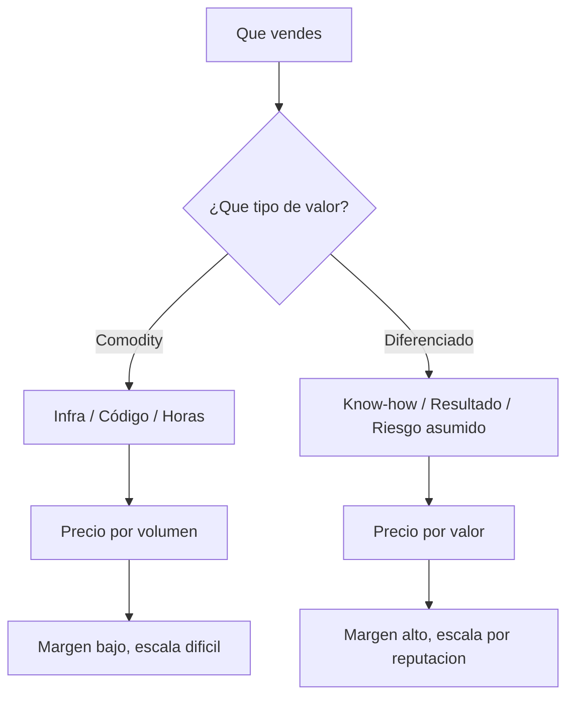
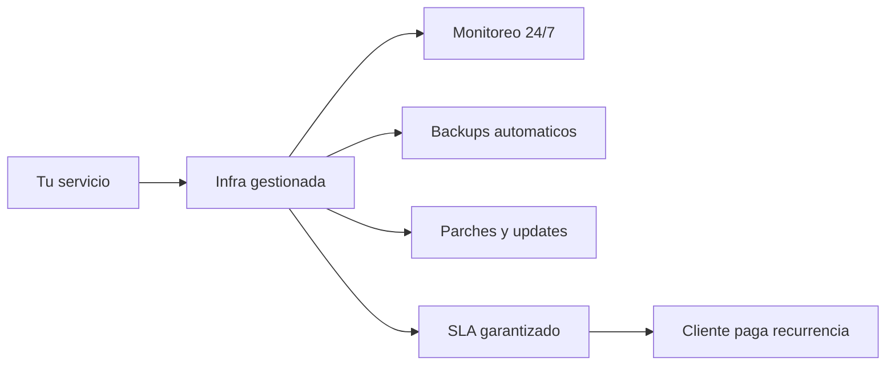
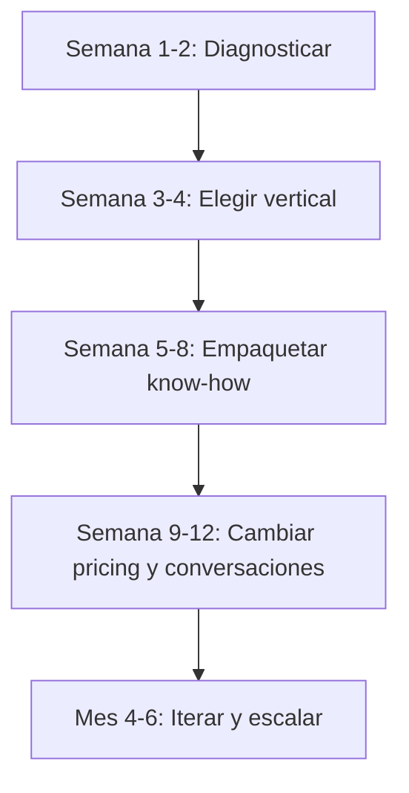
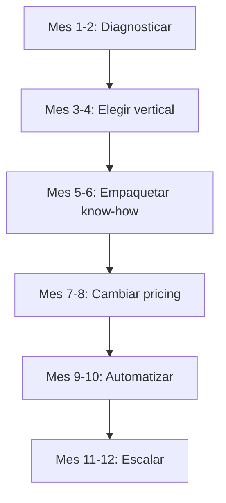

# MASTERCLASS: No vendas software, vende infra y know-how

## 🎯 Introducción: el cambio de paradigma

Hay una frase que se repite en consultorios de empresas y en comunidades de devs desde 2024, pero que en 2026 se volvió urgente:

> **"No vendas software. Vendé infra, vendé know-how."**

No es un eslogan. Es la descripción de un movimiento estructural:

- El **código se abarató**.
- Las **herramientas de IA generan boilerplate** a velocidad humana.
- Los **clientes no quieren un .zip ni un repo**; quieren un problema resuelto, medido y con soporte.
- Los **modelos de precios por hora** se volvieron contraproducentes: premian la lentitud y ocultan el valor real.

Esta guía recorre **qué está pasando en el mercado**, por qué el software puro se está comoditizando, y cómo armar **un plan de carrera y un modelo de negocio** alrededor de la infraestructura, el conocimiento y el valor entregado.

> **Objetivo de Aprendizaje** — Al finalizar, podrás explicar por qué el modelo "vendo horas de desarrollo" es riesgoso en 2026, diferenciar infra/comodity de know-how/valor, y armar un plan de 90 días para migrar tu propuesta de valor y tu pricing.

> **Advertencia** — Algunos datos de mercado son de conocimiento general del rubro y no pudieron verificarse con fuentes primarias en el momento de escribir esta guía. Marcá con **[Verificar]** lo que necesites confirmar antes de usarlo en una presentación o propuesta comercial.

---

## 🗺️ Mapa mental: el stack de tu negocio

| Capa | Qué es | Ejemplo |
|------|--------|---------|
| **Software puro** | Código, librerías, plantillas | Un template, un módulo, un bot |
| **Infra** | Servicio gestionado, hosting, operación 24/7 | Un servicio monitoreado, un pipeline de CI/CD gestionado |
| **Know-how** | Conocimiento aplicado, arquitectura, gobernanza, mitigación de riesgo | Un modelo de riesgo, una migración, un plan de compliance |

---

## 📉 PARTE 1: Por qué el software puro se está comoditizando

### 1.1 La ley de la oferta digital

El código tiene un costo marginal de reproducción cercano a cero. En 2026, sumale tres factores:

| Factor | Qué pasó | Impacto en el precio del software |
|--------|----------|----------------------------------|
| **IA generativa** | Los modelos escriben boilerplate, tests, migraciones y hasta arquitecturas completas a velocidad humana | El "escribir código" dejó de ser el cuello de botella |
| **Open-weight y SLM** | Modelos chicos corren en tu propio servidor o celular; el costo de inference domina, no el desarrollo | La ventaja competitiva pasó de "tener un modelo" a "tener datos y flujos" |
| **Plataformas low-code/no-code** | Herramientas que antes requerían un dev ahora las resuelve un analista | El ticket de "crear un form + DB + API" se resolvió sin un ingeniero |

**Resultado:** lo que antes se vendía como "desarrollo a medida" hoy es commodity en 48 horas. El cliente lo sabe; los proveedores que siguen facturando por horas de código están en una carrera hacia el fondo.

### 1.2 El mercado no paga por código; paga por resultados

Un cliente no contrata un desarrollo porque sí. Contrata porque:

- Tiene un problema que le duele.
- No tiene el expertise, el tiempo o la estructura para resolverlo solo.
- Necesita que alguien asuma el riesgo operativo, legal o técnico.

El **código es el medio**, no el fin. El fin es el resultado medible.

> **📌 Idea clave** — Si tu propuesta comercial empieza por "hacemos un sistema con React y Node", estás vendiendo commodity. Si empieza por "reducimos tu costo operativo un 30% en 6 meses con un servicio gestionado", estás vendiendo know-how.

### 1.3 Señales de que estás vendiendo commodity

| Señal | Por qué es un problema |
|-------|------------------------|
| Tu propuesta empieza por la tecnología, no por el dolor del cliente | Estás compitiendo por precio, no por valor |
| Te piden presupuesto por "una app similar a X" sin métricas | El cliente ve tu trabajo como intercambiable |
| Tu diferenciador es "somos más baratos" | No hay defensa ante un competidor que subcontrate más lejos |
| Vendés el código y te desconectás | No generas recurrencia, no conoces el negocio del cliente |
| Tu portfolio es una lista de tecnologías, no de resultados | El mercado no compra tecnologías; compra transformaciones |

---

## 🏗️ PARTE 2: La trinidad — infra, know-how y resultado

### 2.1 Infra: lo que se puede gestionar y escalar

La **infraestructura** en sentido amplio incluye:

- Servicios gestionados (hosting, monitoreo, backups, actualizaciones).
- Procesos operativos (CI/CD, rollback, alertas, runbooks).
- Seguridad y compliance (parches, accesos, auditoría).
- Acuerdos de nivel de servicio (SLAs, time-to-repair, uptime).

El cliente paga por esto porque **no quiere operarlo**. Quiere dormir tranquilo.

**Modelo de negocio:** suscripción mensual o anual. Puede ser por activo, por usuario o por volumen. El margen mejora con la escala y la estandarización.

### 2.2 Know-how: lo que no se descarga de GitHub

El **know-how** es el conocimiento acumulado que solo vos (o tu equipo) tiene:

| Tipo | Ejemplo | Cómo se cobra |
|------|---------|---------------|
| **Arquitectura** | Diseño de un sistema escalable, migración de legacy | Proyecto fijo o retainer |
| **Gobernanza** | Modelo de riesgo, compliance, políticas de datos | Consultoría por valor |
| **Mitigación** | Red teaming, auditoría de seguridad, optimización de performance | Por resultado o por día |
| **Estrategia** | Roadmap de IA, selección de modelos, ruteo de agentes | Retainer mensual |
| **Entrenamiento** | Capacitación de equipos, adopción de herramientas | Por programa o por hora |

**Modelo de negocio:** proyectos fijos, retainers mensuales, o pricing por valor (cuando podés atar el cobro al beneficio medible del cliente).

### 2.3 Resultado: el único lenguaje que el cliente entiende

El resultado es la métrica que el cliente usa para justificar tu pago a su jefe:

- Reducción de costos operativos.
- Tiempo de procesamiento disminuido.
- Tasa de error bajada.
- Ingresos generados por un funnel que antes no existía.

Si no podés medirlo, no podés venderlo a precio de valor.

---

## 💼 PARTE 3: Los tres modelos de negocio

### 3.1 Servicios gestionados (Infra)

| Aspecto | Detalle |
|---------|---------|
| **Qué vendés** | Operación 24/7, monitoreo, mantenimiento, soporte |
| **Pricing** | Suscripción mensual (por usuario, por activo, por volumen) |
| **Ejemplo** | Un SaaS de facturación electrónica gestionada: el cliente no sabe (ni le importa) en qué lenguaje está escrito; le importa que las facturas salgan a tiempo y no se caiga en AFIP |
| **Margen** | Mejora con la escala y la estandarización |
| **Riesgo** | La calidad del servicio se vuelve la métrica principal; un incidente puede costar el cliente |

### 3.2 Consultoría por valor (Know-how)

| Aspecto | Detalle |
|---------|---------|
| **Qué vendés** | Decisiones correctas, evitando caminos caros y errores costosos |
| **Pricing** | Por proyecto (fijo), por retainer mensual, o por valor (cuando podés medir el impacto) |
| **Ejemplo** | Un arquitecto que diseña la migración de un legacy a microservicios, cobrando un fijo y un bonus si reduce el costo operativo un 20% |
| **Margen** | Alto, porque el costo es tiempo + experiencia, no infra |
| **Riesgo** | Necesitás credibilidad y referencias; el "por valor" requiere confianza |

### 3.3 Producto/Platform (Infra + Know-how empaquetado)

| Aspecto | Detalle |
|---------|---------|
| **Qué vendés** | Una solución vertical que resuelve un problema específico |
| **Pricing** | Suscripción + setup + soporte premium |
| **Ejemplo** | Un sistema de gestión de inventario para PYMEs de retail, con actualizaciones automáticas, soporte y cumplimiento de normativas locales |
| **Margen** | Muy alto en escala; muy caro en desarrollo inicial |
| **Riesgo** | Necesitás dominio del negocio, no solo tecnología |

---

## 🗺️ PARTE 4: Cómo migrar de "vendedor de horas" a "vendedor de valor"

### 4.1 El diagnóstico: ¿dónde estás hoy?

| Pregunta | Si tu respuesta es sí... | Estás... |
|----------|--------------------------|----------|
| ¿Tu presupuesto empieza por horas estimadas? | Sí | Vendiendo commodity |
| ¿Tu diferenciador es precio o velocidad? | Sí | En carrera hacia el fondo |
| ¿El cliente pide un .zip, un repo o un deploy? | Sí | Vendiendo software puro |
| ¿Te desconectás después de entregar? | Sí | Sin recurrencia |
| ¿Tu portfolio es una lista de tecnologías? | Sí | Sin historia de resultados |

### 4.2 El plan de migración: 90 días

**Semana 1-2: Diagnosticar tu posición actual**

| Acción | Entregable |
|--------|------------|
| Listá tus últimos 10 proyectos | ¿Qué problema resolviste? ¿Cómo lo mediste? |
| Identificá qué repetís | ¿Hay un patrón que podés empaquetar? |
| Analizá tu mercado | ¿Qué vertical tenés más experiencia? |
| Mapeá tu know-how | ¿Qué sabés hacer que un junior tarda 6 meses en aprender? |

**Semana 3-4: Elegir una vertical**

No seas "desarrollador Full Stack". Sé "el tipo que resuelve X para industrias Y".

Ejemplos:

| Vertical | Problema específico | Tu propuesta |
|----------|---------------------|--------------|
| Salud | Pacientes pierden tiempo en turnos | "Automatizo la agenda y reduzco un 40% las inasistencias" |
| Retail | Inventario desactualizado | "Integro stock en tiempo real y reduzco quiebres un 25%" |
| Legal | Contratos se pierden en carpetas | "Digitalizo contratos con búsqueda semántica y alertas de vencimiento" |
| Construcción | Presupuestos en Excel que se rompen | "Automatizo presupuestos y reduzco errores un 60%" |

**Semana 5-8: Empaquetar know-how**

1. **Documentá tu proceso:** escribí un playbook de cómo resolvés el problema.
2. **Creá un producto mínimo viable (PMV) de know-how:** no es código; es una propuesta, una plantilla, un diagnóstico.
3. **Definí métricas de éxito:** qué medís, cómo, cada cuánto.
4. **Armá casos de estudio:** antes/después, con números.

**Semana 9-12: Cambiar pricing y conversaciones**

| Antes | Después |
|-------|---------|
| "Desarrollo una app por $X" | "Automatizo tu proceso por $Y/mes, con SLA y soporte" |
| "Cobro $Z por hora" | "Cobro un fijo por resultado, con bonus si superas la meta" |
| "Te entrego el código" | "Te entrego un servicio gestionado, con monitoreo y mejoras continuas" |
| "Tengo experiencia en React" | "Reduje el tiempo de carga un 35% en 3 clientes de retail" |

**Mes 4-6: Iterar y escalar**

- Automatizá lo repetitivo (tu know-how empaquetado en scripts, plantillas, servicios).
- Sumá clientes en la misma vertical: cada nuevo cliente te da datos para mejorar el producto.
- Subí el precio a medida que tenés referencias y métricas.

---

## 💵 PARTE 5: Pricing — cómo cobrar lo que vales

### 5.1 Los modelos que existen (y cuándo usarlos)

| Modelo | Cuándo usarlo | Riesgo |
|--------|---------------|--------|
| **Por hora** | Consultoría pura, sin garantía de resultado | Premia la lentitud, genera desconfianza |
| **Por proyecto (fijo)** | Alcance claro y cerrado | Si el cliente cambia de opinión, comés el costo |
| **Por retainer mensual** | Servicio gestionado, soporte, mejoras continuas | Necesitás definir SLAs y alcance explícito |
| **Por valor (outcome-based)** | Podés medir el impacto económico | Necesitás credibilidad y un mecanismo de medición independiente |
| **Híbrido** | Fijo + bonus por resultado | Balance entre seguridad y motivación |

### 5.2 La regla de oro

> **Tu precio no es tu costo × markup. Tu precio es el valor que el cliente percibe × la confianza que generás.**

Si un cliente gana $100.000/mes con tu solución y tu costo es $5.000, el rango de precio razonable no es $6.000; es $15.000 a $40.000, dependiendo de cuánto confíe en que lo vas a sostener en el tiempo.

### 5.3 Ejemplo práctico: de horas a retainer

**Situación:** un dev freelance hace mantenimiento de un e-commerce.

| Antes | Después |
|-------|---------|
| Cobra $80/hora, 10 horas/mes = $800/mes | Retainer de $2.500/mes por monitoreo 24/7, actualizaciones de seguridad, soporte y optimización continua |
| El cliente lo ve como costo variable | El cliente lo ve como infraestructura crítica |
| Si hay un problema, discuten si entra en las horas | El SLA define tiempo de respuesta y reparación |
| Sin compromiso de mejora | Incluye 2 mejoras por mes, acordadas al inicio |

**Resultado:** el dev pasa de facturar $800/mes a $2.500/mes, con un trabajo más predecible y un cliente más estable.

---

## 📈 PARTE 6: Plan de carrera — de dev a profesional de valor

### 6.1 Los tres niveles

| Nivel | Enfoque | Pricing | Ejemplo |
|-------|---------|---------|---------|
| **1. Ejecutor** | Hace lo que le piden | Por hora | "Desarrollo una feature por $X" |
| **2. Solucionador** | Resuelve problemas específicos | Por proyecto | "Automatizo tu proceso por un fijo" |
| **3. Asesor de valor** | Define qué hay que resolver y por qué | Por valor / retainer | "Diseño tu estrategia de datos y la implemento por un fijo + bonus" |

### 6.2 Habilidades que hay que desarrollar

| Habilidad | Por qué importa | Cómo se adquiere |
|-----------|----------------|------------------|
| **Arquitectura de sistemas** | Porque el know-how está en el diseño, no en el código | Diseñar sistemas propios, estudiar patrones, migrar legacy |
| **Gestión de riesgo** | Los clientes pagan para no sufrir | Certificaciones, experiencia en producción, red teaming |
| **Comunicación comercial** | Saber vender sin sonar técnico | Escuchar primero, hablar en términos de negocio |
| **Domain knowledge** | El know-how específico de la industria | Trabajar en verticales, no ser generalista para todos |
| **Automatización** | Empaquetar know-how en servicios escalables | Crear scripts, pipelines, productos mínimos |

### 6.3 Hoja de ruta de 12 meses

| Mes | Objetivo | Entregable |
|-----|----------|------------|
| 1-2 | Diagnosticar | Mapa de skills + mercado objetivo |
| 3-4 | Elegir vertical | 1-2 industrias donde tengas ventaja |
| 5-6 | Empaquetar know-how | Playbook + 2 casos de estudio |
| 7-8 | Cambiar pricing | De horas a retainer o fijo en al menos 1 cliente |
| 9-10 | Automatizar | Un servicio gestionado con monitoreo y SLA |
| 11-12 | Escalar | 3-5 clientes en la misma vertical, referencias y metrics |

---

## 📊 PARTE 7: Casos de estudio (ejemplos para adaptar)

### 7.1 De dev freelance a servicio gestionado

**Antes:** un desarrollador mantenía 3 sitios WordPress para clientes, cobrando $50/hora por incidentes y cambios.

**Después:** empaquetó el servicio como "WebOps": monitoreo 24/7, actualizaciones de seguridad semanales, backup diario, soporte por Slack, y un reporte mensual de performance. Pricing: $1.200/mes por sitio.

**Resultado:** pasó de ingresos variables de $1.500/mes a $3.600/mes estables, con menos horas porque automatizó las tareas repetitivas.

### 7.2 De estudio de software a consultoría de valor

**Antes:** un equipo hacía desarrollos a medida para fintechs, compitiendo por precio contra offshore.

**Después:** se especializaron en compliance y seguridad de APIs para fintechs en Argentina. Ofrecen: auditoría de arquitectura, diseño de controles, capacitación y un retainer mensual de seguimiento. Pricing: proyectos de $15.000 a $50.000 + retainer de $3.000/mes.

**Resultado:** cerraron 4 clientes en 8 meses, con márgenes del 60% porque el know-how es el producto.

### 7.3 De SaaS commodity a plataforma con servicio

**Antes:** un SaaS de gestión de gastos para PYMEs competía contra decenas de alternativas por $10/usuario/mes.

**Después:** se enfocaron en estudios contables. Ofrecen el SaaS + implementación personalizada + capacitación del equipo contable + soporte prioritario. Pricing: $30/usuario/mes + setup de $2.000. Los contadores lo recomiendan a sus clientes.

**Resultado:** pasaron de churn rate del 8% al 2%, con un canal de ventas indirecto y un precio 3x mayor.

---

## ❌ PARTE 8: Errores comunes

| Error | Consecuencia | Cómo evitarlo |
|-------|--------------|---------------|
| **Vender horas porque es lo que conocés** | Te estancás en un modelo de escala 1:1 | Empezar a cobrar proyectos o retainers desde el primer cliente que puedas |
| **Especializarse demasiado rápido sin experiencia** | No podés demostrar resultados | Tener 2-3 casos de la vertical antes de declararte experto |
| **Cobrar barato para conseguir clientes** | Atraés clientes que valoran poco y te exigen más | Establecer precios mínimos desde el día 1 |
| **No medir el impacto** | No podés justificar el precio ni mejorar el servicio | Definir KPIs desde el inicio del proyecto |
| **Depender de un solo cliente** | Riesgo de ruina si se va | Diversificar en la misma vertical, no en industrias nuevas |
| **Dejar de aprender la tecnología** | El know-worth se deprecia | Dedicar 10% del tiempo a investigación y experimentación |

---

## ✅ PARTE 9: Checklist de profesionalización

| Área | Check |
|------|-------|
| **Propuesta de valor** | Empieza por el dolor del cliente, no por la tecnología |
| **Pricing** | Hay al menos un servicio con pricing por valor o retainer |
| **Know-how** | Tenés documentado un playbook o metodología propia |
| **Métricas** | Medís el impacto en el cliente, no solo tu esfuerzo |
| **Vertical** | Estás posicionado en una industria específica |
| **Infra** | Ofrecés servicio gestionado, no solo entrega de código |
| **Recurrencia** | Más del 50% de los ingresos viene de clientes recurrentes |
| **Automatización** | Hay procesos que se ejecutan sin tu intervención directa |
| **Referencias** | Tenés 3+ casos de estudio con números |
| **Precio** | No competís por precio; competís por resultados |

---

## ❓ PARTE 10: PREGUNTAS DE VERIFICACIÓN

1. **Diagnóstico:** ¿tu propuesta comercial actual empieza por la tecnología o por el problema del cliente?
2. **Pricing:** ¿cuál es el porcentaje de tus ingresos recurrentes vs. proyectos one-shot?
3. **Know-how:** ¿podrías escribir un playbook de cómo resolvés el problema que resolvés mejor?
4. **Infra:** ¿el cliente depende de vos para operar, o solo para desarrollar?
5. **Resultado:** ¿medís el impacto de tu trabajo en el negocio del cliente?
6. **Vertical:** ¿en qué industria tenés más experiencia o contactos?
7. **Escala:** si conseguís 10 clientes nuevos mañana, ¿podrías atenderlos sin trabajar más horas?
8. **Precio:** si un cliente gana $200.000/mes con tu solución, ¿cuánto le cobrás?
9. **Competencia:** ¿cuál es tu diferenciador más allá del precio?
10. **Visión:** ¿en 3 años querés ser un estudio de 50 personas o una consultora boutique de 5?

---

## 📚 Glosario

| Término | Definición en 1 línea |
|---------|-----------------------|
| **Comoditización** | Cuando un producto o servicio se vuelve intercambiable y el precio deja de ser diferenciador |
| **Infraestructura (en el contexto de servicios)** | Servicio gestionado que el cliente consume sin preocuparse por la operación interna |
| **Know-how** | Conocimiento aplicado, experiencia y procesos que no se descargan de internet |
| **Retainer** | Pago recurrente (mensual/anual) por acceso continuo a un servicio o expertise |
| **SLA (Service Level Agreement)** | Acuerdo que define el nivel de servicio esperado (uptime, tiempo de respuesta, etc.) |
| **Pricing por valor** | Modelo de precios basado en el impacto económico del servicio, no en el costo de producción |
| **Vertical** | Industria o nicho específico donde aplicás tu know-how |
| **PMV (Producto Mínimo Viable)** | Versión mínima de un producto o servicio que resuelve un problema concreto |
| **Churn rate** | Porcentaje de clientes que cancelan un servicio en un período |
| **Margen** | Diferencia entre el precio de venta y el costo de prestar el servicio |

---

## 📎 Fuentes Y REFERENCIAS PARA INVESTIGAR

Dado que no pudimos acceder a datos primarios en tiempo real, esta sección te sugiere **dónde buscar información actualizada** para fundamentar tus decisiones:

| Tema | Dónde buscar |
|------|--------------|
| **Comoditización del código** | Informes de Gartner y Forrester sobre "low-code/no-code" y "AI-assisted development" |
| **Mercado de servicios gestionados** | Estudios de IDC, MarketsandMarkets, Statista sobre "managed IT services" y "managed cloud services" |
| **Precio por valor en consultoría** | Artículos de Harvard Business Review sobre "value-based pricing" y "outcome-based contracts" |
| **Impacto de la IA en precios de desarrollo** | Reportes de Stack Overflow Developer Survey, JetBrains State of Developer Ecosystem, y blogs de consultoras como ThoughtWorks |
| **Tendencias de modelos de negocio en software** | Informes de SaaS Capital, OpenView, y contenido de Jason Cohen (founder de WP Engine) sobre pricing |
| **Datos de mercado 2026** | Buscar "software development pricing trends 2026" en Google con filtro de fecha |

> **Nota:** Esta guía se apoya en conocimiento general del mercado de tecnología y servicios profesionales. Antes de usarla en una presentación formal o propuesta comercial, verificá los datos cuantitativos con fuentes actuales.

---

## 🎯 Plan de acción inmediato (PARA HACER ESTA SEMANA)

| Día | Acción |
|-----|--------|
| Lunes | Listá tus últimos 5 proyectos. Escribí 1 oración por cada uno: qué problema resolviste, cómo lo mediste, qué valor generó. |
| Martes | Elegí 1 vertical donde tengas experiencia o contactos. Escribí 3 dolores específicos de esa industria. |
| Miércoles | Armá un playbook de 1 página de cómo resolvés uno de esos dolores. |
| Jueves | Definí un retainer o proyecto fijo para un cliente actual o potencial. Escribí la propuesta en términos de valor, no de horas. |
| Viernes | Hacé 1 llamada o reunión para validar la propuesta. No vendas; escuchá primero. |

---

## 🏁 Cierre

El mercado no paga por código. Paga por **problemas resueltos, riesgo mitigado y resultados medibles**.

El código es el medio. La infra es el servicio que permite dormir tranquilo. El know-how es lo que hace que un problema no se repita.

Tu carrera no avanza por saber más frameworks. Avanza por saber **resolver dolores más caros, para clientes que pueden pagarlos, con un modelo de negocio que escale**.

> **📌 Idea clave** — El profesional que sobrevive a la comoditización no es el que escribe más código. Es el que puede **ponerle nombre, métrica y precio al problema del cliente**, y luego resolverlo con la herramienta adecuada — código, IA o lo que sea.

