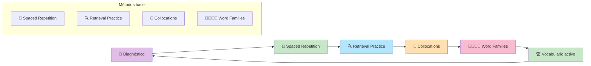

# Masterclass: Vocabulario A1-A2 - Aprender Palabras con Métodos Científicos 📚🔬🇬🇧

> **La premisa central de esta guía** — Aprender vocabulario no es memorizar listas: es construir redes de palabras en tu cerebro usando retrieval practice, spaced repetition y contexto. Esta guía te muestra el camino científico para pasar de 0 a 1.000 palabras activas en A1-A2.

## Antes de empezar: 🎯 ¿qué vas a poder hacer al terminar esta guía?

Al terminar de leer y **aplicar** esta guía vas a poder:

- Entender por qué memorizar listas de palabras no funciona.
- Aplicar 4 métodos científicos probados para aprender vocabulario (SRS, retrieval practice, collocations, word families).
- Aprender las 300 palabras esenciales de A1 y las 700 palabras esenciales de A2.
- Usar herramientas como Anki y Quizlet para automatizar el repaso.
- Construir un sistema de vocabulario que se mantenga sin esfuerzo a largo plazo.

---

## MAPA DEL WORKFLOW 🔄



---

## PARTE 1 — 🚨 Por qué memorizar listas de palabras no funciona

### El mito: "necesito memorizar 100 palabras por día"

Muchos estudiantes creen que aprender vocabulario es sentarse y memorizar listas de palabras con sus traducciones. **Falso.**

Memorizar listas no funciona porque:
1. **Genera vocabulario pasivo, no activo:** reconocés la palabra cuando la ves, pero no la podés usar al hablar.
2. **No genera redes de asociación:** las palabras aisladas no se conectan entre sí.
3. **Olvidás rápido:** sin repaso espaciado, olvidás el 80% de las palabras en 24 horas.
4. **No aprendés a usarlas:** una palabra sin contexto es como una herramienta sin manual de uso.

### La métrica real del vocabulario en A1-A2

| Nivel | Vocabulario activo | Vocabulario pasivo | Cobertura del inglés oral |
|-------|-------------------|-------------------|--------------------------|
| **A1** | 300 palabras | 500-800 palabras | 65% |
| **A2** | 1.000 palabras | 1.500-2.000 palabras | 80-85% |

### El diagnóstico rápido

Hacé este test de 2 minutos:
1. Escribí 10 oraciones sobre tu trabajo sin consultar diccionario.
2. Contá cuántas palabras diferentes usaste.
3. Si usaste menos de 100 palabras distintas: estás en A1.
4. Si usaste entre 100-300 palabras distintas: estás en A2.
5. Si usaste más de 300: estás en B1 o superior.

---

## PARTE 2 — 🔬 Los métodos científicos que usaremos

### Método 1: 📅 Spaced Repetition (Ebbinghaus, 1885)

> **Principio:** repasar en intervalos crecientes genera retención a largo plazo mucho mayor que repasar todo en un solo día.

**En la práctica:**
- **Día 1:** aprendé 10 palabras nuevas.
- **Día 2:** repasá las 10 palabras.
- **Día 4:** repasá las palabras que te costaron.
- **Día 7:** repasá las palabras que te costaron.
- **Día 14:** repasá las palabras que te costaron.
- **Día 30:** repasá las palabras que te costaron.

> **📊 Datos científicos:** un meta-análisis de 2023 (Webb) muestra que el **spaced practice** (múltiples sesiones) tiene un efecto mayor que la práctica masiva en tests demorados. Apps como **Anki** y **Quizlet** automatizan estos intervalos.

### Método 2: 🔍 Retrieval Practice (Bjork & Bjork, 2011)

> **Principio:** intentar recordar sin ayuda es más efectivo que volver a leer.

**En la práctica:**
- Después de aprender una palabra, cerrá el listado e intentá recordarla.
- Hacé flashcards donde el esfuerzo está en recordar, no en reconocer.
- Escribí frases sin mirar el vocabulario.

> **📊 Datos científicos:** el **retrieval practice** mejora la retención a largo plazo más que cualquier otra técnica de estudio. Cada intento de recordar fortalece la conexión neuronal.

### Método 3: 🔗 Collocations

> **Principio:** los hablantes nativos usan combinaciones naturales de palabras. Aprendé esas combinaciones como bloques.

**En la práctica:**
- Por cada palabra nueva, aprendé 2-3 collocations:
  - make a decision
  - do homework
  - take a shower
- No aprendas la palabra sola: aprendé el "paquete" completo.

> **📊 Datos científicos:** aprender **collocations** mejora la fluidez y la naturalidad del lenguaje más que aprender palabras aisladas. Los hablantes nativos usan collocations sin pensar; vos tenés que aprenderlas explícitamente.

### Método 4: 👨‍👩‍👧‍👦 Word Families

> **Principio:** cada palabra tiene una familia: sustantivo, verbo, adjetivo, adverbio. Aprendé toda la familia, no solo la forma base.

**En la práctica:**
- Para *economy*: economy (sust.), economize (v.), economic (adj.), economically (adv.)
- Para *succeed*: success (sust.), succeed (v.), successful (adj.), successfully (adv.)

> **📊 Datos científicos:** aprender **word families** aumenta tu vocabulario activo sin aprender palabras nuevas. Una raíz te da 4-5 formas diferentes.

---

## PARTE 3 — 📚 Vocabulario A1: las 300 palabras esenciales

### 🎯 Objetivo del nivel A1

Aprender las 300 palabras de alta frecuencia que cubren el 65% del inglés oral.

### 📖 Las 300 palabras organizadas por temas

#### 🟢 Tema 1: Pronombres y verbos básicos (30 palabras)

| Palabra | Tipo | Ejemplo de uso |
|---------|------|---------------|
| I | Pronombre | I am Juan. |
| you | Pronombre | You are tall. |
| he/she/it | Pronombres | He works here. |
| we/they | Pronombres | We like pizza. |
| be (am/is/are) | Verbo | I am happy. She is tired. |
| have/has | Verbo | I have a dog. |
| do/does | Verbo | Do you like tea? |
| can | Modal | I can swim. |
| want | Verbo | I want water. |
| like | Verbo | I like music. |
| need | Verbo | I need help. |
| go | Verbo | I go to work. |
| come | Verbo | Come here. |
| say | Verbo | Say hello. |
| see | Verbo | I see a cat. |
| know | Verbo | I know him. |
| think | Verbo | I think yes. |
| make | Verbo | Make coffee. |
| get | Verbo | Get the book. |
| give | Verbo | Give me the pen. |
| take | Verbo | Take this. |
| help | Verbo | Help me please. |
| love | Verbo | I love you. |
| eat | Verbo | Eat the apple. |
| drink | Verbo | Drink water. |
| work | Verbo | I work in an office. |
| study | Verbo | Study English. |
| live | Verbo | I live in Buenos Aires. |
| speak | Verbo | Speak slowly please. |
| understand | Verbo | I understand. |

#### 🟢 Tema 2: Números, días, meses (30 palabras)

| Categoría | Palabras |
|-----------|----------|
| Números 1-20 | one, two, three, four, five, six, seven, eight, nine, ten, eleven, twelve, thirteen, fourteen, fifteen, sixteen, seventeen, eighteen, nineteen, twenty |
| Días | Monday, Tuesday, Wednesday, Thursday, Friday, Saturday, Sunday |
| Meses | January, February, March, April, May, June, July, August, September, October, November, December |

#### 🟢 Tema 3: Colores, familia, alimentos (40 palabras)

| Categoría | Palabras |
|-----------|----------|
| Colores | red, blue, green, yellow, black, white, orange, pink, brown, purple |
| Familia | mother, father, brother, sister, son, daughter, family, husband, wife, baby |
| Alimentos | bread, water, milk, coffee, tea, rice, meat, chicken, fish, apple, banana, egg, cheese, sugar, salt |

#### 🟢 Tema 4: Lugares y direcciones (40 palabras)

| Categoría | Palabras |
|-----------|----------|
| Lugares | house, school, office, store, restaurant, park, hospital, airport, station, bathroom |
| Direcciones | left, right, straight, near, far, next to, between, in front of, behind, corner |

#### 🟢 Tema 5: Adjetivos básicos (40 palabras)

| Palabra | Ejemplo |
|---------|---------|
| big/small | The house is big. |
| hot/cold | It is hot today. |
| good/bad | Good morning! |
| happy/sad | I am happy. |
| new/old | This is new. |
| fast/slow | He runs fast. |
| easy/difficult | This is easy. |
| clean/dirty | The room is clean. |

#### 🟢 Tema 6: Preposiciones y conectores (30 palabras)

| Palabra | Ejemplo |
|---------|---------|
| in | In the house. |
| on | On the table. |
| at | At 5 PM. |
| to | Go to school. |
| from | From Argentina. |
| with | With my friend. |
| and | Bread and butter. |
| but | I like it, but... |
| or | Tea or coffee? |
| because | Because I am tired. |

#### 🟢 Tema 7: Preguntas y respuestas básicas (40 palabras)

| Pregunta | Respuesta |
|----------|-----------|
| What? | It is a book. |
| Where? | In the kitchen. |
| When? | At 5 PM. |
| Who? | My friend. |
| Why? | Because... |
| How? | Very well, thanks. |
| How much? | Ten dollars. |
| How many? | Three apples. |

#### 🟢 Tema 8: Verbos irregulares más comunes (30 palabras)

| Presente | Pasado | Ejemplo |
|----------|---------|---------|
| go | went | I went home. |
| see | saw | I saw a movie. |
| eat | ate | I ate pizza. |
| drink | drank | I drank coffee. |
| have | had | I had a good time. |
| be | was/were | I was tired. |
| do | did | I did my homework. |
| say | said | He said hello. |
| make | made | I made dinner. |
| come | came | He came late. |

---

## PARTE 4 — 📚 Vocabulario A2: de 300 a 1.000 palabras

### 🎯 Objetivo del nivel A2

Ampliar tu vocabulario de alta frecuencia hasta cubrir el 80-85% del inglés cotidiano.

### 📖 Las 700 palabras nuevas organizadas por temas

#### 🟢 Tema 1: Verbos irregulares comunes (50 palabras)

| Presente | Pasado | Participio | Ejemplo |
|----------|---------|-----------|---------|
| break | broke | broken | I broke the glass. |
| buy | bought | bought | I bought a car. |
| catch | caught | caught | I caught the ball. |
| choose | chose | chosen | I chose the red one. |
| drive | drove | driven | I drove to work. |
| fall | fell | fallen | I fell down. |
| feel | felt | felt | I felt happy. |
| find | found | found | I found my keys. |
| fly | flew | flown | I flew to Madrid. |
| forget | forgot | forgotten | I forgot my wallet. |
| get | got | got/gotten | I got a gift. |
| give | gave | given | I gave him a book. |
| grow | grew | grown | I grew up in Buenos Aires. |
| have | had | had | I had a great time. |
| hear | heard | heard | I heard a noise. |
| keep | kept | kept | I kept the secret. |
| know | knew | known | I knew the answer. |
| leave | left | left | I left early. |
| lose | lost | lost | I lost my phone. |
| make | made | made | I made dinner. |
| meet | met | met | I met my friend. |
| pay | paid | paid | I paid the bill. |
| put | put | put | I put it on the table. |
| read | read | read | I read a book. |
| run | ran | run | I ran 5 km. |
| say | said | said | He said goodbye. |
| see | saw | seen | I saw a movie. |
| sell | sold | sold | I sold my bike. |
| send | sent | sent | I sent an email. |
| sit | sat | sat | I sat down. |
| sleep | slept | slept | I slept well. |
| speak | spoke | spoken | I spoke English. |
| spend | spent | spent | I spent money. |
| stand | stood | stood | I stood up. |
| swim | swam | swum | I swam in the sea. |
| take | took | taken | I took a photo. |
| teach | taught | taught | I taught English. |
| tell | told | told | I told a story. |
| think | thought | thought | I thought about it. |
| understand | understood | understood | I understood everything. |
| wake | woke | woken | I woke up at 7. |
| wear | wore | worn | I wore a jacket. |
| win | won | won | I won the game. |
| write | wrote | written | I wrote a letter. |

#### 🟢 Tema 2: Adjetivos comparativos y superlativos (30 palabras)

| Positivo | Comparativo | Superlativo | Ejemplo |
|----------|-------------|-------------|---------|
| big | bigger | biggest | This is the biggest house. |
| small | smaller | smallest | This is the smallest car. |
| good | better | best | This is the best restaurant. |
| bad | worse | worst | This is the worst movie. |
| easy | easier | easiest | This is the easiest test. |
| difficult | harder | hardest | This is the hardest question. |
| expensive | more expensive | most expensive | This is the most expensive watch. |
| cheap | cheaper | cheapest | This is the cheapest option. |
| fast | faster | fastest | He is the fastest runner. |
| beautiful | more beautiful | most beautiful | She is the most beautiful. |

#### 🟢 Tema 3: Adverbios de frecuencia y modo (30 palabras)

| Adverbio | Uso | Ejemplo |
|----------|-----|---------|
| always | 100% | I always drink coffee. |
| usually | 80% | I usually walk to work. |
| often | 60% | I often read books. |
| sometimes | 40% | I sometimes watch TV. |
| rarely | 20% | I rarely eat meat. |
| never | 0% | I never smoke. |
| quickly | modo | Run quickly! |
| slowly | modo | Speak slowly please. |
| well | modo | She sings well. |
| badly | modo | He plays badly. |

#### 🟢 Tema 4: Expresiones de tiempo y secuencia (40 palabras)

| Expresión | Uso | Ejemplo |
|-----------|-----|---------|
| yesterday | pasado | Yesterday I worked. |
| last week/month/year | pasado | Last week I traveled. |
| ago | desde hace | Two days ago... |
| already | ya | I already ate. |
| yet | todavía (pregunta/negación) | Have you finished yet? |
| just | recién | I just arrived. |
| still | todavía | I still live here. |
| since | desde | I have lived here since 2020. |
| for | durante | I have lived here for 3 years. |
| when | cuándo | When did you arrive? |
| while | mientras | I read while I eat. |
| before | antes | I arrived before him. |
| after | después | I left after the meeting. |
| then | entonces | First, then, finally. |

#### 🟢 Tema 5: Conectores y frases útiles (30 palabras)

| Conector | Uso | Ejemplo |
|----------|-----|---------|
| because | causa | Because I was tired. |
| so | consecuencia | It rained, so I stayed home. |
| but | contraste | I like it, but it's expensive. |
| although | contraste | Although it was cold, I went out. |
| however | contraste | However, I disagree. |
| first/firstly | secuencia | First, we need to plan. |
| then/next | secuencia | Then, we execute. |
| finally | secuencia | Finally, we review. |
| in addition | adición | In addition, we need more time. |
| for example | ejemplo | For example, I like pizza. |
| such as | ejemplo | I like fruits such as apples. |
| that's why | consecuencia | It was late, that's why I left. |

#### 🟢 Tema 6: Colocaciones esenciales A2 (50 palabras)

| Collocation | Traducción |
|-------------|-----------|
| make a decision | tomar una decisión |
| do homework | hacer la tarea |
| take a shower | ducharse |
| have breakfast | desayunar |
| get up | levantarse |
| go home | ir a casa |
| come back | volver |
| look for | buscar |
| wait for | esperar |
| listen to | escuchar |
| look at | mirar |
| talk about | hablar de |
| think about | pensar en |
| depend on | depender de |
| care about | importar |
| be interested in | estar interesado en |
| be good at | ser bueno en |
| be afraid of | tener miedo de |
| be tired of | estar cansado de |
| be married to | estar casado con |

---

## PARTE 3 — 🛠️ Cómo aprender vocabulario de forma científica

### 🧩 El sistema de 4 pasos para cada palabra

Para cada palabra nueva, seguí estos 4 pasos:

#### Paso 1: 📖 Aprendé en contexto

**Mal:** aprender *"sustainable = sostenible"* en una flashcard.

**Bien:** aprender *"sustainable"* dentro de frases reales:

```
- This business model is sustainable long-term.
- We need to find a sustainable solution to plastic waste.
- Sustainable energy is becoming cheaper than fossil fuels.
```

#### Paso 2: 👨‍👩‍👧‍👧 Aprendé la familia de palabras

| Raíz | Sustantivo | Verbo | Adjetivo | Adverbio |
|------|-----------|-------|----------|----------|
| economy | economy | economize | economic | economically |
| environment | environment | — | environmental | environmentally |
| innovation | innovation | innovate | innovative | innovatively |

#### Paso 3: 🔗 Aprendé las collocations

```
Palabra: decision
- make a decision
- make a final decision
- make an informed decision
- struggle to make a decision
```

#### Paso 4: ✍️ Escribí una frase original

```
Usando la palabra "sustainable":
"I think renewable energy is the most sustainable option for our city."
```

---

## PARTE 4 — 📅 Plan de acción: 12 semanas para dominar el vocabulario A1-A2

### 🗓️ Semanas 1-3: Vocabulario A1 esencial

- [ ] 📚 Aprendé 100 palabras de alta frecuencia (pronombres, verbos básicos, números).
- [ ] 📅 Usá Anki o Quizlet con spaced repetition (10 min/día).
- [ ] 🔍 Practicá retrieval practice: cerrá el listado e intentá escribir las palabras de memoria.
- [ ] ✍️ Escribí 1 frase por palabra en contexto.
- [ ] 📊 Medí tu progreso: al final de la semana, escribí 50 palabras de memoria.

### 🗓️ Semanas 4-6: Vocabulario A1 completo

- [ ] 📚 Aprendé 100 palabras nuevas (familia, alimentos, lugares).
- [ ] 📅 Repasá las 100 palabras anteriores con spaced repetition.
- [ ] 🔍 Practicá retrieval practice con las 200 palabras acumuladas.
- [ ] ✍️ Escribí 1 frase por palabra en contexto.
- [ ] 📊 Medí tu progreso: escribí 100 palabras de memoria.

### 🗓️ Semanas 7-9: Vocabulario A2 ampliación

- [ ] 📚 Aprendé 100 palabras nuevas (verbos irregulares, adverbios, expresiones de tiempo).
- [ ] 📅 Repasá las 300 palabras anteriores con spaced repetition.
- [ ] 🔍 Practicá retrieval practice con las 400 palabras acumuladas.
- [ ] ✍️ Escribí 1 frase por palabra en contexto.
- [ ] 📊 Medí tu progreso: escribí 150 palabras de memoria.

### 🗓️ Semanas 10-12: Vocabulario A2 completo

- [ ] 📚 Aprendé 100 palabras nuevas (colocaciones, conectores, adjetivos comparativos).
- [ ] 📅 Repasá las 700 palabras anteriores con spaced repetition.
- [ ] 🔍 Practicá retrieval practice con las 1.000 palabras acumuladas.
- [ ] ✍️ Escribí 1 frase por palabra en contexto.
- [ ] 📊 Medí tu progreso: escribí 300 palabras de memoria.
- [ ] 🏆 Hacé un test de vocabulario A2 para medir tu nivel.

---

## PARTE 5 — ⚠️ Errores comunes al aprender vocabulario

| Error | Por qué pasa | Solución |
|-------|--------------|----------|
| ❌ **Memorizar listas de palabras** | Parece más eficiente | Aprendé palabras en contexto, no en listas. |
| ❌ **Aprender sin repasar** | Estudiamos una vez y olvidamos | Usá spaced repetition: repasá al día 1, 3, 7, 14, 30. |
| ❌ **Aprender sin retrieval practice** | Volvemos a leer en vez de recordar | Cerra el listado e intentá escribir las palabras de memoria. |
| ❌ **Aprender palabras aisladas** | No generan redes de asociación | Aprendé collocations y word families. |
| ❌ **Aprender palabras muy raras** | Queremos sonar sofisticados | Elegí palabras de alta frecuencia que usarías en una conversación. |
| ❌ **No usar las palabras** | Solo las reconocemos, no las producimos | Escribí frases y hablá usando las palabras nuevas. |

---

## PARTE 6 — 📚 Glosario de conceptos clave

- 📅 **Spaced Repetition (SRS):** sistema de repaso en intervalos crecientes para maximizar la retención a largo plazo.
- 🔍 **Retrieval Practice:** intentar recordar sin ayuda; más efectivo que volver a leer.
- 🔗 **Collocation:** combinación natural de palabras que los hablantes nativos usan sin pensar (ej: make a decision).
- 👨‍👩‍👧‍👦 **Word Family:** familia de palabras derivadas de una misma raíz (sustantivo, verbo, adjetivo, adverbio).
- 📦 **Vocabulario pasivo:** palabras que reconocés pero no usás espontáneamente.
- 🔧 **Vocabulario activo:** palabras que podés recuperar y usar en una conversación real.
- 📊 **Frecuencia de palabras:** las palabras más comunes del inglés; las 300 más frecuentes cubren el 65% del inglés oral.
- 🎯 **Sweet spot:** el punto óptimo de dificultad donde aprendés más (70-90% de comprensión).
- 🧠 **Reteaching:** el proceso de volver a aprender una palabra en un contexto nuevo, que fortalece su activación en la memoria.
- 📈 **Retención a largo plazo:** capacidad de recordar información después de semanas o meses.

---

## PARTE 7 — 🧠 Resumen mental (para fijar el conocimiento)

Si tuvieras que recordar solo 3 ideas de esta masterclass:

1. 📅 **Spaced Repetition es el método más efectivo para aprender vocabulario.** Repasá en intervalos: día 1, 3, 7, 14, 30. Usá Anki o Quizlet para automatizarlo.
2. 🔍 **Retrieval Practice > reconocimiento.** Cerrá el listado e intentá escribir las palabras de memoria. Ese esfuerzo es lo que las convierte en vocabulario activo.
3. 🔗 **Aprendé collocations y word families, no palabras aisladas.** Una palabra con su familia y sus collocations vale más que 5 palabras sueltas.

---

## PARTE 8 — 🌐 Recursos para profundizar

- 📖 Libro: *"Make It Stick"* de Peter Brown — ciencia de la memoria aplicada al aprendizaje de vocabulario.
- 📖 Libro: *"Vocabulary in Use"* (Cambridge) — series por nivel con familias de palabras y collocations.
- 📱 App: **Anki** — spaced repetition con algoritmo personalizable.
- 📱 App: **Quizlet** — spaced repetition con modos de juego.
- 📱 App: **Memrise** — spaced repetition con videos de nativos.
- 🌐 Web: **Reverso Context** — para buscar collocations reales en corpus de inglés.
- 🌐 Web: **Ludwig.guru** — para ver cómo se usan las palabras en contexto real.
- 🤖 Herramienta: **ChatGPT / Claude** — para crear frases de ejemplo y practicar retrieval.
- 📚 Herramienta: **English Vocabulary Profile** — lista de palabras por nivel CEFR.
- 🎥 Video: Maddie from Slow English Podcast — *"How to Turn Passive Vocabulary into Active Vocabulary"* (los 6 pasos).

---

*Guía elaborada como síntesis de métodos científicos probados para aprender vocabulario en inglés niveles A1-A2: Spaced Repetition (Ebbinghaus), Retrieval Practice (Bjork & Bjork), Collocations (Maddie, POC English), Word Families y evidencia de meta-análisis recientes (Webb 2023, Alsowat 2020).*
