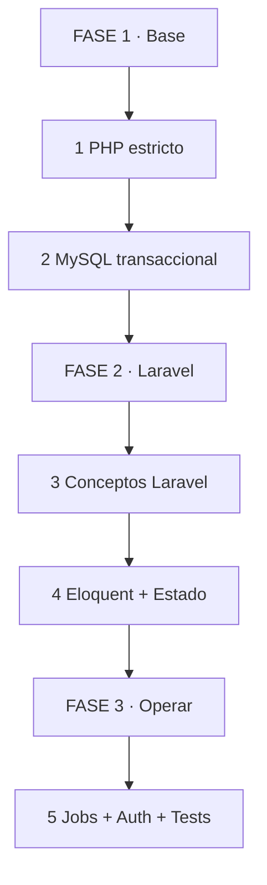
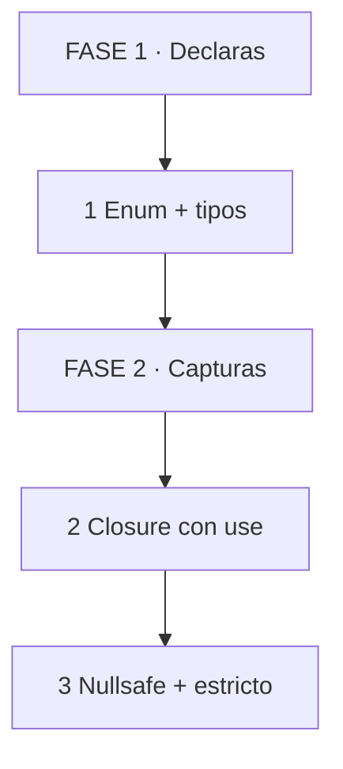
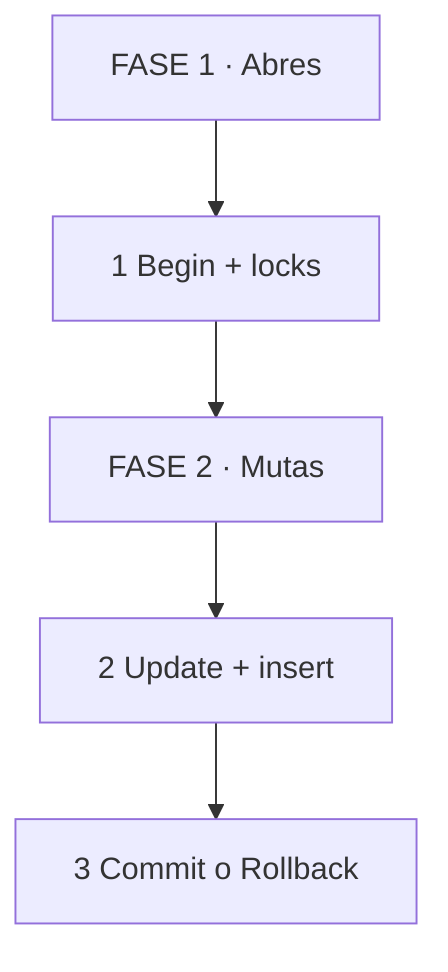
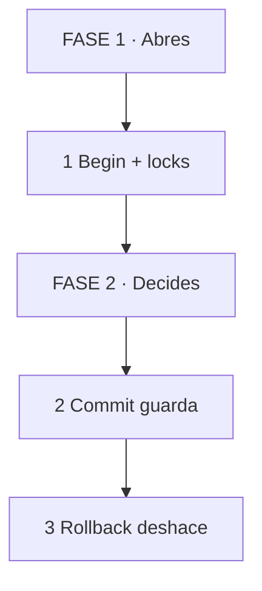
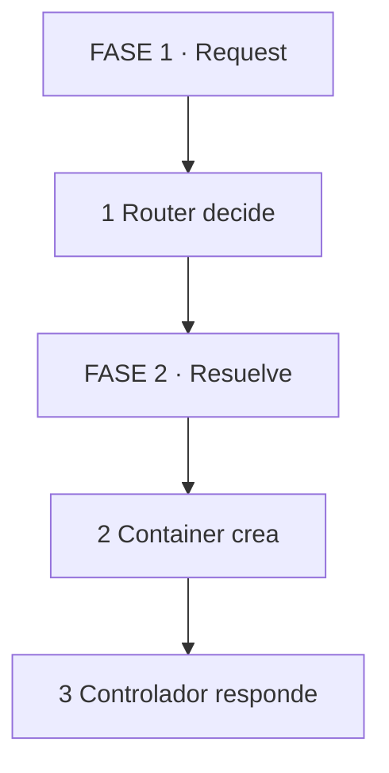
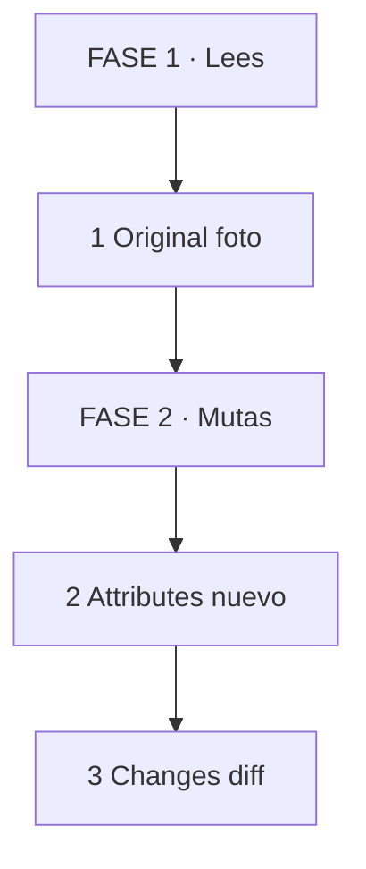
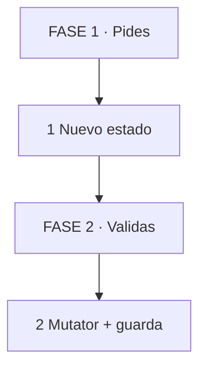

# MASTERCLASS: Laravel 12 + PHP 8.2 + MySQL 8.4 — Backend Blindado 🛡️

## INTRODUCCIÓN: POR QUÉ ESTE MASTERCLASS ES DIFERENTE 🎯

El 80% de los bugs que vi en este proyecto no están en la lógica de negocio. Están en PHP, MySQL y Eloquent mal entendidos.

Un `!=` en vez de `!==` rompe un diff de decimales. Una validación que no revierte transacción deja auditoría fantasma. Un job que se dispatchea antes del commit procesa un delivery que no existe. Un `unsignedInteger` contra un `unsignedBigInteger` rompe una FK en producción.

Este masterclass propone otro camino: un **backend blindado** donde PHP estricto, MySQL transaccional y Laravel expresivo trabajan como un sistema integrado.

La meta no es aprender sintaxis. La meta es construir el reflejo de mutación + auditoría atómica + job diferido que sostiene Delivery y SR en WAIOT.

> **🎯 Objetivo de Aprendizaje** — Al final podrás usar enums casteados, closures con `use`, transacciones con `afterCommit`, state machines con mutators, queues serializables, validación con scoping, Storage fakes, Sanctum + Gates, y tests con `RefreshDatabase`.

> **⚠️ Advertencia operativa** — Todo lo que muta filas va en transacción. Todo lo que toca archivos, S3 o jobs va después del commit. Lo que no es rollbackeable no va dentro.

---

## 🗺️ MAPA DE LA MASTERCLASS 🧭



*Se lee de arriba hacia abajo. Empiezas en FASE 1, bajas hasta FASE 3. No es un ciclo.*

| 🧩 Fase | ❓ Pregunta que responde | 📤 Resultado principal |
|---------|------------------------|------------------------|
| **FASE 1 · Base** | ¿Cómo evito bugs tontos en PHP y MySQL? | Código predecible |
| **FASE 2 · Laravel** | ¿Cómo funcionan Container, Facades y Eloquent? | Framework productivo |
| **FASE 3 · Operar** | ¿Cómo hago que jobs, auth y tests sostengan? | Sistema productivo |


*Se lee de izquierda a derecha. I muestra 1 caso, W lo haces acompañado, Y lo haces solo con checklist.*

---

## 🧩 PARTE 1: PHP ESTRICTO — EL 80% DE LOS BUGS 🧩

### 1.1 ❓ PRETEST

¿Qué problema causa comparar `!=` en vez de `!==` con decimales desde MySQL?

> Respuesta esperada: `'10.00' != 10.0` puede ser false o true según coerción, generando falsos positivos en diffs.
> Si acertás: camino rápido → andá al punto 7.

### 1.2 🎯 POR QUÉ + LOGRO

Importa porque **PHP no es tipado por defecto, y eso es una trampa en auditoría**. Un string `'10.00'` y un float `10.0` parecen iguales, pero no lo son. Vas a lograr **escribir código predecible** donde los tipos sean explícitos y las comparaciones, estrictas.

### 1.3 ⚡ VICTORIA RÁPIDA (<5 min)

Escribí esta línea en un test: `assert('10.00' != 10.0);` — ¿qué devuelve? Ahora probá con `!==`. Esa es la diferencia que puede romper tu auditoría.

### 1.4 💡 CONCEPTO

Analogía: PHP es como **un depósito con etiquetas a mano** — si no exiges tipos, alguien guarda `"10.00"` donde esperabas `10`. El tipo estricto es el código de barras que evita errores.

Definición: PHP estricto significa declarar tipos en propiedades, parámetros y retornos. Usar enums backed para valores de dominio, readonly para inmutabilidad, y comparaciones estrictas `!==` para evitar coerción. Esto elimina una clase entera de bugs silenciosos en diffs, validaciones y asignaciones.

### 1.5 👀 EJEMPLO RESUELTO

| Paso | Tú ves | Qué pasa dentro | Ejemplo |
|------|--------|-----------------|---------|
| 1 Pides enum | `DeliveryActionEnum::DELIVER` | Objeto tipado, no string suelto | `status_cd` validado |
| 2 Inyectas | `private readonly X $y` | Propiedad creada + congelada | Service sin setters |
| 3 Iteras | `fn () use (...)` | Closure captura contexto | `DB::transaction(fn () use ($id))` |

### 1.6 ⚠️ CONTRA-EJEMPLO / Error Típico

Error: Guardar `$request->action` directo sin casteo a enum. MySQL guarda `'Deliver'` con mayúscula y el `===` falla en silencio.

Corrección: Usa `Rule::enum(DeliveryActionEnum::class)` en validación y casteo automático en el modelo. El enum es tu LoV con esteroides.

### 1.7 🧪 PRÁCTICA

Creá un enum backed `DeliveryActionEnum` con 3 casos: `DELIVER`, `CANCEL`, `RETURN`. Agregá el casteo en el modelo y validá con `Rule::enum()` en un request.

> Respuesta esperada / criterio: El enum debe tener `: string`, el modelo debe tener `casts()`, y la validación debe usar `Rule::enum()`.

### 1.8 🔁 RECALL — Nivel Bloom: Aplicar

¿Por qué `number_format()` + `!==` es más seguro que `!=` para diffs de auditoría?

### 1.9 📌 IDEA CLAVE

Enum backed convierte un string peligroso en un tipo que el IDE y PHPStan pueden verificar.

### 1.10 ✅ AUTO-CHEQUEO + SIGUIENTE

- [ ] Creé 1 enum backed con casos testeados
- [ ] Usé `Rule::enum()` en validación
- [ ] Entiendo por qué `!==` con normalización > `!=`

Siguiente: MySQL transaccional y ACID.

### 1.1 Principio Central

Analogía en 1 línea: PHP es como un depósito con etiquetas a mano — si no exiges tipos, alguien guarda "10.00" donde esperabas 10.

| Paso | Tú ves | Qué pasa dentro | Ejemplo |
|------|--------|-----------------|---------|
| 1 Pides enum | `DeliveryActionEnum::DELIVER` | Objeto tipado, no string suelto | `status_cd` validado |
| 2 Inyectas | `private readonly X $y` | Propiedad creada + congelada | Service sin setters |
| 3 Iteras | `fn () use (...)` | Closure captura contexto | `DB::transaction(fn () use ($id))` |



*Cómo leerlo: Declaras tipos arriba, capturas contexto en medio, comparas estricto al final.*

### 1.2 Enums backed + casteo en modelos

```php
enum DeliveryActionEnum: string
{
    case DELIVER = 'deliver';
    case CANCEL = 'cancel';
    case RETURN = 'return';
}

// En el modelo:
protected function casts(): array
{
    return [
        'action' => DeliveryActionEnum::class,
    ];
}

// Uso: nunca compares strings sueltos
if ($delivery->action === DeliveryActionEnum::DELIVER) { ... }
```

Consejo: el enum es tu LoV con esteroides. Si viene de un request, valida con `Rule::enum(DeliveryActionEnum::class)` antes de asignar. Te ahorra un `if` defensivo por cada acción.

Error típico: guardar `$request->action` directo sin casteo. MySQL guarda `'Deliver'` con mayúscula y el `===` falla en silencio.

> **📌 Idea clave** — Enum backed convierte un string peligroso en un tipo que el IDE y PHPStan pueden verificar.

### 1.3 Constructor promotion + readonly

```php
final class RecordDeliveryChange
{
    public function __construct(
        private readonly DeliveryRepository $deliveries,
        private readonly string $actor,
    ) {}
}
```

Analogía: es como recibir una caja sellada al entrar al turno. No la abres para cambiarla, la usas.

Consejo WAIOT: usa `readonly` en services, actions y jobs. Si necesitas mutar, crea otro objeto. Evita el bug de "alguien reasignó el repo a mitad del transaction".

> **📌 Idea clave** — Promotion + readonly elimina 10 líneas de boilerplate y una clase entera de bugs de reasignación.

### 1.4 Closures con use y arrow fns

```php
// Clásico: necesita use para ver $deliveryId
DB::transaction(function () use ($deliveryId, $payload) {
    return $this->service->apply($deliveryId, $payload);
});

// Arrow: captura automática, 1 expresión
$ids = $deliveries->mapWithKeys(fn ($d) => [$d->id => $d->status_cd]);

// TRAMPA: arrow de 1 línea no sirve para transacción multi-paso
DB::transaction(fn () => $this->service->apply($id, $data)); // ok solo si es 1 llamada
```

Consejo: si el closure tiene más de 2 líneas, usa `function () use (...)`. La arrow fn te tienta a meter lógica y pierdes legibilidad + tipado de retorno.

> **📌 Idea clave** — `use` es explícito y auditable. Arrow es para mapeos cortos, no para transacciones.

### 1.5 Nullsafe, coalescing, blank/filled

```php
$city = $delivery->address?->city ?? 'sin-ciudad';

if (blank($request->input('note'))) { ... }   // null, '', [], '   ' -> true
if (filled($delivery->delivered_at)) { ... }  // lo contrario
```

Analogía: `?->` es como tocar la puerta antes de entrar. Si no hay casa, no rompes la puerta, devuelves null.

> **📌 Idea clave** — `?->` evita el `Trying to get property on null`. `??` pone default. `blank/filled` entienden strings vacíos que `empty()` maneja mal con `'0'`.

### 1.6 Excepciones vs validación

| Paso | Tú ves | Qué pasa dentro | Ejemplo |
|------|--------|-----------------|---------|
| 1 Validas | `Validator::make(...)` | Falla antes de tocar DB | `ValidationException` 422 |
| 2 Mutas | `DB::transaction(...)` | Si explota, rollback | `RuntimeException` revierte |
| 3 Auditas | `delivery_changes` insert | Misma transacción | Sin auditoría huérfana |

```php
$validator = Validator::make($data, [...])->validate(); // lanza ValidationException

DB::transaction(function () use ($delivery, $data) {
    $delivery->update($data);          // si falla aquí -> rollback
    $delivery->changes()->create([...]); // auditoría atómica
});
```

Regla de oro: valida **antes** de abrir transacción. `ValidationException` dentro de transacción también hace rollback, pero ya gastaste conexión y lock por nada. Valida fuera, muta dentro.

> **📌 Idea clave** — Validación es filtro de entrada. Excepción es freno de emergencia que revierte filas.

### 1.7 Comparaciones estrictas — el bug del recorder

```php
// MAL: '10.00' == 10 es true, '0' == false es true
if ($old != $new) { /* falso positivo con decimales/bools */ }

// BIEN: normaliza y compara estricto
$old = number_format((float) $delivery->getOriginal('total'), 2, '.', '');
$new = number_format((float) $delivery->getAttributes()['total'], 2, '.', '');
if ($old !== $new) { /* diff real */ }
```

Analogía: `!=` es como comparar por foto borrosa. `!==` es comparar huella digital.

Consejo que te mordió: MySQL devuelve decimals como string `"10.00"`, PHP los tiene como float `10.0`. Con `!=` parecen iguales a veces y distintos otras. Normaliza a string antes del `!==`.

> **📌 Idea clave** — En diffs de auditoría siempre `!==` con normalización previa. Nunca `!=`.

**Pregunta recall:** ¿por qué `DB::transaction(fn () => ...)` con arrow fn es peligroso si necesitas 3 pasos?

---

## 🗄️ PARTE 2: MYSQL TRANSACCIONAL — LO QUE SÍ SE DESHACE 🗄️

### 2.1 ❓ PRETEST

¿Qué significa ACID en una transacción?

> Respuesta esperada: Atomicidad, Consistencia, Aislamiento, Durabilidad.
> Si acertás: camino rápido → andá al punto 7.

### 2.2 🎯 POR QUÉ + LOGRO

Importa porque **las transacciones son la única garantía de que auditoría + mutación sean atómicos**. Si el update funciona pero el insert de auditoría falla, tenés un delivery sin historia. Vas a lograr **diseñar mutaciones que no dejan huérfanos**.

### 2.3 ⚡ VICTORIA RÁPIDA (<5 min)

Escribí esta query mental: `START TRANSACTION; UPDATE deliveries SET ...; INSERT INTO delivery_changes ...; COMMIT;` — si el INSERT falla, el UPDATE se deshace. Esa es la garantía.

### 2.4 💡 CONCEPTO

Analogía: Una transacción es como **una mudanza con camión único** — o llega todo, o no sale nada, pero lo que ya tiraste al río no vuelve.

Definición: ACID significa: Atomicidad (todo o nada), Consistencia (FK válida a FK válida), Aislamiento (cada transacción ve su snapshot), Durabilidad (COMMIT persiste). En WAIOT, todo lo que muta filas va dentro de `DB::transaction()`. Archivos, S3 y jobs van en `afterCommit`.

### 2.5 👀 EJEMPLO RESUELTO

| Paso | Tú ves | Qué pasa dentro | Ejemplo |
|------|--------|-----------------|---------|
| 1 Abres | `START TRANSACTION` | InnoDB toma snapshot | `DB::transaction(...)` |
| 2 Mutas | `UPDATE deliveries` | Locks de fila | `where id = ? for update` |
| 3 Cierras | `COMMIT / ROLLBACK` | Libera o deshace filas | Archivos no se deshacen |



*Se lee de arriba hacia abajo. Abres transacción, mutas filas, decides commit o rollback.*

### 2.6 ⚠️ CONTRA-EJEMPLO / Error Típico

Error: `Storage::put()` antes de `DB::transaction()`. Si el update falla, el archivo queda huérfano en S3.

Corrección: Archivos/S3/emails/jobs van después del commit. Patrón WAIOT:

```php
DB::transaction(function () use ($sr, $data) {
    $sr->update($data);
    $sr->audits()->create([...]);
    DB::afterCommit(fn () => SrProcessJob::dispatch($sr->id));
});
```

### 2.7 🧪 PRÁCTICA

Convertí este código inseguro en transaccional: `Storage::put($path, $file); DB::transaction(fn () => $delivery->update([...]));` — mové el Storage a `afterCommit`.

> Respuesta esperada / criterio: El Storage debe estar fuera de la transacción, idealmente en `afterCommit`. Si el update falla, no se sube el archivo.

### 2.8 🔁 RECALL — Nivel Bloom: Aplicar

¿Por qué `afterCommit` es el único lugar seguro para disparar jobs después de una mutación?

### 2.9 📌 IDEA CLAVE

Filas sí se deshacen. Archivos, S3 y jobs ya lanzados no. Transacción para filas, `afterCommit` para el resto.

### 2.10 ✅ AUTO-CHEQUEO + SIGUIENTE

- [ ] Entiendo ACID en una línea cada uno
- [ ] Sé mover Storage/jobs a `afterCommit`
- [ ] Entiendo por qué la auditoría va dentro de la transacción

Siguiente: Aislamiento y niveles de transacción.

> Esta parte es el corazón operativo de WAIOT. Si solo te llevas una idea: **filas sí se deshacen, archivos no**.

### 2.1 Principio Central — ACID sin humo

Analogía en 1 línea: una transacción es como una mudanza con camión único — o llega todo, o no sale nada, pero lo que ya tiraste al río no vuelve.

ACID en una línea cada uno:

- **A (Atomicidad):** todo o nada. `update deliveries + insert delivery_changes` es una unidad.
- **C (Consistencia):** de FK válida a FK válida. Nunca dejas `delivery_id` huérfano.
- **I (Aislamiento):** tu transacción no ve la mugre a medio escribir de otra.
- **D (Durabilidad):** una vez `COMMIT`, ni un apagón lo borra (redo log de InnoDB).

| Paso | Tú ves | Qué pasa dentro | Ejemplo |
|------|--------|-----------------|---------|
| 1 Abres | `START TRANSACTION` | InnoDB toma snapshot | `DB::transaction(...)` |
| 2 Mutas | `UPDATE deliveries` | Locks de fila | `where id = ? for update` |
| 3 Cierras | `COMMIT / ROLLBACK` | Libera o deshace filas | Archivos no se deshacen |



*Cómo leerlo: Abres arriba, mutas en medio, decides commit o rollback al final.*

Versión SQL cruda (lo que Laravel hace por ti):

```sql
START TRANSACTION;

UPDATE deliveries SET status_cd = 'delivered' WHERE id = 42;
INSERT INTO delivery_changes (delivery_id, changes, created_at)
VALUES (42, '{"status_cd":{"old":"pending","new":"delivered"}}', NOW());

COMMIT; -- o ROLLBACK si algo falló
```

Versión WAIOT (la que debes usar):

```php
DB::transaction(function () use ($delivery) {
    $snapshot = $delivery->getOriginal();

    $delivery->update(['status_cd' => 'delivered']);
    $delivery->changes()->create([
        'changes' => $this->differ->diff($snapshot, $delivery->getAttributes()),
    ]);
});
// Si el create falla, el update se deshace. Si subiste un PDF a S3 antes, ese NO se deshace.
```

Consejo crítico: archivos/S3/emails/jobs lanzados **no son rollbackeables**. Patrón WAIOT:

```php
DB::transaction(function () use ($sr, $data) {
    $sr->update($data);
    $sr->audits()->create([...]);
    DB::afterCommit(fn () => SrProcessJob::dispatch($sr->id));
});
// 1. filas dentro, 2. efectos externos después del commit. Nunca al revés.
```

Anti-patrón que vi en producción:

```php
// MAL: si el update falla, el archivo queda huérfano en S3
Storage::disk('s3')->put($path, $file);
DB::transaction(fn () => $delivery->update([...]));
```

> **📌 Idea clave** — Filas sí se deshacen. Archivos, S3 y jobs ya lanzados no. Transacción para filas, `afterCommit` para el resto.

### 2.2 Isolation — qué ve cada transacción

Analogía: aislamiento es como cajas de supermercado con mamparas. Cada cliente ve su cinta, no la del vecino, aunque compartan depósito.

MySQL 8.4 + InnoDB default: `REPEATABLE READ`. Niveles de menor a mayor aislamiento:

| Nivel | Qué evita | Costo |
|-------|-----------|-------|
| `READ COMMITTED` | Lecturas sucias | Menos locks, más concurrente |
| `REPEATABLE READ` | + no-repetibles (default) | Gap locks, más seguro |
| `SERIALIZABLE` | + phantoms | Todo secuencial, lento |

```sql
-- Ver tu nivel:
SELECT @@transaction_isolation; -- REPEATABLE-READ

-- Cambiar por sesión (reportes pesados que no necesitan tanta 아니면):
SET SESSION TRANSACTION ISOLATION LEVEL READ COMMITTED;
```

Caso WAIOT real: el history paginado (`delivery_changes where delivery_id = ? order by id desc`) no necesita `REPEATABLE READ`. Con `READ COMMITTED` evitas gap locks que bloquean inserts concurrentes de auditoría mientras alguien pagina 2M filas.

Consejo:

- Escrituras (delivery + changes + SR): deja `REPEATABLE READ`. Quieres snapshot estable para el diff.
- Lecturas/reportes largos: baja a `READ COMMITTED` o usa `->sharedLock()` en vez de `lockForUpdate()` si solo lees.

> **📌 Idea clave** — Más aislamiento = más seguridad, menos concurrencia. Escritura exigente, lectura tolerante.

### 2.3 Savepoints — transacciones anidadas sin mentiras

```php
DB::transaction(function () {
    $delivery->update(['status_cd' => 'shipped']);

    try {
        DB::transaction(function () {
            // SAVEPOINT trans2 — si falla, solo revierte esto
            $delivery->changes()->create([...]);
            throw new \RuntimeException('falla auditoría');
        });
    } catch (\RuntimeException $e) {
        // el update de arriba SIGUE VIVO, solo se liberó el savepoint
        Log::warning('auditoría falló, sigo con delivery');
    }
});
```

Analogía: savepoint es como punto de guardado en videojuego. Mueres en el jefe, vuelves al checkpoint, no al inicio del juego.

Advertencia: en Laravel `DB::transaction` anidada crea `SAVEPOINT`, no transacción real. El `COMMIT` externo es el único que importa. Y **no te salva de deadlocks** — solo de rollback parcial.

> **📌 Idea clave** — Anidar sirve para aislar un paso opcional. El commit real es el de afuera.

### 2.4 FKs e índices — por qué history necesita índice

```php
Schema::create('delivery_changes', function (Blueprint $t) {
    $t->id();
    $t->foreignId('delivery_id')->constrained()->cascadeOnDelete();
    $t->foreignId('actor_id')->nullable()->constrained('users');
    $t->json('changes');
    $t->timestamps();

    $t->index('delivery_id'); // paginado del history sin full scan
    $t->index(['delivery_id', 'created_at']); // history ordenado por fecha
});
```

Analogía: buscar history sin índice es como buscar un pedido en un galpón sin pasillos. Con índice, vas directo al estante `delivery_id`.

Prueba con `EXPLAIN`:

```sql
EXPLAIN SELECT * FROM delivery_changes
WHERE delivery_id = 42 ORDER BY id DESC LIMIT 20;
-- Sin índice: type=ALL, rows=2000000 (full scan)
-- Con índice: type=ref, key=delivery_changes_delivery_id_index, rows=20
```

Reglas WAIOT:

1. Toda FK que se filtra/pagina lleva índice.
2. Si ordenas por `created_at`, índice compuesto `(delivery_id, created_at)`.
3. `cascadeOnDelete` en history: si borras delivery hard, su auditoría se va. Con SoftDeletes no se dispara — ojo.

> **📌 Idea clave** — Toda FK que se pagina o filtra lleva índice. Sin excepción. Verifícalo con `EXPLAIN`.

### 2.5 Tipos: el mismatch que rompe FKs (Error 150)

| Paso | Tú ves | Qué pasa dentro | Ejemplo |
|------|--------|-----------------|---------|
| 1 Creas | `unsignedInteger` | INT 4 bytes | `deliveries.id` viejo |
| 2 Refieres | `unsignedBigInteger` | BIGINT 8 bytes | `delivery_id` nuevo |
| 3 Migras | Error 150 FK | Tipos no coinciden | Deploy roto |

```php
// CORRECTO Laravel 12: ambos lados BIGINT
$t->id(); // unsignedBigInteger implícito
$t->foreignId('delivery_id')->constrained(); // unsignedBigInteger -> coincide

// MAL: mezcla silenciosa
$t->unsignedInteger('delivery_id'); // INT vs BIGINT -> errno 150

// HERENCIA: tabla vieja con increments() (INT)
$t->increments('id'); // INT -> entonces usa:
$t->unsignedInteger('delivery_id'); // INT con INT, no foreignId
```

Tabla de tipos WAIOT:

| Columna | Tipo MySQL | Laravel |
|---------|------------|---------|
| PK nueva | BIGINT UNSIGNED | `$t->id()` |
| FK nueva | BIGINT UNSIGNED | `$t->foreignId()->constrained()` |
| Dinero | DECIMAL(12,2) | `$t->decimal('total', 12, 2)` |
| Auditoría | JSON | `$t->json('changes')` |

Consejo dinero: nunca `float` para `total`. `FLOAT` guarda `10.10` como `10.099999`. `DECIMAL(12,2)` guarda string exacto `"10.10"` — y por eso tu diff con `!==` funciona.

> **📌 Idea clave** — FK exige tipo idéntico: INT con INT, BIGINT con BIGINT. Dinero siempre `DECIMAL`, nunca `FLOAT`.

### 2.6 JSON columns — auditoría legible, no relacional

```php
// Guardado (normalizado a strings para evitar bug != vs !==)
$delivery->changes()->create([
    'changes' => ['total' => ['old' => '10.00', 'new' => '12.50']],
]);

// Lectura
DeliveryChange::whereJsonContains('changes->total->new', '12.50')->get();
DeliveryChange::where('delivery_id', $id)->whereJsonLength('changes', '>', 0)->paginate(20);
```

Analogía: JSON es como una planilla dentro de una celda. Flexible, pero si la consultas siempre, mejor tabla normal.

Truco MySQL 8.4 — columna generada + índice para consultas frecuentes:

```sql
ALTER TABLE delivery_changes
  ADD COLUMN total_new VARCHAR(20)
  GENERATED ALWAYS AS (JSON_UNQUOTE(JSON_EXTRACT(changes, '$.total.new'))) STORED,
  ADD INDEX idx_total_new (total_new);

SELECT * FROM delivery_changes WHERE total_new = '12.50'; -- usa índice, no full scan JSON
```

Cuándo NO usar JSON: joins, `SUM()`, agregaciones, filtros por rango pesado. Ahí va columna real + índice.

> **📌 Idea clave** — JSON sirve para auditoría legible. Si lo filtras siempre, crea columna generada + índice o tabla normal.

### 2.7 SoftDeletes — el where invisible

```php
use SoftDeletes;

// SELECT * FROM deliveries WHERE deleted_at IS NULL
Delivery::all(); // excluye borrados
Delivery::withTrashed()->get(); // incluye
Delivery::onlyTrashed()->get(); // solo borrados
```

El recorder lo filtra porque un delivery borrado no debe auditarse como activo. Dos trampas:

1. **Job huérfano:** delivery se borra soft, el job con `SerializesModels` hace `findOrFail` y explota. Captura `ModelNotFoundException` y termina silencioso.
2. **Índice:** `where deleted_at is null` en tablas grandes necesita índice compuesto `(client_id, deleted_at)` o el paginado se arrastra.

```php
$t->softDeletes(); // deleted_at nullable timestamp
$t->index(['client_id', 'deleted_at']);
```

> **📌 Idea clave** — SoftDeletes es un `where deleted_at is null` invisible. Si lo olvidas, auditas fantasmas. Si no lo indexas, paginas lento.

### 2.8 Deadlocks y lock contention — el puente angosto

Analogía: dos camiones en un puente angosto en direcciones opuestas. Si ambos entran, ninguno pasa. Solución: uno espera, o entran en orden.

Cómo ocurre en WAIOT:

```php
// Job A: lock delivery 1, luego 2. Job B: lock 2, luego 1. Se esperan mutuamente.
// MySQL mata a uno: Deadlock found when trying to get lock
```

Tipos de lock que debes conocer:

| Lock | Qué hace | Cuándo lo ves |
|------|----------|---------------|
| `FOR UPDATE` | Exclusivo, bloquea escritura | `lockForUpdate()` al mutar |
| `LOCK IN SHARE` | Compartido, permite leer | `sharedLock()` en reportes |
| Gap / Next-key | Bloquea rango (REPEATABLE READ) | Inserts concurrentes frenados |

Prevención (receta 90% efectiva):

```php
DB::transaction(function () use ($ids) {
    // 1. Orden fijo: todos lockean en el mismo orden
    $rows = Delivery::whereIn('id', $ids)
        ->orderBy('id')
        ->lockForUpdate()
        ->get();

    // 2. Transacción corta: nada de sleep, HTTP, S3 aquí dentro
    foreach ($rows as $r) {
        $r->update(['status_cd' => 'shipped']);
    }
}, retries: 3); // 3. Laravel reintenta deadlock automáticamente
```

Diagnóstico en MySQL:

```sql
SHOW ENGINE INNODB STATUS; -- busca LATEST DETECTED DEADLOCK
SELECT * FROM performance_schema.data_locks; -- quién lockea qué (8.4)
```

Checklist anti-deadlock WAIOT:

- [ ] `orderBy('id')->lockForUpdate()` siempre que lockees varios.
- [ ] Transacción < 1s. Sin HTTP/S3/sleep dentro.
- [ ] `retries: 3` en `DB::transaction`.
- [ ] Jobs con `tries = 1` + re-lanzado manual (no reintento ciego que duplica auditoría).

> **📌 Idea clave** — Transacción corta + orden fijo + reintento = 90% de deadlocks eliminados.

### 2.9 Resumen operativo — qué poner dónde

| Dentro de transacción | Después del commit (`afterCommit`) |
|-----------------------|-------------------------------------|
| `update deliveries / sr` | `Storage::put / S3` |
| `insert delivery_changes` | `Dispatch job` |
| `validación de negocio` que lee locks | `Mail::send / notificaciones` |
| Nada de HTTP ni sleep | Reconciliación y logs externos |

**Preguntas recall:**

1. ¿Qué devuelve `SELECT @@transaction_isolation` en tu MySQL y por qué el history paginado prefiere `READ COMMITTED`?
2. ¿Qué no se deshace con ROLLBACK y dónde debes poner el `putFile` a S3 entonces?
3. Si `EXPLAIN` dice `type=ALL rows=2M` en `where delivery_id = ?`, ¿qué índice creas?

---

## 🧩 PARTE 2.5: CONCEPTOS FUNDAMENTALES DE LARAVEL

### 2.5.1 Principio Central

Analogía en 1 línea: Laravel es como una ciudad con reglas fijas — el Service Container es el plano de quién construye qué, las Facades son los nombres de las calles que todo el mundo conoce, y el Request es el formulario de entrada que debe llenarse antes de entrar.

| Paso | Tú ves | Qué pasa dentro | Ejemplo |
|------|--------|-----------------|---------|
| 1 Pides | `DeliveryService` | Container lo construye | `app(DeliveryService::class)` |
| 2 Llamas | `Cache::get()` | Facade consulta container | `Cache` es alias |
| 3 Consultas | `Delivery::find()` | Eloquent consulta MySQL | Modelo tipado |



### 2.5.2 Service Container (IoC Container)

```php
// Registro manual (raro en Laravel moderno)
$this->app->singleton(DeliveryService::class, fn ($app) => new DeliveryService(
    $app->make(DeliveryRepository::class),
));

// Resolución automática (constructor promotion)
public function __construct(
    private readonly DeliveryService $service,
) {}

// Laravel lo resuelve solo, sin configurar nada
$service = app(DeliveryService::class);
```

Analogía: el Container es un restaurant con carta fija. Pides "DeliveryService" y el maître (Container) sabe quién lo cocina, sin que vos lo preguntes.

Error típico: `new DeliveryService()` en vez de inyectar. Rompe el testeo porque no podés reemplazar el repo por un fake.

Consejo WAIOT: registra interfaces en el provider. `DeliveryServiceInterface -> DeliveryService`. En tests haces `$this->app->instance(DeliveryServiceInterface::class, $fake)`. Un cambio, tests verdes.

> **📌 Idea clave** — El Container resuelve dependencias automáticamente. Inyecta por constructor, nunca `new` dentro de servicios.

### 2.5.3 Facades — acceso expresivo sin acoplamiento

```php
// Facade: acceso estático al container
Cache::remember("delivery:{$id}", 300, fn () => Delivery::find($id));
DB::transaction(fn () => $delivery->update([...]));
Storage::disk('s3')->put($path, $file);

// Equivalente sin facade (inyectado)
$this->cache->remember(...);
$this->db->transaction(...);
$this->storage->disk('s3')->put(...);
```

Analogía: las Facades son como ventanillas públicas. Pedís sin saber quién te atiende, pero te atienden igual.

Error típico: usar `Storage::put()` dentro de transacción. Ahí sí necesitás el objeto real para mockear. Si la clase tiene tests sin fakes, la facade te complica.

> **📌 Idea clave** — Facade = atajo legible. Testeable si el servicio está en el Container. Si mockeás, inyecta el servicio real.

### 2.5.4 Eloquent ORM — modelos como tablas vivas

```php
// Query builder fluido
$delivery = Delivery::where('client_id', $clientId)
    ->where('status_cd', '!=', 'cancelled')
    ->orderByDesc('created_at')
    ->paginate(20);

// Relaciones
$client = Client::find($id);
$deliveries = $client->deliveries()->where('status_cd', 'pending')->get();

// Creación atómica
$delivery = $client->deliveries()->create([
    'total' => '10.00',
    'status_cd' => 'pending',
]);
```

Analogía: Eloquent es como un gerente de oficina. No escribís SQL, le pedís "las deliveries pendientes de este cliente" y él las busca, ordena y te entrega en bandeja.

Error típico: `N+1`. Recorres 100 deliveries y dentro llamás a `$d->client->name` sin `with('client')`. 100 consultas extra. Solución: `Delivery::with('client')->get()`.

Regla: si el loop tiene `->client` o `->changes` dentro, siempre `with()` antes.

> **📌 Idea clave** — Eloquent convierte tablas en objetos. `with()` evita N+1. `create()` usa relación, no `new + save()`.

### 2.5.5 Routing y Middleware — el portero de la puerta

```php
// web.php / api.php
Route::middleware(['auth:sanctum', 'can:delivery-store'])
    ->prefix('api')
    ->group(function () {
        Route::post('/deliveries', DeliveryController::class);
        Route::get('/deliveries/{id}', [DeliveryController::class, 'show']);
    });

// Route model binding (inyecta el modelo)
public function show(Delivery $delivery): JsonResponse
{
    return response()->json($delivery);
}
```

Analogía: el Router es el portero del edificio. El Middleware es el checklist de entrada: credenciales, autorización, formato de DNI. Si no pasás, ni llegás al controlador.

Error típico: validar `$request->client_id` dentro del controlador. Mejor `Route::get('/clients/{client}/deliveries', ...)` con implicit binding y `where('client_id', ...)` en la query.

> **📌 Idea clave** — Router decide, Middleware filtra, Model Binding resuelve. Controlador delgado, reglas en el medio.

### 2.5.6 Collections — arrays con superpoderes

```php
$deliveries = Delivery::all(); // Collection

// Mapeo, filtrado, agrupación
$ids = $deliveries->pluck('id')->toArray();
$byClient = $deliveries->groupBy('client_id');
$pending = $deliveries->filter(fn ($d) => $d->status_cd === 'pending');

// Transformación en memoria
$summary = $deliveries->map(fn ($d) => [
    'id' => $d->id,
    'total' => number_format((float) $d->total, 2, '.', ''),
])->toArray();
```

Analogía: Collection es como un Excel en memoria. Filtrado, ordenado, agrupado, sin tocar MySQL hasta que lo necesitás.

Error típico: `foreach` con `array_push`. Collection tiene `map`, `filter`, `groupBy`. Más legible, testeable, encadenable.

> **📌 Idea clave** — Collection reemplaza `foreach` + arrays. `pluck` extrae columnas. `groupBy` organiza. Todo en memoria, sin SQL.

### 2.5.7 Configuración y entorno — .env como fuente de verdad

```php
// config/database.php
'mysql' => [
    'driver' => env('DB_CONNECTION', 'mysql'),
    'host' => env('DB_HOST', '127.0.0.1'),
],

// Uso
$host = config('database.connections.mysql.host');

// En .env.testing sobrescribís sin tocar código
DB_CONNECTION=sqlite
DB_DATABASE=:memory:
```

Analogía: `.env` es el tablero de control del auto. Cambias el modo de manejo (testing/prod) sin abrir el capó.

Error típico: `config('app.debug')` en producción. Si olvidás el `.env`, `APP_DEBUG=true` expone stack traces. CI debe tener `APP_DEBUG=false` incluso en staging.

Regla: `config()` lee de cache en producción. Si cambiás `.env`, corré `php artisan config:clear` o `optimize`.

> **📌 Idea clave** — `.env` separa código de entorno. `config()` lee valores. Cache en prod, clear al cambiar.

### 2.5.8 Práctica guiada

**Escenario:** Necesitás listar deliveries pendientes de un cliente, cachear 5 minutos, y paginar.

| Paso | Tú ves | Qué pasa dentro | Ejemplo |
|------|--------|-----------------|---------|
| 1 Relación | `$client->deliveries()` | JOIN implícito | `hasMany` |
| 2 Filtro | `->where('status_cd', 'pending')` | WHERE en SQL | Sin traer todo |
| 3 Cache | `Cache::remember()` | key + TTL | 5 minutos |
| 4 Página | `->paginate(20)` | LIMIT + OFFSET | Paginador de Laravel |

```php
public function pending(int $clientId): LengthAwarePaginator
{
    return Cache::remember("client:{$clientId}:pending_deliveries", 300, function () use ($clientId) {
        return Delivery::where('client_id', $clientId)
            ->where('status_cd', 'pending')
            ->orderByDesc('created_at')
            ->paginate(20);
    });
}
```

### 2.5.9 ❓ RECALL — Nivel Bloom: Aplicar

1. ¿Por qué `new DeliveryService()` rompe el testeo, pero `app(DeliveryService::class)` o inyección lo habilita?
2. ¿Qué hace `Cache::remember()` si la key existe vs si no existe?
3. ¿Por qué `$client->deliveries()->where(...)->get()` es mejor que `Delivery::where('client_id', $id)->get()`?
4. ¿Cuándo usas `pluck('id')` vs `map(fn ($d) => $d->id)`?

### 2.5.10 📌 IDEA CLAVE

Service Container resuelve dependencias, Facades dan acceso legible, Eloquent convierte tablas en objetos, Collections reemplazan `foreach`, y `.env` separa código de entorno. Si dominás estos 5 conceptos, todo lo demás en Laravel es solo aprender métodos nuevos.

### 2.5.11 ✅ AUTO-CHEQUEO + SIGUIENTE

- [ ] Entiendo por qué inyectar por constructor y no usar `new`
- [ ] Sé la diferencia entre Facade y servicio inyectado
- [ ] Uso Eloquent con `with()` para evitar N+1
- [ ] Agrupo con Collections en vez de `foreach`
- [ ] Configuro `.env` sin hardcodear valores

Siguiente: Eloquent lifecycle y state machines.

> Esta parte es el puente entre PHP/MySQL y Laravel. Si solo te llevas una idea: **todo en Laravel pasa por el Container, todo lo mutable va con Eloquent**.

---

## PARTE 3: ELOQUENT LIFECYCLE — EL SNAPSHOT MANUAL

### 3.1 Principio Central

Analogía en 1 línea: Eloquent es como un escribano con fotocopia — `getOriginal` es la fotocopia de cuando abrió el expediente, `getAttributes` es lo que lleva escrito ahora.

| Paso | Tú ves | Qué pasa dentro | Ejemplo |
|------|--------|-----------------|---------|
| 1 Lees | `getAttributes()` | Estado actual en memoria | `['total' => '12.50']` |
| 2 Comparas | `getOriginal()` | Estado al leer de DB | `['total' => '10.00']` |
| 3 Diff | `getChanges()` | Solo lo que cambió + save | Vacío antes de `save()` |



*Cómo leerlo: Lees foto arriba, mutas en medio, el diff sale solo tras save.*

```php
$delivery = Delivery::find($id); // syncOriginal() corre aquí dentro

$delivery->total = '12.50';

$delivery->getAttributes()['total']; // '12.50'
$delivery->getOriginal('total');     // '10.00'
$delivery->getChanges();             // [] todavía! no hubo save
$delivery->wasChanged();             // false

$delivery->save();

$delivery->getChanges();             // ['total' => '12.50']
$delivery->wasChanged('total');      // true
```

Por qué no existe `getPrevious()`: porque Eloquent solo guarda 2 fotos (original y actual). Si haces 3 `save()` seguidos sin snapshot manual, pierdes el intermedio. Te salvó el snapshot manual:

```php
$snapshot = $delivery->getOriginal(); // fotocopia antes de mutar
$delivery->update($payload);
$diff = $this->differ->diff($snapshot, $delivery->getAttributes()); // diff real aunque haya múltiples saves
```

> **📌 Idea clave** — `getChanges()` solo vive después de `save()`. Para auditoría fiable, saca tu propia foto antes.

### 3.2 DB::transaction + afterCommit — patrón SR

```php
DB::transaction(function () use ($sr, $data) {
    $sr->update($data);
    $sr->audits()->create(['changes' => $this->diff($sr)]);

    DB::afterCommit(function () use ($sr) {
        SrProcessJob::dispatch($sr->id); // job solo si commit ok
    });
});
```

Analogía: es como firmar escritura y recién después entregar llaves. Si la firma falla, nadie entrega nada.

Error típico: `dispatch()` dentro sin `afterCommit`. En tests con `database` driver el job corre igual aunque luego haya rollback. En prod con `database`/`redis` el job puede leer un SR que nunca se commiteó.

> **📌 Idea clave** — Mutación + auditoría en la misma transacción. Jobs y archivos después del commit.

**Pregunta recall:** ¿qué devuelven `getChanges()` antes y después de `save()`?

---

## PARTE 4: STATE MACHINE CON MUTATOR

Analogía en 1 línea: el estado es como un molinete de subte — solo gira a la siguiente posición válida, no puedes saltar de `pending` a `delivered` sin pasar por `in_transit` si la regla lo prohíbe.

| Paso | Tú ves | Qué pasa dentro | Ejemplo |
|------|--------|-----------------|---------|
| 1 Asignas | `state = new Shipped` | Mutator intercepta | `setStateAttribute` |
| 2 Valida | `canTransition()` | Rechaza salto ilegal | `pending -> delivered` no |
| 3 Guarda | `status_cd = 'shipped'` | Columna real en DB | Query simple |



*Cómo leerlo: Pides estado arriba, el mutator valida y guarda abajo.*

```php
// En Delivery:
protected function state(): Attribute
{
    return Attribute::make(
        get: fn ($v, $attrs) => match ($attrs['status_cd']) {
            'pending' => new PendingState(),
            'shipped' => new ShippedState(),
            'delivered' => new DeliveredState(),
        },
        set: function ($state) {
            if (! $this->state()->canTransitionTo($state)) {
                throw new InvalidTransitionException(...);
            }
            return ['status_cd' => $state->value];
        },
    );
}

// Uso:
$delivery->state = new ShippedState();
$delivery->save();
```

Consejo: el `match` del getter debe cubrir todos los `status_cd` o lanza `UnhandledMatchError`. Agrega `default => throw` explícito para que el error sea legible.

> **📌 Idea clave** — `state = new X` parece magia, es un mutator que escribe `status_cd`. La máquina vive en PHP, la verdad vive en MySQL.

**Pregunta recall:** ¿dónde se guarda realmente el estado si usas `$delivery->state = new X`?

---

## PARTE 5: QUEUES, VALIDACIÓN, STORAGE, AUTH

### 5.1 Queues — lo que se serializa

Analogía en 1 línea: un job es como un sobre con fotocopia — viaja la copia, no el original. Si el original cambia antes de abrirlo, trabajas con papel viejo.

| Paso | Tú ves | Qué pasa dentro | Ejemplo |
|------|--------|-----------------|---------|
| 1 Dispatcheas | `dispatch($id)` | Serializa solo ID | `SerializesModels` re-lee |
| 2 Procesas | `handle()` | Fresh de DB | `Delivery::findOrFail` |
| 3 Fallas | `tries = 1` | No reintenta | Proceso manual |

```php
final class DeliveryProcessJob implements ShouldQueue
{
    use Dispatchable, InteractsWithQueue, Queueable, SerializesModels;

    public $tries = 1;

    public function __construct(public readonly int $deliveryId) {}

    public function handle(DeliveryService $service): void
    {
        $delivery = Delivery::findOrFail($this->deliveryId); // fresh, no stale
        $service->process($delivery);
    }
}
```

Consejo: pasa IDs, no modelos completos. `SerializesModels` igual re-consulta, pero si pasas modelo con relaciones cargadas, el payload se infla y el job falla por tamaño. `tries = 1` en WAIOT porque reintentar un delivery a medias duplica auditoría. Si falla, lo re-lanza un humano.

Driver: `sync` en tests ejecuta al instante (ideal para `Queue::fake()` assertions). `database` en local/prod persiste y permite reintentos y monitoreo.

> **📌 Idea clave** — Job lleva IDs. `tries = 1` evita doble auditoría. `sync` para tests, `database` para real.

### 5.2 Validación con scoping

```php
Validator::make($data, [
    'client_id' => ['required', Rule::exists('clients', 'id')],
    'delivery_id' => [Rule::exists('deliveries', 'id')->where('client_id', $data['client_id'])],
    'action' => [Rule::enum(DeliveryActionEnum::class)],
    'status_cd' => [Rule::in(['pending', 'shipped', 'delivered'])],
])->validate();
```

Analogía: es como pedir DNI y verificar que vive en tu edificio, no en cualquiera. El `where(client_id)` es el portero.

> **📌 Idea clave** — `Rule::exists()->where()` evita IDOR. `Rule::in()` + `Rule::enum()` blindan LoVs.

### 5.3 Storage fakes

```php
Storage::fake('public');

$response = $this->post('/api/deliveries/1/attach', [
    'file' => UploadedFile::fake()->create('remito.pdf', 100),
]);

Storage::disk('public')->assertExists('deliveries/1/remito.pdf');
```

`putFile` genera nombre hash (seguro). `putFileAs` respeta tu nombre (legible, riesgo de colisión). En WAIOT usa `putFile` para adjuntos de usuario, `putFileAs` solo para exports con nombre determinístico.

> **📌 Idea clave** — `Storage::fake` evita tocar disco real. `putFile` para usuarios, `putFileAs` para nombres fijos.

### 5.4 Auth: Sanctum + Gates

```php
// Middleware asigna preferencias tras auth:sanctum
Route::middleware(['auth:sanctum', ConfigureUserPreferencesMiddleware::class])->group(...);

// Gate
Gate::define('delivery-store', fn (User $u) => $u->hasPermission('delivery-store'));
// Uso: ->middleware('can:delivery-store')
```

Analogía: Sanctum es la pulsera del evento. El middleware de preferencias es el mozo que ya sabe que tomas café sin azúcar. El Gate es el guardia de cada puerta.

> **📌 Idea clave** — Sanctum identifica. Middleware personaliza. Gate autoriza por puerta (`can:delivery-store`).

**Pregunta recall:** ¿por qué pasar `$deliveryId` y no `$delivery` al job?

---

## PARTE 6: TESTING Y HERRAMIENTAS

### 6.1 Testing — lo mínimo que sostiene

```php
use RefreshDatabase;

public function test_records_change_on_update(): void
{
    Queue::fake(); // jobs no corren, solo se afirman

    $delivery = Delivery::factory()->create(['client_id' => $this->client->id]);

    $this->actingAs($this->user)
        ->putJson("/api/deliveries/{$delivery->id}", ['total' => '12.50'])
        ->assertOk();

    $this->assertDatabaseHas('delivery_changes', ['delivery_id' => $delivery->id]);
    Queue::assertPushed(DeliveryProcessJob::class);
}
```

| Paso | Tú ves | Qué pasa dentro | Ejemplo |
|------|--------|-----------------|---------|
| 1 Aislas | `RefreshDatabase` | Migra + rollback por test | DB limpia |
| 2 Fingís | `Queue::fake()` | Jobs no ejecutan | Solo asserts |
| 3 Siembras | `RandomDataSeeder` | Datos variados | Staging realista |

`RefreshDatabase` vs `DatabaseMigrations`: el primero usa transacción + migrate una vez (rápido). El segundo re-migra todo cada vez (lento, solo si cambias schema en caliente). Usa `RefreshDatabase` siempre salvo que testees migraciones.

> **📌 Idea clave** — `RefreshDatabase` + `Queue::fake()` + `assertDatabaseHas()` es el tríptico que prueba transacción + auditoría + job sin flakiness.

### 6.2 Herramientas del repo

| Herramienta | Comando | Cuándo |
|-------------|---------|--------|
| **Pint** | `./vendor/bin/pint --dirty` | Antes de cada commit |
| **PHPStan 5** | `./vendor/bin/phpstan analyse` | Antes de cada PR |
| **Scribe** | `php artisan scribe:generate` | Tras cambiar controllers |

Pint es el corrector de estilo (no discutas, ejecútalo). PHPStan nivel 5 + baseline es el revisor gruñón que atrapa `null?->` olvidados y enums mal comparados. Si agregas `ignoreErrors` al baseline sin arreglar, la deuda crece. Scribe regenera docs API: si cambias un controller y no corres `scribe:generate`, la doc miente.

> **📌 Idea clave** — Pint formatea, PHPStan piensa, Scribe documenta. Los tres corren antes del PR, no después.

**Pregunta recall:** ¿cuándo corres `scribe:generate`?

---

## PARTE 7: I DO / WE DO / YOU DO — EJERCICIOS

### 7.1 I Do — Diff correcto con decimales

**Objetivo:** auditar cambio de total sin falsos positivos.

| Paso | Acción | Resultado |
|------|--------|-----------|
| 1 | `getOriginal()` snapshot | `['total' => '10.00']` |
| 2 | Normaliza a string 2 dec | `'10.00' vs '12.50'` |
| 3 | Compara `!==` | Diff real |

```php
$old = number_format((float) $d->getOriginal('total'), 2, '.', '');
$new = number_format((float) $d->total, 2, '.', '');
if ($old !== $new) { $d->changes()->create(['changes' => compact('old','new')]); }
```

### 7.2 We Do — Transacción + auditoría + job

**Escenario:** SR cambia de `draft` a `confirmed`. Debes auditar y lanzar job solo si commit ok.

| Decisión | Opción | Por qué |
|----------|--------|---------|
| Dónde validar | Fuera de transaction | Ahorra locks |
| Dónde auditar | Dentro de transaction | Atómico |
| Dónde dispatch | `afterCommit` | Evita job huérfano |

```php
Validator::make($data, ['status_cd' => Rule::in(['draft','confirmed'])])->validate();
DB::transaction(function () use ($sr, $data) {
    $snap = $sr->getOriginal();
    $sr->update($data);
    $sr->audits()->create(['changes' => diff($snap, $sr->getAttributes())]);
    DB::afterCommit(fn () => SrProcessJob::dispatch($sr->id));
});
```

Pregunta guía: ¿qué pasa si el `dispatch` va sin `afterCommit` y luego falla el `create` de auditoría?

### 7.3 You Do — State ilegal + test

**Tarea:** intenta `$delivery->state = new DeliveredState()` desde `pending` cuando la regla exige pasar por `shipped`. Debe lanzar `InvalidTransitionException` y no dejar fila en `delivery_changes`.

Criterio de auto-corrección:

- [ ] Excepción correcta lanzada
- [ ] `assertDatabaseMissing('delivery_changes', ...)` pasa
- [ ] `wasChanged('status_cd')` es false tras catch

### 7.4 You Do — Deadlock simulado

**Tarea:** dos transacciones tocan deliveries `[1,2]` en orden opuesto. Reordena con `orderBy('id')->lockForUpdate()` y agrega `retries: 3`.

Respuesta esperada: sin orden fijo hay deadlock; con orden + reintento, ambas pasan.

### 7.5 Cierre práctico

| Nivel | Debes poder hacer |
|-------|-------------------|
| **I Do** | Snapshot + `!==` + `DB::transaction` con auditoría |
| **We Do** | State machine + `afterCommit` + validación scopeada |
| **You Do** | Job idempotente + test con `RefreshDatabase` + Pint/PHPStan en verde |

---

## CHECKLIST FINAL DEL BACKEND BLINDADO

| Bloque | Check |
|--------|-------|
| PHP | Enums casteados, readonly, `use` explícito, `!==` normalizado |
| MySQL | Transacción corta, FK con índice, tipos iguales, JSON solo auditoría |
| Laravel | Container, Facades, Eloquent, Collections, .env |
| Eloquent | Snapshot manual, `getChanges` tras save, `afterCommit` para jobs |
| Estado | Mutator valida, `status_cd` es verdad, transición ilegal explota |
| Ops | `Queue::fake` en tests, `Storage::fake`, `can:` en rutas, Scribe al cambiar controller |

---

## Preguntas de Verificación 📝

1. **Aplica**: Delivery tiene `total` `"10.00"` en DB y pones `10.0` float. ¿Por qué `!=` te miente y qué normalización aplicas antes de `!==`?
2. **Analiza**: ¿Qué se revierte con ROLLBACK y qué no? ¿Dónde pones el `putFile` a S3 entonces?
3. **Diseña**: Crea `SrActionEnum` backed con 3 casos y muestra su `casts()` + `Rule::enum()` en validación.
4. **Reflexiona**: ¿Cuándo usas `function () use (...)` vs `fn () =>` en una transacción? Da 1 ejemplo de cada.
5. **Calcula**: Tabla `delivery_changes` con 2M filas sin índice en `delivery_id`. ¿Qué plan de query esperas en `where delivery_id = ? paginate(20)` y cómo lo arreglas?
6. **Evalúa**: ¿Por qué `getChanges()` está vacío antes de `save()` y cómo lo reemplazas con snapshot manual para auditoría?
7. **Conecta**: Explica `DB::transaction + afterCommit + dispatch(job)`. ¿Qué bug aparece si dispatcheas sin `afterCommit`?
8. **Propón**: Diseña validación de `delivery_id` scopeada por `client_id` para evitar IDOR. ¿Qué Rule usas?
9. **Síntesis**: Un job recibe `$delivery` entero en vez de `$id`. El delivery se borra (soft) antes de procesar. ¿Qué lee el job y por qué el recorder lo filtra?
10. **Reflexión final**: De PHP, MySQL y Laravel, ¿cuál es el más crítico para evitar auditoría huérfana? Justifica con transacción + afterCommit.
11. **Conecta**: ¿Por qué inyectar por constructor es más testeable que `new` dentro de un servicio? Menciona Container y fakes.
12. **Evalúa**: ¿Qué es N+1 y cómo lo evitas con Eloquent? Da un ejemplo con `$client->deliveries`.

## GLOSARIO — CONCEPTOS PRINCIPALES

| Término | Definición en 1 línea |
|---------|-----------------------|
| **Enum backed** | Tipo PHP que ata un nombre a un string guardable en DB |
| **Promotion + readonly** | Crea e inmoviliza dependencias en el constructor |
| **Closure use** | Función que captura variables externas explícitamente |
| **Nullsafe** | `?->` que devuelve null si no hay objeto |
| **Transacción** | Bloque atómico que se commitea todo o se revierte todo |
| **FK + índice** | Relación entre tablas con acceso rápido por columna |
| **JSON column** | Celda que guarda objeto para auditoría legible |
| **SoftDeletes** | Filtro invisible que excluye borrados por `deleted_at` |
| **Deadlock** | Dos transacciones que se bloquean mutuamente esperando locks |
| **getOriginal** | Foto de la fila al leerla de DB |
| **getChanges** | Diff que solo existe tras `save()` |
| **State mutator** | `Attribute` que convierte `state = new X` en `status_cd` |
| **afterCommit** | Callback que corre solo si la transacción commitea |
| **ShouldQueue** | Contrato que envía un job a cola en vez de correrlo ya |
| **SerializesModels** | Re-lee el modelo fresh en el worker en vez de usar copia vieja |
| **Rule::exists where** | Valida que el ID exista y pertenezca al cliente |
| **Storage::fake** | Disco falso para tests sin tocar archivos reales |
| **Pint / PHPStan / Scribe** | Formato, análisis estático y docs API del repo |
| **Service Container** | Registro y resolución automática de dependencias |
| **Facade** | Acceso estático a un servicio del Container |
| **Eloquent ORM** | Mapper que convierte filas de DB en objetos PHP |
| **Route Model Binding** | Laravel resuelve el modelo desde el parámetro de ruta |
| **Collection** | Array en memoria con métodos funcionales (map, filter, groupBy) |
| **N+1** | Problema de rendimiento por consultas repetidas en un loop |
| **.env** | Archivo de configuración por entorno |
