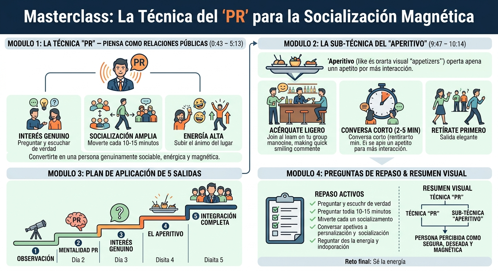
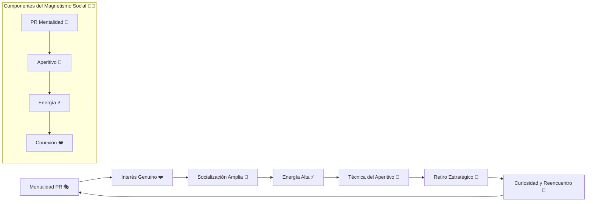
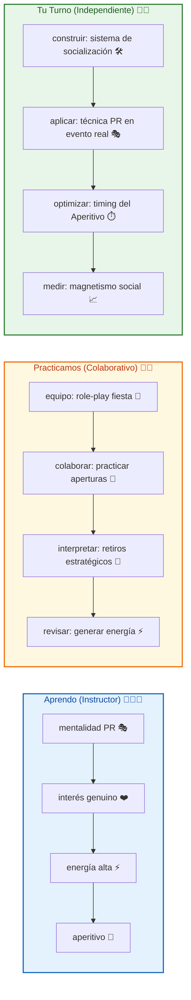

# 🎉🔥 MASTERCLASS: La Técnica del PR para la Socialización Magnética — El Método de Héctor Latorre para Conectar en Fiestas y Eventos ✨🚀

{style="z-index: 1000; position: relative; margin-top: -20px;"}

## 🎯 INTRODUCCIÓN: POR QUÉ ESTE MASTERCLASS ES DIFERENTE 💡🌟

No necesitas guiones, frases memorizadas ni manipulación. La verdadera atracción social surge de convertirte en una persona **genuinamente sociable, enérgica y magnética** — alguien que disfruta el momento y hace que los demás quieran estar cerca. 🎭✨

Este masterclass propone un camino distinto: **entender la socialización como un sistema de mentalidad PR + técnica del Aperitivo** que se puede aprender, practicar y dominar en cualquier evento social. No se trata de "tener éxito" con alguien — se trata de ser la energía que todos recuerdan.

> **🎯 Objetivo de Aprendizaje** — Al final de esta guía, podrás: (1) explicar la mentalidad PR y sus 3 componentes, (2) aplicar la técnica del Aperitivo para generar curiosidad, (3) diseñar un plan de 5 salidas para entrenar tu músculo social, y (4) medir tu progreso en magnetismo y confianza social.

> **⚠️ Advertencia formativa** — Este contenido es educativo. El magnetismo social requiere autenticidad y respeto. Ninguna técnica reemplaza la intención honesta de conectar con otras personas. 🧘‍♂️🤝

---

## 🗺️ MAPA DEL WORKFLOW DE SOCIALIZACIÓN MAGNÉTICA 🗺️🚀



| Fase 🎯 | Pregunta que responde ❓ | Output principal 🎯 |
|---------|------------------------|---------------------|
| **Mentalidad PR** 🎭 | ¿Cómo debo pensar para ser magnético? | Enfoque en dar energía, no en obtener aprobación 💡 |
| **Interés genuino** ❤️ | ¿Cómo hago que otros se sientan importantes? | Conexión emocional auténtica 🤝 |
| **Socialización amplia** 🤝 | ¿Cómo evito la ansiedad de "una sola persona"? | Red de conexiones múltiples 🕸️ |
| **Energía alta** ⚡ | ¿Cómo genero magnetismo sin esfuerzo? | Presencia atractiva y memorable ✨ |
| **Aperitivo** 🥂 | ¿Cómo dejo una impresión duradera? | Curiosidad y deseo de reencontrarse 🔄 |
| **Retiro estratégico** 🚪 | ¿Cómo evito agotar la conversación? | Timing perfecto y abundancia social ✅ |



---

## 🔹 Módulo 1: La Técnica "PR" — Piensa Como Relaciones Públicas (0:43 – 5:13) 🎭✨

### La idea central 💡

En vez de entrar a una fiesta con el objetivo estrecho de "conocer a una persona específica", adopta la mentalidad de un **relacionista público (PR)**: alguien cuyo trabajo es generar buena energía, conectar con la mayor cantidad de gente posible y hacer que el ambiente sea memorable para todos. 🌟

> 🧩 **Analogía del instructor:** Un buen anfitrión de fiesta no se pasa la noche pegado a una sola conversación — se mueve, saluda, presenta gente entre sí, genera risas, sube la energía del lugar. Esa persona, sin buscarlo directamente, termina siendo la más atractiva de la sala. 🎉

### Por qué funciona psicológicamente 🧠🔬

1. **Elimina la presión del resultado** — al no enfocarte en "conquistar" a una sola persona, sueltas la ansiedad que normalmente sabotea la interacción. 😌
2. **Genera prueba social** — cuando socializas con muchas personas y grupos, quienes te observan perciben que eres alguien valorado y bienvenido, lo cual aumenta tu atractivo automáticamente. 👥
3. **Te posiciona como el centro energético del lugar** — la gente gravita naturalmente hacia quien genera diversión, no hacia quien busca aprobación. 🧲

### Los 3 componentes de la mentalidad PR 📋

| Componente 🎯 | Qué significa 💬 | Ejemplo práctico ⚡ |
|---------------|------------------|---------------------|
| Interés genuino ❤️ | Preguntar y escuchar de verdad, no esperar tu turno para hablar | "¿De dónde se conocen ustedes?" 💬 |
| Socialización amplia 🤝 | No quedarte anclado en un solo grupo toda la noche | Saludar, conversar, moverte cada 10-15 minutos 🚶 |
| Energía alta ⚡ | Ser tú quien sube el ánimo del lugar, no quien lo absorbe | Reír fácil, iniciar bromas, invitar a brindar 🥂 |

### ✅ Ejercicio práctico 1 🎯✨

Antes de tu próxima salida social, define:
- 🎯 ¿Con cuántos grupos distintos te propones hablar esta noche (mínimo 3)?
- 💬 ¿Qué pregunta genuina usarás para abrir conversación con desconocidos?
- ⚡ ¿Cómo vas a "subir la energía" del lugar en vez de solo consumirla?

> 💡 **Punto clave:** No estás ahí para "conseguir" algo de una persona en particular. Estás ahí para ser la energía que todos recuerdan — el resultado atractivo es una consecuencia, no el objetivo directo. ✨🎯

---

## 🔹 Módulo 2: La Sub-técnica del "Aperitivo" (9:47 – 10:14) 🥂✨

### La idea central 💡

Cuando te acerques a un grupo o persona —en la barra, en la pista de baile, donde sea— **mantén la interacción corta y ligera**. Suelta un comentario breve, divertido o interesante, y **tú decides irte primero**, antes de que la conversación se agote o se sienta forzada. 🚪✨

> 🧩 **Origen del nombre:** Igual que un aperitivo abre el apetito sin llenarte, esta técnica busca dejar una impresión positiva breve que despierte curiosidad, sin extender la interacción hasta agotarla. 🍸

### Por qué funciona 🧠🔬

1. **Comunica abundancia, no necesidad** — al ser tú quien se retira primero, transmites que tu noche no depende de esa conversación, lo cual es una de las señales más atractivas en cualquier contexto social. 💫
2. **Deja a la otra persona con curiosidad, no con saturación** — una interacción que termina en su punto más alto genera más interés que una que se alarga hasta volverse incómoda o predecible. 🔄
3. **Reduce tu propia ansiedad de "sostener la conversación"** — al saber que vas a irte pronto, no sientes la presión de mantener el interés artificialmente. 😌

### Cómo aplicar el "Aperitivo" paso a paso 🔧

1. 🎯 Acércate con un comentario breve, ligero y con buena energía (un chiste, una observación divertida, un cumplido genuino).
2. 💬 Deja que la conversación fluya de forma natural por un par de minutos.
3. 🚪 **Antes de que decaiga**, retírate tú primero con una salida elegante: "Voy a saludar a unos amigos, ¡fue un gusto charlar!"
4. 🔄 Si hay interés mutuo real, esa breve interacción quedará abierta para un reencuentro más tarde en la noche — sin haberla forzado.

> 🧩 **Ejemplo aplicado:** Te acercas a un grupo en la barra, haces un comentario gracioso sobre la música, se ríen, conversas 2-3 minutos con genuino interés... y luego dices: "Los dejo, voy a seguir la ronda" — dejando la puerta abierta, sin agotar el momento. 🎵🍻

### ✅ Ejercicio práctico 2 🎯✨

En tu próxima salida, practica el "Aperitivo" con al menos 2 grupos distintos:
- ⏱️ Cronometra mentalmente tus interacciones — apunta a que duren entre 2 y 5 minutos.
- 🚪 Sé tú quien decide terminar la conversación, no quien espera a que se apague sola.
- 📊 Observa cómo cambia la energía cuando te vas en el punto alto, en vez de esperar hasta que decaiga.

| Tipo de interacción 🎭 | Duración ideal ⏱️ | Resultado esperado ✨ |
|------------------------|-------------------|----------------------|
| Aperitivo perfecto 🥂 | 2-5 minutos | Curiosidad y deseo de reencontrarse 🔄 |
| Conversación agotada 😞 | > 15 minutos | Saturación y olvido rápido 🚫 |
| Retiro en punto alto 🚀 | En el mejor momento | Impresión memorable y magnetismo ✅ |
| Esperar a que decaiga 📉 | Hasta el silencio incomodo | Percepción de "falta de opciones" ❌ |

> 💡 **Punto clave:** No se trata de ser frío o distante — se trata de valorar tu propio tiempo y energía tanto como para no aferrarte a ninguna conversación. Esa seguridad, paradójicamente, es lo que más atrae. 💎✨

---

## 📅 PARTE 3: PLAN DE APLICACIÓN DE 5 DÍAS (O 5 SALIDAS SOCIALES) 📆🔥

| Salida 📅 | Enfoque 🎯 | Acción concreta ⚡ |
|-----------|------------|-------------------|
| 1 | 👀 Observación | Ve a un evento social solo con el objetivo de observar quién genera energía en la sala y cómo lo hace |
| 2 | 🎭 Mentalidad PR | Proponte hablar con al menos 3 grupos distintos, sin objetivo de "conquista" |
| 3 | ❤️ Interés genuino | En cada conversación, haz al menos 2 preguntas reales antes de hablar de ti |
| 4 | 🥂 El Aperitivo | Practica retirarte primero de al menos 2 conversaciones, en su punto más alto |
| 5 | 🚀 Integración completa | Combina ambas técnicas en una salida completa: sé el "anfitrión" energético de la noche y aplica el Aperitivo en cada acercamiento |

> 🧩 **Nota del instructor:** El objetivo de estas 5 salidas no es "tener éxito" en el sentido tradicional — es **entrenar el músculo social** de moverte con soltura, generar energía y desapegarte del resultado de cada interacción individual. 💪✨

---

## 🎓✨ PARTE 4: I DO / WE DO / YOU DO — EJERCICIOS PRÁCTICOS 🎓🌟

### 4.1 🏫 I Do — Mentalidad PR en vivo 🎭🎯

**Objetivo:** experimentar el cambio de enfoque de "conseguir" a "generar". 🔄

| Paso 🚶 | Acción ⚡ | Resultado esperado ✅ |
|---------|---------|----------------------|
| 1️⃣ 🎯 | Define tu objetivo para la noche | "Ser la energía que todos recuerden" ⚡ |
| 2️⃣ 🎭 | Adopta la mentalidad de anfitrión | No buscas aprobación, la generas 🌟 |
| 3️⃣ 🤝 | Acércate a 3 grupos distintos | Mínimo 3 conversaciones esta noche 🎉 |
| 4️⃣ 💬 | Haz preguntas genuinas antes de hablar de ti | Escucha 80%, habla 20% 👂 |
| 5️⃣ 📊 | Registra cómo cambia la dinámica | Antes vs después de la mentalidad PR 📈 |

### 4.2 👥 We Do — Role-play de Aperitivo en equipo 👥🤝

**Escenario:** simulacro de fiesta. Cada integrante practica apertura, conversación corta y retiro estratégico.

```
🎭 Role-play social:

1. Entrante A: abre conversación con comentario breve y energético.
2. Entrante B: responde con interés genuino y pregunta abierta.
3. Entrante C: mantiene la conversación 2-3 minutos y luego se retira primero.
4. Todos: cronometran la interacción y califican la "energía dejada".
5. Facilitador: da feedback sobre timing y abundancia social. ✅
```

### 4.3 🎯 You Do — Sistema de socialización magnética personal 🛠️🚀

**Tarea:** diseña tu sistema PR + Aperitivo con 4 componentes:

| Componente 🧩 | Acción ⚡ | Alerta de fallo 🔔 |
|---------------|---------|-------------------|
| 🎭 Mentalidad PR | Objetivo de la noche: "generar energía, no conseguir aprobación" | Sin objetivo definido 📅 |
| 🤝 Socialización amplia | Mínimo 3 grupos por salida | < 3 grupos 🚫 |
| ⚡ Energía alta | 1 acción para subir la energía del lugar (broma, baile, brindis) | Sin acción energética 📉 |
| 🥂 Aperitivo | 2 retiros estratégicos por salida | Sin retiros o muy tardíos ⏰ |

---

## ✅✨ PARTE 5: CHECKLIST FINAL DEL SISTEMA 🏁📋

| Bloque 🧩 | Check ✅ | Evidencia 📸 |
|------------|---------|--------------|
| **🎭 Mentalidad PR** | Entró a evento con objetivo de dar energía, no de conseguir | Journal de salidas |
| **🤝 Socialización amplia** | Habló con 3+ grupos distintos en 1 salida | Notas de follow-up |
| **⚡ Energía alta** | Generó al menos 1 momento de alta energía en la sala | Testimonio de amigos |
| **🥂 Aperitivo** | Se retiró primero de 2 conversaciones en punto alto | Registro de timing |
| **📅 Plan 5 días** | Completó 3 salidas de práctica | Bitácora firmada |
| **📊 Magnetismo** | Se siente más cómodo y recordado en eventos | Autoevaluación + feedback |

---

## 📝✨ PARTE 6: PREGUNTAS DE VERIFICACIÓN 📝🌟

Responde cada pregunta basándote en los conceptos de esta masterclass. Escribe tus respuestas o compártelas para profundizar tu aprendizaje. 📝💡

### Preguntas sobre la Mentalidad PR 🎭🔍

1. **🎯 Aplica**: ¿Qué diferencia hay entre entrar a una fiesta pensando "voy a conocer gente" vs "voy a ser la energía del lugar"? ¿Cómo cambia tu lenguaje corporal en cada caso? ⚡

2. **🔍 Analiza**: En tu última salida social, ¿cuántos grupos distintos conversaste? Si fue menos de 3, ¿qué te frenó? 📊

### Preguntas sobre el Aperitivo 🥂✨

3. **🥂 Diseña**: Escribe la frase exacta que usarías para retirarte de una conversación en su punto alto, sin ser grosero. 🚪

4. **⏱️ Calcula**: Si tienes una salida de 3 horas y hablas con 4 grupos usando Aperitivo de 4 minutos cada uno, ¿cuánto tiempo te queda para moverte y generar energía? 📊

### Preguntas Integradoras 🔗🌟

5. **🔗 Conecta**: ¿Por qué la mentalidad PR y el Aperitivo se complementan? ¿Qué pasa si aplicas Aperitivo sin mentalidad PR, o viceversa? 🧠

6. **💡 Propón un sistema**: Diseña un protocolo de 3 minutos para usar ANTES de cualquier evento social. Incluye: (1) objetivo PR, (2) pregunta de apertura, (3) regla de retiro. 📋

7. **🧪 Evalúa**: Si tuvieras que explicarle esta técnica a un amigo que dice "yo soy tímido", ¿qué 3 argumentos usarías basados en resultados observables? 📊

8. **🏆 Síntesis final**: De los 2 módulos (PR y Aperitivo), ¿cuál te cuesta más aplicar? ¿Qué cambio pequeño podrías hacer en tu próxima salida? 📈

---

## 📚✨ GLOSARIO RÁPIDO 📖🔬

| Término 📝 | Definición 📋 | Aplicación social 🤝 |
|-----------|---------------|---------------------|
| **Mentalidad PR** 🎭 | Enfoque de generar energía, no de conseguir aprobación | Fiestas, eventos, reuniones networking |
| **Aperitivo** 🥂 | Interacción corta y estratégica que genera curiosidad | Conocidos, citas, networking |
| **Prueba social** 👥 | Percepción de que alguien es valorado por otros | Atractivo automático en eventos |
| **Retiro estratégico** 🚪 | Irse primero, en el punto alto de la interacción | Generar deseo de reencuentro |
| **Centro energético** ⚡ | Persona que sube el ánimo del lugar sin esfuerzo | Magnetismo natural |
| **Abundancia social** 💫 | Mentalidad de "tengo muchas opciones" vs "necesito esta" | Reduce ansiedad y aumenta atractivo |
| **Interés genuino** ❤️ | Escuchar para conectar, no para responder | Construcción de rapport rápido |
| **Timing social** ⏱️ | Saber cuándo entrar, cuándo hablar, cuándo retirarse | Fluidez en cualquier evento |

---

## 📐✨ ANEXO: FORMATO IDEAL PARA MASTERCLASS EDUCATIVAS 📐📏

### 📏 Estructura visual recomendada para lectura larga 📏✨

El ancho óptimo para artículos educativos es **60–75 caracteres por línea** (incluyendo espacios). Equivale aproximadamente a: 📐

```css
.article-content {
  font-size: 18px;
  line-height: 1.75;
  max-width: 65ch;
}
```

Esto facilita: ✅
- Mantener la atención 👀
- Reducir la fatiga visual 😌
- Mejorar la comprensión de conceptos complejos 🧠
- Facilitar el seguimiento de protocolos paso a paso 📋

---

### 🎯 CIERRE PRÁCTICO — NIVELES DE DOMINIO 🎯✅

| Nivel 📊 | Debes poder hacer ✨ | Evidencia 📸 |
|---------|---------------------|-------------|
| **🏫 I Do** | ✅ Aplicar mentalidad PR en una salida social real | Registro de práctica guiada |
| **👥 We Do** | 🤝 Role-play Aperitivo en equipo con feedback | Sesión completada |
| **🎯 You Do** | 🚀 Implementar plan de 5 salidas y medir magnetismo | Sistema documentado y seguimiento 5 días |

---

## 🎁✨ RECURSOS ADICIONALES 🎁📚

- 📖 **📚 Héctor Latorre** — Técnicas de socialización y magnetismo social 📖
- 🎥 **🎬 Video:** La técnica del PR para la socialización magnética ⏱️
- 🧠 **💡 Psicología social:** Prueba social, abundancia y energía atractiva 🧠
- 🛠️ **📱 Apps recomendadas:** Notion para journaling social, Timer para control de timing ✅
- 📖 **📚 Libros clave:** "Cómo Ganar Amigos e Influir Sobre las Personas" (Dale Carnegie), "El Arte de Conversar" (M. P. Fernández), "Influencia" (Robert Cialdini) 📚
- 🧠 **⚕️ Psicología evolutiva:** Señales de atractivo y abundancia social 🧠
- 📝 **📓 Bullet Journal** — Método de Ryder Carroll para registro diario 📒

---

**🎉 Felicitaciones! Has completado la masterclass de la técnica del PR para la socialización magnética. 🎉 Ahora comprendes que el magnetismo social no es un don — es una habilidad que se entrena con mentalidad de relaciones públicas, interés genuino, energía alta y el timing perfecto del Aperitivo. ✨ Tu próximo paso: en tu próxima salida, no busques "conseguir" nada — busca ser la energía que todos recuerden. El atractivo es una consecuencia de la actitud, no una técnica aislada. 🚀🧠 Tu nueva identidad: "Soy alguien que genera energía, conecta con facilidad y se retira con estilo". 🌟✨**
