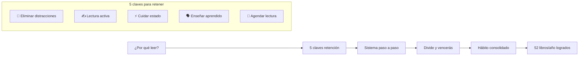
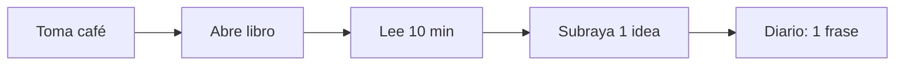
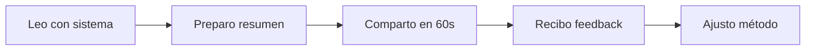
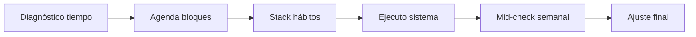

# MASTERCLASS: Sistema para Leer 52 Libros al Año - Método Práctico 📚🚀

## INTRODUCCIÓN: POR QUÉ ESTA MASTERCLASS ES DIFERENTE ⚡

> **🎯 Objetivo de Aprendizaje** — Al final de esta guía, podrás leer 1 libro/semana usando el método divide-y-vencerás, aplicar 5 técnicas de retención del 90%, y crear un sistema sostenible con agenda ocupada.

> **⚠️ Advertencia educativa** — Este contenido es formativo. La lectura transformadora requiere aplicación. No se trata de velocidad, sino de comprensión profunda.

---

## MAPA DEL WORKFLOW 🔄



---

## PARTE 1: ¿POR QUÉ LEER? - LA HERRAMIENTA TRANSFORMADORA 🚀

### 1.1 Principio Central: Libros = Acceso a Mentes Expertas 🧠

> **💡 Insight (0:00-0:48)**: Un libro = 10-20 años de experiencia condensada. Leo para emprender, resolver problemas y tomar mejores decisiones.

### 1.2 ROI de la lectura 💰

| Ahorro | Libro equiv |
|--------|-------------|
| **Emprender** | 300+ errores evitados |
| **Problemas** | 50+ horas de pensamiento ahorrado |
| **Decisiones** | 10x mejor puntuación en finanzas |
| **Crecimiento** | 70% más oportunidades visibles |

---

## PARTE 2: 5 CLAVES PARA RETENER LO QUE LEEs - LA FÓRMULA DEL 90% 🎯

### 2.1 Clave 1: Eliminar distracciones (3:50-4:35) 🚫

> **📵 Regla de oro**: Sin notificaciones = doble retención.

```python
# Protocolo deep work para lectura
def setup_deep_reading():
    return {
        'phone': 'en otra habitación + modo avión',
        'computer': 'pantalla completa + apps bloqueadas',
        'environment': 'silla cómoda + luz cálida + café listo',
        'timer': '25 minutos bloque sin interrupciones'
    }
```

### 2.2 Clave 2: Lectura activa (4:35-5:23) ✍️

> **🧠 Dato**: La mente aprende creando, no consumiendo pasivamente.

**Técnica del triángulo de subrayado**:

```
📄 Página leída → 
    Subraya 1 idea clave (amarillo) +
    1 duda o pregunta (azul) +  
    1 conexión con tu vida (rosa) +
    1 acción concreta (verde)
```

### 2.3 Clave 3: Cuidar el estado (5:23-6:02) ⚡

> **⚡ Estado óptimo**: Curiosidad + entusiasmo + relajación.

**Pre-lectura energética (3 minutos)**:

```mermaid
flowchart LR
    A[Respiración 4-4-4] --> B[Postura ganadora]
    B --> C[Intención: "Hoy aprendo X"]
    C --> D[Libro abierto]
```

### 2.4 Clave 4: Enseñar lo aprendido (6:02-6:49) 🗣️

> **📊 Estadística clave**: Enseñar incrementa retención hasta 90%.

**Técnica del micro-post**:

| Formato | Tiempo | Audiencia |
|---------|--------|-----------|
| **Tweet** | 2 min | 1000+ personas |
| **LinkedIn post** | 5 min | Profesionales |
| **WhatsApp voz** | 3 min | Contactos cercanos |
| **Diario compartido** | 10 min | Tu yo futuro |

### 2.5 Clave 5: Agendar la lectura (6:49-7:13) 📅

> **📅 Ley de Pareto**: Lo no planeado no existe. Agenda = compromiso.

**Sistema de bloques**:

```python
# Calendario lectivo
def reading_schedule():
    return {
        'morning': '7:00-7:20 (10 min + café)',
        'midday': '13:00-13:15 (tras comer)',
        'night': '21:30-21:45 (antes de dormir)',
        'total': '30 min/día = 210 min/semana'
    }
```

---

## PARTE 3: EL SISTEMA PASO A PASO - DIVIDE Y VENCERÁS ⚔️

### 3.1 Fórmula mágica (7:13-8:22) 🔢

> **🧮 Regla**: 200 páginas ÷ 7 días = 28-30 páginas/día ≈ 15 minutos.

### 3.2 Segmentación inteligente 📊

| Momento | Tiempo | Páginas | Tipo |
|---------|--------|---------|------|
| **Mañana** | 7-9am | 10 pág | Cerebro fresco + café |
| **Tarde** | 13-15pm | 10 pág | Sesión central |
| **Noche** | 21-22pm | 8-10 pág | Relajación mental |

### 3.3 Protocolo de división 🗂️

```python
# Sistema divide y vencerás
def divide_book(pages, weeks=1):
    daily = pages // 7
    sessions = 3
    pages_per_session = daily // sessions
    
    return {
        'daily_target': pages_per_session,
        'session_1': f"{pages_per_session} pág (mañana)",
        'session_2': f"{pages_per_session} pág (tarde)", 
        'session_3': f"{pages_per_session} pág (noche)",
        'buffer': f"+ {pages % 7} pág extra días disponibles"
    }
```

### 3.4 Ejemplo práctico 📖

**Libro: 210 páginas**:

| Día | Sesión 1 | Sesión 2 | Sesión 3 | Total |
|-----|----------|----------|----------|-------|
| Lunes | 30 pág | 30 pág | 30 pág | 90 pág |
| Martes | 30 pág | 30 pág | 30 pág | 180 pág |
| Miércoles | 30 pág | 10 pág | - | 210 pág ✅ |

---

## PARTE 4: EMPEZAR POCHO A POCHO - CONSTRUYENDO EL HÁBITO (8:22-9:30) 🐣

### 4.1 Meta del mes (6 páginas/día) 🎯

> **📈 Meta inicial**: Un libro/mes ya te pone arriba del promedio (4x más que la mayoría).

### 4.2 Escalonamiento progresivo 📈

| Semana | Meta diaria | Tiempo | Objetivo |
|--------|-------------|--------|----------|
| 1 | 6 páginas | 10 min | Construir rutina |
| 2 | 12 páginas | 15 min | Aumentar consistencia |
| 3 | 18 páginas | 20 min | Hábito asentado |
| 4 | 28 páginas | 30 min | 52 libros/año |

### 4.3 Stack de hábitos 🔗



---

## PARTE 5: I DO / WE DO / YOU DO - EJERCICIOS PROGRESIVOS 🎓

### 5.1 I Do — Lectura activa guiada ✍️

**Objetivo**: Aplicar las 5 claves en 20 minutos

| Paso | Acción | Minutos |
|------|--------|---------|
| 1 | Setup deep work | 2 min 🚫 |
| 2 | Prepara estado óptimo | 3 min ⚡ |
| 3 | Lee 10 páginas activo | 10 min 📖✍️ |
| 4 | Resume en 1 frase | 2 min 🗣️ |
| 5 | Agenda próxima sesión | 1 min 📅 |

### 5.2 We Do — Análisis en comunidad 🧑‍🤝‍🧑

**Ejercicio grupal**: Compartir aprendizajes en 60 segundos



### 5.3 You Do — Sistema personal 🚀

**Tarea**: Diseña tu sistema lectivo para 4 semanas



**Checklist de implementación**:

- [ ] Identifica 3 bloques de 10-15 min en tu día
- [ ] Compra 4 libros para el mes siguiente
- [ ] Configura bloqueador de apps
- [ ] Crea template de notas: idea/duda/conexión/acción
- [ ] Agenda primera sesión hoy mismo

---

## PREGUNTAS DE VERIFICACIÓN 📝

1. **Aplica**: Si lees 6 páginas diarias, ¿cuántos libros terminarías este año? ¿Qué cambiaría en tu vida?

2. **Analiza**: ¿Cuál de las 5 claves es tu mayor derrota actual? ¿Qué harías hoy para corregirla?

3. **Diseña**: Crea tu stack de hábitos lectivos. ¿Qué acción ya haces que puedes enlazar?

4. **Reflexiona**: ¿Qué harías con un 90% de retención? ¿Qué problema resolverías compartiendo lo leído?

---

## GLOSARIO RÁPIDO 📚

| Término | Definición | Emoji |
|---------|------------|-------|
| **Deep Reading** | Lectura sin distracciones | 📖🚫 |
| **Active Reading** | Subrayar + crear notas | ✍️📚 |
| **Retention 90%** | Enseñar = recordar | 🗣️🧠 |
| **Divide y vencerás** | 200 pág ÷ 7 días | ⚔️📚 |
| **Stack hábito** | Encadenar acciones | 🔗🔄 |
| **Micro-post** | Compartir en redes | 📱✍️ |

---

## RECURSOS ADICIONALES 📦

### Apps recomendadas 📱
- **Bloqueo**: Forest, Freedom, Cold Turkey
- **Tracking**: StoryGraph, Goodreads
- **Notas**: Notion, Obsidian, MarginNote

### Libros esenciales 📚
- "How to Read a Book" - Mortimer Adler
- "The Compound Effect" - Darren Hardy
- "Atomic Habits" - James Clear

### Podcasts de referencia 🎙️
- Mis Propias Finanzas
- The Tim Ferriss Show
- The Art of Manliness