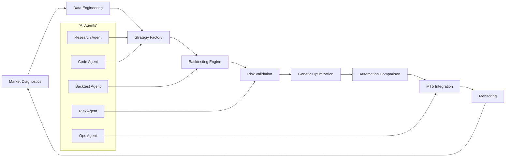
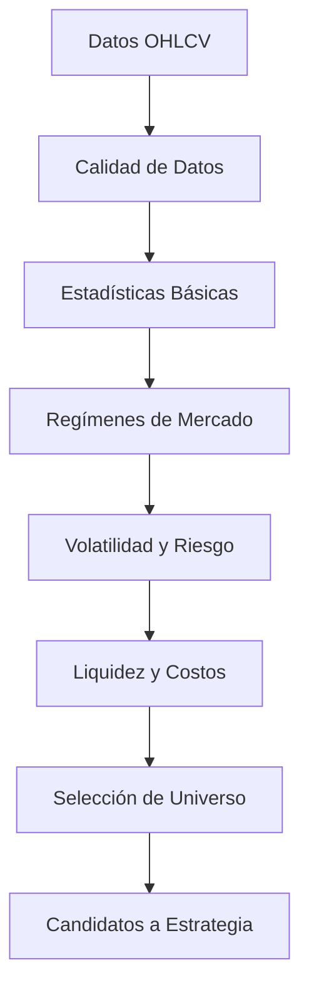
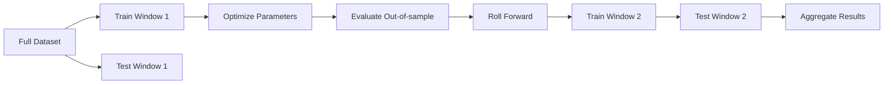
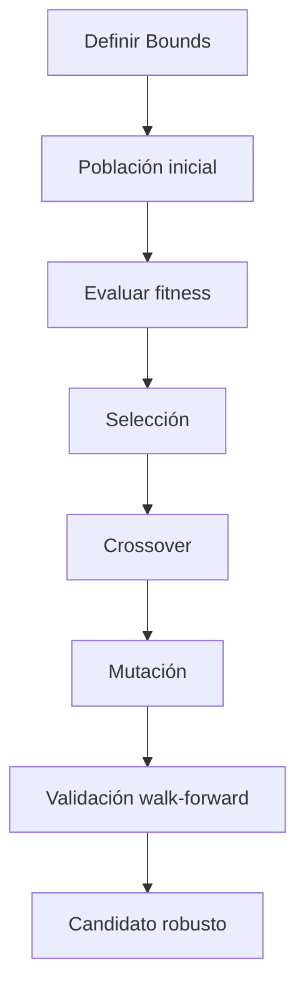
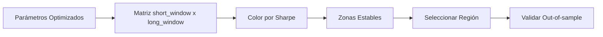

# MASTERCLASS: Alpha Quant Research Workflow - Fábrica de Estrategias Algorítmicas

## INTRODUCCIÓN: POR QUÉ ESTE MASTERCLASS ES DIFERENTE

La investigación cuantitativa tradicional suele avanzar demasiado lento para los mercados actuales. Un equipo tarda semanas en recolectar datos, limpiar velas, probar hipótesis, backtestear estrategias y optimizar parámetros. Cuando finalmente llega una idea a producción, el régimen del mercado ya cambió.

Este masterclass propone otro camino: una **fábrica de estrategias algorítmicas** donde Python, datos financieros, backtesting riguroso, optimización genética, automatización y AI agents trabajan como un sistema integrado.

La meta no es encontrar una estrategia mágica. La meta es construir un proceso repetible para descubrir, validar, descartar y mejorar ideas de trading con disciplina estadística.

> **Objetivo de Aprendizaje** — Al final de esta guía, podrás diseñar un workflow end-to-end para investigar mercados, generar estrategias, backtestearlas, optimizarlas, comparar automatizaciones, integrar MetaTrader5 y documentar una ruta de producción.

> **Advertencia educativa** — Este contenido es formativo. Ninguna estrategia, métrica o código debe interpretarse como recomendación financiera. El trading cuantitativo requiere gestión de riesgo, validación robusta y control operacional.

---

## MAPA DEL WORKFLOW



| Fase | Pregunta que responde | Output principal |
|------|-----------------------|------------------|
| **Market Diagnostics** | ¿Qué tipo de mercado estoy investigando? | Regímenes, volatilidad, liquidez y sesgos |
| **Data Engineering** | ¿Los datos son confiables? | Pipeline reproducible y validado |
| **Strategy Factory** | ¿Qué ideas puedo convertir en señales? | Reglas, features y parámetros |
| **Backtesting Engine** | ¿La estrategia sobrevive al pasado? | Métricas, equity curve y drawdown |
| **Risk Validation** | ¿El riesgo es aceptable? | Límites, sizing y escenarios |
| **Genetic Optimization** | ¿Qué combinación de parámetros es robusta? | Candidatos optimizados |
| **Automation Comparison** | ¿Dónde debe operar la estrategia? | Arquitectura de ejecución |
| **MT5 Integration** | ¿Cómo se ejecuta en mercado? | Orders, positions y monitoreo |
| **Monitoring** | ¿La estrategia sigue viva? | Alertas, logs y kill-switch |

---

## PARTE 1: MARKET DIAGNOSTICS — LEER EL MERCADO ANTES DE OPERARLO

### 1.1 Principio Central

Una estrategia no vive aislada. Vive dentro de un régimen de mercado. Una tendencia alcista premia sistemas momentum. Un rango lateral premia mean reversion. Un mercado de alta volatilidad castiga apalancamiento excesivo. Un mercado ilíquido castiga slippage.

El primer error del quant principiante es saltar directo a la idea. El primer hábito del quant profesional es diagnosticar.



### 1.2 Qué significa diagnosticar un mercado

| Diagnóstico | Qué mide | Por qué importa |
|-------------|----------|-----------------|
| **Tendencia** | Dirección y persistencia del precio | Decide si usar momentum o reversión |
| **Volatilidad** | Amplitud de movimientos | Define sizing, stops y frecuencia |
| **Liquidez** | Spread, volumen y profundidad | Estima slippage y capacidad |
| **Regulación de régimen** | Cambios entre tendencia, rango y caos | Evita operar la misma regla en contextos distintos |
| **Costos de transacción** | Spread, comisión y slippage | Determina si la ventaja estadística es real |
| **Correlaciones** | Dependencia entre activos | Reduce riesgo concentrado |
| **Sesgos temporales** | Horarios, sesiones y eventos | Evita falsos edge por calendario |

### 1.3 Código base de Market Diagnostics

```python
import numpy as np
import pandas as pd
from dataclasses import dataclass


@dataclass
class MarketDiagnostics:
    data: pd.DataFrame
    risk_free_rate: float = 0.0

    def prepare(self) -> pd.DataFrame:
        df = self.data.copy()
        df = df.dropna(subset=['open', 'high', 'low', 'close'])
        df['return'] = np.log(df['close']).diff()
        df['range'] = (df['high'] - df['low']) / df['close']
        return df

    def volatility(self, window: int = 20) -> pd.Series:
        df = self.prepare()
        return df['return'].rolling(window).std() * np.sqrt(252)

    def sharpe(self, window: int = 252) -> float:
        df = self.prepare()
        excess = df['return'] - self.risk_free_rate / 252
        if excess.std() == 0:
            return 0.0
        return np.sqrt(252) * excess.mean() / excess.std()

    def max_drawdown(self) -> float:
        df = self.prepare()
        equity = (1 + df['return'].fillna(0)).cumprod()
        running_max = equity.cummax()
        drawdown = equity / running_max - 1
        return drawdown.min()

    def trend_score(self, short_window: int = 20, long_window: int = 100) -> float:
        df = self.prepare()
        short_ma = df['close'].rolling(short_window).mean()
        long_ma = df['close'].rolling(long_window).mean()
        score = (short_ma - long_ma) / long_ma
        return score.dropna().iloc[-1]

    def regime(self, window: int = 60) -> str:
        vol = self.volatility(window)
        trend = self.trend_score()
        last_vol = vol.dropna().iloc[-1]
        median_vol = vol.dropna().median()

        if last_vol > median_vol * 1.5 and abs(trend) < 0.01:
            return 'volatile_range'
        if abs(trend) > 0.03 and last_vol < median_vol * 1.3:
            return 'smooth_trend'
        if abs(trend) > 0.03 and last_vol >= median_vol * 1.3:
            return 'volatile_trend'
        return 'mean_reversion_range'

    def summary(self) -> dict:
        return {
            'sharpe': self.sharpe(),
            'max_drawdown': self.max_drawdown(),
            'trend_score': self.trend_score(),
            'regime': self.regime(),
```

## APPEND

## PARTE 2: DATA ENGINEERING — EL PIPELINE QUE NO MIENTE

### 2.1 Regla de Oro

Si el dato está roto, el backtest está roto. Una señal brillante sobre datos sucios produce una curva de equity falsa. Antes de hablar de alpha, el pipeline debe responder:

1. ¿Hay velas duplicadas?
2. ¿Hay saltos horarios incorrectos?
3. ¿Hay gaps imposibles?
4. ¿El ajuste de splits o dividendos es consistente?
5. ¿El spread estimado es realista?
6. ¿La frecuencia coincide con la estrategia?

### 2.2 Estructura mínima del proyecto

```text
alpha-quant-workflow/
├── data/
│   ├── raw/
│   ├── processed/
│   └── cache/
├── notebooks/
│   └── diagnostics.ipynb
├── src/
│   ├── data_loader.py
│   ├── diagnostics.py
│   ├── strategy_factory.py
│   ├── backtester.py
│   ├── optimizer.py
│   └── mt5_adapter.py
├── tests/
│   ├── test_data_quality.py
│   └── test_backtester.py
├── configs/
│   ├── symbols.yaml
│   └── risk.yaml
└── requirements.txt
```

### 2.3 Data loader con validaciones

```python
import pandas as pd
from pathlib import Path


class DataValidator:
    def __init__(self, df: pd.DataFrame):
        self.df = df.copy()

    def required_columns(self) -> bool:
        required = {'timestamp', 'open', 'high', 'low', 'close', 'volume'}
        return required.issubset(self.df.columns)

    def no_duplicate_index(self) -> bool:
        return not self.df.index.has_duplicates

    def positive_prices(self) -> bool:
        price_cols = ['open', 'high', 'low', 'close']
        return (self.df[price_cols] > 0).all().all()

    def high_low_logic(self) -> bool:
        return ((self.df['high'] >= self.df['low']) &
                (self.df['high'] >= self.df['open']) &
                (self.df['high'] >= self.df['close']) &
                (self.df['low'] <= self.df['open']) &
                (self.df['low'] <= self.df['close'])).all()

    def returns_are_finite(self) -> bool:
        returns = self.df['close'].pct_change()
        return returns.replace([float('inf'), float('-inf')], float('nan')).notna().all()

    def run(self) -> dict:
        checks = {
            'required_columns': self.required_columns(),
            'no_duplicate_index': self.no_duplicate_index(),
            'positive_prices': self.positive_prices(),
            'high_low_logic': self.high_low_logic(),
            'returns_are_finite': self.returns_are_finite(),
        }
        return {
            'valid': all(checks.values()),
            'checks': checks,
        }


def load_ohlcv(path: str | Path) -> pd.DataFrame:
    df = pd.read_csv(path, parse_dates=['timestamp'])
    df = df.set_index('timestamp').sort_index()
    validator = DataValidator(df)
    report = validator.run()
    if not report['valid']:
        failed = [name for name, ok in report['checks'].items() if not ok]
        raise ValueError(f'Data validation failed: {failed}')
    return df
```

### 2.4 Tabla de validaciones críticas

| Riesgo de dato | Síntoma en backtest | Validación |
|----------------|---------------------|------------|
| Duplicados | Rentabilidad inflada | Índice sin duplicados |
| Velas fuera de orden | Señales desplazadas | Orden cronológico |
| Precios cero | Retornos infinitos | Precios positivos |
| High menor que low | Lógica imposible | High >= low |
| Gaps excesivos | Slippage subestimado | Umbral por percentil |
| Ajustes mal aplicados | Señales falsas | Revisión de splits/dividendos |
| Sesión incompleta | Frecuencia incorrecta | Calendario por activo |

## PARTE 3: STRATEGY FACTORY — CONVERTIR HIPÓTESIS EN ESTRATEGIAS

### 3.1 Qué es una Strategy Factory

Una Strategy Factory no es una carpeta con scripts sueltos. Es una línea de ensamblaje que transforma una hipótesis en una estrategia parametrizada:

```text
Hipótesis → Features → Señal → Filtro → Sizing → Backtest → Métricas
```

La factory debe permitir probar muchas variaciones sin reescribir el sistema. Por ejemplo, una idea de cruce de medias puede variar en:

- ventana corta
- ventana larga
- tipo de promedio
- filtro de volatilidad
- filtro de volumen
- stop loss
- take profit
- frecuencia de rebalanceo

### 3.2 Arquitectura de una estrategia

| Componente | Función | Ejemplo |
|------------|---------|---------|
| **Universe** | Define qué activos se analizan | EURUSD, GBPUSD, XAUUSD |
| **Features** | Transforma precios en variables | SMA, RSI, ATR, z-score |
| **Signal** | Decide long, short o flat | Cruce, ruptura, reversión |
| **Filter** | Evita regímenes malos | Volatilidad, spread, horario |
| **Sizing** | Define tamaño de posición | Riesgo fijo por trade |
| **Execution** | Define cómo se opera | Market, limit, trailing |
| **Risk** | Controla pérdidas y exposición | Max DD, daily loss, kill-switch |

### 3.3 Código de Strategy Factory

```python
import numpy as np
import pandas as pd
from dataclasses import dataclass
from enum import Enum


class Signal(Enum):
    FLAT = 0
    LONG = 1
    SHORT = -1


@dataclass
class StrategyConfig:
    short_window: int = 10
    long_window: int = 50
    atr_window: int = 14
    volatility_threshold: float = 1.5
    stop_atr_multiple: float = 2.0
    take_profit_atr_multiple: float = 3.0
    risk_per_trade: float = 0.01


class StrategyFactory:
    def __init__(self, config: StrategyConfig):
        self.config = config

    def features(self, df: pd.DataFrame) -> pd.DataFrame:
        out = df.copy()
        out['sma_short'] = out['close'].rolling(self.config.short_window).mean()
        out['sma_long'] = out['close'].rolling(self.config.long_window).mean()
        delta = out['close'].diff()
        up = delta.clip(lower=0)
        down = -delta.clip(upper=0)
        roll_up = up.rolling(self.config.atr_window).mean()
        roll_down = down.rolling(self.config.atr_window).mean()
        out['rsi'] = 100 - (100 / (1 + roll_up / roll_down.replace(0, np.nan)))
        true_range = pd.concat([
            out['high'] - out['low'],
            (out['high'] - out['close'].shift()).abs(),
            (out['low'] - out['close'].shift()).abs(),
        ], axis=1).max(axis=1)
        out['atr'] = true_range.rolling(self.config.atr_window).mean()
        out['volatility_regime'] = out['atr'] / out['atr'].rolling(100).mean()
        return out

    def signal(self, features: pd.DataFrame) -> pd.Series:
        raw = np.select(
            [
                features['sma_short'] > features['sma_long'],
                features['sma_short'] < features['sma_long'],
            ],
            [Signal.LONG.value, Signal.SHORT.value],
            default=Signal.FLAT.value,
        )
        signal = pd.Series(raw, index=features.index)
        filter_mask = features['volatility_regime'] > self.config.volatility_threshold
        signal[filter_mask] = Signal.FLAT.value
        return signal.astype(int)

    def levels(self, features: pd.DataFrame, signal: pd.Series) -> pd.DataFrame:
        out = features.copy()
        out['signal'] = signal
        out['stop_loss'] = np.where(
            signal == Signal.LONG.value,
            out['close'] - self.config.stop_atr_multiple * out['atr'],
            np.where(
                signal == Signal.SHORT.value,
                out['close'] + self.config.stop_atr_multiple * out['atr'],
                np.nan,
            ),
        )
        out['take_profit'] = np.where(
            signal == Signal.LONG.value,
            out['close'] + self.config.take_profit_atr_multiple * out['atr'],
            np.where(
                signal == Signal.SHORT.value,
                out['close'] - self.config.take_profit_atr_multiple * out['atr'],
                np.nan,
            ),
        )
        return out
```

### 3.4 Tabla de familias de estrategias

| Familia | Edge esperado | Mejor régimen | Riesgo principal |
|---------|---------------|---------------|------------------|
| **Trend following** | Persistencia direccional | Tendencias suaves | Whipsaws en rangos |
| **Mean reversion** | Exceso de desviación | Rangos estables | Rupturas violentas |
| **Breakout** | Expansión post-consolidación | Volatilidad creciente | Falsas rupturas |
| **Carry** | Diferencial de tasas o rollover | Mercados calmados | Cambios de régimen |
| **Stat arb** | Relación histórica entre activos | Alta correlación | Desacople estructural |
| **Event driven** | Reacción a eventos | Ventanas específicas | Liquidez y slippage |

### 3.5 Prompt para AI Research Agent

```text
Actúa como investigador cuantitativo senior.
Objetivo: generar 10 hipótesis de estrategia para el activo {symbol} en timeframe {timeframe}.
Entradas:
- Régimen detectado: {regime}
- Volatilidad anualizada: {volatility}
- Spread promedio: {spread}
- Liquidez: {liquidity}
- Restricciones: sin martingala, sin sobreajuste, costos incluidos.
Entrega:
1. Nombre de la hipótesis
2. Lógica económica
3. Features necesarias
4. Filtros de régimen
5. Riesgos esperados
6. Métrica de invalidación
```

6. Métrica de invalidación
```

## PARTE 4: BACKTESTING ENGINE — PROBAR SIN AUTOENGAÑO

### 4.1 El backtest perfecto no existe

Un backtest es una simulación condicionada por supuestos. Si los supuestos son ingenuos, la simulación será optimista. Si los supuestos son conservadores, la simulación será más útil.

Los errores más comunes son:

- usar el futuro en las señales
- ignorar comisiones
- ignorar slippage
- optimizar sobre toda la muestra
- no separar entrenamiento y validación
- medir solo rentabilidad
- no evaluar drawdown
- no comparar contra un benchmark
- no probar robustez por parámetros

### 4.2 Métricas mínimas

| Métrica | Fórmula conceptual | Interpretación |
|---------|--------------------|----------------|
| **CAGR** | Crecimiento anual compuesto | Rentabilidad anualizada |
| **Volatilidad** | Desviación de retornos | Variabilidad del resultado |
| **Sharpe** | Exceso de retorno / volatilidad | Retorno ajustado a riesgo |
| **Sortino** | Exceso de retorno / downside deviation | Penaliza solo pérdidas |
| **Max Drawdown** | Peor caída peak-to-trough | Peor dolor histórico |
| **Profit Factor** | Ganancias brutas / pérdidas brutas | Calidad del payoff |
| **Win Rate** | Trades ganadores / total trades | Frecuencia de aciertos |
| **Expectancy** | Promedio ponderado por resultado | Valor esperado por trade |
| **Exposure** | Tiempo en mercado | Capital realmente utilizado |
| **Turnover** | Rotación de posiciones | Costos potenciales |

### 4.3 Backtester vectorizado simple

```python
import numpy as np
import pandas as pd


class VectorBacktester:
    def __init__(self, initial_capital=100000.0, commission=0.0005, slippage=0.0002):
        self.initial_capital = initial_capital
        self.commission = commission
        self.slippage = slippage

    def run(self, prices: pd.DataFrame, signals: pd.Series) -> pd.DataFrame:
        df = prices.copy()
        df['signal'] = signals.reindex(df.index).fillna(0)
        df['position'] = df['signal'].shift(1).fillna(0)
        df['ret'] = np.log(df['close']).diff().fillna(0)
        df['strategy_ret'] = df['position'] * df['ret']

        turnover = df['position'].diff().abs().fillna(0)
        costs = turnover * (self.commission + self.slippage)
        df['strategy_ret'] = df['strategy_ret'] - costs

        df['equity'] = self.initial_capital * np.exp(df['strategy_ret'].cumsum())
        df['benchmark'] = self.initial_capital * np.exp(df['ret'].cumsum())
        return df

    def metrics(self, result: pd.DataFrame) -> dict:
        returns = result['strategy_ret']
        equity = result['equity']
        trades = result['position'].diff().abs().fillna(0)
        trade_count = int(trades.sum())

        gross_profit = returns[returns > 0].sum()
        gross_loss = abs(returns[returns < 0].sum())
        profit_factor = gross_profit / gross_loss if gross_loss else np.inf

        dd = equity / equity.cummax() - 1
        max_dd = dd.min()
        cagr = (equity.iloc[-1] / self.initial_capital) ** (252 / len(result)) - 1
        sharpe = np.sqrt(252) * returns.mean() / returns.std() if returns.std() else 0

        return {
            'cagr': cagr,
            'sharpe': sharpe,
            'max_drawdown': max_dd,
            'profit_factor': profit_factor,
            'trade_count': trade_count,
            'final_equity': equity.iloc[-1],
        }
```

### 4.4 Walk-forward validation



| Bloque | Uso | Regla |
|--------|-----|-------|
| **In-sample** | Optimizar parámetros | Nunca reporta resultado final |
| **Out-of-sample** | Validar robustez | Debe sostener métricas |
| **Burn-in** | Calcular indicadores | No opera durante warm-up |
| **Paper trading** | Validar ejecución | Compara señales vs fills |
| **Live monitoring** | Control real | Detecta degradación |

### 4.5 Señales de overfitting

| Señal | Qué sugiere | Acción |
|-------|-------------|--------|
| Sharpe altísimo en una muestra corta | Curva demasiado perfecta | Probar más años |
| Muchos parámetros para pocos trades | Modelo frágil | Reducir complejidad |
| Resultados excelentes solo en un activo | Edge específico o ruido | Probar universo |
| Caída fuerte fuera de muestra | Sobreajuste | Reentrenar con walk-forward |
| Sensibilidad extrema a un parámetro | Inestabilidad | Usar zonas robustas |
| Win rate alto con payoff pobre | Costos pueden comer edge | Incluir slippage realista |

## PARTE 5: RISK VALIDATION — GESTIÓN DE RIESGO ANTES DE OPTIMIZACIÓN

### 5.1 El riesgo no es una sección final

La optimización sin riesgo produce estrategias peligrosas. Un parámetro puede mejorar Sharpe mientras concentra pérdidas en eventos raros. Por eso, cada estrategia debe pasar una batería de estrés antes de llegar a producción.

### 5.2 Reglas de riesgo por defecto

| Regla | Límite sugerido | Motivo |
|-------|-----------------|--------|
| Riesgo por trade | 0.25% a 1.00% del equity | Evita ruina temprana |
| Drawdown diario | 2% a 4% | Freno operativo |
| Drawdown de estrategia | 10% a 20% | Revisión obligatoria |
| Correlación máxima | 0.70 entre estrategias | Diversificación real |
| Exposición máxima | Por activo, sector y mercado | Control de concentración |
| Slippage mínimo | Basado en percentil 95 | Conservadurismo |
| Kill-switch | Activación automática | Protección operacional |

### 5.3 Position sizing por volatilidad

```python
import numpy as np


def position_size_from_atr(account_equity, risk_per_trade, entry_price, stop_price, atr, contract_value=1.0):
    technical_risk = abs(entry_price - stop_price)
    if technical_risk <= 0 or atr <= 0:
        return 0.0

    risk_amount = account_equity * risk_per_trade
    units_by_risk = risk_amount / technical_risk
    units_by_volatility = account_equity * risk_per_trade / (atr * contract_value)
    units = min(units_by_risk, units_by_volatility)

    return max(units, 0.0)
```

### 5.4 Stress test conceptual

| Escenario | Descripción | Qué debe resistir |
|-----------|-------------|-------------------|
| **Vol shock** | Volatilidad 2x o 3x | Stops, sizing, margen |
| **Liquidity shock** | Spread 3x promedio | Slippage y fills |
| **Gap adverse** | Salto contra posición | Stop gap y exposición |
| **Correlation shock** | Activos correlacionan a 1 | Diversificación |
| **Latency shock** | Ejecución tardía | Estrategias intradía |
| **Data outage** | Feed interrumpido | Kill-switch |
| **Broker issue** | Rechazo de órdenes | Reconciliación |

## APPEND2

## PARTE 6: GENETIC OPTIMIZATION

La optimización genética permite explorar espacios grandes de parámetros sin probar cada combinación posible. Se usa para encontrar regiones estables, no para fabricar una curva perfecta.

### 6.1 Flujo de trabajo



### 6.2 Fitness function

| Componente | Peso | Motivo |
|------------|------|--------|
| Sharpe out-of-sample | 30% | Rentabilidad ajustada a riesgo |
| Max drawdown | 25% | Penaliza caídas severas |
| Profit factor | 15% | Calidad del payoff |
| Trade count | 10% | Evita muestras vacías |
| Stability | 10% | Penaliza picos aislados |
| Cost sensitivity | 10% | Mide fragilidad ante costos |

### 6.3 Código base

```python
import random
import numpy as np


class GeneticOptimizer:
    def __init__(self, bounds, population_size=40, generations=25):
        self.bounds = bounds
        self.population_size = population_size
        self.generations = generations

    def random_gene(self):
        return {
            'short_window': random.randint(*self.bounds['short_window']),
            'long_window': random.randint(*self.bounds['long_window']),
            'atr_window': random.randint(*self.bounds['atr_window']),
            'stop_atr_multiple': random.uniform(*self.bounds['stop_atr_multiple']),
            'take_profit_atr_multiple': random.uniform(*self.bounds['take_profit_atr_multiple']),
        }

    def initialize(self):
        return [self.random_gene() for _ in range(self.population_size)]

    def mutate(self, gene):
        mutated = gene.copy()
        for key in mutated:
            if random.random() < 0.15:
                low, high = self.bounds[key]
                mutated[key] = random.randint(low, high) if isinstance(low, int) else random.uniform(low, high)
        return mutated

    def crossover(self, a, b):
        keys = list(a.keys())
        point = random.randint(1, len(keys) - 1)
        child = {**{k: a[k] for k in keys[:point]}, **{k: b[k] for k in keys[point:]}}
        return child

    def optimize(self, evaluator):
        population = self.initialize()
        history = []
        for _ in range(self.generations):
            scored = [(evaluator(gene), gene) for gene in population]
            scored.sort(reverse=True, key=lambda x: x[0])
            history.append(scored[0])
            elites = [gene for _, gene in scored[:5]]
            next_population = elites.copy()
            while len(next_population) < self.population_size:
                p1, p2 = random.sample(scored[:20], 2)
                child = self.crossover(p1[1], p2[1])
                next_population.append(self.mutate(child))
            population = next_population
        return history
```

### 6.4 Errores comunes

| Error | Consecuencia | Prevención |
|-------|--------------|------------|
| Fitness solo en CAGR | Estrategias extremas | Usar Sharpe y drawdown |
| Población pequeña | Búsqueda pobre | Aumentar población |
| Generaciones excesivas | Sobreajuste | Early stopping |
| Sin out-of-sample | Falsa confianza | Walk-forward |
| Sin costos | Edge ilusorio | Comisión y slippage |
| Sin límites lógicos | Parámetros absurdos | Bounds estrictos |
| Sin robustez | Picos aislados | Heatmaps y perturbaciones |

### 6.5 Heatmap de parámetros



| Patrón en heatmap | Lectura |
|-------------------|---------|
| Isla pequeña con Sharpe alto | Posible sobreajuste |
| Meseta amplia con Sharpe bueno | Región robusta |
| Resultados buenos solo con ventanas largas | Lentitud y baja frecuencia |
| Resultados sensibles a un parámetro | Fragilidad |
| Mejores resultados con costos altos | Edge fuerte |
| Mejores resultados solo antes de 2020 | Régimen específico |

## PARTE 7: AUTOMATION COMPARISON

## PARTE 7: AUTOMATION COMPARISON — DÓNDE EJECUTAR LA ESTRATEGIA


