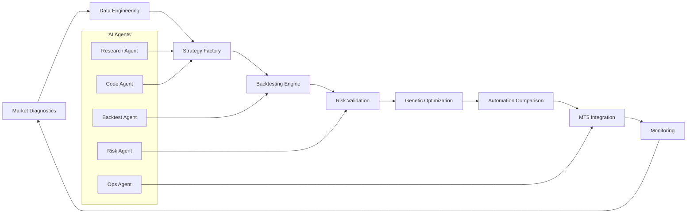
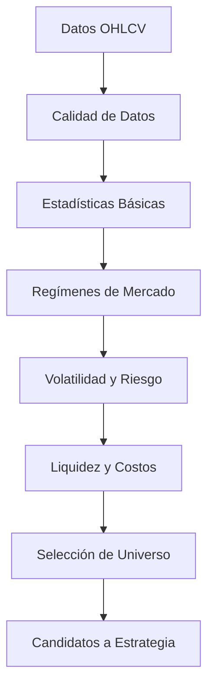
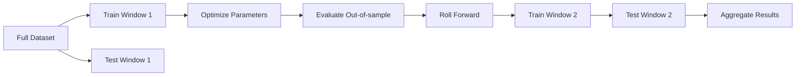
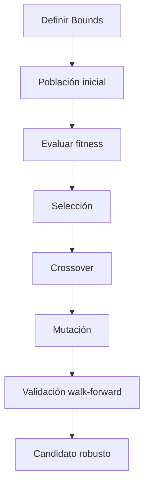
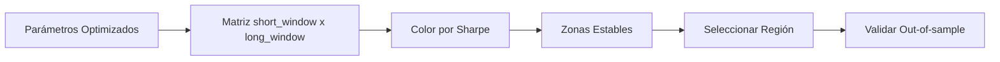
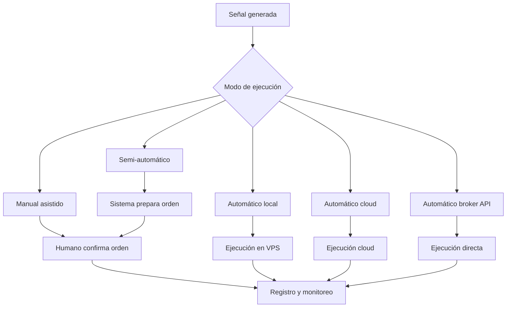
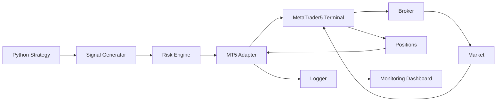
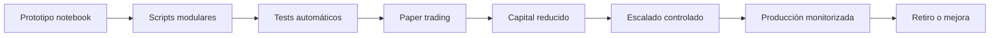
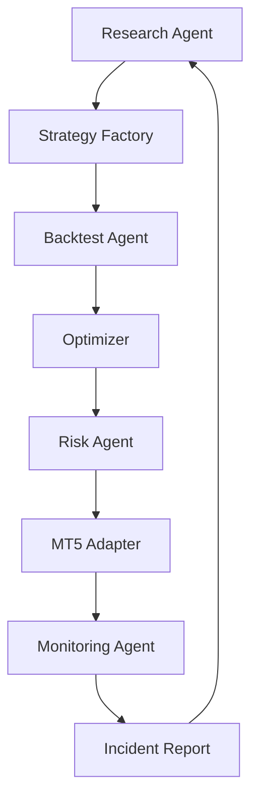

# MASTERCLASS: Alpha Quant Research Workflow - Fábrica de Estrategias Algorítmicas

## INTRODUCCIÓN: POR QUÉ ESTE MASTERCLASS ES DIFERENTE

La investigación cuantitativa tradicional suele avanzar demasiado lento para los mercados actuales. Un equipo tarda semanas en recolectar datos, limpiar velas, probar hipótesis, backtestear estrategias y optimizar parámetros. Cuando finalmente llega una idea a producción, el régimen del mercado ya cambió.

Este masterclass propone otro camino: una **fábrica de estrategias algorítmicas** donde Python, datos financieros, backtesting riguroso, optimización genética, automatización y AI agents trabajan como un sistema integrado.

La meta no es encontrar una estrategia mágica. La meta es construir un proceso repetible para descubrir, validar, descartar y mejorar ideas de trading con disciplina estadística.

> **Objetivo de Aprendizaje** — Al final de esta guía, podrás diseñar un workflow end-to-end para investigar mercados, generar estrategias, backtestearlas, optimizarlas, comparar automatizaciones, integrar MetaTrader5 y documentar una ruta de producción.

> **Advertencia educativa** — Este contenido es formativo. Ninguna estrategia, métrica o código debe interpretarse como recomendación financiera. El trading cuantitativo requiere gestión de riesgo, validación robusta y control operacional.

---

## MAPA DEL WORKFLOW



| Fase | Pregunta que responde | Output principal |
|------|-----------------------|------------------|
| **Market Diagnostics** | ¿Qué tipo de mercado estoy investigando? | Regímenes, volatilidad, liquidez y sesgos |
| **Data Engineering** | ¿Los datos son confiables? | Pipeline reproducible y validado |
| **Strategy Factory** | ¿Qué ideas puedo convertir en señales? | Reglas, features y parámetros |
| **Backtesting Engine** | ¿La estrategia sobrevive al pasado? | Métricas, equity curve y drawdown |
| **Risk Validation** | ¿El riesgo es aceptable? | Límites, sizing y escenarios |
| **Genetic Optimization** | ¿Qué combinación de parámetros es robusta? | Candidatos optimizados |
| **Automation Comparison** | ¿Dónde debe operar la estrategia? | Arquitectura de ejecución |
| **MT5 Integration** | ¿Cómo se ejecuta en mercado? | Orders, positions y monitoreo |
| **Monitoring** | ¿La estrategia sigue viva? | Alertas, logs y kill-switch |

```mermaid
flowchart LR
    subgraph I_Do["I Do (Instructor)"]
        direction TB
        A1[Market Diagnostics: Calculate volatility, trend score, regime] --> A2[Strategy Factory: Walkthrough of mean reversion signal] --> A3[Backtesting: Run vectorized test with conservative costs] --> A4[MT5: Connect to terminal, read symbols, simulate orders]
    end
    
    subgraph We_Do["We Do (Collaborative)"]
        direction TB
        B1[Team: Design EURUSD mean reversion strategy] --> B2[Collaborate: Refine strategy parameters together] --> B3[Interpret: Analyze metrics (Sharpe, trade count, drawdown)] --> B4[Review: Examine runbook for incident handling]
    end
    
    subgraph You_Do["You Do (Independent)"]
        direction TB
        C1[Build: Create Strategy Factory for 3 families (trend, mean reversion, breakout)] --> C2[Define: Set bounds and fitness for genetic optimization] --> C3[Design: Create monitoring dashboard for production] --> C4[Apply: Use full framework on your own strategy]
    end
    
    %% Styling with quant-appropriate colors
    classDef I_DoStyle fill:#E3F2FD,stroke:#1565C0,stroke-width:2px,color:#0D47A1;
    classDef We_DoStyle fill:#FFF8E1,stroke:#EF6C00,stroke-width:2px,color:#BF360C;
    classDef You_DoStyle fill:#E8F5E9,stroke:#2E7D32,stroke-width:2px,color:#1B5E20;
    
    class I_Do I_DoStyle;
    class We_Do We_DoStyle;
    class You_Do You_DoStyle;
```

---

## PARTE 1: MARKET DIAGNOSTICS — LEER EL MERCADO ANTES DE OPERARLO

### 1.1 Principio Central

Una estrategia no vive aislada. Vive dentro de un régimen de mercado. Una tendencia alcista premia sistemas momentum. Un rango lateral premia mean reversion. Un mercado de alta volatilidad castiga apalancamiento excesivo. Un mercado ilíquido castiga slippage.

El primer error del quant principiante es saltar directo a la idea. El primer hábito del quant profesional es diagnosticar.



### 1.2 Qué significa diagnosticar un mercado

| Diagnóstico | Qué mide | Por qué importa |
|-------------|----------|-----------------|
| **Tendencia** | Dirección y persistencia del precio | Decide si usar momentum o reversión |
| **Volatilidad** | Amplitud de movimientos | Define sizing, stops y frecuencia |
| **Liquidez** | Spread, volumen y profundidad | Estima slippage y capacidad |
| **Regulación de régimen** | Cambios entre tendencia, rango y caos | Evita operar la misma regla en contextos distintos |
| **Costos de transacción** | Spread, comisión y slippage | Determina si la ventaja estadística es real |
| **Correlaciones** | Dependencia entre activos | Reduce riesgo concentrado |
| **Sesgos temporales** | Horarios, sesiones y eventos | Evita falsos edge por calendario |

### 1.3 Código base de Market Diagnostics

```python
import numpy as np
import pandas as pd
from dataclasses import dataclass


@dataclass
class MarketDiagnostics:
    data: pd.DataFrame
    risk_free_rate: float = 0.0

    def prepare(self) -> pd.DataFrame:
        df = self.data.copy()
        df = df.dropna(subset=['open', 'high', 'low', 'close'])
        df['return'] = np.log(df['close']).diff()
        df['range'] = (df['high'] - df['low']) / df['close']
        return df

    def volatility(self, window: int = 20) -> pd.Series:
        df = self.prepare()
        return df['return'].rolling(window).std() * np.sqrt(252)

    def sharpe(self, window: int = 252) -> float:
        df = self.prepare()
        excess = df['return'] - self.risk_free_rate / 252
        if excess.std() == 0:
            return 0.0
        return np.sqrt(252) * excess.mean() / excess.std()

    def max_drawdown(self) -> float:
        df = self.prepare()
        equity = (1 + df['return'].fillna(0)).cumprod()
        running_max = equity.cummax()
        drawdown = equity / running_max - 1
        return drawdown.min()

    def trend_score(self, short_window: int = 20, long_window: int = 100) -> float:
        df = self.prepare()
        short_ma = df['close'].rolling(short_window).mean()
        long_ma = df['close'].rolling(long_window).mean()
        score = (short_ma - long_ma) / long_ma
        return score.dropna().iloc[-1]

    def regime(self, window: int = 60) -> str:
        vol = self.volatility(window)
        trend = self.trend_score()
        last_vol = vol.dropna().iloc[-1]
        median_vol = vol.dropna().median()

        if last_vol > median_vol * 1.5 and abs(trend) < 0.01:
            return 'volatile_range'
        if abs(trend) > 0.03 and last_vol < median_vol * 1.3:
            return 'smooth_trend'
        if abs(trend) > 0.03 and last_vol >= median_vol * 1.3:
            return 'volatile_trend'
        return 'mean_reversion_range'

    def summary(self) -> dict:
        return {
            'sharpe': self.sharpe(),
            'max_drawdown': self.max_drawdown(),
            'trend_score': self.trend_score(),
            'regime': self.regime(),
```

## APPEND

## PARTE 2: DATA ENGINEERING — EL PIPELINE QUE NO MIENTE

### 2.1 Regla de Oro

Si el dato está roto, el backtest está roto. Una señal brillante sobre datos sucios produce una curva de equity falsa. Antes de hablar de alpha, el pipeline debe responder:

1. ¿Hay velas duplicadas?
2. ¿Hay saltos horarios incorrectos?
3. ¿Hay gaps imposibles?
4. ¿El ajuste de splits o dividendos es consistente?
5. ¿El spread estimado es realista?
6. ¿La frecuencia coincide con la estrategia?

### 2.2 Estructura mínima del proyecto

```text
alpha-quant-workflow/
├── data/
│   ├── raw/
│   ├── processed/
│   └── cache/
├── notebooks/
│   └── diagnostics.ipynb
├── src/
│   ├── data_loader.py
│   ├── diagnostics.py
│   ├── strategy_factory.py
│   ├── backtester.py
│   ├── optimizer.py
│   └── mt5_adapter.py
├── tests/
│   ├── test_data_quality.py
│   └── test_backtester.py
├── configs/
│   ├── symbols.yaml
│   └── risk.yaml
└── requirements.txt
```

### 2.3 Data loader con validaciones

```python
import pandas as pd
from pathlib import Path


class DataValidator:
    def __init__(self, df: pd.DataFrame):
        self.df = df.copy()

    def required_columns(self) -> bool:
        required = {'timestamp', 'open', 'high', 'low', 'close', 'volume'}
        return required.issubset(self.df.columns)

    def no_duplicate_index(self) -> bool:
        return not self.df.index.has_duplicates

    def positive_prices(self) -> bool:
        price_cols = ['open', 'high', 'low', 'close']
        return (self.df[price_cols] > 0).all().all()

    def high_low_logic(self) -> bool:
        return ((self.df['high'] >= self.df['low']) &
                (self.df['high'] >= self.df['open']) &
                (self.df['high'] >= self.df['close']) &
                (self.df['low'] <= self.df['open']) &
                (self.df['low'] <= self.df['close'])).all()

    def returns_are_finite(self) -> bool:
        returns = self.df['close'].pct_change()
        return returns.replace([float('inf'), float('-inf')], float('nan')).notna().all()

    def run(self) -> dict:
        checks = {
            'required_columns': self.required_columns(),
            'no_duplicate_index': self.no_duplicate_index(),
            'positive_prices': self.positive_prices(),
            'high_low_logic': self.high_low_logic(),
            'returns_are_finite': self.returns_are_finite(),
        }
        return {
            'valid': all(checks.values()),
            'checks': checks,
        }


def load_ohlcv(path: str | Path) -> pd.DataFrame:
    df = pd.read_csv(path, parse_dates=['timestamp'])
    df = df.set_index('timestamp').sort_index()
    validator = DataValidator(df)
    report = validator.run()
    if not report['valid']:
        failed = [name for name, ok in report['checks'].items() if not ok]
        raise ValueError(f'Data validation failed: {failed}')
    return df
```

### 2.4 Tabla de validaciones críticas

| Riesgo de dato | Síntoma en backtest | Validación |
|----------------|---------------------|------------|
| Duplicados | Rentabilidad inflada | Índice sin duplicados |
| Velas fuera de orden | Señales desplazadas | Orden cronológico |
| Precios cero | Retornos infinitos | Precios positivos |
| High menor que low | Lógica imposible | High >= low |
| Gaps excesivos | Slippage subestimado | Umbral por percentil |
| Ajustes mal aplicados | Señales falsas | Revisión de splits/dividendos |
| Sesión incompleta | Frecuencia incorrecta | Calendario por activo |

## PARTE 3: STRATEGY FACTORY — CONVERTIR HIPÓTESIS EN ESTRATEGIAS

### 3.1 Qué es una Strategy Factory

Una Strategy Factory no es una carpeta con scripts sueltos. Es una línea de ensamblaje que transforma una hipótesis en una estrategia parametrizada:

```text
Hipótesis → Features → Señal → Filtro → Sizing → Backtest → Métricas
```

La factory debe permitir probar muchas variaciones sin reescribir el sistema. Por ejemplo, una idea de cruce de medias puede variar en:

- ventana corta
- ventana larga
- tipo de promedio
- filtro de volatilidad
- filtro de volumen
- stop loss
- take profit
- frecuencia de rebalanceo

### 3.2 Arquitectura de una estrategia

| Componente | Función | Ejemplo |
|------------|---------|---------|
| **Universe** | Define qué activos se analizan | EURUSD, GBPUSD, XAUUSD |
| **Features** | Transforma precios en variables | SMA, RSI, ATR, z-score |
| **Signal** | Decide long, short o flat | Cruce, ruptura, reversión |
| **Filter** | Evita regímenes malos | Volatilidad, spread, horario |
| **Sizing** | Define tamaño de posición | Riesgo fijo por trade |
| **Execution** | Define cómo se opera | Market, limit, trailing |
| **Risk** | Controla pérdidas y exposición | Max DD, daily loss, kill-switch |

### 3.3 Código de Strategy Factory

```python
import numpy as np
import pandas as pd
from dataclasses import dataclass
from enum import Enum


class Signal(Enum):
    FLAT = 0
    LONG = 1
    SHORT = -1


@dataclass
class StrategyConfig:
    short_window: int = 10
    long_window: int = 50
    atr_window: int = 14
    volatility_threshold: float = 1.5
    stop_atr_multiple: float = 2.0
    take_profit_atr_multiple: float = 3.0
    risk_per_trade: float = 0.01


class StrategyFactory:
    def __init__(self, config: StrategyConfig):
        self.config = config

    def features(self, df: pd.DataFrame) -> pd.DataFrame:
        out = df.copy()
        out['sma_short'] = out['close'].rolling(self.config.short_window).mean()
        out['sma_long'] = out['close'].rolling(self.config.long_window).mean()
        delta = out['close'].diff()
        up = delta.clip(lower=0)
        down = -delta.clip(upper=0)
        roll_up = up.rolling(self.config.atr_window).mean()
        roll_down = down.rolling(self.config.atr_window).mean()
        out['rsi'] = 100 - (100 / (1 + roll_up / roll_down.replace(0, np.nan)))
        true_range = pd.concat([
            out['high'] - out['low'],
            (out['high'] - out['close'].shift()).abs(),
            (out['low'] - out['close'].shift()).abs(),
        ], axis=1).max(axis=1)
        out['atr'] = true_range.rolling(self.config.atr_window).mean()
        out['volatility_regime'] = out['atr'] / out['atr'].rolling(100).mean()
        return out

    def signal(self, features: pd.DataFrame) -> pd.Series:
        raw = np.select(
            [
                features['sma_short'] > features['sma_long'],
                features['sma_short'] < features['sma_long'],
            ],
            [Signal.LONG.value, Signal.SHORT.value],
            default=Signal.FLAT.value,
        )
        signal = pd.Series(raw, index=features.index)
        filter_mask = features['volatility_regime'] > self.config.volatility_threshold
        signal[filter_mask] = Signal.FLAT.value
        return signal.astype(int)

    def levels(self, features: pd.DataFrame, signal: pd.Series) -> pd.DataFrame:
        out = features.copy()
        out['signal'] = signal
        out['stop_loss'] = np.where(
            signal == Signal.LONG.value,
            out['close'] - self.config.stop_atr_multiple * out['atr'],
            np.where(
                signal == Signal.SHORT.value,
                out['close'] + self.config.stop_atr_multiple * out['atr'],
                np.nan,
            ),
        )
        out['take_profit'] = np.where(
            signal == Signal.LONG.value,
            out['close'] + self.config.take_profit_atr_multiple * out['atr'],
            np.where(
                signal == Signal.SHORT.value,
                out['close'] - self.config.take_profit_atr_multiple * out['atr'],
                np.nan,
            ),
        )
        return out
```

### 3.4 Tabla de familias de estrategias

| Familia | Edge esperado | Mejor régimen | Riesgo principal |
|---------|---------------|---------------|------------------|
| **Trend following** | Persistencia direccional | Tendencias suaves | Whipsaws en rangos |
| **Mean reversion** | Exceso de desviación | Rangos estables | Rupturas violentas |
| **Breakout** | Expansión post-consolidación | Volatilidad creciente | Falsas rupturas |
| **Carry** | Diferencial de tasas o rollover | Mercados calmados | Cambios de régimen |
| **Stat arb** | Relación histórica entre activos | Alta correlación | Desacople estructural |
| **Event driven** | Reacción a eventos | Ventanas específicas | Liquidez y slippage |

### 3.5 Prompt para AI Research Agent

```text
Actúa como investigador cuantitativo senior.
Objetivo: generar 10 hipótesis de estrategia para el activo {symbol} en timeframe {timeframe}.
Entradas:
- Régimen detectado: {regime}
- Volatilidad anualizada: {volatility}
- Spread promedio: {spread}
- Liquidez: {liquidity}
- Restricciones: sin martingala, sin sobreajuste, costos incluidos.
Entrega:
1. Nombre de la hipótesis
2. Lógica económica
3. Features necesarias
4. Filtros de régimen
5. Riesgos esperados
6. Métrica de invalidación
```

6. Métrica de invalidación
```

## PARTE 4: BACKTESTING ENGINE — PROBAR SIN AUTOENGAÑO

### 4.1 El backtest perfecto no existe

Un backtest es una simulación condicionada por supuestos. Si los supuestos son ingenuos, la simulación será optimista. Si los supuestos son conservadores, la simulación será más útil.

Los errores más comunes son:

- usar el futuro en las señales
- ignorar comisiones
- ignorar slippage
- optimizar sobre toda la muestra
- no separar entrenamiento y validación
- medir solo rentabilidad
- no evaluar drawdown
- no comparar contra un benchmark
- no probar robustez por parámetros

### 4.2 Métricas mínimas

| Métrica | Fórmula conceptual | Interpretación |
|---------|--------------------|----------------|
| **CAGR** | Crecimiento anual compuesto | Rentabilidad anualizada |
| **Volatilidad** | Desviación de retornos | Variabilidad del resultado |
| **Sharpe** | Exceso de retorno / volatilidad | Retorno ajustado a riesgo |
| **Sortino** | Exceso de retorno / downside deviation | Penaliza solo pérdidas |
| **Max Drawdown** | Peor caída peak-to-trough | Peor dolor histórico |
| **Profit Factor** | Ganancias brutas / pérdidas brutas | Calidad del payoff |
| **Win Rate** | Trades ganadores / total trades | Frecuencia de aciertos |
| **Expectancy** | Promedio ponderado por resultado | Valor esperado por trade |
| **Exposure** | Tiempo en mercado | Capital realmente utilizado |
| **Turnover** | Rotación de posiciones | Costos potenciales |

### 4.3 Backtester vectorizado simple

```python
import numpy as np
import pandas as pd


class VectorBacktester:
    def __init__(self, initial_capital=100000.0, commission=0.0005, slippage=0.0002):
        self.initial_capital = initial_capital
        self.commission = commission
        self.slippage = slippage

    def run(self, prices: pd.DataFrame, signals: pd.Series) -> pd.DataFrame:
        df = prices.copy()
        df['signal'] = signals.reindex(df.index).fillna(0)
        df['position'] = df['signal'].shift(1).fillna(0)
        df['ret'] = np.log(df['close']).diff().fillna(0)
        df['strategy_ret'] = df['position'] * df['ret']

        turnover = df['position'].diff().abs().fillna(0)
        costs = turnover * (self.commission + self.slippage)
        df['strategy_ret'] = df['strategy_ret'] - costs

        df['equity'] = self.initial_capital * np.exp(df['strategy_ret'].cumsum())
        df['benchmark'] = self.initial_capital * np.exp(df['ret'].cumsum())
        return df

    def metrics(self, result: pd.DataFrame) -> dict:
        returns = result['strategy_ret']
        equity = result['equity']
        trades = result['position'].diff().abs().fillna(0)
        trade_count = int(trades.sum())

        gross_profit = returns[returns > 0].sum()
        gross_loss = abs(returns[returns < 0].sum())
        profit_factor = gross_profit / gross_loss if gross_loss else np.inf

        dd = equity / equity.cummax() - 1
        max_dd = dd.min()
        cagr = (equity.iloc[-1] / self.initial_capital) ** (252 / len(result)) - 1
        sharpe = np.sqrt(252) * returns.mean() / returns.std() if returns.std() else 0

        return {
            'cagr': cagr,
            'sharpe': sharpe,
            'max_drawdown': max_dd,
            'profit_factor': profit_factor,
            'trade_count': trade_count,
            'final_equity': equity.iloc[-1],
        }
```

### 4.4 Walk-forward validation



| Bloque | Uso | Regla |
|--------|-----|-------|
| **In-sample** | Optimizar parámetros | Nunca reporta resultado final |
| **Out-of-sample** | Validar robustez | Debe sostener métricas |
| **Burn-in** | Calcular indicadores | No opera durante warm-up |
| **Paper trading** | Validar ejecución | Compara señales vs fills |
| **Live monitoring** | Control real | Detecta degradación |

### 4.5 Señales de overfitting

| Señal | Qué sugiere | Acción |
|-------|-------------|--------|
| Sharpe altísimo en una muestra corta | Curva demasiado perfecta | Probar más años |
| Muchos parámetros para pocos trades | Modelo frágil | Reducir complejidad |
| Resultados excelentes solo en un activo | Edge específico o ruido | Probar universo |
| Caída fuerte fuera de muestra | Sobreajuste | Reentrenar con walk-forward |
| Sensibilidad extrema a un parámetro | Inestabilidad | Usar zonas robustas |
| Win rate alto con payoff pobre | Costos pueden comer edge | Incluir slippage realista |

## PARTE 5: RISK VALIDATION — GESTIÓN DE RIESGO ANTES DE OPTIMIZACIÓN

### 5.1 El riesgo no es una sección final

La optimización sin riesgo produce estrategias peligrosas. Un parámetro puede mejorar Sharpe mientras concentra pérdidas en eventos raros. Por eso, cada estrategia debe pasar una batería de estrés antes de llegar a producción.

### 5.2 Reglas de riesgo por defecto

| Regla | Límite sugerido | Motivo |
|-------|-----------------|--------|
| Riesgo por trade | 0.25% a 1.00% del equity | Evita ruina temprana |
| Drawdown diario | 2% a 4% | Freno operativo |
| Drawdown de estrategia | 10% a 20% | Revisión obligatoria |
| Correlación máxima | 0.70 entre estrategias | Diversificación real |
| Exposición máxima | Por activo, sector y mercado | Control de concentración |
| Slippage mínimo | Basado en percentil 95 | Conservadurismo |
| Kill-switch | Activación automática | Protección operacional |

### 5.3 Position sizing por volatilidad

```python
import numpy as np


def position_size_from_atr(account_equity, risk_per_trade, entry_price, stop_price, atr, contract_value=1.0):
    technical_risk = abs(entry_price - stop_price)
    if technical_risk <= 0 or atr <= 0:
        return 0.0

    risk_amount = account_equity * risk_per_trade
    units_by_risk = risk_amount / technical_risk
    units_by_volatility = account_equity * risk_per_trade / (atr * contract_value)
    units = min(units_by_risk, units_by_volatility)

    return max(units, 0.0)
```

### 5.4 Stress test conceptual

| Escenario | Descripción | Qué debe resistir |
|-----------|-------------|-------------------|
| **Vol shock** | Volatilidad 2x o 3x | Stops, sizing, margen |
| **Liquidity shock** | Spread 3x promedio | Slippage y fills |
| **Gap adverse** | Salto contra posición | Stop gap y exposición |
| **Correlation shock** | Activos correlacionan a 1 | Diversificación |
| **Latency shock** | Ejecución tardía | Estrategias intradía |
| **Data outage** | Feed interrumpido | Kill-switch |
| **Broker issue** | Rechazo de órdenes | Reconciliación |

## APPEND2

## PARTE 6: GENETIC OPTIMIZATION

La optimización genética permite explorar espacios grandes de parámetros sin probar cada combinación posible. Se usa para encontrar regiones estables, no para fabricar una curva perfecta.

### 6.1 Flujo de trabajo



### 6.2 Fitness function

| Componente | Peso | Motivo |
|------------|------|--------|
| Sharpe out-of-sample | 30% | Rentabilidad ajustada a riesgo |
| Max drawdown | 25% | Penaliza caídas severas |
| Profit factor | 15% | Calidad del payoff |
| Trade count | 10% | Evita muestras vacías |
| Stability | 10% | Penaliza picos aislados |
| Cost sensitivity | 10% | Mide fragilidad ante costos |

### 6.3 Código base

```python
import random
import numpy as np


class GeneticOptimizer:
    def __init__(self, bounds, population_size=40, generations=25):
        self.bounds = bounds
        self.population_size = population_size
        self.generations = generations

    def random_gene(self):
        return {
            'short_window': random.randint(*self.bounds['short_window']),
            'long_window': random.randint(*self.bounds['long_window']),
            'atr_window': random.randint(*self.bounds['atr_window']),
            'stop_atr_multiple': random.uniform(*self.bounds['stop_atr_multiple']),
            'take_profit_atr_multiple': random.uniform(*self.bounds['take_profit_atr_multiple']),
        }

    def initialize(self):
        return [self.random_gene() for _ in range(self.population_size)]

    def mutate(self, gene):
        mutated = gene.copy()
        for key in mutated:
            if random.random() < 0.15:
                low, high = self.bounds[key]
                mutated[key] = random.randint(low, high) if isinstance(low, int) else random.uniform(low, high)
        return mutated

    def crossover(self, a, b):
        keys = list(a.keys())
        point = random.randint(1, len(keys) - 1)
        child = {**{k: a[k] for k in keys[:point]}, **{k: b[k] for k in keys[point:]}}
        return child

    def optimize(self, evaluator):
        population = self.initialize()
        history = []
        for _ in range(self.generations):
            scored = [(evaluator(gene), gene) for gene in population]
            scored.sort(reverse=True, key=lambda x: x[0])
            history.append(scored[0])
            elites = [gene for _, gene in scored[:5]]
            next_population = elites.copy()
            while len(next_population) < self.population_size:
                p1, p2 = random.sample(scored[:20], 2)
                child = self.crossover(p1[1], p2[1])
                next_population.append(self.mutate(child))
            population = next_population
        return history
```

### 6.4 Errores comunes

| Error | Consecuencia | Prevención |
|-------|--------------|------------|
| Fitness solo en CAGR | Estrategias extremas | Usar Sharpe y drawdown |
| Población pequeña | Búsqueda pobre | Aumentar población |
| Generaciones excesivas | Sobreajuste | Early stopping |
| Sin out-of-sample | Falsa confianza | Walk-forward |
| Sin costos | Edge ilusorio | Comisión y slippage |
| Sin límites lógicos | Parámetros absurdos | Bounds estrictos |
| Sin robustez | Picos aislados | Heatmaps y perturbaciones |

### 6.5 Heatmap de parámetros



| Patrón en heatmap | Lectura |
|-------------------|---------|
| Isla pequeña con Sharpe alto | Posible sobreajuste |
| Meseta amplia con Sharpe bueno | Región robusta |
| Resultados buenos solo con ventanas largas | Lentitud y baja frecuencia |
| Resultados sensibles a un parámetro | Fragilidad |
| Mejores resultados con costos altos | Edge fuerte |
| Mejores resultados solo antes de 2020 | Régimen específico |

## PARTE 7: AUTOMATION COMPARISON

La automatización define cómo una estrategia pasa de señal a ejecución. La decisión no es solo técnica: también afecta latencia, costos, control de riesgo, portabilidad y complejidad operacional.



### 7.1 Comparación de modelos

| Modelo | Ventaja | Desventaja | Mejor uso |
|--------|---------|------------|-----------|
| **Manual asistido** | Control humano total | Lentitud y sesgo emocional | Investigación y paper trading |
| **Semi-automático** | Reduce errores operativos | Requiere confirmación | Estrategias diarias |
| **Automático local** | Baja latencia relativa | Depende del equipo local | Intradía simple |
| **Automático cloud** | Alta disponibilidad | Complejidad DevOps | Sistemas 24/7 |
| **Broker API** | Ejecución directa | Riesgo de integración | Producción robusta |
| **Híbrido** | Balance control/velocidad | Más piezas que monitorear | Equipos pequeños |

### 7.2 Criterios de decisión

| Criterio | Pregunta clave | Peso sugerido |
|----------|----------------|---------------|
| **Latencia** | ¿La estrategia depende de milisegundos? | 20% |
| **Disponibilidad** | ¿Debe operar 24/7 sin caída? | 20% |
| **Control de riesgo** | ¿Puede cortar exposición automáticamente? | 25% |
| **Costo operacional** | ¿El beneficio justifica infraestructura? | 15% |
| **Complejidad** | ¿El equipo puede mantenerlo? | 10% |
| **Portabilidad** | ¿Puede migrar de broker o activo? | 10% |

### 7.3 Matriz de automatización

```python
def choose_automation(latency_sensitive, needs_24_7, team_devops, risk_controls):
    if latency_sensitive and team_devops:
        return 'broker_api_cloud'
    if needs_24_7 and risk_controls:
        return 'cloud_hybrid'
    if team_devops:
        return 'local_automated_vps'
    if risk_controls:
        return 'semi_automated'
    return 'manual_assisted'
```

### 7.4 Checklist de producción

| Check | Requisito |
|-------|-----------|
| Señales reproducibles | Mismo input produce misma señal |
| Logs estructurados | Cada orden tiene request_id |
| Reconciliación | Posiciones locales = broker |
| Kill-switch | Apaga por drawdown, latencia o datos |
| Alertas | Fallos de datos, órdenes rechazadas, exposición |
| Backups | Configuración y estado recuperables |
| Paper trading | Validación antes de capital real |
| Runbook | Procedimiento ante incidentes |

## APPEND4

## PARTE 8: MT5 INTEGRATION — EJECUCIÓN CON METATRADER 5

MetaTrader 5 puede funcionar como terminal de ejecución, fuente de datos y capa de órdenes para estrategias Python. La integración típica usa el paquete MetaTrader5 para consultar precios, enviar órdenes y leer posiciones.

### 8.1 Arquitectura de integración



### 8.2 Requisitos prácticos

| Requisito | Motivo |
|-----------|--------|
| Terminal MT5 instalado | El paquete Python se conecta al terminal |
| Cuenta habilitada para trading automático | Permite órdenes programáticas |
| Símbolos visibles en Market Watch | Evita errores de símbolo no encontrado |
| Permisos de trading API | Necesarios para enviar órdenes |
| VPS estable | Reduce caídas y latencia |
| Logs y reconciliación | Detecta discrepancias |
| Kill-switch externo | Apaga la estrategia si el terminal falla |

### 8.3 Adapter básico

```python
import MetaTrader5 as mt5
import pandas as pd
from datetime import datetime, timezone


class MT5Adapter:
    def __init__(self, login, password, server, path=None):
        self.login = login
        self.password = password
        self.server = server
        self.path = path

    def connect(self):
        if not mt5.initialize(path=self.path):
            raise ConnectionError(mt5.last_error())
        authorized = mt5.login(self.login, password=self.password, server=self.server)
        if not authorized:
            raise PermissionError(mt5.last_error())
        return True

    def rates(self, symbol, timeframe, bars=1000):
        rates = mt5.copy_rates_from_pos(symbol, timeframe, 0, bars)
        if rates is None:
            raise RuntimeError(mt5.last_error())
        df = pd.DataFrame(rates)
        df['time'] = pd.to_datetime(df['time'], unit='s', utc=True)
        return df.set_index('time')

    def symbol_info(self, symbol):
        info = mt5.symbol_info(symbol)
        if info is None:
            raise RuntimeError(mt5.last_error())
        return info

    def position_exists(self, symbol):
        positions = mt5.positions_get(symbol=symbol)
        return positions is not None and len(positions) > 0

    def close_position(self, symbol):
        positions = mt5.positions_get(symbol=symbol)
        if not positions:
            return None
        position = positions[0]
        volume = abs(position.volume)
        order_type = mt5.ORDER_TYPE_SELL if position.type == mt5.POSITION_TYPE_BUY else mt5.ORDER_TYPE_BUY
        price = mt5.symbol_info_tick(symbol).ask if order_type == mt5.ORDER_TYPE_SELL else mt5.symbol_info_tick(symbol).bid
        request = {
            'action': mt5.TRADE_ACTION_DEAL,
            'symbol': symbol,
            'volume': volume,
            'type': order_type,
            'position': position.ticket,
            'price': price,
            'deviation': 20,
            'magic': 234000,
            'comment': 'close_position',
            'type_time': mt5.ORDER_TIME_GTC,
            'type_filling': mt5.ORDER_FILLING_IOC,
        }
        return mt5.order_send(request)

    def send_order(self, symbol, order_type, volume, sl=0.0, tp=0.0):
        tick = mt5.symbol_info_tick(symbol)
        price = tick.ask if order_type == mt5.ORDER_TYPE_BUY else tick.bid
        request = {
            'action': mt5.TRADE_ACTION_DEAL,
            'symbol': symbol,
            'volume': volume,
            'type': order_type,
            'price': price,
            'sl': sl,
            'tp': tp,
            'deviation': 20,
            'magic': 234000,
            'comment': 'python_strategy',
            'type_time': mt5.ORDER_TIME_GTC,
            'type_filling': mt5.ORDER_FILLING_IOC,
        }
        result = mt5.order_send(request)
        if result.retcode != mt5.TRADE_RETCODE_DONE:
            raise RuntimeError(result._asdict())
        return result._asdict()
```

### 8.4 Reconciliación de posiciones

| Fuente | Qué compara | Frecuencia |
|--------|-------------|------------|
| Estrategia local | Señal objetivo | Cada tick o vela |
| MT5 positions | Posición real | Cada ciclo |
| Historial de órdenes | Fills ejecutados | Cada ciclo |
| Equity | Capital disponible | Cada minuto |
| Logs | Discrepancias | En tiempo real |

### 8.5 Loop operacional seguro

```python
def trading_loop(adapter, strategy, symbol, timeframe, cycle_seconds=60):
    import time

    while True:
        try:
            bars = adapter.rates(symbol, timeframe, bars=500)
            features = strategy.features(bars)
            signal = strategy.signal(features).iloc[-1]
            target = strategy.target_from_signal(signal)

            if target == 0:
                adapter.close_position(symbol)
            else:
                info = adapter.symbol_info(symbol)
                volume = strategy.size(symbol, info, features.iloc[-1])
                order_type = mt5.ORDER_TYPE_BUY if target > 0 else mt5.ORDER_TYPE_SELL
                levels = strategy.levels(features.iloc[-1], target)
                adapter.send_order(symbol, order_type, volume, levels['sl'], levels['tp'])

            time.sleep(cycle_seconds)
        except Exception as exc:
            print(f'error: {exc}')
            time.sleep(cycle_seconds)
```

### 8.6 Riesgos específicos de MT5

| Riesgo | Síntoma | Mitigación |
|--------|---------|------------|
| Terminal desconectado | copy_rates devuelve None | Healthcheck y reconexión |
| Símbolo no visible | order_send falla | Agregar a Market Watch |
| Filling rechazado | Retcode no DONE | Ajustar filling mode |
| Slippage alto | Precio ejecutado distinto | Deviation y límites |
| VPS caída | Sin señales ni órdenes | Monitoreo externo |
| Cuenta en hedge | Múltiples posiciones | Política de neteo o tickets |
| Broker cambia contrato | Volumen inválido | Leer volume_min y volume_step |

## APPEND5

## PARTE 9: FUTURE ROADMAP — DE PROTOTIPO A PRODUCCIÓN

La ruta hacia producción no es lineal. Primero se valida la idea, luego se industrializa el pipeline, después se automatiza la ejecución y finalmente se monitorea la degradación.



### 9.1 Roadmap por etapas

| Etapa | Objetivo | Duración típica | Entregable |
|-------|----------|-----------------|------------|
| **Exploración** | Encontrar hipótesis | 1-2 semanas | Research brief |
| **Prototipo** | Validar señal básica | 1 semana | Notebook reproducible |
| **Industrialización** | Convertir en código modular | 1-2 semanas | Package interno |
| **Backtest robusto** | Medir métricas reales | 1-2 semanas | Reporte walk-forward |
| **Paper trading** | Verificar ejecución simulada | 2-4 semanas | Logs y fills simulados |
| **Live small** | Operar capital mínimo | 4-8 semanas | Monitoreo real |
| **Scale up** | Aumentar tamaño gradualmente | Variable | Control de riesgo |
| **Retire** | Cerrar estrategia degradada | Cualquier momento | Post-mortem |

### 9.2 Señales de degradación

| Señal | Interpretación | Acción |
|-------|----------------|--------|
| Sharpe rolling cae 50% | Edge disminuyendo | Reducir tamaño |
| Drawdown supera umbral | Riesgo excesivo | Stop temporal |
| Slippage aumenta | Liquidez deteriorada | Revisar horarios |
| Latencia aumenta | Problema técnico | Migrar infra |
| Señales sin fills | Ejecución fallida | Revisar broker |
| Correlación sube | Diversificación rota | Rebalancear |
| Regimen cambia | Estrategia fuera de contexto | Pausar o ajustar |

### 9.3 Evolución del sistema



### 9.4 Roles de AI agents

| Agente | Responsabilidad | Output |
|--------|-----------------|--------|
| **Research Agent** | Generar hipótesis y revisar literatura | Brief de estrategia |
| **Data Agent** | Validar datos y detectar anomalías | Reporte de calidad |
| **Code Agent** | Implementar features y tests | Pull request limpio |
| **Backtest Agent** | Correr backtests y métricas | Reporte comparativo |
| **Risk Agent** | Revisar drawdown y exposición | Semáforo de riesgo |
| **Ops Agent** | Monitorear ejecución y logs | Alertas y runbook |

### 9.5 Prompt para Risk Agent

```text
Actúa como responsable de riesgo cuantitativo.
Evalúa esta estrategia:
- Símbolo: {symbol}
- Timeframe: {timeframe}
- CAGR: {cagr}
- Sharpe: {sharpe}
- Max drawdown: {max_dd}
- Profit factor: {profit_factor}
- Trade count: {trade_count}
- Regímenes probados: {regimes}
Entrega:
1. Riesgos principales
2. Condiciones de pausa
3. Límites de tamaño
4. Pruebas faltantes
5. Decisión: aprobar, aprobar con reducción, rechazar
```

---

## PARTE 10: I DO / WE DO / YOU DO — EJERCICIOS PROGRESIVOS

### 10.1 I Do — Diagnóstico de mercado guiado

**Objetivo:** diagnosticar un activo antes de proponer estrategia.

| Paso | Acción | Resultado esperado |
|------|--------|--------------------|
| 1 | Cargar OHLCV | DataFrame limpio |
| 2 | Calcular retornos | Serie log-return |
| 3 | Calcular volatilidad | Volatilidad anualizada |
| 4 | Calcular tendencia | SMA corta vs SMA larga |
| 5 | Clasificar régimen | smooth_trend, range o volatile |
| 6 | Recomendar familia | Trend, mean reversion o breakout |

```python
diagnostics = MarketDiagnostics(df)
summary = diagnostics.summary()
print(summary)
```

**Interpretación guiada:**

- Si `trend_score` es positivo y estable, prioriza momentum.
- Si `trend_score` está cerca de cero y la volatilidad es moderada, prioriza mean reversion.
- Si la volatilidad está muy alta, reduce tamaño o evita operar.
- Si el spread estimado supera el edge esperado, descarta la estrategia.

### 10.2 We Do — Diseñar una estrategia en equipo

**Escenario:** tienes EURUSD en timeframe H1. El diagnóstico muestra rango lateral con volatilidad moderada.

**Tarea colaborativa:** diseña una estrategia de reversión a la media.

| Decisión | Opción recomendada | Justificación |
|----------|--------------------|---------------|
| Feature principal | z-score de precio | Mide desviación de la media |
| Filtro | ATR bajo o medio | Evita rupturas violentas |
| Entrada long | z-score menor que -2 | Precio estirado a la baja |
| Salida | z-score vuelve a 0 | Reversión completada |
| Stop | ATR múltiplo | Riesgo basado en volatilidad |
| Validación | Walk-forward | Evita sobreajuste |

```python
def mean_reversion_signal(df, window=100, z_entry=-2.0, z_exit=0.0):
    mean = df['close'].rolling(window).mean()
    std = df['close'].rolling(window).std()
    z = (df['close'] - mean) / std
    signal = 0
    if z.iloc[-1] < z_entry:
        signal = 1
    elif z.iloc[-1] > z_exit and df['signal'].iloc[-2] == 1:
        signal = 0
    return signal
```

### 10.3 You Do — Construir tu propia Strategy Factory

**Tarea:** crea una factory para tres familias de estrategias:

1. Trend following
2. Mean reversion
3. Breakout

Debes incluir:

- features comunes
- señales específicas
- filtros de régimen
- sizing por ATR
- métricas de salida
- criterios de rechazo

| Criterio | Peso |
|----------|------|
| Modularidad | 25% |
| Validación de datos | 20% |
| Gestión de riesgo | 25% |
| Backtest reproducible | 20% |
| Claridad del informe | 10% |

### 10.4 I Do — Backtest con costos conservadores

**Objetivo:** entender cómo los costos destruyen edge falso.

| Escenario | Comisión | Slippage | Resultado esperado |
|-----------|----------|----------|--------------------|
| Ingenuo | 0 | 0 | Curva optimista |
| Realista | 0.0005 | 0.0002 | Curva ajustada |
| Conservador | 0.0010 | 0.0005 | Curva estresada |

```python
bt = VectorBacktester(commission=0.0005, slippage=0.0002)
result = bt.run(prices, signals)
metrics = bt.metrics(result)
print(metrics)
```

### 10.5 We Do — Interpretar métricas

**Caso:** una estrategia tiene Sharpe 2.4, pero solo 18 trades en 5 años.

| Pregunta | Respuesta esperada |
|----------|--------------------|
| ¿Es suficiente muestra? | No |
| ¿Qué riesgo existe? | Sobreajuste o suerte |
| ¿Qué hacer? | Probar más activos y más tiempo |
| ¿Qué métrica falta? | Estabilidad por año y por régimen |
| ¿Se puede automatizar? | No todavía |

### 10.6 You Do — Optimización genética responsable

**Tarea:** define bounds y fitness para una estrategia de cruce de medias.

| Parámetro | Bound mínimo | Bound máximo |
|-----------|--------------|--------------|
| short_window | 5 | 30 |
| long_window | 30 | 200 |
| atr_window | 10 | 30 |
| stop_atr_multiple | 1.0 | 4.0 |
| take_profit_atr_multiple | 1.5 | 5.0 |

**Regla:** no aceptar un candidato si no supera al benchmark en out-of-sample y no mantiene drawdown menor al umbral.

### 10.7 I Do — Integración MT5 en paper trading

**Objetivo:** conectar Python con MT5 sin enviar órdenes reales.

| Paso | Acción | Validación |
|------|--------|------------|
| 1 | Inicializar terminal | initialize true |
| 2 | Login | authorized true |
| 3 | Leer símbolo | symbol_info no None |
| 4 | Copiar velas | DataFrame con filas |
| 5 | Generar señal | Señal reproducible |
| 6 | Simular orden | order_send no llamado |
| 7 | Registrar decisión | Log con timestamp |

```python
adapter = MT5Adapter(login=123456, password='password', server='Broker-Demo')
adapter.connect()
bars = adapter.rates('EURUSD', mt5.TIMEFRAME_H1, bars=1000)
print(bars.tail())
```

### 10.8 We Do — Revisar runbook de incidente

**Escenario:** MT5 devuelve rechazo de orden por filling mode inválido.

| Paso | Acción |
|------|--------|
| 1 | Leer retcode y comment |
| 2 | Verificar modo de ejecución permitido |
| 3 | Ajustar type_filling |
| 4 | Reprocesar orden |
| 5 | Registrar incidente |
| 6 | Actualizar tests |

### 10.9 You Do — Diseño de monitoreo

**Tarea:** diseña un dashboard mínimo para producción.

| Widget | Métrica | Alerta |
|--------|---------|--------|
| Equity | Capital actual | Caída diaria > umbral |
| Positions | Exposición por símbolo | Exposición > límite |
| Signals | Señales generadas | Señal sin orden |
| Orders | Fills rechazados | Rechazo > 0 |
| Latency | Tiempo de ciclo | Ciclo > threshold |
| Data | Última vela recibida | Sin datos > threshold |
| Risk | Drawdown rolling | Drawdown > umbral |

### 10.10 Cierre práctico

| Nivel | Debes poder hacer |
|-------|-------------------|
| **I Do** | Seguir un ejemplo completo de diagnóstico, backtest y ejecución simulada |
| **We Do** | Ajustar parámetros, interpretar métricas y decidir si avanzar |
| **You Do** | Construir una factory propia con validación, optimización y monitoreo |

---

## CHECKLIST FINAL DE LA FÁBRICA DE ESTRATEGIAS

| Bloque | Check |
|--------|-------|
| Datos | Fuente documentada, validaciones y calendario correcto |
| Diagnóstico | Régimen, volatilidad, liquidez y costos medidos |
| Estrategia | Hipótesis clara, features reproducibles y filtros explícitos |
| Backtest | Costos incluidos, sin look-ahead y con walk-forward |
| Riesgo | Sizing, drawdown, exposición y kill-switch definidos |
| Optimización | Bounds lógicos, fitness conservador y validación externa |
| Automatización | Arquitectura elegida según latencia, disponibilidad y equipo |
| MT5 | Conexión, reconciliación, logs y control de rechazos |
| Producción | Paper trading, capital reducido, monitoreo y runbook |
| Retiro | Criterios claros para pausar, ajustar o cerrar estrategia |

---

## Preguntas de Verificación 📝

Responde cada pregunta basándote en los conceptos de esta master class. Escribe tus respuestas o compártelas para profundizar tu aprendizaje.

### Preguntas sobre Market Diagnostics

1. **Aplica**: Si tu activo muestra un régimen `volatile_range` con volatilidad 40% anualizada, ¿qué tipo de estrategia recomendarías y por qué?

2. **Analiza**: ¿Cómo afecta el slippage a un backtest cuando la frecuencia de trading es intradía? Propones un modelo de estimación?

### Preguntas sobre Strategy Factory

3. **Diseña**: Crea una estrategia de breakouts para un activo con alta liquidez. Define las features, filtros y niveles de entrada/salida.

4. **Reflexiona**: ¿Qué riesgos tienes más en cuenta cuando diseñas una estrategia: el overfitting o el underfitting? Por qué?

### Preguntas sobre Backtesting

5. **Calcula**: Una estrategia genera 100 trades con un profit factor de 1.5 y un win rate del 45%. ¿Cuál sería el profit factor esperado si el win rate baja al 40%?

6. **Evalúa**: ¿Por qué es crucial separar datos de entrenamiento y validación en un backtest? Qué sucede si no lo haces?

### Preguntas Integradoras

7. **Conecta**: Explica cómo el Risk Validation se relaciona con la Genetic Optimization. ¿Qué pasaría si optimizas sin considerar riesgo primero?

8. **Propón un sistema**: Diseña un sistema de monitoreo para detectar degradación de estrategia en producción. ¿Qué alertas configurarías?

9. **Síntesis**: Toma una estrategia que hayas diseñado anteriormente y aplica el framework completo: desde diagnostics hasta monitoreo. Identifica los puntos críticos.

10. **Reflexión final**: De los 10 componentes del workflow, ¿cuál consideras el más crítico para evitar pérdidas en producción? Justifica tu respuesta.

## GLOSARIO RÁPIDO

| Término | Definición |
|---------|------------|
| **Alpha** | Ventaja estadística esperada después de costos |
| **Backtest** | Simulación histórica de una estrategia |
| **Drawdown** | Caída desde el máximo anterior del equity |
| **Fitness** | Función que evalúa la calidad de un candidato |
| **Look-ahead bias** | Uso accidental de información futura |
| **Overfitting** | Ajuste al ruido histórico en lugar del edge real |
| **Regime** | Estado del mercado: tendencia, rango, volatilidad o caos |
| **Slippage** | Diferencia entre precio esperado y precio ejecutado |
| **Walk-forward** | Validación que avanza ventanas de entrenamiento y prueba |
| **Kill-switch** | Mecanismo automático para detener la estrategia |

---

## ANEXO: FORMATO IDEAL PARA ARTÍCULOS EDUCAТIVOS

### Recomendaciones de ancho para lectura larga

El ancho óptimo para artículos educativos es **60–75 caracteres por línea** (incluyendo espacios). Equivale aproximadamente a:

- `max-width: 65ch` en CSS (una de las mejores opciones).
- 550–750 px de ancho de contenido.

```css
.article-content {
  max-width: 65ch;
}
```

Muchos estudios de legibilidad consideran que entre **50 y 75 caracteres por línea** es la zona óptima para lectura prolongada.

---

### Anchura recomendada para guías de aprendizaje

Las guías educativas tienen necesidades diferentes a las noticias o blogs normales.

**Ancho recomendado:**

```css
.article-content {
  max-width: 60ch;
}
```

o

```css
.article-content {
  max-width: 65ch;
}
```

Esto facilita:

- Mantener la atención
- Reducir la fatiga visual
- Mejorar la comprensión
- Facilitar el seguimiento de conceptos complejos

---

### Lo que hace agradable una guía al cerebro

#### 1. Jerarquía visual muy clara

El usuario debería poder "escanear" el contenido sin leerlo.

**Ejemplo:**

```text
H1: Guía Avanzada de Orquestación
Introducción
H2: ¿Qué es la orquestación?
Texto...
H2: Arquitectura Multiagente
Texto...
H3: Coordinador
Texto...
```

**Regla práctica:**

| Elemento | Tamaño recomendado |
|----------|------------------|
| H1 | 40–56 px |
| H2 | 28–36 px |
| H3 | 22–28 px |
| Párrafos | 18–20 px |

#### 2. Párrafos cortos

El cerebro percibe los bloques grandes como "trabajo".

**Mejor:**

Imagina agentes IA como empleados especializados.

Uno analiza datos.

Otro genera reportes.

Un tercero coordina el flujo de trabajo.

**Peor:**

Imagina agentes IA como empleados especializados, uno analiza datos, otro genera reportes y un tercero coordina el flujo de trabajo...

#### 3. Espacio en blanco abundante

Para aprendizaje profundo:

```css
.article-content {
  line-height: 1.75;
  /* Separación entre párrafos: 1–1.5 líneas */
  /* Mucho espacio antes de cada sección */
}
```

#### 4. Secciones cortas

Una buena regla: **200–400 palabras por sección** y luego un nuevo subtítulo.

La sensación psicológica es:

- "Estoy avanzando"

En lugar de:

- "Esto nunca termina"

#### 5. Alternar patrones visuales

Cada pocas pantallas, alterna entre:

- Lista
- Diagrama
- Tabla
- Ejemplo práctico
- Resumen

**Ejemplo de patrón:**

```text
Concepto
↓
Explicación
↓
Ejemplo
↓
Resumen
```

Esto reduce la carga cognitiva.

#### 6. Resúmenes frecuentes

Después de cada tema, agrega un cierre visual:

> **📌 Idea clave** — La orquestación permite coordinar agentes especializados para resolver tareas complejas.

El cerebro recuerda mejor cuando recibe cierres frecuentes.

#### 7. Combinación recomendada de anchura y tamaño de fuente

Una combinación muy utilizada en documentación técnica moderna:

```css
.article-content {
  font-size: 18px;
  line-height: 1.75;
  max-width: 65ch;
}
```

Esto crea una experiencia similar a la de documentación de alta calidad como la de empresas tecnológicas modernas.

---

### Evaluación de legibilidad

Una guía educativa bien estructurada debería aspirar a:

- **Diseño visual:** 9/10
- **Tipografía:** 8.5/10
- **Jerarquía de títulos:** 9/10
- **Legibilidad para lectura larga:** 7.5/10+

Las mejoras más importantes a aplicar:

- Reducir el ancho del texto principal a 60–65ch
- Aumentar ligeramente el interlineado
- Dividir algunos párrafos en bloques más pequeños
- Añadir cajas de "Idea clave", diagramas y resúmenes cada pocas secciones

Con esos ajustes, una guía técnica de **5.000–15.000 palabras** se sentiría mucho más cómoda y menos agotadora de leer.

