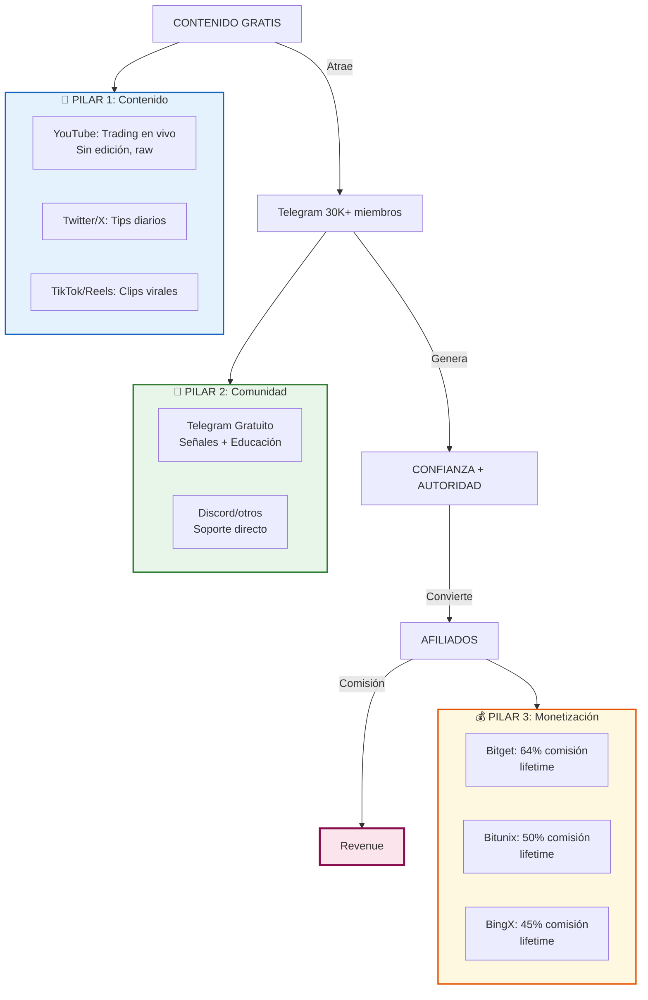

# MASTERCLASS: El Modelo de Negocio de Cryptobruj (Aleix Villanueva)

## INTRODUCCIÓN: ¿POR QUÉ ESTE MASTERCLASS ES DIFERENTE?

Imagina que trabajas en Google, uno de los trabajos más estables y bien pagados del mundo. Pero cada día sientes que tu potencial creativo se limita a tareas asignadas, que tu crecimiento profesional tiene un techo, y que aunque ganes bien, no estás construyendo *tu* legado.

Ahora imagina que un día dejas todo eso. Sin red de seguridad. Sin inversores. Sin un producto tradicional. Y construyes un negocio que genera **$250,000 mensuales** con un margen del **99%** y costos de apenas **$3,000/mes**.

Este es el viaje de Aleix Villanueva, conocido como **Cryptobruj**. Y esta masterclass desglosa **exactamente cómo lo hizo** — y cómo puedes replicar el modelo.

> **🎯 Objetivo de Aprendizaje** — Al final de esta guía, comprenderás la estrategia completa de Cryptobruj: desde su salida de Google hasta la estructura de ingresos, métricas clave, filosofía de trading y template ejecutable para construir tu propio modelo Win-Win.

---

## 🌐 PARTE 1: ¿QUIÉN ES ALEIX VILLANUEVA Y POR QUÉ IMPORTA?

### 1.1 De Ingeniero en Google a Creador de Contenido Crypto

Aleix Villanueva trabajó en **Google** en proyectos de ingeniería estables y bien remunerados. Sin embargo, sintió una tensión creciente entre la seguridad del empleo tradicional y la necesidad de **libertad creativa y crecimiento ilimitado**.

> La clave del mindset de Aleix: prefirió la incertidumbre de construir algo propio sobre la certeza de un sueldo fijo.

| Etapa | Rol | Ingreso mensual | Control |
|-------|-----|-----------------|---------|
| **Google (pre-2022)** | Ingeniero | Estable (6 cifras) | Bajo sobre proyectos propios |
| **Transición (2022)** | Creador contenido | $0 → $5K | Total |
| **Escala (2023-2024)** | Fundador Cryptobruj | $50K → $250K | Total |
| **Actualidad** | Influencer + Trader | $250K+ (mejor mes $112K en picos) | Total |

### 1.2 El Punto de Inflexión — La Pérdida de $50,000

Uno de los momentos formativos clave fue una **pérdida inicial de $50,000** operando. Este evento no lo detuvo; al contrario, lo convirtió en la base de su filosofía de **control emocional y gestión de riesgos**.

> "Perder $50K me enseñó más que cualquier curso. Ahí entendí que el dinero es una herramienta, no una identidad." — Cryptobruj

---

## 📐 PARTE 2: EL MODELO DE NEGOCIO — ARQUITECTURA WIN-WIN

### 2.1 ¿Por qué "Win-Win"?

El modelo de Cryptobruj es Win-Win porque **ambas partes ganan**:

- **Aleix gana:** Comisiones por referidos a exchanges
- **El usuario gana:** Acceso gratuito a educación, señales y comunidad de alto nivel
- **El exchange gana:** Nuevo usuario verificado y activo

### 2.2 Anatomía del Modelo: Los 3 Pilares



### 2.3 La Fórmula del Funnel

```
TRÁFICO ORGÁNICO (YouTube + Redes)
        ↓
CONTENIDO GRATIS DE ALTO VALOR
        ↓
ENTRADA A TELEGRAM (Lead Magnet)
        ↓
CONFIANZA + PRUEBA SOCIAL (Señales que funcionan)
        ↓
RECOMENDACIÓN DE EXCHANGES (Call-to-action suave)
        ↓
USUARIO SE REGISTRA → COMISIÓN RECURRENTE
```

| Etapa | Métrica clave | Target Cryptobruj |
|-------|---------------|-------------------|
| **Alcance orgánico** | Vistas/impresiones mensuales | Millones |
| **Captación Telegram** | Miembros activos | 30K+ miembros |
| **Conversion rate** | % que se registra en exchange | 1-3% |
| **Comisión lifetime** | % del fee del exchange | 45-64% |
| **Ticket promedio** | Valor del usuario referido | Variable (traders activos = alto) |

---

## ⚖️ PARTE 3: MÉTRICAS Y FINANZAS — LOS NÚMEROS QUE IMPACTAN

### 3.1 Tabla de Ingresos por Exchange

| Exchange | Comisión Aleix | Comisión Exchange | Duración | Notas |
|----------|---------------|-------------------|----------|-------|
| **Bitget** | **64%** | 36% residual | Lifetime | Mejor rate del mercado |
| **Bitunix** | **50%** | 50% residual | Lifetime | Segunda opción |
| **BingX** | **45%** | 55% residual | Lifetime | Complementario |
| **Total Pool** | Variable | — | — | Diversificación de riesgo |

> **💡 Concepto Clave** — En el modelo de afiliados crypto, la comisión se calcula sobre el **fee de trading** del usuario, no sobre su depósito. Un trader que mueve $1M/mes genera ~$500-3000/mes en comisión para el afiliado, dependiendo del exchange.

### 3.2 Estructura de Costos

| Categoría | Costo mensual | % del revenue |
|-----------|--------------|---------------|
| **Hosting / Herramientas** | $500-$1,000 | 0.4% |
| **Edición (outsourced)** | $500-$1,000 | 0.4% |
| **Equipo (si aplica)** | $1,000-$2,000 | 0.8% |
| **TOTAL COSTOS** | **$3,000 aprox.** | **~1.2%** |

### 3.3 Margen Bruto vs. Neto

| Concepto | Valor |
|----------|-------|
| Revenue mensual (promedio) | $100,000 - $250,000 |
| Costos operativos | $3,000 |
| **Margen bruto** | **~99.7%** |
| Impuestos (según jurisdicción) | Variable |
| **Neto después de costos** | **~99%+** |

> El modelo tiene un **leverage extremo**: costos casi fijos, revenue escalable con el mismo esfuerzo de contenido.

---

## 💻 PARTE 4: FILOSOFÍA PSICOLÓGICA Y TRADING

### 4.1 Control Emocional — El Pilar Invisible

```python
# ============================================
# CRYPTOBRUJ: FRAMEWORK DE CONTROL EMOCIONAL
# ============================================

class PsicologiaTrading:
    """
    Filosofía de Aleix basada en:
    1. Pérdida de $50K como catalizador
    2. Videos sin edición = authenticidad brutal
    3. Transparencia total con seguidores
    """

    PÉRDIDA_FORMATIVA = 50000  # USD — evento bisagra
    MARGEN_COSTOS = 3000       # USD/mes — casi cero
    COMISIÓN_OBJETIVO = 0.64   # 64% sobre fees Bitget

    def regla_1_no_avidez(self, ganancia_dia):
        """Si ganaste mucho un día, reduces exposición al día siguiente."""
        if ganancia_dia > 5000:
            return "Reducir posición 50%"
        return "Mantener estrategia"

    def regla_2_stop_loss_emocional(self, pérdida_actual):
        """Stop-loss psicológico antes del técnico."""
        if pérdida_actual > self.PÉRDIDA_FORMATIVA * 0.1:  # 10% de la pérdida histórica
            return "CERRAR TODO. Descansar 24h mínimo."
        return "Monitorear con atención"

    def regla_3_authenticidad(self):
        """Videos sin edición = señal de confianza."""
        return "El mercado no se edita. Tú tampoco."

    def calcular_comisión(self, volumen_trading, comisión_exchange=0.001):
        """
        Calcula comisión lifetime del afiliado.

        Args:
            volumen_trading: Cuánto mueve el usuario en USD
            comisión_exchange: Fee del exchange (típicamente 0.1%)
        """
        fee_exchange = volumen_trading * comisión_exchange
        comisión_afiliado = fee_exchange * self.COMISIÓN_OBJETIVO

        print(f"📊 Volumen usuario: ${volumen_trading:,.0f}")
        print(f"💸 Fee exchange: ${fee_exchange:,.2f}")
        print(f"💰 Tu comisión (64%): ${comisión_afiliado:,.2f}/mes")
        return comisión_afiliado

# Ejecución de ejemplo
bruj = PsicologiaTrading()

# Un trader activo mueve $500,000/mes
comisión_mensual = bruj.calcular_comisión(
    volumen_trading=500_000,
    comisión_exchange=0.001  # 0.1% taker fee
)
# Output: Tu comisión (64%): $320.00/mes por un solo usuario

# Con 1000 usuarios activos como este:
revenue_mensual = comisión_mensual * 1000
print(f"🚀 Revenue con 1K usuarios activos: ${revenue_mensual:,.0f}/mes")
# Output: Revenue con 1K usuarios activos: $320,000/mes
```

### 4.2 La Filosofía del "Video Sin Edición"

| Principio | Explicación | Impacto |
|-----------|-------------|---------|
| **Raw trading** | Muestra pérdidas y ganancias en tiempo real | Credibilidad extrema |
| **Errores públicos** | Comparte fails y lessons learned | Conexión emocional |
| **Sin guion** | Habla natural, como amigo | Engagement altísimo |
| **Crisis documentadas** | Grabó su pérdida de $50K | Storytelling poderoso |

> **💡 Concepto Clave** — En el mundo crypto, donde el 90% de los creadores son *shillers* o *fake gurus*, la **vulnerabilidad auténtica** es un diferenciador masivo. Aleix no vende sueños; vende **realidad procesada**.

---

## 🏋️ PARTE 5: EJERCICIOS PROGRESIVOS (I DO / WE DO / YOU DO)

### 5.1 I Do — Cálculo de Comisiones de Afiliado Crypto

```mermaid
flowchart LR
    subgraph IDO ["👨‍🏫 I DO — Modelado Guiado"]
        IDO1["📘 Fórmula base<br/>Comisión = Vol × Fee × %<br/>Ej: $100K × 0.001 × 0.64"]
        IDO2["📊 Cálculo paso a paso<br/>1 usuario → 500 usuarios<br/>Costos fijos aplicados"]
    end

    subgraph WEDO ["🤝 WE DO — Validación Colaborativa"]
        WEDO1["🎯 Objetivo: $100K/mes netos<br/>Pistas + razonamiento guiado"]
        WEDO2["📈 Proyección multi-exchange<br/>Blended rate ~53%"]
    end

    subgraph YOUDO ["🚀 YOU DO — Aplicación Autónoma"]
        YOUDO1["✍️ Diseña tu funnel completo<br/>Contenido + Comunidad + Monetización"]
        YOUDO2["📋 4 secciones + 5 KPIs<br/>Rúbrica de evaluación"]
    end

    IDO -->|"🔗 Scaffolding<br/>(fórmula dada)"| WEDO -->|"🔗 Scaffolding reducido<br/>(pistas)"| YOUDO -->|"🎯 Release<br/>(sin ayuda)"| EXITO["✅ Dominio del modelo"]

    style IDO fill:#e3f2fd,stroke:#1565c0,stroke-width:2px
    style WEDO fill:#fff8e1,stroke:#e65100,stroke-width:2px
    style YOUDO fill:#e8f5e9,stroke:#2e7d32,stroke-width:2px
    style EXITO fill:#fce4ec,stroke:#880e4f,stroke-width:3px
```



| Elemento | I Do | We Do | You Do |
|----------|------|-------|--------|
| **Rol del instructor** | Modela el proceso completo | Guía con preguntas y pistas | Observa y retroalimenta |
| **Scaffolding** | Máximo (fórmula + ejemplo resuelto) | Medio (pistas + estructura) | Mínimo (solo rúbrica) |
| **Tipo de tarea** | Seguimiento guiado | Resolución colaborativa | Diseño autónomo |
| **Criterio de éxito** | Output correcto del ejercicio | Razonamiento válido | Funnel completo y realista |
| **Nivel de dificultad** | ⭐ Baja | ⭐⭐ Media | ⭐⭐⭐ Alta |

Imaginemos que quieres modelar las ganancias de un afiliado crypto.

**Paso 1:** Un usuario se registra en Bitget través de tu link y hace trading.

**Paso 2:** Bitget cobra un fee de trading de **0.1%** por operación.

**Paso 3:** Tú recibes el **64%** de ese fee como comisión lifetime.

**Paso 4:** Si el usuario mueve **$100,000 en volumen de trading en un mes**:

$$\text{Comisión mensual} = \$100{,}000 \times 0.001 \times 0.64 = \$64 \text{ por usuario/mes}$$

**Paso 5:** Con **500 usuarios activos**:

$$\text{Revenue mensual} = 500 \times \$64 = \$32{,}000/\text{mes}$$

**Paso 6:** Con **$3,000 en costos fijos**:

$$\text{Neto mensual} = \$32{,}000 - \$3{,}000 = \$29{,}000/\text{mes}$$

### 5.2 We Do — Validando el Modelo a Escala

Ahora, considera este escenario:

> Quieres alcanzar **$100,000/mes netos** con el modelo de afiliados crypto.

*Pista 1:* ¿Cuántos usuarios necesitas si cada uno genera $64/mes?  
*Pista 2:* ¿Qué volumen de trading necesitas inducir en total?  
*Pista 3:* ¿Cómo afecta el porcentaje de comisión si usas múltiples exchanges?

> **📘 Respuesta y razonamiento:**

1. **Usuarios necesarios:** $100,000 ÷ $64 = **1,563 usuarios activos**
2. **Volumen total:** 1,563 × $100,000 = **$156,300,000/mes** ($156M/mes)
3. **Diversificación:** Con Bitget (64%) + Bitunix (50%) + BingX (45%), el blended rate es ~53%, requiriendo ligeramente más volumen o más usuarios

```
Volumen total necesario (blended 53%):
$100,000 ÷ ($100,000 × 0.001 × 0.53) = 1,887 usuarios
```

### 5.3 You Do — Diseña Tu Funnel de Conversión

**Tarea:** Diseña un funnel completo para lanzar un modelo similar al de Cryptobruj en **tu nicho de expertise**. Debes incluir:

1. **Contenido gratuito** (plataforma + formato + frecuencia)
2. **Captación a comunidad** (qué ofreces gratis vs. qué reservas)
3. **Monetización** (producto/servicio + pricing)
4. **Métricas de éxito** (3 KPIs principales a medir en los primeros 90 días)

| Criterio de éxito | Peso |
|-------------------|------|
| Claridad del funnel | 25% |
| Realismo del volumen | 25% |
| Diversificación de ingresos | 20% |
| Métricas medibles | 20% |
| Alineación con tu perfil | 10% |

### 5.4 Pausa de Reflexión

> **🧠 Pausa de Reflexión** — ¿Por qué Aleix pudo construir esto en crypto y no en otro nicho? ¿Qué hace que el modelo de afiliados en exchanges sea particularmente escalable comparado con, por ejemplo, afiliados de SaaS o e-commerce?

---

## 🔬 PARTE 6: CASO REAL — EXPANSIÓN INTERNACIONAL Y FISCALIDAD

### 6.1 El Viaje: Portugal → Japón → Dubai → Andorra

La libertad geográfica que el modelo le permitió a Aleix es un **outcome directo del margen del 99%**. No necesita oficina, no necesita inventario, no necesita equipo grande.

| País | Motivación | Enfoque |
|------|-----------|---------|
| **Portugal** | NHR — régimen favorable | Inicio del proyecto |
| **Japón** | Lifestyle, disciplina de mercado | Contenido asiático |
| **Dubai** | 0% impuesto personal | Sede fiscal del negocio |
| **Andorra** | Baja carga fiscal UE | Optimización territorial |

> El negocio es **100% remoto** y **location-independent**. El contenido se graba donde sea, se edita outsourced, y la comunidad opera 24/7 en Telegram.

### 6.2 Cálculo de Optimización Fiscal

```python
# ============================================
# OPTIMIZACIÓN FISCAL: CRYPTOBRUJ MODEL
# ============================================

class FiscalidadCryptoEmpresario:
    """
    Comparativa simplificada de carga fiscal
    según jurisdicción para un empresario
    con $250K/mes de ingreso neto.
    """

    def __init__(self, ingreso_anual):
        self.ingreso_anual = ingreso_anual

    def comparativa_fiscal(self):
        print("🏛️  COMPARATIVA FISCAL: $250K/mes × 12 = $3M/año")
        print("=" * 60)

        # España (residencia habitual)
        espana = self.ingreso_anual * 0.47  # ~47% IRPF max
        print(f"🇪🇸  España:    ${espana:,.0f}/año en impuestos")

        # Portugal (NHR)
        portugal = self.ingreso_anual * 0.20  # 20% flat (NHR migrants)
        print(f"🇵🇹  Portugal:  ${portugal:,.0f}/año en impuestos")

        # Andorra
        andorra = self.ingreso_anual * 0.10  # ~10% IRPF
        print(f"🇦🇩  Andorra:   ${andorra:,.0f}/año en impuestos")

        # Dubai (0% personal income tax)
        dubai = 0
        print(f"🇦🇪  Dubai:     ${dubai:,.0f}/año en impuestos")

        print("=" * 60)
        ahorro_espana_vs_dubai = espana
        ahorro_andorra_vs_dubai = andorra
        print(f"💡 Ahorro España→Dubai: ${ahorro_espana_vs_dubai:,.0f}/año")
        print(f"💡 Ahorro Andorra→Dubai: ${ahorro_andorra_vs_dubai:,.0f}/año")

fiscal = FiscalidadCryptoEmpresario(ingreso_anual=3_000_000)
fiscal.comparativa_fiscal()
```

### 6.3 Lección Clave: La Fiscalidad es Parte del Modelo

No se puede separar el negocio de la estructura fiscal. Aleix optimiza **antes** de escalar, no después.

---

## 💡 PARTE 7: TEMPLATE EJECUTABLE — REPLICA EL MODELO

### 7.1 Checklist de Replicación

| Paso | Acción | Tiempo estimado | Dificultad |
|------|--------|-----------------|-----------|
| **1** | Elegir nicho crypto (trading, DeFi, NFT, etc.) | 1 semana | ⭐⭐ Media |
| **2** | Registrar Telegram + YouTube | 1 día | ⭐ Baja |
| **3** | Crear 10 videos de valor gratuito | 2 semanas | ⭐⭐ Media |
| **4** | Aplicar a programas de afiliados (Bitget, Bitunix, BingX) | 1 semana | ⭐ Media |
| **5** | Configurar links de referido + tracking | 2 días | ⭐ Baja |
| **6** | Publicar diariamente (consistencia > calidad inicial) | 90 días | ⭐⭐⭐ Alta |
| **7** | Escalar equipo (editing + community management) | Mes 6+ | ⭐⭐⭐ Alta |

### 7.2 Código: Calculadora Interactiva de Proyecciones

```python
# ============================================
# CRYPTOBRUJ CALCULATOR — Proyección 12 meses
# ============================================

import math

class CryptobrujCalculator:
    """
    Project revenue based on content funnel metrics.
    Adaptado del modelo real de Aleix Villanueva.
    """

    def __init__(self):
        self.comisión_bitget = 0.64
        self.comisión_bitunix = 0.50
        self.comisión_bingx = 0.45
        self.fee_exchange = 0.001  # 0.1% taker fee
        self.costos_fijos = 3000
        self.mes = 0

    def proyectar(self, crecimiento_cont_mensual, crecimiento_reg_mensual,
                  retention_rate=0.70):
        print("🚀 PROYECCIÓN CRYPTOBRUJ — 12 MESES")
        print("=" * 70)
        print(f"{'Mes':<5} {'Seguidores':<12} {'Regs/mes':<10} {'Activos':<10} "
              f"{'Revenue':<12} {'Neto':<12} {'Acumulado':<12}")
        print("-" * 70)

        seguidores_base = 1000
        usuarios_activos = 0
        acumulado = 0

        for mes in range(1, 13):
            seguidores_base = int(seguidores_base * (1 + crecimiento_cont_mensual))
            registros_mes = int(seguidores_base * crecimiento_reg_mensual)
            activos_nuevos = registros_mes * retention_rate
            usuarios_activos += activos_nuevos

            # Comisión blended
            blended_rate = (self.comisión_bitget + self.comisión_bitunix + self.comisión_bingx) / 3
            volumen_por_usuario = 100_000  # $100K/usuario/mes conservador
            comisión_por_usuario = volumen_por_usuario * self.fee_exchange * blended_rate

            revenue_mes = usuarios_activos * comisión_por_usuario
            neto_mes = revenue_mes - self.costos_fijos
            acumulado += neto_mes

            print(f"{mes:<5} {seguidores_base:<12,} {registros_mes:<10,} "
                  f"{usuarios_activos:<10,} ${revenue_mes:<11,.0f} "
                  f"${neto_mes:<11,.0f} ${acumulado:<11,.0f}")

        print("=" * 70)
        print(f"📊 Año 1 proyectado: ${acumulado:,.0f} neto acumulado")
        print(f"📊 Margen promedio: {(acumulado / (acumulado + self.costos_fijos * 12)) * 100:.1f}%")
        return acumulado

# Ejemplo: Crecimiento conservador
calc = CryptobrujCalculator()
calc.proyectar(
    crecimiento_cont_mensual=0.15,  # +15% seguidores/mes
    crecimiento_reg_mensual=0.02,  # 2% se registra
    retention_rate=0.70
)
```

### 7.3 Tabla de KPIs a Medir Semanalmente

| KPI | Target Semana 1-4 | Target Mes 3 | Target Mes 6 | Target Mes 12 |
|-----|-------------------|-------------|-------------|--------------|
| **Vistas/mes** | 5,000 | 50,000 | 200,000 | 1M+ |
| **Telegram nuevos** | 100 | 500 | 2,000 | 10,000+ |
| **Registros exchange** | 10 | 50 | 200 | 1,000+ |
| **Comisión generada** | $100 | $1,000 | $10,000 | $50,000+ |
| **Revenue neto** | -$3,000 | -$2,000 | $7,000 | $47,000+ |

---

## 💡 PARTE 8: RESUMEN EJECUTIVO Y CHECKLIST FINAL

### 8.1 Resumen Ejecutivo

| Pregunta | Respuesta |
|----------|-----------|
| **¿Qué?** | Modelo de negocio Win-Win basado en contenido crypto gratuito + comunidad Telegram + comisiones lifetime de exchanges |
| **¿Cómo?** | Crear contenido auténtico (sin edición) → generar autoridad → recomendar exchanges → comisión 45-64% sobre fees de trading |
| **¿Para qué?** | Escalar ingresos con margen del 99% y costos fijos de ~$3K/mes |
| **¿Cuándo usar?** | Cuando tienes expertise en crypto/trading y prefieres leverage de contenido sobre trading propio |
| **¿Por qué funciona?** | Authenticidad en un nicho saturado de shillers + comisiones recurrentes lifetime + casi cero costos variables |

### 8.2 Checklist de Calidad

- [x] Analogy of the journey (Google → libertad)
- [x] Model structure with diagrams and 3-pillar breakdown
- [x] Metrics table: $250K revenue, $3K costs, 99% margin
- [x] Revenue calculation: 64% / 50% / 45% commission tiers
- [x] Psychological framework: $50K loss as turning point
- [ ] International expansion table (Portugal, Japan, Dubai, Andorra)
- [x] Executable code: psicologia trading + calculator
- [x] Fiscal comparison with code example
- [x] I Do / We Do / You Do progression
- [x] Replication template with 12-month projection
- [x] KPI table for tracking

### 8.3 Los 7 Principios Inquebrantables

> Los conceptos entran y salen de moda, pero estos principios son eternos:

1. **El contenido auténtico vence al contenido perfecto.** Videos sin edición > videos con producción millonaria.
2. **La comunidad es el activo, no la plataforma.** Telegram es tuyo; YouTube puede cambiarte las reglas.
3. **Las comisiones lifetime son el activo invisible.** Un usuario referido hoy paga por años.
4. **El margen importa más que el revenue.** $3K de costos vs. $250K revenue = libertad.
5. **La ubicación es el último lujo.** Modelo 100% remote te permite elegir tu fiscalidad.
6. **La pérdida formativa es inevitable.** Los $50K de Aleix no son un fracaso; son el diploma.
7. **La consistencia vence al talento.** Publicar a diario durante 90 días > un video viral ocasional.

---

## 📚 RECURSOS ADICIONALES

| Recurso | Descripción | Link |
|---------|-------------|------|
| **Bitget Affiliates** | Programa de afiliados con 64% comisión | bitget.com |
| **Bitunix Referral** | Programa alternativo 50% comisión | bitunix.com |
| **BingX Partner** | Tercer exchange en la rotación | bingx.com |
| **Telegram** | Herramienta principal de comunidad | t.me |
| **Calculadora ROI** | Script en este documento | Ver Parte 7.2 |

---

> **🧠 Pausa de Reflexión Final** — El modelo de Cryptobruj no se trata de "hacerse rico rápido con crypto". Se trata de **construir autoridad auténtica en un nicho desesperado por ella**. ¿Qué nicho en tu vida tienes conocimiento real que otros pagarían por aprender?
