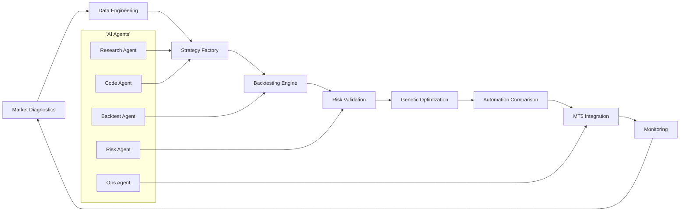
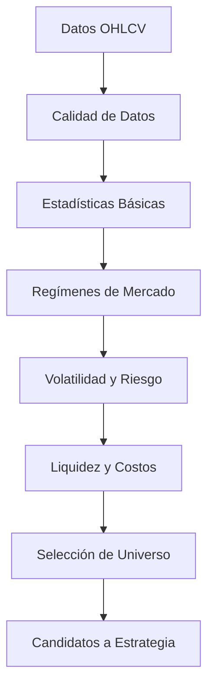

# MASTERCLASS: Alpha Quant Research Workflow - Fábrica de Estrategias Algorítmicas

## INTRODUCCIÓN: POR QUÉ ESTE MASTERCLASS ES DIFERENTE

La investigación cuantitativa tradicional suele avanzar demasiado lento para los mercados actuales. Un equipo tarda semanas en recolectar datos, limpiar velas, probar hipótesis, backtestear estrategias y optimizar parámetros. Cuando finalmente llega una idea a producción, el régimen del mercado ya cambió.

Este masterclass propone otro camino: una **fábrica de estrategias algorítmicas** donde Python, datos financieros, backtesting riguroso, optimización genética, automatización y AI agents trabajan como un sistema integrado.

La meta no es encontrar una estrategia mágica. La meta es construir un proceso repetible para descubrir, validar, descartar y mejorar ideas de trading con disciplina estadística.

> **Objetivo de Aprendizaje** — Al final de esta guía, podrás diseñar un workflow end-to-end para investigar mercados, generar estrategias, backtestearlas, optimizarlas, comparar automatizaciones, integrar MetaTrader5 y documentar una ruta de producción.

> **Advertencia educativa** — Este contenido es formativo. Ninguna estrategia, métrica o código debe interpretarse como recomendación financiera. El trading cuantitativo requiere gestión de riesgo, validación robusta y control operacional.

---

## MAPA DEL WORKFLOW



| Fase | Pregunta que responde | Output principal |
|------|-----------------------|------------------|
| **Market Diagnostics** | ¿Qué tipo de mercado estoy investigando? | Regímenes, volatilidad, liquidez y sesgos |
| **Data Engineering** | ¿Los datos son confiables? | Pipeline reproducible y validado |
| **Strategy Factory** | ¿Qué ideas puedo convertir en señales? | Reglas, features y parámetros |
| **Backtesting Engine** | ¿La estrategia sobrevive al pasado? | Métricas, equity curve y drawdown |
| **Risk Validation** | ¿El riesgo es aceptable? | Límites, sizing y escenarios |
| **Genetic Optimization** | ¿Qué combinación de parámetros es robusta? | Candidatos optimizados |
| **Automation Comparison** | ¿Dónde debe operar la estrategia? | Arquitectura de ejecución |
| **MT5 Integration** | ¿Cómo se ejecuta en mercado? | Orders, positions y monitoreo |
| **Monitoring** | ¿La estrategia sigue viva? | Alertas, logs y kill-switch |

---

## PARTE 1: MARKET DIAGNOSTICS — LEER EL MERCADO ANTES DE OPERARLO

### 1.1 Principio Central

Una estrategia no vive aislada. Vive dentro de un régimen de mercado. Una tendencia alcista premia sistemas momentum. Un rango lateral premia mean reversion. Un mercado de alta volatilidad castiga apalancamiento excesivo. Un mercado ilíquido castiga slippage.

El primer error del quant principiante es saltar directo a la idea. El primer hábito del quant profesional es diagnosticar.



### 1.2 Qué significa diagnosticar un mercado

| Diagnóstico | Qué mide | Por qué importa |
|-------------|----------|-----------------|
| **Tendencia** | Dirección y persistencia del precio | Decide si usar momentum o reversión |
| **Volatilidad** | Amplitud de movimientos | Define sizing, stops y frecuencia |
| **Liquidez** | Spread, volumen y profundidad | Estima slippage y capacidad |
| **Regulación de régimen** | Cambios entre tendencia, rango y caos | Evita operar la misma regla en contextos distintos |
| **Costos de transacción** | Spread, comisión y slippage | Determina si la ventaja estadística es real |
| **Correlaciones** | Dependencia entre activos | Reduce riesgo concentrado |
| **Sesgos temporales** | Horarios, sesiones y eventos | Evita falsos edge por calendario |

### 1.3 Código base de Market Diagnostics

```python
import numpy as np
import pandas as pd
from dataclasses import dataclass


@dataclass
class MarketDiagnostics:
    data: pd.DataFrame
    risk_free_rate: float = 0.0

    def prepare(self) -> pd.DataFrame:
        df = self.data.copy()
        df = df.dropna(subset=['open', 'high', 'low', 'close'])
        df['return'] = np.log(df['close']).diff()
        df['range'] = (df['high'] - df['low']) / df['close']
        return df

    def volatility(self, window: int = 20) -> pd.Series:
        df = self.prepare()
        return df['return'].rolling(window).std() * np.sqrt(252)

    def sharpe(self, window: int = 252) -> float:
        df = self.prepare()
        excess = df['return'] - self.risk_free_rate / 252
        if excess.std() == 0:
            return 0.0
        return np.sqrt(252) * excess.mean() / excess.std()

    def max_drawdown(self) -> float:
        df = self.prepare()
        equity = (1 + df['return'].fillna(0)).cumprod()
        running_max = equity.cummax()
        drawdown = equity / running_max - 1
        return drawdown.min()

    def trend_score(self, short_window: int = 20, long_window: int = 100) -> float:
        df = self.prepare()
        short_ma = df['close'].rolling(short_window).mean()
        long_ma = df['close'].rolling(long_window).mean()
        score = (short_ma - long_ma) / long_ma
        return score.dropna().iloc[-1]

    def regime(self, window: int = 60) -> str:
        vol = self.volatility(window)
        trend = self.trend_score()
        last_vol = vol.dropna().iloc[-1]
        median_vol = vol.dropna().median()

        if last_vol > median_vol * 1.5 and abs(trend) < 0.01:
            return 'volatile_range'
        if abs(trend) > 0.03 and last_vol < median_vol * 1.3:
            return 'smooth_trend'
        if abs(trend) > 0.03 and last_vol >= median_vol * 1.3:
            return 'volatile_trend'
        return 'mean_reversion_range'

    def summary(self) -> dict:
        return {
            'sharpe': self.sharpe(),
            'max_drawdown': self.max_drawdown(),
            'trend_score': self.trend_score(),
            'regime': self.regime(),
```

## APPEND

## PARTE 2: DATA ENGINEERING — EL PIPELINE QUE NO MIENTE

### 2.1 Regla de Oro

Si el dato está roto, el backtest está roto. Una señal brillante sobre datos sucios produce una curva de equity falsa. Antes de hablar de alpha, el pipeline debe responder:

1. ¿Hay velas duplicadas?
2. ¿Hay saltos horarios incorrectos?
3. ¿Hay gaps imposibles?
4. ¿El ajuste de splits o dividendos es consistente?
5. ¿El spread estimado es realista?
6. ¿La frecuencia coincide con la estrategia?

### 2.2 Estructura mínima del proyecto

```text
alpha-quant-workflow/
├── data/
│   ├── raw/
│   ├── processed/
│   └── cache/
├── notebooks/
│   └── diagnostics.ipynb
├── src/
│   ├── data_loader.py
│   ├── diagnostics.py
│   ├── strategy_factory.py
│   ├── backtester.py
│   ├── optimizer.py
│   └── mt5_adapter.py
├── tests/
│   ├── test_data_quality.py
│   └── test_backtester.py
├── configs/
│   ├── symbols.yaml
│   └── risk.yaml
└── requirements.txt
```

### 2.3 Data loader con validaciones

```python
import pandas as pd
from pathlib import Path


class DataValidator:
    def __init__(self, df: pd.DataFrame):
        self.df = df.copy()

    def required_columns(self) -> bool:
        required = {'timestamp', 'open', 'high', 'low', 'close', 'volume'}
        return required.issubset(self.df.columns)

    def no_duplicate_index(self) -> bool:
        return not self.df.index.has_duplicates

    def positive_prices(self) -> bool:
        price_cols = ['open', 'high', 'low', 'close']
        return (self.df[price_cols] > 0).all().all()

    def high_low_logic(self) -> bool:
        return ((self.df['high'] >= self.df['low']) &
                (self.df['high'] >= self.df['open']) &
                (self.df['high'] >= self.df['close']) &
                (self.df['low'] <= self.df['open']) &
                (self.df['low'] <= self.df['close'])).all()

    def returns_are_finite(self) -> bool:
        returns = self.df['close'].pct_change()
        return returns.replace([float('inf'), float('-inf')], float('nan')).notna().all()

    def run(self) -> dict:
        checks = {
            'required_columns': self.required_columns(),
            'no_duplicate_index': self.no_duplicate_index(),
            'positive_prices': self.positive_prices(),
            'high_low_logic': self.high_low_logic(),
            'returns_are_finite': self.returns_are_finite(),
        }
        return {
            'valid': all(checks.values()),
            'checks': checks,
        }


def load_ohlcv(path: str | Path) -> pd.DataFrame:
    df = pd.read_csv(path, parse_dates=['timestamp'])
    df = df.set_index('timestamp').sort_index()
    validator = DataValidator(df)
    report = validator.run()
    if not report['valid']:
        failed = [name for name, ok in report['checks'].items() if not ok]
        raise ValueError(f'Data validation failed: {failed}')
    return df
```

### 2.4 Tabla de validaciones críticas

| Riesgo de dato | Síntoma en backtest | Validación |
|----------------|---------------------|------------|
| Duplicados | Rentabilidad inflada | Índice sin duplicados |
| Velas fuera de orden | Señales desplazadas | Orden cronológico |
| Precios cero | Retornos infinitos | Precios positivos |
| High menor que low | Lógica imposible | High >= low |
| Gaps excesivos | Slippage subestimado | Umbral por percentil |
| Ajustes mal aplicados | Señales falsas | Revisión de splits/dividendos |
| Sesión incompleta | Frecuencia incorrecta | Calendario por activo |

## PARTE 3: STRATEGY FACTORY — CONVERTIR HIPÓTESIS EN ESTRATEGIAS


